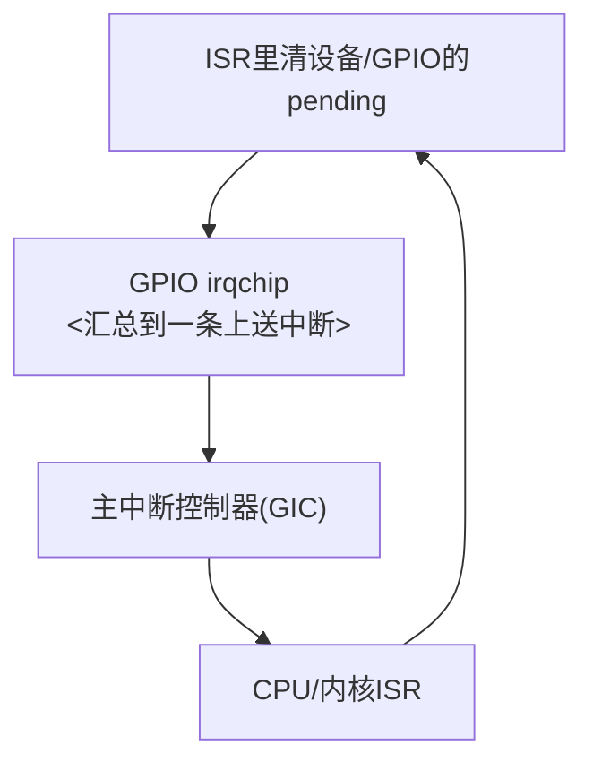

# 第5章_GPIO_与触发语义_电平_边沿_DTS_与_只来一次一直来_为何出现

## 5.1_GPIO_与触发语义_电平_边沿_DTS_与_只来一次/一直来_为何出现

### 5.1.1_章节说明

前四章把“为什么有中断→SoC 为什么要分层→Linux 为什么要用 irq_chip/irq_domain/irq_desc→驱动怎么拿 IRQ 并注册”这一条主线说完了。接下来必须进一个在实际板子上**最容易踩坑的部分**：**GPIO 场景下的中断触发语义**。

这一章要解决下面这些你在板子上一开中断就会遇到的问题：

1. DTS 里写了 `interrupts = <...>`，驱动也 `request_irq()` 成功了，但**只进了一次**，然后就再也不进；
2. 反过来，有的 GPIO 中断是**一直进**，`/proc/interrupts` 疯狂加；
3. DTS 里明明写了 `GPIO_ACTIVE_LOW`，但你的中断实际上是上升沿进来的——**因为这是两个概念**；
4. 同一根 GPIO，要的其实是“下降沿触发”，但中断控制器只看到了“电平=0”，于是一直报；
5. 按键想做去抖，写在中断线程里 `msleep(20)`，结果整条中断线都被你拖住了。

要把这些问题讲清楚，必须同时看**硬件的触发方式**、**中断控制器的表达方式**、**设备树怎么写**、**驱动为什么还要再钉一次类型**、以及**为什么有时候必须在 ISR 里清中断源**。

------

### 5.1.2_硬件层面的三种触发语义

无论最终跑到 Linux 上长成什么样，GPIO/外设中断在硬件层面基本就三种语义（组合出来的双边沿也还是这三种的延伸）：

| 触发语义   | 描述                                                         | 典型用途                   | 处理要求                       |
| ---------- | ------------------------------------------------------------ | -------------------------- | ------------------------------ |
| 上升沿触发 | 从 0 → 1 的瞬间触发，只关心变化的一刹那                      | 按键松开、某些完成脉冲     | 一次性，来了就处理             |
| 下降沿触发 | 从 1 → 0 的瞬间触发                                          | 按键按下、低有效的设备信号 | 一次性，来了就处理             |
| 电平触发   | 只要电平保持在“有效状态”就认为中断仍然存在（高电平有效/低电平有效） | 低电平保持的告警、共享线   | **必须在 ISR 里清/拉高/写ACK** |

这里要特别强调：**电平触发 ≠ 不用清**，恰恰相反，**电平触发一定要清**，不清就会一直打。后面“只来一次/一直来”90% 都是这个原因。

------

### 5.1.3_中断控制器的视角_它只管_怎么触发_不管_你为什么要这样触发

在 SoC 里，不同的中断控制器（GIC、GPIO irqchip、外设自带的 IRQ 控制器）大多都能表达上面这些触发方式，但它们表达的方式不一样，有的用寄存器位，有的用 DTS 编号。Linux 抽象成统一的几种类型：

- `IRQ_TYPE_EDGE_RISING`
- `IRQ_TYPE_EDGE_FALLING`
- `IRQ_TYPE_EDGE_BOTH`
- `IRQ_TYPE_LEVEL_HIGH`
- `IRQ_TYPE_LEVEL_LOW`

**这些才是真正意义上的“中断触发类型”**。你在驱动里调用的 `irq_set_irq_type(irq, type)`，最终就是要落到对应 irq_chip 的“把这个中断线设置成这种触发方式”的寄存器上。

请记住这一条，因为后面要对比 DTS 里的 `GPIO_ACTIVE_LOW`。

------

### 5.1.4_设备树里的中断字段到底说的是什么

很多人一遇到设备树里的这几种写法就乱了：

- `interrupt-parent = <&gpio1>;`
- `interrupts = <5 IRQ_TYPE_EDGE_FALLING>;`
- `gpios = <&gpio1 5 GPIO_ACTIVE_LOW>;`

看上去都跟“高低电平、上升下降”有关，但它们说的**不是一回事**。

#### (1)_interrupts_=_<...>_说的是_中断控制器那一头要怎么触发

这个字段最终会被 `of_irq_get()` / `irq_of_parse_and_map()` / `platform_get_irq()` 这一条路径拿走，然后通过 **irq_domain→irq_chip** 落到真正的中断控制器上。它要表达的是：**这条中断线在控制器里应该被配置成什么触发类型**，也就是上面那几个 `IRQ_TYPE_...`。

#### (2)_GPIO_ACTIVE_LOW_/_GPIO_ACTIVE_HIGH_说的是_逻辑含义

GPIO 的 active-high/low 是在说：**这个设备觉得“按下”是低还是高**，是逻辑层的“有效态”，**不是中断控制器的触发语义**。
 所以会出现这种合法但让人懵的组合：

- GPIO 是 `GPIO_ACTIVE_LOW`（低电平表示“被按下”）
- 中断是 `IRQ_TYPE_EDGE_FALLING`（从高掉到低时触发一次）

这两个不冲突：

- 一个是“信号的语义”；
- 一个是“中断控制器什么时候该打断 CPU”。

所以驱动里很多时候要做两件事：

1. 从 DTS 把中断拿出来当成 IRQ；
2. 再从 GPIO 那边把**逻辑电平的含义**拿出来，解释成“按下/松开”。

这就是为什么**同一个 GPIO 节点里会同时出现 `gpios = <... GPIO_ACTIVE_LOW>` 和 `interrupts = <... IRQ_TYPE_EDGE_FALLING>`**，它们分别服务于两个不同的子系统。

------

### 5.1.5_为什么驱动里还要再_irq_set_irq_type()_一次

很多板子上 DTS 是别人写的或者是参考 BSP 拷过来的，你的设备不一定真的是那个触发方式；再加上有些 GPIO irqchip 在“父中断控制器”那一层只能统一成某种触发，导致你从 DTS 看上去没问题，但真实硬件边沿不对，所以**驱动里再钉一次类型是正确做法**：

```c
irq = platform_get_irq(pdev, 0);
if (irq < 0)
    return irq;

/* 驱动清楚自己要下降沿 */
ret = irq_set_irq_type(irq, IRQ_TYPE_EDGE_FALLING);
if (ret)
    dev_warn(&pdev->dev, "failed to set irq type\n");
```

这一步是**把“我这块设备真正想要的触发方式”写死在驱动里**，避免 DTS 写错拖累你。

------

### 5.1.6_为什么会出现_只来一次_和_一直来

这是 GPIO 中断里最经典的两个现象，我们分开剖。

#### (1)_只来一次

典型现象：

- 一上电就能进一次中断；
- 之后你怎么按键都不进；
- `/proc/interrupts` 里也只加了 1。

最常见的原因有两个：

1. **你要的是边沿，但 DTS/驱动设成了电平**
   - 第一次电平满足，中断来了；
   - 你在 ISR 里没有“去掉这个电平”（比如没有清 GPIO 中断状态寄存器、没有把引脚电平恢复）；
   - 控制器觉得“你还在那个电平上”，不会再给新的边沿。
2. **子控制器的中断 pending 位没清**
   - GPIO 控制器内部通常有一个“哪个 PIN 触发了”的 pending 位；
   - 你要在 ISR 里把它清掉；
   - 否则上一级控制器认为“我已经通知过你了，你没处理完”，就不会再发。

**解决办法**：在真正的 ISR 里，先清底层 GPIO 控制器的中断状态，再返回；必要时配合 `IRQF_ONESHOT` 和 threaded IRQ 用“先关→延后→再开”的节奏。

#### (2)_一直来

典型现象：

- 一开机中断计数就疯涨；
- 你明明没按键；
- 很可能还能看到控制器状态寄存器一直是“有效态”。

最常见的原因也有两个：

1. **电平型中断你没清源**
   - 控制器看见“低电平有效”，你没把它抬回去/没清设备的状态位；
   - 它就会一直往上报；
   - 上面那层中断控制器就会一直打 CPU。
2. **DTS 写成了低电平有效，但硬件上这根线恰好就是低的**
   - 你等于是告诉控制器“这个电平一直是中断态”；
   - 所以它一直报；
   - 这就是 DTS 跟硬件不符的典型表现。

**解决办法**：

- 确认 DTS 的触发类型和实际硬件接法一致；
- 确认 ISR 里真的有清设备/清 GPIO pending 的动作；
- 实在不行，先 `disable_irq_nosync()`，等线程里用完再 `enable_irq()`，别让它无限打。

------

### 5.1.7_清中断源_到底指哪一层

GPIO 场景其实有**两层都可能需要清**：

1. **设备/子控制器这一层**
   - 比如某些 GPIO 控制器有 `ISR`/`ISR_FLAG` 一类的寄存器；
   - 你要写 1 清它，否则这个 GPIO 控制器一直觉得“这根 PIN 还在中断中”。
2. **主中断控制器这一层**
   - 比如 GIC 需要 EOI/ACK；
   - 这一层 Linux 一般会帮你做（在通用 irq 层里），你只要把子控制器那一层清掉就行；
   - 但如果你写的是自己的 irqchip，就要在 irq_chip 的 `irq_ack`/`irq_eoi` 里做这件事。

一个比较容易记的图：



意思是：**CPU 处理时要把“最底下那个真实产生中断的点”清掉**，否则你的上半部再快也没用。


------

### 5.1.8_GPIO_中断综合案例(同一_DTS_三种驱动写法)

#### (1)_内容说明

本节做一件事：

> 同一块板子，同一个 GPIO 按键中断，同一份 DTS
>  以三种写法，展示中断“快/慢/正确调试”的真实差异

三种写法分别对应三种典型阶段：

| 示例   | 特征                                       | 常见用途                                               |
| ------ | ------------------------------------------ | ------------------------------------------------------ |
| 示例一 | 硬中断直接翻 LED，无消抖                   | 用于确认**中断链路通没通**                             |
| 示例二 | threaded + IRQF_ONESHOT + printk           | 用来复现“明明进中断但感觉卡住”的真实坑                 |
| 示例三 | threaded + trace_printk + 硬中断时间窗去抖 | 这是 GPIO 按键中断真正能用、能调、不卡顿的**成熟形态** |

下面所有示例都用**同一份设备树**。

------

#### (2)_本节统一_DTS

```dts
demo_led_key_int: led_key_int@0 {
    compatible = "nxp,imx6ull-led_key_int";
    pinctrl-names = "default";
    pinctrl-0 = <&pinctrl_led_key_int>;

    led-gpios = <&gpio1 3  GPIO_ACTIVE_LOW>;   /* LED：低电平点亮 */
    key-gpios = <&gpio1 18 GPIO_ACTIVE_LOW>;   /* KEY：按下为低 */

    interrupt-parent = <&gpio1>;
    interrupts = <18 IRQ_TYPE_EDGE_FALLING>;   /* 按下瞬间触发 */

    nxp,debounce-ms = <30>;
    status = "okay";
};
```

说明要点：

- LED 与 KEY 都来自 `gpio1`
- 按下为低 ⇒ 触发类型设为 FALLING
- `nxp,debounce-ms` 给驱动做参考
- 后续三个驱动都使用这一份 DTS

------

#### (3)_示例一_无消抖_硬中断直接翻_LED

##### 1)_用途定位

这是开发过程中**第一件事应该做的**：

> 能不能进中断？
>  LED 能不能亮/灭？

它不考虑抖动
 只考虑“链路是否完全通”

##### 2)_关键代码片段

```c
static irqreturn_t lk_irq_handler(int irq, void *data)
{
    lk->led_on = !lk->led_on;
    gpiod_set_value(lk->led, lk->led_on);
    return IRQ_HANDLED;
}

devm_request_irq(dev, lk->irq, lk_irq_handler,
                 IRQF_TRIGGER_FALLING | IRQF_NO_THREAD,
                 dev_name(dev), lk);
```

##### 3)_要点

- IRQF_NO_THREAD
- **零等待**、**零判断**
- 立刻能看到效果

完整示例代码：
```c
// SPDX-License-Identifier: GPL-2.0
/*
 * i.MX6ULL Alpha v2.2
 * 目标：按键按下(下降沿) → 立刻在硬中断里翻转 LED；无去抖、无线程、零等待。
 *
 */

#include <linux/module.h>
#include <linux/platform_device.h>
#include <linux/of_device.h>
#include <linux/of_irq.h>
#include <linux/gpio/consumer.h>
#include <linux/interrupt.h>
#include <linux/pinctrl/consumer.h>

#define DRV_NAME "imx6ull-led_key_int_fast"

struct lk_dev {
	struct device      *dev;
	struct gpio_desc   *led;     /* ACTIVE_LOW: 1=逻辑有效=>物理低=>亮 */
	struct gpio_desc   *key;     /* ACTIVE_LOW: 按下=0(物理低) */
	int                 irq;
	bool                led_on;  /* 逻辑层面 1=亮，0=灭 */
};

/* 硬中断：立刻翻转 LED（不读电平、不去抖、不睡眠） */
static irqreturn_t lk_irq_handler(int irq, void *data)
{
	struct lk_dev *lk = data;

	lk->led_on = !lk->led_on;
	/* 原子上下文：使用不可睡眠版本，速度最快 */
	gpiod_set_value(lk->led, lk->led_on);

	return IRQ_HANDLED;
}

static int lk_probe(struct platform_device *pdev)
{
	struct device *dev = &pdev->dev;
	struct lk_dev *lk;
	struct pinctrl *pct;
	int ret;

	lk = devm_kzalloc(dev, sizeof(*lk), GFP_KERNEL);
	if (!lk)
		return -ENOMEM;

	lk->dev = dev;

	/* 立即切到 default 引脚状态，避免“过一会儿才生效” */
	pct = devm_pinctrl_get_select_default(dev);
	if (IS_ERR(pct))
		dev_warn(dev, "pinctrl default not applied: %ld\n", PTR_ERR(pct));

	/* LED：ACTIVE_LOW；默认熄灭（逻辑0=物理高） */
	lk->led_on = false;
	lk->led = devm_gpiod_get(dev, "led", GPIOD_OUT_LOW);
	if (IS_ERR(lk->led))
		return dev_err_probe(dev, PTR_ERR(lk->led), "get led-gpios failed\n");

	/* KEY：输入（ACTIVE_LOW 语义在 DTS 中） */
	lk->key = devm_gpiod_get(dev, "key", GPIOD_IN);
	if (IS_ERR(lk->key))
		return dev_err_probe(dev, PTR_ERR(lk->key), "get key-gpios failed\n");

	/* 拿到 IRQ；如 DT 未提供，则从 key-gpio 派生 */
	lk->irq = platform_get_irq_optional(pdev, 0);
	if (lk->irq < 0) {
		if (lk->irq != -ENXIO)
			return lk->irq;
		lk->irq = gpiod_to_irq(lk->key);
		if (lk->irq < 0)
			return lk->irq;
	}

	/* 钉死触发类型为 “下降沿”，不依赖 DT 是否落地 */
	irq_set_irq_type(lk->irq, IRQ_TYPE_EDGE_FALLING);

	/* 直接请求硬中断（primary handler），要求不要强制线程化 */
	ret = devm_request_irq(dev, lk->irq, lk_irq_handler,
			       IRQF_TRIGGER_FALLING | IRQF_NO_THREAD,
			       dev_name(dev), lk);
	if (ret)
		return dev_err_probe(dev, ret, "request_irq failed\n");

	platform_set_drvdata(pdev, lk);
	dev_info(dev, "fast-mode ready: FALLING IRQ=%d, ACTIVE_LOW LED; press->instant toggle\n",
		 lk->irq);
	return 0;
}

static int lk_remove(struct platform_device *pdev)
{
	return 0;
}

static const struct of_device_id lk_of_match[] = {
	{ .compatible = "nxp,imx6ull-led_key_int" },
	{ /* sentinel */ }
};
MODULE_DEVICE_TABLE(of, lk_of_match);

static struct platform_driver lk_driver = {
	.probe  = lk_probe,
	.remove = lk_remove,
	.driver = {
		.name           = DRV_NAME,
		.of_match_table = lk_of_match,
	},
};
module_platform_driver(lk_driver);

MODULE_LICENSE("GPL");
MODULE_AUTHOR("Leaf & ChatGPT");
MODULE_DESCRIPTION("i.MX6ULL fast IRQ: toggle ACTIVE_LOW LED directly in hardirq on falling edge");

```


------

#### (4)_示例二_threaded_+_IRQF_ONESHOT_+_printk(复现_卡死体感)

##### 1)_用途定位

这是非常典型的踩坑版本
 大家在“想打印一下确认中断线程有没有跑”时就会写成这样

结果：

> 能进中断，但 re-trigger 很慢
>  用肉眼感觉“怎么按都没反应了”

##### 2)_根因一句话

```text
ONESHOT = 中断线程没返回前本 IRQ 禁止重新进入
printk = 串口速度极慢
```

所以 **线程还没结束前，中断不会 re-enable**

##### 3)_关键代码片段

```c
static irqreturn_t ledkey_thread(int irq, void *data)
{
    printk("IRQ in thread\n");  // ← 仅此一句，就足够造成“体感卡”
    lk->led_on = !lk->led_on;
    gpiod_set_value(lk->led, lk->led_on);
    return IRQ_HANDLED;
}

devm_request_threaded_irq(..., IRQF_ONESHOT | IRQF_TRIGGER_FALLING, ...);
```

##### 4)_这是一个_现象教材

必须保留，因为新人 100% 会踩

完整驱动示例：

```c
// SPDX-License-Identifier: GPL-2.0
#include <linux/module.h>
#include <linux/platform_device.h>
#include <linux/of_device.h>
#include <linux/of_irq.h>
#include <linux/gpio/consumer.h>
#include <linux/interrupt.h>
#include <linux/jiffies.h>
#include <linux/spinlock.h>
#include <linux/pm_runtime.h>
#include <linux/pinctrl/consumer.h>
#include <linux/printk.h>

#define DRV_NAME "imx6ull-led_key_int"

struct ledkey_dev {
    struct device    *dev;
    struct gpio_desc *led; /* ACTIVE_LOW: 1=low(ON), 0=high(OFF) */
    struct gpio_desc *key; /* ACTIVE_LOW: press=0, release=1 */
    int               irq;

    unsigned int  debounce_ms; /* SW 去抖窗口（ms），0 表示使用 HW 去抖 */
    unsigned long last_edge_j; /* 最近一次被接受的边沿时间 */
    bool          led_on;
    bool          suspended;

    atomic_t   pending; /* hardirq 锁存的“待处理事件” */
    spinlock_t lock;    /* 保护 last_edge_j */
};

/* ---------- Hardirq：锁存下降沿 + 时间窗去抖 ---------- */
static irqreturn_t
ledkey_primary(int irq, void *data)
{
    struct ledkey_dev *lk = data;
    unsigned long      flags, now = jiffies;

    spin_lock_irqsave(&lk->lock, flags);

    if (!lk->debounce_ms || time_after(now, lk->last_edge_j + msecs_to_jiffies(lk->debounce_ms))) {
        lk->last_edge_j = now;
        atomic_set(&lk->pending, 1);
        spin_unlock_irqrestore(&lk->lock, flags);
        pr_info(DRV_NAME ": hardirq latched IRQ%d @ jiff=%lu\n", irq, now);
        return IRQ_WAKE_THREAD;
    }

    spin_unlock_irqrestore(&lk->lock, flags);
    return IRQ_HANDLED;
}

/* ---------- Threaded：凡是 pending 就翻转（不再读电平） ---------- */
static irqreturn_t
ledkey_thread(int irq, void *data)
{
    struct ledkey_dev *lk  = data;
    unsigned long      now = jiffies;

    if (lk->suspended)
        return IRQ_HANDLED;

    if (atomic_xchg(&lk->pending, 0)) {
        /**********************************
         *   printk就是在这里导致的中断阻塞 *
         *********************************/
        printk(KERN_INFO DRV_NAME
                        ": thread run @ jiff=%lu, delta=%lums\n",
                        now,
                        jiffies_to_msecs(now - lk->last_edge_j));

        lk->led_on = !lk->led_on;
        gpiod_set_value(lk->led, lk->led_on);

        /**********************************
         *   printk就是在这里导致的中断阻塞 *
         *********************************/
        printk(KERN_INFO DRV_NAME
                        ": LED toggled -> %d (1=ON/low,0=OFF/high)\n",
                        lk->led_on);
    }
    return IRQ_HANDLED;
}

static int
ledkey_request_irq(struct platform_device *pdev, struct ledkey_dev *lk)
{
    int           irq, ret;

    irq = platform_get_irq_optional(pdev, 0);
    if (irq < 0) {
        if (irq != -ENXIO)
            return irq;
        irq = gpiod_to_irq(lk->key);
        if (irq < 0)
            return irq;
    }
    lk->irq = irq;

    /* 钉死为下降沿（不依赖 DT 是否生效） */
    irq_set_irq_type(lk->irq, IRQ_TYPE_EDGE_FALLING);

    ret = devm_request_threaded_irq(&pdev->dev, lk->irq,
                                    ledkey_primary,
                                    ledkey_thread,
                                    IRQF_ONESHOT | IRQF_TRIGGER_FALLING, /* IRQF_ONESHOT 设置了中断线独占 */
                                     dev_name(&pdev->dev), lk);
    if (ret)
        return ret;

    dev_info(&pdev->dev, "irq=%d ready; falling edge; debounce=%u ms\n",
             lk->irq, lk->debounce_ms);
    return 0;
}

static int
ledkey_probe(struct platform_device *pdev)
{
    struct device     *dev = &pdev->dev;
    struct ledkey_dev *lk;
    struct pinctrl    *pct;
    u32                val;
    int                ret, ret_db;

    lk = devm_kzalloc(dev, sizeof(*lk), GFP_KERNEL);
    if (!lk)
        return -ENOMEM;

    lk->dev = dev;
    spin_lock_init(&lk->lock);
    atomic_set(&lk->pending, 0);
    lk->led_on    = false;
    lk->suspended = false;

    /* 进入 probe 即切 pinctrl->default，避免“过一会儿才生效” */
    pct = devm_pinctrl_get_select_default(dev);
    if (IS_ERR(pct))
        dev_warn(dev, "pinctrl default not applied: %ld\n", PTR_ERR(pct));

    /* 去抖参数（默认 30ms，可在 DTS 用 nxp,debounce-ms 覆盖） */
    lk->debounce_ms = 30;
    if (!of_property_read_u32(dev->of_node, "nxp,debounce-ms", &val))
        lk->debounce_ms = val;

    /* LED：ACTIVE_LOW；默认灭（物理高） */
    lk->led = devm_gpiod_get(dev, "led", GPIOD_OUT_LOW);
    if (IS_ERR(lk->led))
        return dev_err_probe(dev, PTR_ERR(lk->led), "get led-gpios failed\n");

    /* KEY：输入（ACTIVE_LOW 在 DTS 描述） */
    lk->key = devm_gpiod_get(dev, "key", GPIOD_IN);
    if (IS_ERR(lk->key))
        return dev_err_probe(dev, PTR_ERR(lk->key), "get key-gpios failed\n");

    /* 优先尝试硬件去抖；不支持则保留 SW 去抖窗口 */
    ret_db = gpiod_set_debounce(lk->key, lk->debounce_ms * 1000);
    if (ret_db == 0) {
        dev_info(dev, "HW debounce enabled: %u ms\n", lk->debounce_ms);
        lk->debounce_ms = 0;
    } else if (ret_db == -ENOTSUPP) {
        dev_info(dev, "HW debounce unsupported, using SW debounce: %u ms\n",
                 lk->debounce_ms);
    } else {
        dev_warn(dev, "gpiod_set_debounce=%d, fallback to SW (%u ms)\n",
                 ret_db, lk->debounce_ms);
    }

    ret = ledkey_request_irq(pdev, lk);
    if (ret)
        return ret;

    platform_set_drvdata(pdev, lk);
    dev_info(dev, "probed: ACTIVE_LOW key/led, FALLING irq, debounce=%u ms\n",
             lk->debounce_ms);
    return 0;
}

static int
ledkey_remove(struct platform_device *pdev)
{
    pr_info(DRV_NAME ": removed\n");
    return 0;
}

static int
ledkey_suspend(struct device *dev)
{
    struct ledkey_dev *lk = dev_get_drvdata(dev);
    lk->suspended         = true;
    return 0;
}

static int
ledkey_resume(struct device *dev)
{
    struct ledkey_dev *lk = dev_get_drvdata(dev);
    lk->suspended         = false;
    return 0;
}

static const struct of_device_id ledkey_of_match[] = {
    { .compatible = "nxp,imx6ull-led_key_int" },
    { /* sentinel */ }
};
MODULE_DEVICE_TABLE(of, ledkey_of_match);

static struct platform_driver ledkey_driver = {
    .probe  = ledkey_probe,
    .remove = ledkey_remove,
    .driver = {
               .name           = DRV_NAME,
               .of_match_table = ledkey_of_match,
               },
};
module_platform_driver(ledkey_driver);

MODULE_LICENSE("GPL");
MODULE_AUTHOR("Leaf & ChatGPT");
MODULE_DESCRIPTION("i.MX6ULL: falling-edge key toggles ACTIVE_LOW LED once (hardirq debounce, unconditional toggle)");

```


------

#### (5)_示例三_threaded_+_trace_printk_+_硬中断时间窗去抖(推荐)

##### 1)_用途定位

这是 GPIO 按键中断的**成熟落地写法**：

- 去抖是硬中断做：锁存 edge
- 线程只做消费事件
- trace_printk 用来看时序而不拖 console

##### 2)_关键代码片段

```c
/* hardirq：锁存 + 时间窗 */
if (time_after(now, lk->last_edge_j + window)) {
    lk->last_edge_j = now;
    atomic_set(&lk->pending, 1);
    return IRQ_WAKE_THREAD;
}

/* threaded 部分：轻量+
   时序看 trace_printk，不拖 console */
trace_printk("toggle delta=%dms\n",
    jiffies_to_msecs(now - lk->last_edge_j));
lk->led_on = !lk->led_on;
```

##### 3)_好处

- 不卡
- 时序可见
- 工程可用

完整驱动示例：

```c
// SPDX-License-Identifier: GPL-2.0
#include <linux/module.h>
#include <linux/platform_device.h>
#include <linux/of_device.h>
#include <linux/of_irq.h>
#include <linux/gpio/consumer.h>
#include <linux/interrupt.h>
#include <linux/jiffies.h>
#include <linux/spinlock.h>
#include <linux/pm_runtime.h>
#include <linux/pinctrl/consumer.h>
#include <linux/printk.h>

#define DRV_NAME "imx6ull-led_key_int"

struct ledkey_dev {
    struct device    *dev;
    struct gpio_desc *led; /* ACTIVE_LOW: 1=low(ON), 0=high(OFF) */
    struct gpio_desc *key; /* ACTIVE_LOW: press=0, release=1 */
    int               irq;

    unsigned int  debounce_ms; /* SW 去抖窗口（ms），0 表示使用 HW 去抖 */
    unsigned long last_edge_j; /* 最近一次被接受的边沿时间 */
    bool          led_on;
    bool          suspended;

    atomic_t   pending; /* hardirq 锁存的“待处理事件” */
    spinlock_t lock;    /* 保护 last_edge_j */
};

/* ---------- Hardirq：锁存下降沿 + 时间窗去抖 ---------- */
static irqreturn_t
ledkey_primary(int irq, void *data)
{
    struct ledkey_dev *lk = data;
    unsigned long      flags, now = jiffies;

    spin_lock_irqsave(&lk->lock, flags);

    if (!lk->debounce_ms || time_after(now, lk->last_edge_j + msecs_to_jiffies(lk->debounce_ms))) {
        lk->last_edge_j = now;
        atomic_set(&lk->pending, 1);
        spin_unlock_irqrestore(&lk->lock, flags);
        pr_info(DRV_NAME ": hardirq latched IRQ%d @ jiff=%lu\n", irq, now);
        return IRQ_WAKE_THREAD;
    }

    spin_unlock_irqrestore(&lk->lock, flags);
    return IRQ_HANDLED;
}

/* ---------- Threaded：凡是 pending 就翻转（不再读电平） ---------- */
static irqreturn_t
ledkey_thread(int irq, void *data)
{
    struct ledkey_dev *lk  = data;
    unsigned long      now = jiffies;

    if (lk->suspended)
        return IRQ_HANDLED;

    if (atomic_xchg(&lk->pending, 0)) {

        /**********************************
         *  trace_printk 不会导致中断阻塞   *
         *********************************/
        trace_printk(KERN_INFO DRV_NAME
                        ": thread run @ jiff=%lu, delta=%lums\n",
                        now,
                        jiffies_to_msecs(now - lk->last_edge_j));

        lk->led_on = !lk->led_on;
        gpiod_set_value(lk->led, lk->led_on);

        /**********************************
         *  trace_printk 不会导致中断阻塞   *
         *********************************/
        trace_printk(KERN_INFO DRV_NAME
                        ": LED toggled -> %d (1=ON/low,0=OFF/high)\n",
                        lk->led_on);
    }
    return IRQ_HANDLED;
}

static int
ledkey_request_irq(struct platform_device *pdev, struct ledkey_dev *lk)
{
    int           irq, ret;

    irq = platform_get_irq_optional(pdev, 0);
    if (irq < 0) {
        if (irq != -ENXIO)
            return irq;
        irq = gpiod_to_irq(lk->key);
        if (irq < 0)
            return irq;
    }
    lk->irq = irq;

    /* 钉死为下降沿（不依赖 DT 是否生效） */
    irq_set_irq_type(lk->irq, IRQ_TYPE_EDGE_FALLING);

    ret = devm_request_threaded_irq(&pdev->dev, lk->irq,
                                    ledkey_primary,
                                    ledkey_thread,
                                    IRQF_ONESHOT | IRQF_TRIGGER_FALLING,
                                     dev_name(&pdev->dev), lk);
    if (ret)
        return ret;

    dev_info(&pdev->dev, "irq=%d ready; falling edge; debounce=%u ms\n",
             lk->irq, lk->debounce_ms);
    return 0;
}

static int
ledkey_probe(struct platform_device *pdev)
{
    struct device     *dev = &pdev->dev;
    struct ledkey_dev *lk;
    struct pinctrl    *pct;
    u32                val;
    int                ret, ret_db;

    lk = devm_kzalloc(dev, sizeof(*lk), GFP_KERNEL);
    if (!lk)
        return -ENOMEM;

    lk->dev = dev;
    spin_lock_init(&lk->lock);
    atomic_set(&lk->pending, 0);
    lk->led_on    = false;
    lk->suspended = false;

    /* 进入 probe 即切 pinctrl->default，避免“过一会儿才生效” */
    pct = devm_pinctrl_get_select_default(dev);
    if (IS_ERR(pct))
        dev_warn(dev, "pinctrl default not applied: %ld\n", PTR_ERR(pct));

    /* 去抖参数（默认 30ms，可在 DTS 用 nxp,debounce-ms 覆盖） */
    lk->debounce_ms = 30;
    if (!of_property_read_u32(dev->of_node, "nxp,debounce-ms", &val))
        lk->debounce_ms = val;

    /* LED：ACTIVE_LOW；默认灭（物理高） */
    lk->led = devm_gpiod_get(dev, "led", GPIOD_OUT_LOW);
    if (IS_ERR(lk->led))
        return dev_err_probe(dev, PTR_ERR(lk->led), "get led-gpios failed\n");

    /* KEY：输入（ACTIVE_LOW 在 DTS 描述） */
    lk->key = devm_gpiod_get(dev, "key", GPIOD_IN);
    if (IS_ERR(lk->key))
        return dev_err_probe(dev, PTR_ERR(lk->key), "get key-gpios failed\n");

    /* 优先尝试硬件去抖；不支持则保留 SW 去抖窗口 */
    ret_db = gpiod_set_debounce(lk->key, lk->debounce_ms * 1000);
    if (ret_db == 0) {
        dev_info(dev, "HW debounce enabled: %u ms\n", lk->debounce_ms);
        lk->debounce_ms = 0;
    } else if (ret_db == -ENOTSUPP) {
        dev_info(dev, "HW debounce unsupported, using SW debounce: %u ms\n",
                 lk->debounce_ms);
    } else {
        dev_warn(dev, "gpiod_set_debounce=%d, fallback to SW (%u ms)\n",
                 ret_db, lk->debounce_ms);
    }

    ret = ledkey_request_irq(pdev, lk);
    if (ret)
        return ret;

    platform_set_drvdata(pdev, lk);
    dev_info(dev, "probed: ACTIVE_LOW key/led, FALLING irq, debounce=%u ms\n",
             lk->debounce_ms);
    return 0;
}

static int
ledkey_remove(struct platform_device *pdev)
{
    pr_info(DRV_NAME ": removed\n");
    return 0;
}

static int
ledkey_suspend(struct device *dev)
{
    struct ledkey_dev *lk = dev_get_drvdata(dev);
    lk->suspended         = true;
    return 0;
}

static int
ledkey_resume(struct device *dev)
{
    struct ledkey_dev *lk = dev_get_drvdata(dev);
    lk->suspended         = false;
    return 0;
}

static const struct of_device_id ledkey_of_match[] = {
    { .compatible = "nxp,imx6ull-led_key_int" },
    { /* sentinel */ }
};
MODULE_DEVICE_TABLE(of, ledkey_of_match);

static struct platform_driver ledkey_driver = {
    .probe  = ledkey_probe,
    .remove = ledkey_remove,
    .driver = {
               .name           = DRV_NAME,
               .of_match_table = ledkey_of_match,
               },
};
module_platform_driver(ledkey_driver);

MODULE_LICENSE("GPL");
MODULE_AUTHOR("Leaf & ChatGPT");
MODULE_DESCRIPTION("i.MX6ULL: falling-edge key toggles ACTIVE_LOW LED once (hardirq debounce, unconditional toggle)");

```


------

#### (6)_三者对比总结表

| 示例 | 去抖         | 是否线程 | 调试方式             | 适用阶段                  |
| ---- | ------------ | -------- | -------------------- | ------------------------- |
| 1    | ×            | ×        | ×                    | 最先验证 “中断链路通没通” |
| 2    | ✓（hardirq） | ✓        | printk（慢）         | 复现 ONESHOT 卡顿现象     |
| 3    | ✓（hardirq） | ✓        | trace_printk（轻量） | 推荐实战调试写法          |

------

#### (7)_小结

本节要表达的核心不在“哪个代码最完美”
 而是：

> 中断线程里做慢操作 + ONESHOT
>  = re-enable IRQ 很慢
>  = 肉眼就是“卡住”

新人踩坑 100% 来自示例二
 而正确姿势，就是示例三


------

### 5.1.9_综合案例②_GPIO_to_GIC_多级中断_+_清源

下面这个再往上拉一层，符合你前面说的“综合一点”的要求。

**硬件形态**：

- GPIO 引脚 12 检测到下降沿；
- GPIO 控制器把这个事件挂到自己的 pending 里；
- GPIO 控制器用**同一条**中断线把“有 GPIO 中断”这件事报给 GIC（也就是 GPIO → GIC）；
- GIC 再把中断发给 CPU；
- CPU 进到 Linux 的中断入口后，要做两件事：
  1. 找到是哪颗 GPIO 的哪根 PIN；
  2. 清掉 GPIO 控制器里的 pending；
  3. 最后才是你的驱动逻辑。

如果你在驱动里**只处理业务、不清 GPIO pending**，就会出现“一直来”。

**示意代码**（省略错误处理）：

```c
static irqreturn_t gpio_irq_handler(int irq, void *data)
{
    struct my_gpiodev *gdev = data;
    u32 status;

    /* 1. 读GPIO控制器的中断状态寄存器 */
    status = readl(gdev->base + GPIO_ISR);
    if (!status)
        return IRQ_NONE;        /* 共享场景下要这样快速退出 */

    /* 2. 清掉这次触发的位（写1清） */
    writel(status, gdev->base + GPIO_ISR);

    /* 3. 现在才做真正的业务 */
    handle_my_gpio_event(status);

    return IRQ_HANDLED;
}
```

要点：

- 第1步必须有，不然你不知道是哪个 PIN；
- 第2步更必须有，不然这次中断在 GPIO 控制器里一直是“有”；
- 第3步才是你真正想做的。

这就是“清中断源”真正落地到代码之后的样子。

------

### 5.1.10_小结

1. GPIO 场景下的问题，**90% 都是“搞混了逻辑电平语义和中断触发语义”**：`GPIO_ACTIVE_LOW` ≠ `IRQ_TYPE_LEVEL_LOW`。
2. DTS 里写的中断类型，最终是要通过 irq_domain→irq_chip 落到中断控制器上的，这一层才是真正的“怎么触发”。
3. 驱动里再 `irq_set_irq_type()` 一次是合理的，它是从“设备自身要求”出发，防止板级描述不准。
4. “只来一次”大多是电平型没清，“一直来”大多是 DTS/硬件处于一直有效态 + 没清源。
5. 多级（GPIO→GIC）场景下一定要清“最底下那一层”的 pending，不然上面那层永远觉得你还没处理。
6. 用线程化中断(`request_threaded_irq`+`IRQF_ONESHOT`)可以把去抖、稍微长一点的业务放到能睡的上下文里，又不会让中断线被重入打爆，是实际工程里非常常见的写法。
7. 后面再讲去抖、定时器配合、`disable_irq_nosync()` 的时候，就可以直接在这个语义上加东西了，不会乱。

你后面要的“综合案例再给全一点”，我们就可以在下一章专门写“GPIO 按键中断的几种去抖方案：jiffies → hrtimer → threaded+重新开中断”，把这章的触发语义、清源动作、线程化用法串起来。