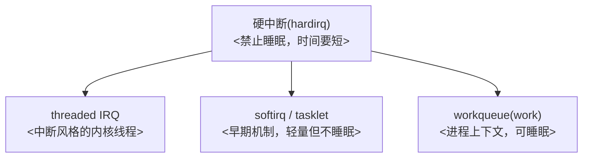

# 第7章_中断下半部机制与驱动中的选择

## 7.1_章节内容说明

本章解决的问题是：
 “我已经能让中断进来了，但我不想、也不能在硬中断（hardirq）里把所有事都做完，我应该把‘后续处理’放到哪里？”

Linux 给你的选择其实不止一个：

- 直接用 **threaded IRQ**（`request_threaded_irq()`）；
- 用**传统下半部**：softirq / tasklet；
- 用**工作队列（workqueue）**；
- 用**专用的系统工作队列（system_wq、system_highpri_wq 等）**；
- 驱动子系统内部还会再封装一层（比如输入子系统里已经帮你排队了）。

本章要做的事就是把这些“下半部”机制拉成一条清楚的梯度线，并且从驱动开发者的角度告诉你：**什么场景用什么，什么场景千万别用什么**。我们仍然保持前几章的风格：先讲“是什么/为什么/怎么实现”，然后给接口表，再给一段你能直接改的代码，最后给调试核对点。

------

## 7.2_为什么需要_下半部

### 7.2.1_硬中断的核心约束

上一章我们已经实践过：在 hardirq 里直接翻 LED 是最快的，但它也说明了 hardirq 的三个硬约束：

1. **不能睡眠**（no sleep）：不能 `msleep()`、不能拿可能睡眠的锁（mutex），不能做 I2C/SPI 这种可能调度的访问；
2. **不能做长时间计算**：hardirq 阻塞的这段时间，CPU 不能去处理别的中断，严重时会导致丢中断；
3. **不能做高延迟 I/O**：比如 `printk` 到慢串口；我们已经在第5章证实了它会“看起来卡住”。

所以：
 **硬中断负责的是“快、必须马上做、不能丢”的部分**，其他全都应该丢给下半部。

### 7.2.2_下半部要解决的问题

下半部机制要解决的其实只有一句话：

> “我要把硬中断里不能做、但又必须做完的那部分工作，在合适的上下文里补完。”

这就引出三类典型驱动需求：

1. **硬中断里只做事件‘锁存’**，真正处理放到线程/任务里；
2. **要能睡眠**（访问寄存器要延时、调用子系统接口要睡眠）；
3. **要能被重新排队**（一次中断要处理多条队列/多个 packet）。

------

## 7.3_几种常见下半部机制总览

下面这张是本章的“总图”。



四点说明：

1. **threaded IRQ**：还是“中断”，但以线程方式跑，优点是离原中断最近，写法也最贴近你现有的中断代码；
2. **tasklet / softirq**：更轻，但还是不能睡，一般现在**不建议新驱动再主动用 tasklet**，除非是为了跟老代码对齐；
3. **workqueue**：是最通用、最安全、也是写得最多的下半部方式，因为它在进程上下文里跑，可以睡；
4. **硬中断 → workqueue** 完全是合法的链路：先在 hardirq 里排队一个 work，后面慢慢处理。

------

## 7.4_threaded_IRQ_把中断_变成线程_的下半部

### 7.4.1_是什么

`request_threaded_irq()` 是内核提供的“分两段”的中断注册方式：

```c
int request_threaded_irq(unsigned int irq,
                         irq_handler_t handler,        // 上半部，可为 NULL
                         irq_handler_t thread_fn,      // 下半部，在线程中跑
                         unsigned long flags,
                         const char *name,
                         void *dev);
```

- `handler` 在真正的硬中断上下文里跑（原子上下文）
- `thread_fn` 在内核帮你创建的中断线程里跑（可调度上下文）
- `IRQF_ONESHOT` 会让控制器在中断线程结束前保持屏蔽状态（我们刚刚那一章的坑就出在这里）

### 7.4.2_什么时候用它

- 你仍然想“从中断开始处理”，但你知道要做的事可能会睡；
- 你想保持“看起来还是一个中断回调”的结构；
- 你需要 IRQF_ONESHOT 来护住一次性处理的场景（比如 GPIO 抖动聚合成一次事件）。

### 7.4.3_和我们第5章的关系

我们在第5章其实已经用过三次 threaded IRQ：

1. 硬中断里做时间窗去抖 → 返回 `IRQ_WAKE_THREAD`；
2. 线程里做翻转、打印；
3. 打印用了 `printk` 就会拖住 ONESHOT，换成 `trace_printk` 就不会。

说明它特别适合“中断→简单判定→交给线程”这种写法。

### 7.4.4_开发者要注意的点

- 线程函数**一定要快结束**，否则 ONESHOT 不会重新打开 IRQ；
- 不要在里面写大段 `printk`；
- 如果你发现线程函数里要做的事越来越多，就应该往 workqueue 拆，而不是一直堆在 threaded IRQ 里。

------

## 7.5_tasklet_/_softirq_老一代的下半部

### 7.5.1_是什么

- softirq 是内核最早的软中断机制，固定若干个 softirq 向量；
- tasklet 是基于 softirq 的一种更易用的封装：本质还是在软中断上下文里执行；
- **它们都不能睡眠**；
- 它们的调度时机不如 workqueue 直观，更多面向协议栈、网络、定时性比较强的场景。

### 7.5.2_为什么现在不推荐新驱动主动选它

- 不能睡；
- 接口相对老；
- 现代驱动大多数要么是 IO 要么是总线，要睡的事情太多；
- 你想要的“方便调试、方便排队、方便取消”，workqueue 都能更好做。

所以我们只需要知道：
 **如果你接手的老驱动里用了 tasklet，不要惊讶，它只是旧写法；新写法更倾向 workqueue 或 threaded IRQ。**

------

## 7.6_workqueue_最推荐的_真正下半部

### 7.6.1_是什么

workqueue 的核心就是一句话：

> 我先把要做的事情封装成一个 work，然后排队给一个内核线程去做，这个内核线程是在进程上下文跑的，所以我能睡。

典型代码：

```c
static void my_work_fn(struct work_struct *work)
{
    /* 这里是进程上下文，可以睡，可以访问子系统 */
}

INIT_WORK(&mydev->work, my_work_fn);

/* 在中断里、在别的地方： */
schedule_work(&mydev->work);
```

### 7.6.2_为什么驱动里更推荐它

- 可以睡；
- 可以做 I2C/SPI/MDIO 访问；
- 可以做分阶段初始化；
- 可以被取消；
- 有 devm 版本（新内核里有 `devm_work_autocancel()`，6.1 也能用到对应的 managed 形式，或者退一步用 `devm_add_action_or_reset()` 自己做回收）；

### 7.6.3_典型的_中断_to_workqueue_模式

这一段是你后面写“带耗时操作的中断处理”时最常用的模板：

```c
static irqreturn_t my_irq_thread(int irq, void *data)
{
    struct mydev *d = data;

    /* 这里只做很快的事，比如锁存事件 */
    d->pending = 1;

    /* 真正的处理丢给 workqueue */
    schedule_work(&d->work);

    return IRQ_HANDLED;
}
```

中断线程里就不做重活了，也不怕 printk 慢了，因为真正的输出你可以放到 work 里。

### 7.6.4_devres_版说明

既然你前面说了——讲内核驱动接口时要同时提一下 devm_*，这里就给一条思路：

- 没有 devm_xxx 可以直接用的，就用 `devm_add_action_or_reset(dev, ...)` 自己包一下；
- 或者在 probe 里 init work，在 remove 里 flush / cancel 工作；
- 样例（6.1 上安全）：

```c
static int my_probe(struct platform_device *pdev)
{
    struct mydev *d = devm_kzalloc(...);

    INIT_WORK(&d->work, my_work_fn);

    return 0;
}

static int my_remove(struct platform_device *pdev)
{
    struct mydev *d = platform_get_drvdata(pdev);

    cancel_work_sync(&d->work);
    return 0;
}
```

这样就能保证：中断来了 → 线程/硬中断排了 work → remove 时不会有悬挂的工作没做完。

------

## 7.7_驱动视角下的选择建议

这一小节直接给你写成书里能用的“选择表”：

### 7.7.1_按是否要睡来选

| 要不要睡                           | 推荐机制                                       |
| ---------------------------------- | ---------------------------------------------- |
| 不要睡，只是要推后做一点非常短的事 | threaded IRQ（不写慢日志） / tasklet（旧驱动） |
| 要睡，要访问子系统，要调度         | workqueue                                      |
| 要兼顾“看起来还是中断”又要能睡     | threaded IRQ + 立即 schedule_work              |

### 7.7.2_按_中断量是否大_来选

| 中断量               | 推荐机制                        |
| -------------------- | ------------------------------- |
| 很大、且单次处理很短 | tasklet / threaded IRQ          |
| 不确定，可能瞬时很多 | workqueue（因为可排队，可限流） |

### 7.7.3_按_是否要保护一次性事件_来选

如果你要保证“一次中断只处理一次事件”，比如 GPIO 抖动要合成一次，就可以：

1. threaded IRQ
2. - IRQF_ONESHOT
3. - 硬中断里做时间窗去抖
4. - 线程里只做翻转/上报

这就是你第5章最后一个版本的思路。

------

我是 GPT-5 Thinking.

## 7.8_示例_把第5章的_trace_printk_去抖版_再下沉一层

这一节就是把你第5章里那个“硬中断锁存 + threaded IRQ 消费 + trace_printk 看时序”的写法，再往下**拆一层**——也就是：
 中断线程只负责“确认这次要处理”，真正的业务（比如翻转 LED、上报 input、访问 I2C）丢给 workqueue 去做。这样你就同时具备下面几条能力：

1. 中断路径很短，不怕 `IRQF_ONESHOT`；
2. 真正业务在进程上下文里跑，可以睡、可以打印、可以访问别的子系统；
3. 保留 trace_printk，可以看时间差；
4. remove 的时候可以 `cancel_work_sync()`，不会留下悬挂的工作。

下面按你现在的写书样式补全。

------

### 7.8.1_思路说明

- 硬中断（hardirq）：只做**时间窗去抖** + **事件锁存**，然后 `return IRQ_WAKE_THREAD;`
- 中断线程（threaded IRQ）：只做一件事——如果有 pending 事件，就 `schedule_work(&lk->work);`
- workqueue：才是真正去翻 LED / 打日志 / 做慢操作的地方

这样一来，哪怕你在线程里偶尔写了一行 `trace_printk()`，也不会把整条 IRQ 拖住；真正慢的东西也被移到了 workqueue。

------

### 7.8.2_完整代码示例

```c
// SPDX-License-Identifier: GPL-2.0
/*
 * i.MX6ULL GPIO key -> IRQ -> workqueue 示例
 * 目标：
 *   1) DTS 同第 5.8 节（nxp,imx6ull-led_key_int）
 *   2) 硬中断做锁存 + 时间窗去抖
 *   3) threaded IRQ 不做业务，只排 work
 *   4) workqueue 里真正翻转 LED，并用 trace_printk 看时序
 *
 * 适用场景：
 *   - 你要在“中断路径”里保持极短
 *   - 但业务里要做能睡的事 / 要打印多行
 *   - 又想保留第 5 章那种时序可视化
 */

#include <linux/module.h>
#include <linux/platform_device.h>
#include <linux/of_device.h>
#include <linux/of_irq.h>
#include <linux/gpio/consumer.h>
#include <linux/interrupt.h>
#include <linux/jiffies.h>
#include <linux/spinlock.h>
#include <linux/pinctrl/consumer.h>
#include <linux/workqueue.h>
#include <linux/printk.h>

#define DRV_NAME "imx6ull-led_key_int_wq"

struct ledkey_dev {
	struct device    *dev;
	struct gpio_desc *led;
	struct gpio_desc *key;
	int               irq;

	unsigned int  debounce_ms;
	unsigned long last_edge_j;

	atomic_t       pending;     /* hardirq 锁存事件 */
	spinlock_t     lock;        /* 保护 last_edge_j */

	bool           led_on;
	bool           suspended;

	struct work_struct work;    /* 真正业务在这里做 */
};

/* ---------- 真正业务：在进程上下文里执行，可睡，可多打印 ---------- */
static void ledkey_work(struct work_struct *work)
{
	struct ledkey_dev *lk = container_of(work, struct ledkey_dev, work);

	/* 这里已经不在中断上下文了，可以放心做慢点的事 */
	lk->led_on = !lk->led_on;
	gpiod_set_value_cansleep(lk->led, lk->led_on);

	trace_printk(DRV_NAME ": work executed, LED -> %d\n", lk->led_on);
	dev_info(lk->dev, "work: key event handled, LED=%d\n", lk->led_on);
}

/* ---------- 硬中断：时间窗去抖 + 锁存 ---------- */
static irqreturn_t ledkey_primary(int irq, void *data)
{
	struct ledkey_dev *lk = data;
	unsigned long now = jiffies;
	unsigned long flags;

	spin_lock_irqsave(&lk->lock, flags);

	/* 没配去抖 || 超过时间窗 → 接受这次中断 */
	if (!lk->debounce_ms ||
	    time_after(now, lk->last_edge_j + msecs_to_jiffies(lk->debounce_ms))) {
		lk->last_edge_j = now;
		atomic_set(&lk->pending, 1);
		spin_unlock_irqrestore(&lk->lock, flags);

		/* 告诉内核：我要跑线程那一段 */
		return IRQ_WAKE_THREAD;
	}

	spin_unlock_irqrestore(&lk->lock, flags);
	return IRQ_HANDLED;
}

/* ---------- 中断线程：只排 work，不做业务 ---------- */
static irqreturn_t ledkey_thread(int irq, void *data)
{
	struct ledkey_dev *lk = data;

	if (lk->suspended)
		return IRQ_HANDLED;

	/* 没有锁存事件就退出，支持共享 */
	if (!atomic_xchg(&lk->pending, 0))
		return IRQ_HANDLED;

	/* 真正业务丢给 workqueue */
	schedule_work(&lk->work);

	/* 注意：这里不做 printk，避免 ONESHOT 被慢串口拖住 */
	return IRQ_HANDLED;
}

/* ---------- 申请中断 ---------- */
static int ledkey_request_irq(struct platform_device *pdev, struct ledkey_dev *lk)
{
	int irq, ret;

	/* 1) 先尝试从 DTS 直接拿 */
	irq = platform_get_irq_optional(pdev, 0);
	if (irq < 0) {
		/* -ENXIO 表示 DTS 里没配 → 从 GPIO 推导 */
		if (irq != -ENXIO)
			return irq;
		irq = gpiod_to_irq(lk->key);
		if (irq < 0)
			return irq;
	}
	lk->irq = irq;

	/* 2) 再钉一次触发类型，保证是下降沿 */
	irq_set_irq_type(lk->irq, IRQ_TYPE_EDGE_FALLING);

	/* 3) 申请“线程化中断”：
	 *    - hardirq: ledkey_primary
	 *    - thread : ledkey_thread
	 *    - ONESHOT: 线程没跑完前这条 IRQ 不会再次进来
	 */
	ret = devm_request_threaded_irq(&pdev->dev, lk->irq,
					ledkey_primary,
					ledkey_thread,
					IRQF_ONESHOT | IRQF_TRIGGER_FALLING,
					dev_name(&pdev->dev), lk);
	if (ret)
		return ret;

	dev_info(&pdev->dev, "irq=%d requested (falling, oneshot)\n", lk->irq);
	return 0;
}

/* ---------- probe ---------- */
static int ledkey_probe(struct platform_device *pdev)
{
	struct device *dev = &pdev->dev;
	struct ledkey_dev *lk;
	struct pinctrl *pct;
	u32 val;
	int ret, ret_db;

	lk = devm_kzalloc(dev, sizeof(*lk), GFP_KERNEL);
	if (!lk)
		return -ENOMEM;

	lk->dev = dev;
	spin_lock_init(&lk->lock);
	atomic_set(&lk->pending, 0);
	lk->led_on    = false;
	lk->suspended = false;

	/* 进入 probe 就把引脚切到 default，避免早期中断丢失 */
	pct = devm_pinctrl_get_select_default(dev);
	if (IS_ERR(pct))
		dev_warn(dev, "pinctrl default not applied: %ld\n", PTR_ERR(pct));

	/* 读 DTS 的软件去抖窗口，默认 30ms */
	lk->debounce_ms = 30;
	if (!of_property_read_u32(dev->of_node, "nxp,debounce-ms", &val))
		lk->debounce_ms = val;

	/* LED：ACTIVE_LOW；默认灭（物理高） */
	lk->led = devm_gpiod_get(dev, "led", GPIOD_OUT_LOW);
	if (IS_ERR(lk->led))
		return dev_err_probe(dev, PTR_ERR(lk->led), "get led-gpios failed\n");

	/* KEY：输入 */
	lk->key = devm_gpiod_get(dev, "key", GPIOD_IN);
	if (IS_ERR(lk->key))
		return dev_err_probe(dev, PTR_ERR(lk->key), "get key-gpios failed\n");

	/* 能开硬件去抖就开，开了就把软件窗口清零 */
	ret_db = gpiod_set_debounce(lk->key, lk->debounce_ms * 1000);
	if (ret_db == 0) {
		dev_info(dev, "HW debounce enabled: %u ms\n", lk->debounce_ms);
		lk->debounce_ms = 0;
	} else if (ret_db == -ENOTSUPP) {
		dev_info(dev, "HW debounce unsupported, using SW debounce: %u ms\n",
			 lk->debounce_ms);
	} else {
		dev_warn(dev, "gpiod_set_debounce=%d, fallback to SW (%u ms)\n",
			 ret_db, lk->debounce_ms);
	}

	/* 初始化工作队列项 */
	INIT_WORK(&lk->work, ledkey_work);

	/* 申请中断（threaded） */
	ret = ledkey_request_irq(pdev, lk);
	if (ret)
		return ret;

	platform_set_drvdata(pdev, lk);
	dev_info(dev, "probed: GPIO key IRQ->thread->work, debounce=%u ms\n",
		 lk->debounce_ms);
	return 0;
}

/* ---------- remove：要把 work 收一收 ---------- */
static int ledkey_remove(struct platform_device *pdev)
{
	struct ledkey_dev *lk = platform_get_drvdata(pdev);

	/* 防止还有没跑完的工作 */
	cancel_work_sync(&lk->work);
	return 0;
}

/* ---------- OF 匹配 ---------- */
static const struct of_device_id ledkey_of_match[] = {
	{ .compatible = "nxp,imx6ull-led_key_int" },
	{ /* sentinel */ }
};
MODULE_DEVICE_TABLE(of, ledkey_of_match);

/* ---------- 平台驱动描述 ---------- */
static struct platform_driver ledkey_driver = {
	.probe  = ledkey_probe,
	.remove = ledkey_remove,
	.driver = {
		.name           = DRV_NAME,
		.of_match_table = ledkey_of_match,
	},
};
module_platform_driver(ledkey_driver);

MODULE_LICENSE("GPL");
MODULE_AUTHOR("Leaf & ChatGPT");
MODULE_DESCRIPTION("i.MX6ULL: GPIO key IRQ -> threaded -> workqueue (trace-able, debounced)");
```

------

### 7.8.3_关键点说明

1. **中断线程不做业务**
    `ledkey_thread()` 里只做：

   ```c
   if (atomic_xchg(&lk->pending, 0))
       schedule_work(&lk->work);
   ```

   没有 printk、没有 msleep、没有访问 I2C，这就确保了 ONESHOT 不会被你“中断线程太慢”而拖死。

2. **真正的“业务/打印/可睡”都丢到 work 里**
    `ledkey_work()` 是进程上下文，可以放心写 `dev_info()`，也可以加上别的子系统操作。

3. **仍然保留 trace_printk**
    我在 work 里写了一个 `trace_printk(...)`，这样你能在 trace_pipe 里看到“中断 → 线程 → work”这条完整链路的时序。

4. **remove 里要 cancel_work_sync()**
    因为我们这次用了独立的 work，如果不收，会在驱动卸载后访问已经释放的结构体。

------

### 7.8.4_调试建议

1. 先用你第5.8的“无消抖硬中断版”确认中断链路是好的；

2. 再 insmod 这个“IRQ→thread→work”版，看能不能翻 LED；

3. 再开：

   ```bash
   cat /sys/kernel/debug/tracing/trace_pipe
   ```

   按键，应该能看到 `work executed`；

4. 再用 `/proc/interrupts` 看中断计数是否在涨；

5. 如果你想模拟“work 很慢”的情况，就在 `ledkey_work()` 里 `msleep(200);`，你会发现这次不会影响 IRQ 的再次进入——这就是“再下沉一层”的意义。

------

这样这一节就完整了，可以直接并到“第7章 中断下半部机制与驱动中的选择”里当 7.8 小节用。

------

## 7.9_调试与验证要点

1. 看 `/proc/interrupts`：确认中断确实在进；
2. 看 `trace_pipe`：确认你的 `trace_printk()` 没被串口拖慢；
3. 看 `workqueue` 状态（`/sys/kernel/debug/workqueue/...`）确认工作是否被执行；
4. 用你第5章的三个驱动版本来回切，能明显感受到“线程里写 printk”和“线程里只排 work”的差别；
5. 如果用的是专用 workqueue，要注意 flush/cancel 的时机，probe 成功后就应该可以排队，remove 前必须收尾。

------

## 7.10_小结

- “下半部”不是一个机制，而是一组机制：threaded IRQ、tasklet/softirq、workqueue；
- 现代驱动里**workqueue 是最通用的选项**；
- 你这块板子之所以“看起来中断卡住了”，不是 Linux 中断有问题，而是你在线程化中断里做了慢操作 + IRQF_ONESHOT；
- 把“去抖/锁存”放 hardirq，把“业务/打印/上报”放 work，是最适合你这个 GPIO 按键中断系列的写法；
- 后面如果要讲 “定时器 / hrtimer + 中断配合做去抖”，就可以在本章的 workqueue 之后继续往下接。

------

如果你要，我们下一章可以转到
 **第8章 中断与高精度定时器(hrtimer)的协同：去抖、延时确认与一次性中断再使能**
 继续保持这个 Markdown 样式。