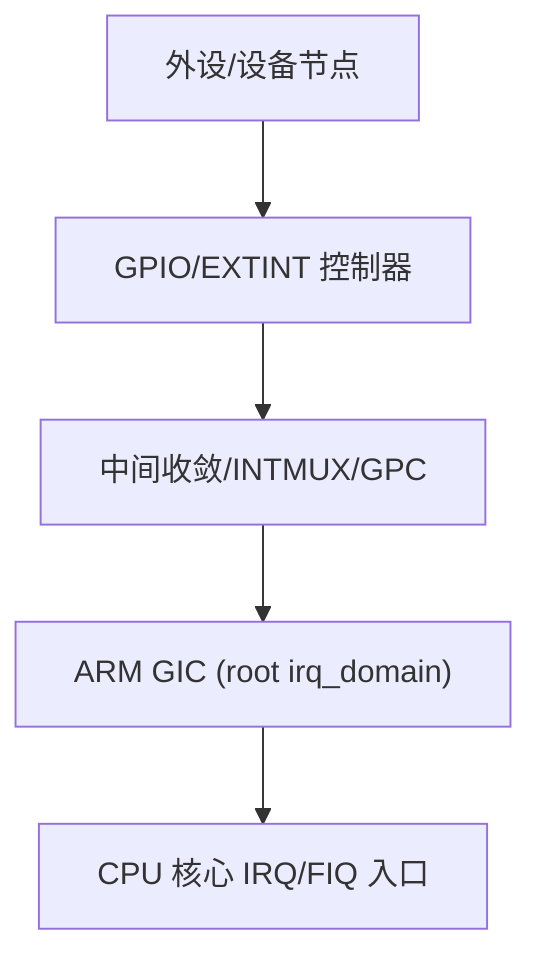
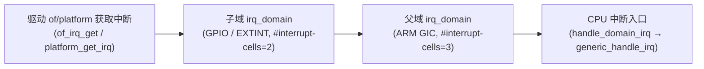
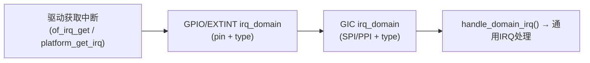

# 第9章_层级中断控制器与_ARM_GIC_在_Linux_中的实现

## 9.1_章节内容说明

本章的目标是把“Linux 内核中断子系统的抽象（irq_chip / irq_domain / irq_desc）”与“真实 ARM SoC 上的分层中断硬件（GPIO-INT → 中间收敛 → GIC）”做一次一一对照，说明为什么**多数看起来像是驱动问题的中断异常，实际根因在于中断控制器没有按层级建好**，尤其是 DTS 已经写了 `interrupt-controller`、`interrupt-parent`，但对应的控制器驱动并没有创建 irq_domain 或者没有正确把 parent 串到 GIC 上。

本章遵循前面章节的写书要求，结构如下：

- 先讲“是什么/为什么”（分层中断出现的背景、Linux 为什么一定要搞层级 irq_domain）；
- 再讲“怎么实现”（GIC 作为根域，子控制器如何创建自己的域并指向 GIC）；
- 再从内核数据结构视角说明各层在内核中的表现形式；
- 再回到开发者视角说明 DTS 怎么写、驱动怎么拿 virq、怎么用 devm 系列；
- 最后给出调试与排查步骤。

本章不讨论以下内容（后续章节单独讲）：

- MSI / MSI-X / PCIe 中断的层级化；
- 虚拟化场景下的 vGIC 转发；
- 电源管理下的唤醒中断细节。

本章的阅读前提：已理解第3章的 irq_domain 基本概念、已理解第5章的 GPIO 中断触发语义，否则读到 9.3 以后会觉得“为什么这里又要设类型”。

------

## 9.2_分层中断在_Linux_中的问题定义(是什么)

### 9.2.1_分层中断的典型硬件形态

在多数 ARM SoC 上，中断路径并不是“外设 → GIC → CPU”这种单层结构，而是：

1. 外设先把中断线接到一个 GPIO/EXTINT/PORT 控制器；
2. 该控制器把“第 N 个引脚发生了中断”转换成一条中断源；
3. 这一条中断源再上报给 GIC；
4. GIC 再把它送给指定的 CPU。

因此，真实路径是：



说明：

- 上图中每一层（B、C、D）都可能在 DTS 中被声明为 `interrupt-controller;`
- 只有最上层的 D（GIC）真正面对 CPU
- A 不需要知道有 B、C、D，只要 DTS 能正确描述链路，Linux 就能分层解析

### 9.2.2_Linux_要解决的核心矛盾

Linux 中断子系统要解决的矛盾不是“如何处理一个中断”——这个在单控制器系统里早就解决了；真正的矛盾是：

1. **硬件是分层的，但驱动希望只看到一个最终的中断号（virq）**
    驱动作者不能被迫去了解“GPIO → INTMUX → GIC”这一条物理路径。
2. **不同层有不同的配置能力**
   - 最底层（GPIO/EXTINT）知道这条线到底是上升沿、下降沿还是电平；
   - 最上层（GIC）才有 CPU 目标路由、优先级、mask/unmask；
      因此配置必须在“能配置的那一层”完成，不能全丢给 GIC。
3. **DTS 允许描述多级中断，但内核要能逐层解释**
    DTS 可以写：
   - GPIO 控制器是中断控制器
   - 它的父亲是 GIC
   - 某个设备的中断来源是 GPIO 控制器的第 X 号 pin
      内核必须把这三层都翻译出来，不能只翻译最上层。
4. **错误几乎都长一个样**
    只要有一层没建 irq_domain，或者类型没在本层处理，就会出现下面这几类典型症状：
   - “能申请但不触发”
   - “只触发一次”
   - “一直触发”
   - “DTS 看着对，但 /proc/interrupts 不动”
   - dmesg: `no irq domain found for ...`

### 9.2.3_不建立层级会带来的直接后果

如果你只建立了 GIC 这一层，而下面 GPIO 那层没建立 irq_domain，或者没把 parent 指到 GIC，会直接出现以下后果：

- 设备驱动在 probe 时调用 `platform_get_irq()` 返回负数，probe 失败，dmesg 里能看到 “no irq domain found …”；
- 设备驱动能 `request_irq()` 成功（说明 GIC 这一层是好的），但你实际去按键/触发外设，它就是不进中断（说明下层没把中断送上来）；
- 设备驱动能进一次中断，然后再也进不来（说明下层有 pending 没清掉，或者下层本来就是电平触发但你上层当作边沿了）；
- 你把 DTS 里写的触发类型改成“下降沿”，行为完全没变（说明类型根本没在能处理的那一层生效）。

这几种现象在嵌入式板级调试里极其高频，本章就是针对这几种现象给出内核层面的解释。

------

## 9.3_ARM_GIC_在层级结构中的角色(怎么放进去)

### 9.3.1_GIC_一定是根域(root_irq_domain)

在 ARMv7/v8 的常见 Linux 移植中，GIC 驱动会在非常早的阶段完成以下动作：

1. 检测到兼容串（如 `arm,cortex-a9-gic`、`arm,gic-v3`）；
2. 建立一个 irq_domain，通常是 linear 类型；
3. 将其注册为系统的主中断控制器；
4. 把这个域指针保存在全局的 GIC 私有数据中，供后续子控制器引用。

这意味着：**后面出现的 GPIO 中断控制器、INTMUX、PMIC-IRQ 等控制器，都必须把自己的 parent 指到这个 GIC 域上**，否则这一条中断路径最后就交不到 CPU。

换句话说：

- GIC 是最终把中断交给 CPU 的那一层
- GIC 是其他中断控制器的“上游”
- GIC 不关心你下面有几层，它只关心：你上报给我的中断号是否合法、要送哪个 CPU、要不要屏蔽、怎么 EOI

### 9.3.2_GIC_做和不做的事情

GIC 要做的：

- 给中断分配最终的 virq（Linux 可见的 IRQ 号）
- 设置路由：这个 IRQ 要进哪个 CPU
- 设置优先级和屏蔽
- 在中断服务后做 EOI/Deactivate（特别是 GICv3）

GIC 不做的：

- 不决定“这是 GPIO 的第几号引脚”
- 不决定“这个中断最初是不是下降沿触发”
- 不负责本地防抖
- 不负责把电平型的外设中断变成边沿型（除非它硬件支持并且驱动写了）

因此，**不要指望 GIC 来纠正下层的错误类型**，类型必须在离外设最近的那一层就确定。

### 9.3.3_为什么子控制器要有自己的_irq_domain

很多人会问：既然最终都是 GIC 在分配 virq，为什么下面的 GPIO/INTMUX 还要创建 irq_domain？

原因有三条：

1. DTS 里已经把它写成了一个中断控制器
    既然 DTS 说它是一个 “interrupt-controller;”，Linux 就必须给它建一个 irq_domain，否则这个节点就成了“声明有功能但没有实现”的状态。
2. 子控制器要在本层消化掉“本层才能理解的信息”
    例如：GPIO 控制器知道 pin 号、知道这个引脚是否反相、知道它能不能双边沿。这个信息如果不上报、或者裸上报给 GIC，GIC 是没法正确配置的，于是行为就不对。
3. 子控制器要把“已经处理好的中断”上交给父域
    也就是说，子控制器的 irq_domain 不光是为了给下面的设备分配本层号，更重要的是，用它来告诉父域：“我这边有一个合法的中断，请你给我一个系统范围内的 virq”。

因此，**只建 GIC 一层，而不建 GPIO 那层，是不完整的**。

### 9.3.4_GIC_与子域的典型_DTS_关系

典型写法如下（这一段只是说明关系，后面 9.3 会拆得更细）：

```dts
gic: interrupt-controller@... {
    compatible = "arm,gic-v2";
    interrupt-controller;
    #interrupt-cells = <3>;
};

gpio1: gpio@... {
    compatible = "fsl,imx6ull-gpio";
    interrupt-controller;
    #interrupt-cells = <2>;
    interrupt-parent = <&gic>;
};
```

解释要点：

- GIC 是 3 cells：通常是中断类型 + 中断号 + 触发类型
- GPIO 是 2 cells：通常是本 GPIO 控制器里的 pin 号 + 触发类型
- GPIO 明确声明了自己的父亲是 GIC：这就构成了“子域 → 父域”的层级

### 9.3.5_可视化结构(Typora_友好版)

下面的图是把“驱动拿 IRQ”到“层级中断控制器真正创建 virq”的过程画出来（引号全部转义）：



说明：

- 驱动只和最左边的 DEV 这一步打交道
- 中间两步完全由内核中断分层机制完成
- 右边 CPU 入口是第1章～第3章讲过的通用中断处理，不在本章重复


## 9.4_GPIO_/_外部中断控制器挂到_GIC_的路径还原

### 9.4.1_典型三层拓扑的_DTS_表达

下面是最常见、也是问题最多的一种形态：设备 → GPIO 控制器 → GIC。

```dts
gic: interrupt-controller@... {
    compatible = "arm,gic-v2";
    interrupt-controller;
    #interrupt-cells = <3>;
};

gpio1: gpio@... {
    compatible = "fsl,imx6ull-gpio";
    interrupt-controller;
    #interrupt-cells = <2>;
    interrupt-parent = <&gic>;
};

key0: key0@0 {
    compatible = "demo,key";
    interrupt-parent = <&gpio1>;
    interrupts = <18 IRQ_TYPE_EDGE_FALLING>;
};
```

要点说明：

1. GIC 是最顶层控制器，3 个 cells；
2. GPIO1 也是一个控制器，但它有父亲 → GIC；
3. 具体设备（key0）用的是 GPIO1 这层的中断描述（2 个 cells），不是直接用 GIC 的 3 个 cells。

这就决定了：**内核在解析 key0 的中断时，一定要先走 GPIO1 的 irq_domain，再走 GIC 的 irq_domain**，这就是“层级”。

### 9.4.2_内核解析路径(运行时链路)

设备驱动在 probe 时会调用 `platform_get_irq()` / `of_irq_get()`，从这里开始内核的实际动作是：

1. 根据 key0 节点里的 `interrupt-parent = <&gpio1>`，先找到 gpio1 这个中断控制器；
2. 用 gpio1 的 irq_domain，把 `<5, IRQ_TYPE_EDGE_FALLING>` 解释成“本 GPIO 控制器里的第5号中断源，触发方式为下降沿”；
3. gpio1 的 irq_domain 发现自己有 parent（就是 GIC），于是把这个“已经解释好的中断”上交给 GIC 的 irq_domain；
4. GIC 的 irq_domain 给它分配一个全局唯一的 virq；
5. 把这个 virq 返回给驱动；
6. 驱动用这个 virq 去 `devm_request_irq()`，以后中断就走这条链。

所以驱动根本不需要、也不应该去手动找 “gpio1 → gic” 这一段，**这一段必须是内核自动完成的**。

### 9.4.3_各层的职责划分

这一点是本章的核心之一，单独写清楚。

- 子域（GPIO / 外部中断芯片）负责：
  - 哪个引脚/哪一路
  - 边沿还是电平
  - 高有效还是低有效
  - 是否需要在本层清 pending
  - 是否需要做本层的消抖/滤波（如果硬件支持）
- 父域（GIC）负责：
  - 把子域上交的“一个已经确定好的中断”映射成系统 virq
  - 路由到哪个 CPU
  - 全局的 mask/unmask
  - EOI/Deactivate

所以正确的思路是：

> 能在子域确定的东西，就在子域确定；
>  子域确定不了的，再往上推给 GIC；
>  不能反过来“先推上去，再指望 GIC 自动帮你修”。

### 9.4.4_不正确挂接方式的后果

1. 设备直接写成挂在 GIC 上，但实际硬件是 GPIO → GIC：
   - 设备能申请到 IRQ（因为 GIC 在）
   - 但是实际引脚变动没有任何中断进来（因为 GPIO 那层没被配置）
2. GPIO 驱动没创建 irq_domain：
   - dmesg 出现 `no irq domain found for node /.../gpio@...`
   - 设备 probe 时 `platform_get_irq()` 返回负数
   - 整个链路在 GPIO 那层断掉
3. GPIO 那层不支持你 DTS 里写的触发类型，但你还是推上去了：
   - GIC 收到了一个它能处理的“中断来了”，但由于下层始终处在触发态，会表现为“一直触发”或者“只要一触发就停不下来”

### 9.4.5_可视化的分层路径



解释：

- DEV 这一端就是驱动世界，只有 virq
- G1/G2 是内核世界，它知道 DTS 怎么写、域怎么串
- 这两层之间出错，99% 是“子域没创建 / parent 没指向 GIC / 类型没在子域处理”

------

## 9.5_层级域中的中断号申请_映射与传播

（本节重点解释“中断号是在哪一层变成最终 virq 的”“触发类型应该在哪一层定”“devm 是怎么配合的”。）

### 9.5.1_hwirq_to_virq_的分层转换顺序

Linux 在分层中断控制器场景下的转换顺序是固定的：

1. 最底层（GPIO/EXTINT）把“硬件中断号 + 本层语义”转换成**本层中断描述**；
2. 把这个描述上交给父域；
3. 父域（GIC）根据自己的映射规则，分配或找到一个全局唯一的 **virq**；
4. 把这个 virq 返回给请求方（通常是中断消费者驱动）。

也就是说，**virq 一定是在最上面的那一层出来的**，不管下面有几层。

这也是为什么你在驱动里永远只看到一个数字，而看不到“GPIO 的第5个 pin”这些细节——那些都已经在下面一层被吃掉了。

### 9.5.2_irq_domain_ops_在层级结构里的真实作用

很多人看到 irq_domain_ops 只想到 “map/unmap”，但在层级场景下它真正做的是：

- 把 DTS 里描述的这一层信息（cells）转成这一层能理解的中断对象；
- 再把“我这层已经看懂了”的结果继续往上层递交；
- 必要时在这一层就做类型转换、极性统一、pending 清除等本层才知道怎么做的动作。

也就是说，**irq_domain 是“逐层解释 DTS 的机制”**，不是“一次性把 DTS 全解释完”的机制。

### 9.5.3_触发类型应该在哪一层处理

这是一条经验规则，也是多数人出错的地方：

- 能在 GPIO / EXTINT 这一层确定的触发类型，必须在这一层就确定；
- GIC 那一层只接受“我已经是一个明确的中断了”，不会也不应该再去帮你试探真正的电气触发模式；
- 如果下层不处理，直接把类型推给 GIC，就会出现：
  - GIC 接受了一个永远为 active 的中断 → 表现为“只要一来就一直来”
  - GIC 接受了一个它硬件不支持的类型 → 表现为“你 DTS 改类型没有效果”
  - GIC 必须被动帮你清 → 表现为“只能进一次，第二次不进”

所以，本节的结论只有一句话：

**触发语义要在离硬件最近的那一层完成；
 GIC 层只做 CPU 相关的事。**

### 9.5.4_与_devm_request_irq_的关系

很多驱动开发者会问：我用了 devm 版，中断是不是还会一层一层释放？
 答案是：会，但不是你想象的那样。

- 层级映射是在你“获取 IRQ 号”的时候就已经完成的（of_irq_get / platform_get_irq）
- devm_request_irq 只是在“驱动生命周期结束时，自动帮你做 free_irq”
- 它不会、也不需要、也不能去“反向拆层级 irq_domain”
- 真正的 irq_domain 层级是在控制器驱动 probe 的时候建立的，和你的消费驱动无关

因此，**层级中断 + devm 是完全可以、也应该一起用的**，写法不需要特别处理。


## 9.6_调试与排查方法

### 9.6.1_典型症状分组

在多级中断场景下，几乎所有问题都可以归到下面四种症状之一：

1. 能申请 IRQ，但永远不触发；
2. 只触发一次，后面不再进；
3. 一直触发、停不下来（中断风暴样式）；
4. DTS 看上去对，但 /proc/interrupts 不动，或者动的是 GIC 的一行而不是你想要的那行。

后面所有排查步骤都围绕这四种症状展开。

### 9.6.2_第一层排查_看_DTS_的层级是否闭合

要先确认这条路径在 DTS 上是闭合的，即：

- 设备节点：有 `interrupt-parent = <&gpioX>` 或间接写法；
- gpioX 节点：有 `interrupt-controller;`、有 `#interrupt-cells = <N>;`，并且有 `interrupt-parent = <&gic>`；
- gic 节点：有 `interrupt-controller;`、有 `#interrupt-cells = <3>;`

缺哪一层，内核就在哪一层断掉。
 如果设备直接指向了 GIC，而实际硬件是“设备→GPIO→GIC”，这是最典型的“能申请不触发”。

### 9.6.3_第二层排查_看控制器驱动是否创建了_irq_domain

DTS 写了不等于驱动实现了。要看启动日志里有没有类似：

- `irq: gpio@...: created irq domain`
- `irq: GICv2: ...`

如果 GPIO 那一层的驱动没打印出域创建的信息，那说明它根本没把 DTS 那一层接起来，这时候你在设备上 `platform_get_irq()` 是没法成功映射到最终 virq 的。

### 9.6.4_第三层排查_看_/proc/interrupts_的跳数

方法：

1. 先 cat 一次 `/proc/interrupts`；
2. 触发外设（按下按键、插拔信号等）；
3. 再 cat 一次 `/proc/interrupts`；
4. 对比哪一行在跳。

情况一：GIC 那一行在跳，但设备的 ISR 不进
 → 说明 GIC 收到了，但下层（真正设备对应的那个 virq）没有建立或没有分给你
 → 多半是你把设备直接挂在 GIC 上了，绕过了 GPIO

情况二：完全不跳
 → 要么硬件根本没进 GPIO，要么 GPIO 层没建 irq_domain，要么 DTS 的 `interrupt-parent` 指错了

### 9.6.5_第四层排查_看触发类型是否在子域生效

如果是“一直触发”或者“只触发一次”，优先看：

- 子域（GPIO/EXTINT）驱动里有没有实现 `irq_set_type`；
- 子域在 probe 时有没有根据 DTS 传进来的 flags 写寄存器；
- 子域有没有在中断处理路径里做本层的 ack/clear。

如果这些都没有，只是把 DTS 的 flags 原样往 GIC 推，那最后看到的现象一定是和硬件不匹配的。

### 9.6.6_建议的最小排查顺序

1. 看 DTS：三层是否闭合
2. 看 dmesg：是否有 “no irq domain found …”
3. 看 /proc/interrupts：是否有跳数
4. 在子域 driver 里加一条 printk，看能否进到子域的 irq_chip 回调
5. 最后才看驱动自己的 ISR

------

## 9.7_与_DTS_的对照核查点

### 9.7.1_必须同时出现的_3_个字段

对于“想作为中断控制器使用”的节点，必须同时出现：

- `interrupt-controller;`
- `#interrupt-cells = <N>;`
- 其上层（父节点）可被引用，并且已经注册了中断域

只写了 `interrupt-controller;` 但没写 `#interrupt-cells`，或者 cells 写了却没有对应驱动，就会导致 of 解析到这里断掉。

### 9.7.2_interrupt-parent_的位置要对

- 设备节点要指向“离自己最近的那个中断控制器”，也就是 GPIO 那层；
- GPIO 那层要指向 GIC；
- 不要跳过中间层直接指向 GIC，除非硬件真的是直接连到 GIC。

### 9.7.3_cells_数量要和控制器驱动一致

GIC 常见是 3 个 cells（中断类型+号+触发）；
 GPIO 常见是 2 个 cells（pin + 触发）；
 如果 DTS 写的是 3，但驱动解析的是 2，就会报 “invalid irq specifier”。

### 9.7.4_多控制器场景下的歧义

如果板子上有两个 GPIO 控制器、一个 PMIC-IRQ，再加一个 GIC，容易出现“写成了另一个 GPIO 的父亲”，结果中断走错控制器。这种情况在 dmesg 里不一定报错，只是在 /proc/interrupts 里你永远看不到你预期的那一行，所以必须对照 DTS 做一次“从设备反推控制器”的核查。

------

## 9.8_驱动侧的最小可行模板

本节的目的不是讲 API，而是要说明：**在层级中断场景下，驱动其实不需要额外做什么，反而是“不能多做”**。

### 9.8.1_获取_IRQ

```c
int irq;

irq = platform_get_irq(pdev, 0);
if (irq < 0)
    return irq;
```

说明：

- 如果 DTS 层级写得对，这里拿到的就是最终 virq；
- 如果这里直接报错，先不要看驱动，先看 DTS 和子域驱动。

### 9.8.2_注册(非_devm)

```c
ret = request_irq(irq, my_isr, 0, dev_name(dev), dev);
if (ret)
    return ret;
```

说明：

- 不建议在这里再硬写 `IRQF_TRIGGER_*`，除非你要覆盖 DTS；
- 如果 DTS 已经指定类型，就让 DTS 的类型沿层级下去。

### 9.8.3_注册(devm_推荐)

```c
ret = devm_request_irq(dev, irq, my_isr, 0, dev_name(dev), dev);
if (ret)
    return ret;
```

说明 devm（响应你之前的固定要求）：

- 作用：生命周期绑定，自动 free
- 释放逻辑：device 销毁 → 内核帮你 free_irq
- 与非 devm 的区别：你不需要自己写 remove 里的 free_irq
- 与层级中断的区别：devm 不参与 irq_domain 的创建和销毁，只负责消费侧的释放

### 9.8.4_ISR_中要做的最少动作

如果你确定下层（GPIO 那层）已经做了 ack/clear，那你的 ISR 就是普通的：

```c
static irqreturn_t my_isr(int irq, void *dev_id)
{
    /* 读状态、清硬件、唤醒下半部等 */
    return IRQ_HANDLED;
}
```

若你发现“一次中断只能进一次”，要排查的是**子域是否真正清了本层的 pending**，而不是在这里反复 `return IRQ_HANDLED`。

------

## 9.9_常见错误场景分类说明

### 9.9.1_DTS_写对了_驱动照样没中断

根因：中断控制器驱动没有创建 irq_domain
 表现：dmesg 有 “no irq domain found …”
 解决：补中断控制器驱动，或打开该控制器的中断功能宏

### 9.9.2_触发一次后就卡死

根因：下层实际是电平触发，但你当作边沿用了，而且没在下层清
 表现：/proc/interrupts 对应项持续加，ISR 进一次后不再进
 解决：把类型落在子域里处理；或者硬件侧按电平处理

### 9.9.3_一直触发

根因：子域没有真正配置成你想要的触发方式，或者输入脚一直处在有效电平
 解决：检查 GPIO 控制器的 set_type 回调，检查 DTS 的 flags 是否被正确消费

### 9.9.4_多个中断控制器名字类似_挂错了

根因：板子上有 gpio1、gpio2、gpio3，设备却写成了 `interrupt-parent = <&gpio2>`
 表现：中断不来，但没有报错
 解决：对照原理图/SoC 手册确认到底是哪一组 GPIO 有中断功能；用 /proc/interrupts 看是否有对应的中断行

### 9.9.5_层级里混进了_PMIC-IRQ

有的平台 PMIC 也会出来一组中断，这一组中断再进 GIC，如果 PMIC 那层驱动没建 irq_domain，那么所有“挂在 PMIC 上的中断”都会表现成“能申请不触发”。

------

## 9.10_小结

1. 多数“能申请不触发/只触发一次/一直触发”的问题，不在驱动，而在“中断控制器没有按层级建好”，尤其是 GPIO/EXTINT 那一层没有创建 irq_domain 或没有把 parent 指到 GIC。
2. GIC 在 Linux 里始终是根域，它只负责 CPU 侧的事，不负责替下层修正类型。触发语义要在离硬件最近的那一层完成。
3. DTS 要求的是“一层一层说清楚”，内核的 irq_domain 机制也是“一层一层解释”，这两者必须配对，否则会在中间某一层断掉。
4. 驱动侧写法其实最简单，重点是：用 DTS 解析出来的 IRQ，不要再在驱动里手动改类型，除非你很确定要覆盖 DTS。
5. 调试时永远先看：DTS 三层是否闭合 → 驱动是否创建 irq_domain → /proc/interrupts 是否跳数 → 子域是否吃掉了类型。只有这一套都正确了，才能往上接着写 MSI / PM 相关的中断章节。

（第9章完）