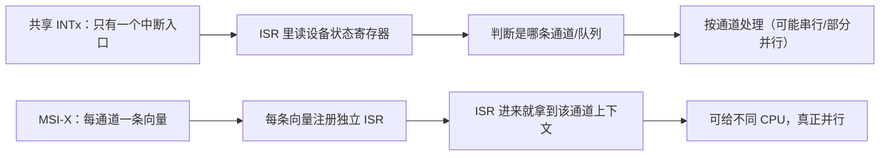
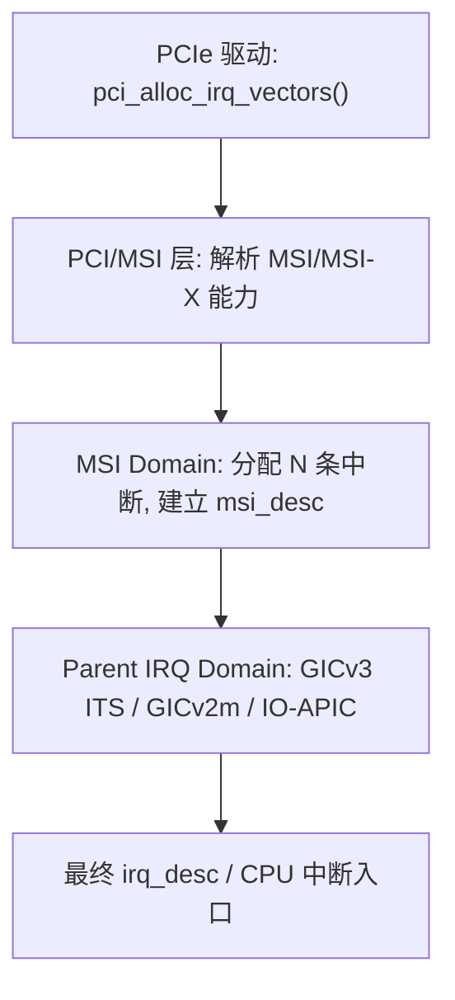
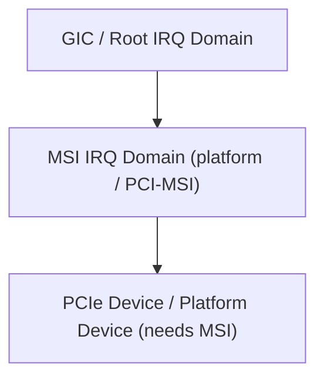
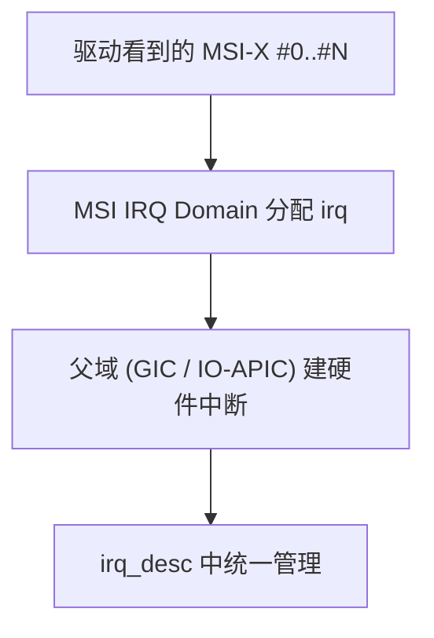

# 第12章_MSI_MSI-X_与_PCIe_设备的中断框架

## 12.1_MSI_/_MSI-X_与_PCIe_设备的中断框架

### 12.1.1_章节引入与目标

本章讨论的是**“非引脚型中断”在 Linux 中是如何被纳入统一中断子系统的**，重点是 MSI（Message Signaled Interrupt）和 MSI-X 两种机制，以及它们与 PCIe 设备、irq_domain、平台中断控制器之间的关系。

前面 1～11 章的主线都是“有一根中断线 → 挂到某个中断控制器 → 经过 irq_domain → 落到 irq_desc → 驱动 request_irq()”。本章要解决的问题是：

1. **没有中断线怎么办？**（PCIe 设备只发一个“写消息”）
2. **同一个设备要很多条中断怎么办？**（多队列网卡、NVMe）
3. **SoC 上没有完整 PC 那套 IO-APIC / HPET，但也要用 MSI 怎么办？**
4. **Linux 怎么把这条“消息型中断路径”塞进现有 irq_domain 框架？**

本章完成后，读者应该能做到：

- 看得懂 `pci_alloc_irq_vectors()` 背后的 IRQ 分配链路；
- 能区分 MSI 和 MSI-X 的作用、使用场景以及“不写的后果”；
- 知道在平台/SoC 上如果 DTS 里写了 `msi-parent`，内核里应该出现哪几个 irq_domain；
- 会在 PCIe 驱动里写**多中断向量版本**的 probe()，并能配合 devm_ 接口写干净的退出路径；
- 能排查“中断号出来了但中断不打”的典型 MSI 故障。

------

### 12.1.2_MSI_出现的动机与和_线中断_的区别

#### (1)_是什么

MSI（Message Signaled Interrupt）是 PCI/PCIe 体系里定义的一种**用一次内存写事务来表示中断**的机制。设备要打中断时，不再去拉 INTA#/INTB# 这些物理引脚，而是**往主机预先配置好的一个地址写一段固定的数据**，上游的中断收集硬件（比如 x86 的 APIC/IO-APIC，ARM 的 GICv2m / GICv3 ITS）收到这个写操作后，就把它当成一次中断事件，进而向 CPU 报告中断。

MSI-X 是 MSI 的扩展版，它的改进点核心只有两条：

1. **向量数量更多**（设备自己有一个 MSI-X Table，每个表项就是一条中断）；
2. **每条向量的地址/数据可以独立配置**（便于做亲和性和多队列的拆分）。

#### (2)_要解决什么问题

MSI 不是为了“更高级”而生的，它是为了解决**线中断天然做不到或者做得很难**的几个点：

1. **中断线数量不够**
    板子上能布出来的中断线有限，PCIe 插进来一堆卡，不可能一张卡一根线。共享线中断就会出现“要轮询一圈是谁产生的”，而且一个坏设备可以拖慢一条线上的所有设备。
2. **需要很多条中断（多队列设备）**
    高性能网卡、NVMe、RDMA、加速卡、虚拟化的 VF 设备都希望做到“每个队列有自己的中断”，这样可以做到 CPU 间分摊和 NUMA 亲和；这在 INTx 模式下基本做不到。
3. **更灵活的拓扑和虚拟化**
    消息型中断可以被 Hypervisor 捕获、重定向，也可以被中断控制器做更灵活的路由；线中断的物理性太强，虚拟化迁移不好做。
4. **不要共享中断的性能损耗**
    MSI/MSI-X 的典型特点是**一条向量只对应一个中断源**（或至少是预期如此），进入中断不需要像共享线那样一轮一轮问。

##### 1)_为啥要用MSI_使用在什么场景

**提问：**

上文提及：

> 板子上能布出来的中断线有限，PCIe 插进来一堆卡，不可能一张卡一根线。共享线中断就会出现“要轮询一圈是谁产生的”，而且一个坏设备可以拖慢一条线上的所有设备。

为什么做不到用线中断呢？我的脑海里任务pcie只有一个中断引脚，它这个中断引脚能够实现中断的目的，那么你这里是在说什么场景需求呢？

**回答**：

你这个疑惑非常关键，归根结底是两句话：

1. **“能不能用线中断” ≠ “线中断是不是一个好、可扩展的方案”**
2. **PCIe 体系里确实保留了“像 PCI 那样的 Legacy INTx”这条路，但它一旦进入‘有很多设备/很多中断源/高 PPS’场景，就会暴露出结构性问题，所以才要 MSI。**

我拆开说，尽量对着你脑子里的模型讲。

------

###### a)_你脑子里的模型_一个_PCIe_设备_to_一个中断引脚_to_能中断

这个是对的，但它说的是**“单设备、低并发、板上布线简单”**这个最小场景，比如：

- 板上就一个 PCIe endpoint；
- 主控（Root Complex）就给你虚拟了一条 Legacy INTx；
- 你的驱动里 `request_irq(pdev->irq, ...)` 就能收到中断。

在这种情况下，“用线中断”完全能工作，你说的没错。

------

###### b)_我说的场景是_总线上有很多设备_而且要高性能

问题一旦变成下面这样，线中断就不好用了：

- 一条 PCIe 链路下面挂了**多个 endpoint**（比如下面还有个 PCIe switch）；
- 每个 endpoint 都有**比较频繁的中断**（网卡、存储、加速卡、SR-IOV 出来的很多 VF）；
- 操作系统想要**给不同队列/不同功能分配多条中断**，做 CPU 分摊。

这时，Legacy INTx 的几个结构性限制会被放大。

------

###### c)_Legacy_INTx_的结构性限制

###### d)_物理/逻辑上就几个中断信号

老的 PCI 是 INTA#/INTB#/INTC#/INTD# 四根线，PCIe 为了兼容，也保留了 “INTx 的语义”（虽然物理上不是那四根线了，很多时候是 message-based emulation），但**数量上仍然是那几个固定的中断“槽位”**。
 一旦**挂的设备多**，就只能**共享**。

###### e)_共享就意味着_进中断要轮询一圈

共享中断的处理逻辑你肯定熟：ISR 进来以后要看“是不是我产生的中断”，如果不是要立刻 return `IRQ_NONE`。

- 共享设备一多，**每次中断都要所有设备过一遍**；
- 如果有一个设备没清 pending，中断线就一直是 active 的，**整个共享组的中断都会被拖慢**；
- 这就是我写的那句话：“一个坏设备可以拖慢一条线上的所有设备”。

这话的前提就是：**那条线是共享的**。

###### f)_一个设备只能有一条中断_这个约束太紧

高性能 PCIe 设备（多队列网卡、NVMe）需要的不是“能不能中断”，而是“要 N 条中断做并行”。
 Legacy INTx 的模型基本就是“一功能一中断”。你说的“一个引脚能实现中断的目的”只是说：**能打得进来**，不是说：**能支撑多中断向量的调度需求**。

------

###### g)_为什么_板子上能布出来的中断线有限_也能说得通

你可能觉得：PCIe 都是差分对，哪里还有一根一根的中断线。这里我说的“板子上能布出来的中断线有限”，其实对应的是**“用 Legacy INTx 这种‘一条总线层面的中断资源’去服务很多设备，是不经济的”**，更具体讲两点：

1. **总线维度的中断资源是有限的**：不管它最终是用线表述，还是用 emulated INTx 表述，**它的命名空间就是 4 个**，挂多了就共享。
2. **共享就要软件分发**：软件分发就是慢、就是受坏设备影响，这在高 PPS 场景是不可接受的。

所以我那句话是在说**“当你把一个总线/一个 Root Port 下挂很多设备时，用‘总线级共享中断’这条路就不合适了”**，不是在说“你一块板子永远不能用线中断”。

------

###### h)_那_MSI_到底解决了什么

1. **每个设备（甚至每个 queue）拿自己的中断向量**
   - MSI/MSI-X 是“1 设备 → N 向量”，而不是“很多设备 → 1 根共享线”
   - 不用再轮询一圈了
2. **触发不依赖总线级共享资源**
   - 它是“往上游的中断控制器写一个消息”
   - 上游能区分出来是哪个向量、哪个设备
3. **可以配合亲和性/SMP/多队列**
   - 这一点在线中断模型下几乎做不到

------

###### i)_回答你最后一句_你这里是在说什么场景需求呢

我说的场景是**“一条 PCIe 根端口/一段 PCIe 拓扑下面有多个高频率、甚至多队列的设备，需要各自独立的中断通道，而且不能互相拖慢”**。
 在这个场景下：

- 用 Legacy INTx → 一定共享 → 一定要轮询 → 一定容易被一个坏/吵的设备拖住
- 用 MSI/MSI-X → 每个设备/每个队列一条 → 不需要轮询 → 好做负载均衡

如果你这个项目是**板上就一个 endpoint，偶尔发一下中断**，那你完全可以继续用 INTx，不会有问题；但一旦你要做**高吞吐 PCIe 设备、SR-IOV、多队列网卡、NVMe、加速器**，就必须走 MSI/MSI-X，这是 PCIe 规范层面已经给出的进化路径。

------

##### 2)_一个多通道设备_可以多通道并行处理中断

**提问：**

那么相当于pcie上挂一个多通道的设备，它还可以做到位每个通道分配中断向量，做到单设备多通道并行中断处理吗？


**回答：**

---

可以，而且这正是 **MSI-X 最典型、也是最“值钱”** 的用法之一：**单个 PCIe 设备 → 多通道/多队列 → 每个通道一条中断向量 → 并行中断处理**。但要满足几个前提，我给你拆成“条件—怎么配—驱动怎么写—受什么限制”四段说。

------

###### a)_前提条件(硬件_+_平台)

1. **设备硬件要支持 MSI-X**
   - 设备的 PCIe 配置空间里要有 MSI-X Capability，里面有 MSI-X Table，表项数就是你能要的“最多向量数”；
   - 没有 MSI-X，只有 MSI，也能多向量，但数量往往更少、配置粒度差一点。
2. **平台要有能“收消息”的中断域**
   - x86 上是 IO-APIC / xAPIC / x2APIC
   - ARM 上是 GICv2m / GICv3 ITS
   - 如果是 SoC，要 DTS 里有 `msi-parent`，内核里得真的建了 MSI irq_domain，不然你驱动能要到的向量数会变少或直接失败。
3. **Linux 内核要开 MSI 相关选项**
   - `CONFIG_PCI_MSI`
   - 最好还有 `CONFIG_PCI_MSI_IRQ_DOMAIN`
   - 嵌入式 BSP 有时候关了这个，要注意。

满足这三个，才谈“一个设备多通道并行中断”。

------

###### b)_分配方式(驱动怎么要)

驱动里就是这一句：

```c
nvec = pci_alloc_irq_vectors(pdev,
                             min_needed,  /* 比如 1 */
                             max_needed,  /* 比如 通道数/队列数 */
                             PCI_IRQ_MSIX | PCI_IRQ_MSI);
```

- 假设你有 4 个“通道/队列”，你就写 `min=1, max=4`；
- 内核会尽量给你 4 条，如果平台/硬件只能给 2 条，你就只能用 2 条，驱动要能退化；
- 分配完后用 `pci_irq_vector(pdev, i)` 挨个取 irq，然后给每个通道注册各自的 ISR。

这就是“单设备多中断向量”的标准写法。

------

###### c)_ISR_层面怎么做到_一通道一中断

你就按“第 i 条中断向量 → 第 i 个通道/队列”的方式写，最直观：

```c
for (i = 0; i < nvec; i++) {
    int irq = pci_irq_vector(pdev, i);
    struct leaf_queue *q = &leaf->queues[i];

    ret = devm_request_irq(&pdev->dev, irq,
                           leaf_queue_isr,
                           0,
                           "leaf-pcie-q",
                           q);   /* dev_id 传该队列 */
}
```

然后 ISR 里就是只处理这个队列的数据：

```c
static irqreturn_t leaf_queue_isr(int irq, void *data)
{
    struct leaf_queue *q = data;

    /* 只处理这个队列的完成、中断状态、doorbell 等 */
    ...
    return IRQ_HANDLED;
}
```

这样**中断入口一进来就知道自己在处理哪条通道**，不需要再做“在设备寄存器里扫一圈到底是哪条队列发的”，这就是用 MSI-X 的最大收益。

------

###### d)_并行怎么来的

1. **中断本身分开了**：每个队列有自己的 irq number

2. **你可以给每个 irq 设不同的 CPU 亲和性**：

   ```c
   irq_set_affinity_hint(irq, cpumask_of(cpu_id));
   ```

   这样 4 条中断可以分到 4 个核上 → 真并行

3. **设备侧也要做 per-queue ring**：网卡/NVMe 本来就是 per-queue，正好对上

4. **不共享**：因为每条 MSI-X 向量就是你这一条队列的，所以不会出现“一个坏队列把整条线拖住”的问题

------

###### e)_会受哪些限制

- **设备 MSI-X 表的大小**：你想要 16 条，但设备只实现了 8 条，那就只能 8 条；
- **平台 MSI 域的容量**：有的 SoC 的 MSI 门户做得很小，只能给很少的中断；
- **内核可能会给得比你要的少**：所以驱动里一定要写“拿多少用多少”的分配逻辑；
- **功耗/挂起场景**：挂起把 MSI 门户关了，起来要重新配置，这跟你第11章要写的是同一条线。

------

###### f)_我给你一张对照图(共享_INTx_vs_MSI-X)



这里的重点是：**共享 INTx 要“判断是谁”，MSI-X 一进来就知道是谁**。

------

###### g)_小结一句

你的理解可以更新成这样：

> **PCIe 设备本身可以只暴露一条传统中断（INTx），这样也能用；但只要它支持 MSI/MSI-X，而且平台也建了 MSI 域，就可以做到“单个 PCIe 设备内部的多个通道/队列各分一条中断向量”，进而在 Linux 里做到真正的并行中断处理。**


#### (3)_和线中断的本质区别

可以用一个表严格对比：

| 维度         | 线中断（INTx/GPIO）        | MSI                          | MSI-X                     |
| ------------ | -------------------------- | ---------------------------- | ------------------------- |
| 中断表示方式 | 外部引脚电平/边沿          | 内存写事务（addr+data）      | 内存写事务（addr+data）   |
| 中断数量     | 一般 1 条，可共享          | 一定程度可多向量             | 可很多条，每条独立        |
| 路由         | 固定走中断控制器的引脚     | 走中断控制器的“MSI 接口”/ITS | 同左，但更细粒度          |
| 是否易共享   | 是，但要轮询               | 理论上不共享                 | 理论上不共享              |
| 典型场景     | GPIO、SPI 控制器、低速外设 | 普通 PCIe 设备               | 高性能/多队列设备         |
| 典型问题     | 共享干扰、触发类型不一致   | 依赖平台 MSI 支持            | 依赖更完整的 MSI-X 表和域 |

#### (4)_不写的后果

- 驱动如果**不去申请 MSI/MSI-X**，那么它往往只能拿到 `pdev->irq` 这一个 Legacy INTx；
- 一旦退回 Legacy INTx，就有可能**和其他 PCIe 设备共享中断**，从而引入你在第5章讲过的“只来一次/一直来”的排查逻辑；
- 多队列设备如果没有 MSI-X，就只能**在中断里自己分发**，CPU 间分摊效果变差；
- 在某些平台/虚拟化场景里，**Legacy INTx 会被禁止或不可用**，不写 MSI 就是设备不可用。

------

### 12.1.3_Linux_MSI_框架与_irq_domain_的结合

这一节是本章的核心，因为你前面已经把“irq_chip + irq_domain + irq_desc 是统一抽象”这条主线定死了，所以这里必须回答一个很直白的问题：

> **既然 MSI 没有物理中断线，Linux 凭什么还能把它塞进 irq_domain？**

答案是：**Linux 对 MSI 也做了“虚拟成一个中断控制器”的抽象**，让它看起来就像是“又多了一个能分配中断号的控制器，只不过这个控制器发中断的方式是写消息”。
 也就是说，MSI 不是“跳过了 Linux 中断子系统”，而是“又增加了一层/一种 irq_domain”。

#### (1)_关键抽象组件

1. **struct msi_desc**
   - 描述“一条 MSI/MSI-X 向量”的信息；

   - 包含向量号、消息地址、消息数据、关联的设备指针、亲和性信息等；

   - 典型来源是：PCI core 在解析设备的 MSI/MSI-X Capability 时创建它；

   - 驱动一般不直接 new 这个结构，而是通过高层接口拿到对应的 irq。


2. **MSI irq_domain（struct irq_domain）**
   - 这是专门给 MSI 准备的中断域；

   - 它的职责是把“这个设备要 N 条 MSI”映射成“N 个 Linux irq number”；

   - 它**本身还会挂到一个 parent domain 上**，parent 才是真正打到 CPU 的 GIC/IO-APIC/ITS 域；

   - 所以这和你在第9章里讲的“GPIO 域挂到 GIC”是一个套路，只是这次挂的是“MSI 域”。


3. **struct msi_domain_info / struct msi_domain_ops**
   - 这是用来描述“这个 MSI 域该怎么分配、怎么释放、怎么写消息”的一套回调；

   - 不同平台（x86，ARM GICv3 ITS，某些 SoC 的 v2m）会给出不同的 ops；

   - 这保证了驱动上层是统一的，而底层怎么把 MSI 写进 GIC ITS 表，是平台各自实现的事。


4. **PCI/MSI bus 层 glue 代码**
   - 比如 `drivers/pci/msi/*`
   - 它负责把 PCI 设备的 MSI/MSI-X Capability 读出来，转成 msi_desc，然后调用 msi_domain 去申请 irq。

#### (2)_分层视角(从上往下看)

可以用一个分层示意（注意转义）：



解释这个图：

- **A 层**是驱动能看到的接口；
- **B 层**是总线相关的 glue，它知道“这是个 PCIe 设备，所以要在它的 Capability 里找 MSI”；
- **C 层**是 MSI 专用域，它知道“我要把这 N 条 MSI 注册成 Linux 能识别的 irq”；
- **D 层**是真正和硬件打交道的控制器域；
- **E 层**是统一的 `handle_irq()`/`__do_irq()` 那条路径。

也就是说，**MSI 只是把“分配 irq 的起点”换到了设备这边，但最后还是会回到统一的 irq_desc 上**。

#### (3)_为什么一定要走_irq_domain

你在第3章就定过原则：**所有中断最终都要进入 irq_domain，理由是要统一号段管理、统一中断控制器层级、统一驱动接口**。
 MSI 如果不进 irq_domain，会出现下面的问题：

1. **中断号无法统一分配**：不同设备各写各的 MSI，最终一个平台上中断号会乱；
2. **无法做层级化**：MSI 要挂到 GIC 上，还是挂到 IO-APIC 上，还是走 ITS，都无法表达；
3. **驱动接口不统一**：你就没法用 `request_irq()`，而要用一套专门的 “request_msi_irq()”，这和 Linux 一贯做法相悖；
4. **中断调试工具不好用**：`/proc/interrupts`、`/sys/kernel/irq/` 都是在 irq_desc 基础上做的，MSI 不进来的话这些工具全废。

所以，**不要把 MSI 理解成“特殊中断”，要把它理解成“触发方式特殊，但在中断子系统里完全要跟别的中断一样”**。

#### (4)_驱动能看到的接口层次

对一个普通 PCIe 驱动来说，它能看到的其实就三步：

1. 申请中断向量：`pci_alloc_irq_vectors()`
2. 取出每一条向量的 irq number：`pci_irq_vector(pdev, i)`
3. 注册 ISR（最好是 devres 版本）：`devm_request_irq(dev, irq, ...)`

底下 MSI 域、parent 域、ITS 表、doorbell 地址、消息数据，全部都被内核挡住了。
 这是我们在写书时要强调的**“驱动视角 vs 内核视角分离”**：驱动只写接口，内核做域、映射、消息写入。

#### (5)_不写的后果(这里要特别说)

- 如果驱动直接写 `request_irq(pdev->irq, ...)`，那你其实是在用 **legacy INTx**，MSI/MSI-X 全部浪费；
- 如果平台的 MSI domain 没初始化好，`pci_alloc_irq_vectors()` 会失败，驱动应该要**能优雅回退**（比如只要 1 条，用 legacy）；
- 如果你要写**可复用的 PCIe 驱动**（面向多 SoC、多主板），那就必须写出“能用 MSI 就用，不能用就退 INTx”的模板。

------

### 12.1.4_平台中断_to_MSI_的迁移

这一节是给**做嵌入式板子、SoC 上挂了一个 PCIe 控制器、想让下面的设备也能用 MSI**的读者写的。服务器/PC 上这节很多时候是“平台都给你弄好了”，但在 SoC/BSP 里这节往往是“你要自己补”。

#### (1)_问题背景

嵌入式/SoC 场景里会同时出现三种设备：

1. **老的平台设备（platform_device）**：走传统 DTS，写 `interrupts = <...>`，拉 GPIO/中断线的；
2. **板载 PCIe 设备**：焊死在板子上，通过 SoC 内部的 PCIe 根端口出来的；
3. **外插的 PCIe 设备**：真正的 PCIe 插槽里插的卡。

前两类设备有一个共同点：**它们的中断最终都要打到 SoC 里那颗 GIC**，但是触发方式不一样：

- platform 设备是 GPIO/外部中断线 → GIC；
- PCIe 设备是 MSI → SoC 的 MSI 门户（比如 GICv2m，或者 GICv3 ITS）→ GIC。

如果你只初始化了前者的 irq_domain，而**没有把 MSI 这一条 irq_domain 栈建起来**，那么 PCIe 设备的驱动在调 `pci_alloc_irq_vectors()` 的时候就会失败。

所以这节要说的其实是：**怎么让 Linux 在一个 SoC 上同时拥有“线中断域”和“MSI 域”，并且都能挂到同一颗 GIC 上**。

#### (2)_平台_MSI_的通用做法

Linux 为了让“不是 PCI 设备”的东西也能用 MSI，引入了所谓的 **platform MSI**（有的资料里叫 non-PCI MSI）。它的思路和 GPIO 子中断非常像：

1. **先有一个能收消息的硬件节点**：比如 GICv2m，或者你自己写的 MSI 控制器 IP；
2. **给它建一个 MSI irq_domain**：这个域的 parent 是真正的 GIC 域；
3. **在 DTS 里给需要用 MSI 的设备写上 `msi-parent = <&msi_ctrl>;`**；
4. **驱动在 probe 里调平台 MSI 的分配接口**，拿到一个 irq，然后就能用 `request_irq()`。

也就是说，**平台 MSI 的关键点是：你要把“收消息的那个控制器”也当成一个 irq_domain。**

可以用一个简化的 DTS 片段说明（注意，这里只是示意，名字你按自己的板子改）：

```dts
msi_ctrl: msi-controller@12340000 {
    compatible = "vendor,my-msi-ctrl";
    reg = <0x12340000 0x1000>;
    interrupt-controller;
    msi-controller;          // 表示这是能发 MSI 的
};
pcie0: pcie@... {
    ...
    msi-parent = <&msi_ctrl>;
};
```

这里的关键点是 `msi-controller;` 和 `msi-parent` 这两个属性，它们对应的正是 Linux MSI 框架里的那一层 irq_domain。

##### 1)_语法说明

- **作用**：告诉内核“这不是 GPIO 型的中断控制器，而是一个能收 MSI 消息并把它转换成中断的控制器”；
- **使用场景**：SoC 上有 on-chip PCIe，但没有 PC 那种正儿八经的 IO-APIC，需要靠这个节点把 MSI 接起来；
- **不写的后果**：内核看不到 MSI 域，导致 PCIe 驱动里 `pci_alloc_irq_vectors()` 失败，只能退回 INTx；
- **驱动中的使用逻辑**：驱动不需要关心这个节点，只管调分配接口；这是 DTS/平台代码要保证的。

#### (3)_与_irq_domain_的衔接方式

这一小节要把它和你第9章说的“层级中断控制器”做一次显式对齐，防止以后你在整理书稿时两章看起来风格不一样。

MSI 的 irq_domain 一般是这样挂的：

1. **根域（root / GIC 域）**：真正连着 CPU 的中断控制器，比如 GICv3；
2. **MSI 域**：负责把“某设备要 N 条 MSI”翻译成 N 条“能在 GIC 上注册的中断号”；
3. **设备/总线层**：PCI/MSI 层会去这个 MSI 域要中断。

可以用一个更细一点的 Mermaid 图表示 MSI 域是怎么挂到 GIC 的（已转义）：



这和你前面写的 GPIO 子域图其实是一个套路，只是这里的中断源不是“GPIO 控制器的 pin”，而是“某个设备要发的消息中断”。

**几点实现上的注意：**

1. **MSI 域一定要有 parent**
    否则消息到了不知道往哪送，就会出现“驱动能分到 irq，但中断进不来”的现象，看上去像是“中断号对不上”。
2. **MSI 域的 alloc() 里要调用 parent 的 alloc()**
    这和“GPIO 域要让 GIC 放行”是一致的，否则父域没有真正生成对应的硬件中断。
3. **DTS 里的 `msi-parent` 要写对**
    很多 BSP 出问题就是这里写错了 phandle，结果 MSI 域建出来了，但是没挂到真正的 GIC 上。
4. **平台代码要注册 MSI 控制器驱动**
    只是 DTS 写了还不够，内核里还要有对应的 driver 去 `irq_domain_add_msi()`，这一步漏了就会出现“属性有了但就是不工作”的情况。

到这里，平台端的“从线中断世界迁到 MSI 世界”这条路径就完整了：

- 线中断：设备 → DTS `interrupts` → GPIO/外部中断域 → GIC → CPU
- MSI：设备 → DTS `msi-parent` → MSI 域 → GIC → CPU

它们只是**入口属性不一样**，但进入 GIC 以后就是一条路。


------

### 12.1.5_多中断向量设备(MSI-X)的分配与管理

这一节的目标是把下面这句话写成“可落地”的驱动代码和内核视角：

> “同一个 PCIe 设备，可以要到多条 MSI/MSI-X 中断向量，然后把这些向量一一绑定到设备内部的不同通道/队列/功能上，实现真正的并行中断处理。”

前一批我们已经说了“原理上可行、接口也就是那几个”，这一节要把它写成书稿级别的：为什么要多向量、向量是按谁分的、驱动怎么降级、devm 怎么写、和 irq_domain 怎么对应、常见错误是什么。

#### (1)_为什么一定要单设备多向量

从内核的角度，多向量是为了解决这三个老问题：

1. **中断上下文里不要再做设备内部的二次分发**
    共享 INTx/单 MSI 时，ISR 进来要先看“到底是哪条队列发的”，还得清对应的 bit，浪费时间；多向量可以做到“进来就知道是谁”。
2. **中断要能分到多个 CPU 上**
    单中断只能绑一个 affinity，或者做 smp_affinity 的自动分摊，但粒度很粗；多向量可以一条绑一个 CPU，最适合高 PPS 场景。
3. **每个功能要能独立控制中断开关**
    典型如：数据面中断要开，错误/管理中断临时要关；如果都绑在一条中断上，关了就都没了。

所以 MSI-X 的核心价值不是“更高级”，而是“粒度更细，更容易和 SMP/NUMA/多队列协议对上”。

#### (2)_分配流程再展开

驱动里常用的流程是这样（对标 PCI 驱动）：

1. enable / request regions / set_master
2. **分配中断向量（MSI → MSI-X）**
3. map bar / 分配 queue 结构
4. 每条向量注册中断
5. 设备初始化、开门

步骤 2 是关键，代码骨架如下：

```c
int nvec;

nvec = pci_alloc_irq_vectors(pdev,
                             1,          /* 至少要 1 条，保证能工作 */
                             LEAF_MAX_VECTORS,  /* 比如 8、16，看设备能给多少 */
                             PCI_IRQ_MSIX | PCI_IRQ_MSI);
if (nvec < 0)
    return nvec;

/* nvec 是实际给到的数，可能 < LEAF_MAX_VECTORS */
```

需要注意的点：

- 一定要把 **min 和 max 分开写**，不要写成“我就要 8 条，要不到就失败”，嵌入式板子很可能给不了那么多；
- `PCI_IRQ_MSIX | PCI_IRQ_MSI` 的意思是：**优先 MSI-X，其次 MSI，最后才会退 INTx**；
- 这一步的失败不能直接让驱动崩掉，最好是退回“只用 1 条”的模式。

#### (3)_向量和通道的绑定策略

最简单、最通用的一种策略是“向量序号 == 队列序号”，也就是：

- `vector 0` → 管理面 / 控制中断 / fatal 中断
- `vector 1..(nvec-1)` → 数据队列

代码示例：

```c
for (i = 0; i < nvec; i++) {
    int irq = pci_irq_vector(pdev, i);
    struct leaf_queue *q = &leaf->queues[i];

    ret = devm_request_irq(&pdev->dev, irq,
                           leaf_queue_isr,
                           0,
                           "leaf-pcie-q",
                           q);
    if (ret) {
        dev_err(&pdev->dev, "request irq %d failed\n", irq);
        /* 这里不能只 return，要做回滚，见下节 */
        goto err_irq;
    }

    /* 可选：设置亲和性，后面 12.4.5 展开 */
}
```

这种“向量号直接当下标”的做法有两个好处：

1. ISR 一进来就知道自己是第几个向量，data 就是这个队列，不用查设备寄存器；
2. 回收/错误路径好写，for 循环里有几条就回收几条。

#### (4)_错误路径与释放(含_devres)

有两个资源要分别释放：

1. **中断 handler 本身**
   - 用 `request_irq()` 的话，要在错误路径和 remove 里 `free_irq()`；
   - 用 `devm_request_irq()` 的话，handler 会在设备释放时自动注销，**这一层你可以省**。
2. **MSI/MSI-X 向量本身**
   - 即使你用的是 devm 申请的 irq handler，**向量也还是你要主动 free 的**；
   - 否则这块设备热插拔/重载驱动时就会出现向量泄漏。

典型错误路径：

```c
err_irq:
    pci_free_irq_vectors(pdev);
err_regions:
    pci_release_regions(pdev);
err_disable:
    pci_disable_device(pdev);
    return ret;
```

要记住这一条：**devm_ 管的是“Linux 里挂的中断处理函数”，不管“PCI 框架里给你分的 MSI 向量”**。这也是你前面要求我以后都要说 devres 的原因——很多人会以为 devm_ 把所有东西都管了，其实 PCI/MSI 这一层还得你自己 free。

#### (5)_与中断亲和性(SMP)的配合

有了多条向量以后，可以做这个事：

```c
cpumask_var_t mask;

if (zalloc_cpumask_var(&mask, GFP_KERNEL)) {
    cpumask_set_cpu(i % nr_cpu_ids, mask);
    irq_set_affinity_hint(irq, mask);
    free_cpumask_var(mask);
}
```

思路就是：**第 i 条中断绑到第 i 个 CPU 上**，这样 4 个队列 → 4 个中断 → 4 个 CPU，可以做到比较理想的负载分摊。
 这一段其实和你第10章要写的内容是互补的：第10章讲“中断亲和性”是横向的，这里是说“有了多向量以后亲和性才真正有价值”。

#### (6)_与_irq_domain_的对应关系

你如果去看 `/proc/interrupts`，会看到这些 MSI-X 向量最后都是普通的 irq number，比如 74、75、76 ……
 这是因为刚才那一套“MSI domain → parent domain → irq_desc”已经起作用了：**你在驱动里看到的是逻辑上的“第 i 条向量”，内核里看到的是“第 K 个 irq number”，这两个不是一回事，MSI 域完成了映射。**

可以用一个小图说明：



这样你在驱动里就不需要去想“这个中断到底是怎么从 PCIe 打到 GIC 上的”，它已经被域体系吸收了。

#### (7)_常见错误与排查要点

1. **只写了 `request_irq(pdev->irq, ...)`**
    → 实际用了 Legacy INTx，MSI/MSI-X 全浪费了。
2. **`pci_alloc_irq_vectors()` 返回值没检查**
    → 以为要到了 8 条，其实只要到了 1 条，结果代码访问了 `pci_irq_vector(pdev, 3)`，数组越界。
3. **没 free 向量**
    → 第一次能用，第二次 probe 失败。
4. **平台 MSI 域没初始化**
    → 申请 MSI 会失败，看 dmesg 会有 “failed to create MSI mapping” 之类的提示，要回到 DTS/平台代码修。

------

### 12.1.6_嵌入式_/_SoC_场景下的精简与限制

你现在做的板子（i.MX6ULL、RK356x 这一类）和 PC/服务器有个根本区别：**PC 那套 PCIe → IO-APIC → CPU 中断的通路比较“标准化”，而 SoC 上那一段 MSI 支持经常是“裁剪过的、只实现了一部分、还得靠 DTS 告诉内核怎么接”**。所以同一份 PCIe 驱动在 PC 上天然能拿到 MSI-X，但在 SoC 上就可能只能拿到 1 条，甚至退回 INTx。

这一节就是讲这个“落差”应该怎么防御。

#### (1)_典型的_SoC_限制现象

1. **DTS 里必须写 `msi-parent` 才能用**
   - 不像 PC 上能自动探测；
   - 写错 phandle、写成别的 GIC 节点，就会出现“分配成功但中断不来”。
2. **MSI 控制器本身只给很少的向量**
   - 有的实现就是一个简易版 GICv2m；
   - 你要 8 条，它只能给 4 条，驱动必须接受这个事实。
3. **BSP 把 MSI 默认关了**
   - 出于内存、复杂度或者历史原因；
   - 要你在 kernel config 里手动开 `CONFIG_PCI_MSI`，甚至要开某个 `*_MSI` 控制器驱动。
4. **低功耗/挂起会把 MSI 一起关掉**
   - 这一点和第11章的“为什么挂起后中断不来/一直来”是同一条线：MSI 门户硬件被 clock-gate 掉了，中断当然不来，恢复要重配。
5. **Root Complex 没做完整的 MSI 转发**
   - 有的 SoC 的 PCIe RC 驱动还在演进中，只支持 Legacy，不支持 MSI/MSI-X，或者只支持 MSI 不支持 MSI-X。

#### (2)_驱动里的防御性写法

所以嵌入式场景下的 PCIe 驱动，分配 MSI 的写法应该是这样，而不是“我要 8 条，要不到就报错”：

```c
int nvec;

/* 尽量多要，但能少不能没有 */
nvec = pci_alloc_irq_vectors(pdev,
                             1,      /* 至少 1 条，能活 */
                             8,      /* 想要 8 条 */
                             PCI_IRQ_MSIX | PCI_IRQ_MSI | PCI_IRQ_LEGACY);
if (nvec < 0)
    return nvec;   /* 真正失败再说 */

/* 根据实际拿到的 nvec 初始化队列 */
init_queues(dev, nvec);
```

注意我多加了一个 `PCI_IRQ_LEGACY`：

- 意思是：**如果 MSI/MSI-X 都拿不到，就退到 INTx 也行**；
- 这是 SoC 上非常常见、也是很务实的写法：**能中断就行，性能好坏再说**。

#### (3)_DTS_里的定位和错误形态

嵌入式下的 MSI 问题经常最后都落在 DTS 上，所以写书时要把它说清楚：

1. **作用**
   - `msi-parent = <&msi_ctrl>;` 的作用就是告诉内核：“这条 PCIe/这个设备的 MSI 要送到这个 MSI 控制器上”。
2. **使用场景**
   - SoC 上 PCIe 是一个 on-chip IP，它自己不等于 GIC；
   - 要靠 DTS 把它连到真正的 GIC/ITS。
3. **不写的后果**
   - 驱动里能看到 MSI 能力，但申请向量失败；
   - 或者分到向量，中断就是不来。
4. **驱动里的使用逻辑**
   - 驱动不直接看 DTS；
   - 驱动只看 `pci_alloc_irq_vectors()` 的返回值，少了就少用。

#### (4)_与电源管理的配合(和第11章的钩子)

MSI 是要靠那段硬件一直在线才能工作的，所以：

- suspend 时如果把 PCIe RC / MSI 控制器 / GICv2m / ITS 关了，MSI 就进不来；
- 唤醒一般是走 GPIO、外部中断、或者专门的 wakeup 源，不走 MSI；
- resume 后要重新配置 MSI，这一步通常是 PCI core / MSI 层做的，驱动一般不用管，但要知道 **“挂起前还能进中断，挂起后不能进了” 这个情况在 MSI 上是正常的**。

如果你要写“同时支持 MSI 和 GPIO 唤醒”的驱动，场景往往是：

- 正常运行：用 MSI/MSI-X，性能好；
- 待机/深睡：靠 GPIO 那条外部中断唤醒；
- 恢复后：重新 init MSI，再切回高性能模式。

这就是嵌入式下常见的“双中断通路”写法。

#### (5)_与_devm_的关系

这里再强调一次你要求的点：

- **devm_request_irq()**：管的是“Linux 里注册的中断处理函数”，推荐在 MSI 驱动里也用它，省得错综复杂的错误路径；
- **pci_free_irq_vectors()**：必须你自己调，devm 不会帮你 free；
- 所以典型组合是：**“MSI 向量手动 free” + “devm 申请每条中断”**，这也是现在上游很多 PCIe 驱动的写法。

------

### 12.1.7_常用接口与使用逻辑对照表

为了方便你以后做“模板 + 核对表”，这一节直接给成表格 + 简短说明，你可以照抄进后面的“实战模式”一章里。

| 场景                       | 接口/配置                                                  | 作用                                               | 不写/写错的后果                                       | 驱动中的使用逻辑                                  |
| -------------------------- | ---------------------------------------------------------- | -------------------------------------------------- | ----------------------------------------------------- | ------------------------------------------------- |
| 申请 MSI/MSI-X（首选）     | `pci_alloc_irq_vectors(pdev, min, max, flags)`             | 向内核申请 N 条中断向量，底层自动选 MSI-X/MSI/INTx | 分不到向量，只能退回 legacy；或者申请到的数量比预期少 | probe 最前面调用，返回值决定后面要不要建 N 个队列 |
| 取第 i 条向量的 irq number | `pci_irq_vector(pdev, i)`                                  | 把逻辑向量号映射成 Linux irq number                | 无法对每条向量 request_irq                            | for (i=0; i<nvec; i++) 里用                       |
| 注册中断（非 devres）      | `request_irq(irq, handler, flags, name, dev_id)`           | 把中断号和 ISR 绑在一起                            | remove 要手动 free_irq                                | 老驱动/要精细控制 flags 时用                      |
| 注册中断（devres）         | `devm_request_irq(dev, irq, handler, flags, name, dev_id)` | 同上，但跟设备生命周期绑定                         | 容易误以为它也会 free MSI 向量，其实不会              | 新驱动建议用它，省错误路径                        |
| 释放 MSI 向量              | `pci_free_irq_vectors(pdev)`                               | 把前面申请的所有 MSI/MSI-X 向量还给内核            | 向量泄漏，热插拔/二次 probe 出问题                    | remove/错误路径必写                               |
| 强制只用 legacy            | `pci_alloc_irq_vectors(pdev, 1, 1, PCI_IRQ_LEGACY)`        | 明确不需要 MSI，或者平台不支持                     | 共享中断、性能差                                      | 嵌入式裁剪、调试阶段可用                          |
| 绑定 CPU 亲和性            | `irq_set_affinity_hint(irq, mask)`                         | 把某条中断固定到某个 CPU/一组 CPU                  | 中断全堆到一个核上，性能起不来                        | 多队列/多向量时建议配合用                         |
| DTS 声明 MSI 控制器        | `msi-controller;` + `msi-parent = <&...>;`                 | 告诉内核这条 PCIe 的 MSI 要送到哪个域              | 驱动申请 MSI 失败，只能退 INTx                        | 平台/BSP 必须写对，驱动只看返回值                 |


------

### 12.1.8_调试与验证

这一节的目的，是给你一条**专门针对 MSI/MSI-X 的排查路径**。因为 MSI 的常见问题和 GPIO/外部中断那种“电平没配对、pinctrl 没放行”不一样，它更多是“分配成了，但是不打 / 打了到不了 CPU / suspend 后丢了 / vector 数量不对”。所以要单独写。

#### (1)_看日志_内核有没有真的启用_MSI

第一步永远是看 dmesg。典型能看到这些行（不同平台略有差异）：

- `pci 0000:01:00.0: enabling device (0000 -> 0002)`
- `pci 0000:01:00.0: enabling MSI`
- `pci 0000:01:00.0: enabling MSI-X`
- `irq 74: allocated MSI for ...`
- ARM/SoC 上可能还有 `its-msi` / `gicv2m: ...` 这样的字样，说明 MSI 域建起来了。

**要点**：如果你一个“应该支持 MSI 的设备”在 dmesg 里完全看不到 “MSI”/“MSI-X” 相关的行，基本就是：

1. 内核没开 MSI（Kconfig 没开）；
2. DTS 没给 `msi-parent`；
3. 平台的 MSI 控制器驱动没 probe；
4. 驱动自己只用了 INTx。

这一步看的是“有没有启用”。

#### (2)_看_/proc/interrupts_到底分到了几条向量

第二步就是：

```bash
cat /proc/interrupts
```

你要确认三件事：

1. 你的那个 PCIe 设备名字是不是出现了多行，像这样：

   ```text
   74:  1000  0  0  0  ...  MSI  leaf-pcie-q0
   75:  0     900 0  0  ...  MSI  leaf-pcie-q1
   76:  0     0   850 0  ...  MSI  leaf-pcie-q2
   ```

   有多行说明**多向量真的被内核注册了**。

2. 这一组 IRQ 的类型是不是标了 `MSI` 或 `MSI-X`，而不是 `IO-APIC` / `GIC` / `edge` / `level` 这类传统标记。

   - 出现 `MSI` 就说明这是一条消息型中断。
   - 出现 `PCI-MSI` / `MSI-X` 更好，看平台。

3. 多个 CPU 上的计数是不是都在动。

   - 如果你给每条向量都绑了不同 CPU，应该看到它们是在不同列递增的；
   - 如果全挤在一个 CPU 上，就要去看 affinity。

这一步看的是“分到了没有、打到没有”。

#### (3)_用_lspci_-vvv_看_Capability

`lspci -vvv -s 01:00.0`（按实际 BDF 填）能看到比较底层的 PCIe 能力，比如：

```text
Capabilities: [50] MSI: Enable+ Count=1/32 Maskable+ 64bit+
Capabilities: [60] MSI-X: Enable+ TabSize=8 ...
```

其中关键字段有两个：

1. `Enable+`：说明内核已经把它 enable 了；
2. `Count=1/32` 或 `TabSize=8`：说明**设备最多能给你多少条**，这跟你驱动里要的 `max` 一起看，就能判断是不是“设备给得就不多”。

如果这里显示设备只有 4 条 MSI-X，你在驱动里非要 16 条，那就是驱动要改，不是平台的问题。

#### (4)_典型问题_1_能分配但不触发

现象：`pci_alloc_irq_vectors()` 成功，`devm_request_irq()` 成功，`/proc/interrupts` 里能看到这一条，但是设备打中断就是不进 ISR。

排查顺序建议这样：

1. **看平台 MSI 域是不是好用的**
   - 同板子上别的 PCIe 设备能不能用 MSI？
   - GICv2m / ITS 的驱动是不是 probe 了？
   - DTS 里 `msi-parent` 有没有写、写得对不对？
2. **看是不是设备没真的发 MSI**
   - 有的设备有一个寄存器能看中断 pending / 状态；
   - 如果设备自己认为“我打了”，那就是路由问题；
   - 如果设备自己都没有 pending，就看驱动是不是忘了开中断、忘了 unmask。
3. **看是不是 MSI 被防火墙/IOMMU 拦了**（ARM/SoC 场景常见）
   - 有的 SoC 把外设的写事务做了过滤，MSI 没写到 GIC 那里；
   - 这个时候往往还能看到设备上的 pending bit 在涨，但 CPU 上没有中断。
4. **看是不是 IRQ 被屏蔽了**
   - `/proc/interrupts` 那条是不是有 `IRQ_DISABLED`（看 sysfs 下）
   - 中断是不是被 core 设成了 disabled，要看 request_irq 时的 flags。

#### (5)_典型问题_2_只能拿到_1_条

现象：驱动里写了 `max=8`，但返回值是 1。

排查：

1. 设备的 MSI-X Table 里就只有 1 条（`TabSize=1`），这是硬件限制；
2. 平台的 MSI 域配置得很小，只给 1 条，这要去看 MSI 控制器和 DTS；
3. 内核判断这个平台的 MSI 不安全，自动降级（有的老平台会这样）；
4. 你 flags 里没给 `PCI_IRQ_MSIX`，只有 MSI，能给的本来就少。

**驱动的正确做法**：把返回的 `nvec` 当成最终数量，写成“拿多少用多少”，不要硬编码“我就是 8 条”。

#### (6)_典型问题_3_挂起/恢复后_MSI_不来了

现象：开机后能进中断，suspend→resume 后不进了；同设备的 GPIO 唤醒却能进。

原因很可能是：**MSI 门户/GICv2m/ITS 在 suspend 时被关电了，resume 时底层没把 mapping/table 恢复好**。

排查方式：

1. 看 dmesg 里 resume 阶段有没有 “reprogramming MSI” / “ITS: ...” 之类的输出；
2. 看是不是只有 MSI 不来，INTx 还来；
3. 如果是你自己的平台代码，就要在 resume 里重新 init MSI 控制器，然后让 MSI 域做 re-map；
4. 驱动这一层一般不需要动，但驱动要能退回到 INTx（比如给模块参数 msi=0）。

这部分和你第11章的“电源管理中的中断”是要互相引用的。

#### (7)_典型问题_4_/proc/interrupts_名字不好看

有时候你会看到 `/proc/interrupts` 里写的是设备名 + 一个比较通用的字符串，不够区分各个向量。
 解决方法就是在 `devm_request_irq()` 里把名字写得更细，比如带上队列号：

```c
char name[32];

snprintf(name, sizeof(name), "leaf-pcie-q%d", i);
ret = devm_request_irq(&pdev->dev, irq,
                       leaf_queue_isr, 0,
                       name, q);
```

这样一看就知道哪条中断不在涨、是哪条队列堵住了，排查性能问题更容易。

------

### 12.1.9_小结

1. **MSI/MSI-X 是把中断从“引脚事件”变成了“消息写事务”**，但在 Linux 里仍然要走统一的中断抽象：MSI domain → parent domain → irq_desc，这一点要和第3章、第9章保持口径一致。
2. **单设备多通道并行中断处理是 MSI-X 唯一真正不可替代的场景**：共享 INTx 做得到“能中断”，做不到“多队列+多核分摊+互不影响”。
3. **驱动写法的核心三步固定下来就不容易错**：
   1. `pci_alloc_irq_vectors()` 要 min/max 分开写，flags 里同时给 MSI-X/MSI/LEGACY，便于嵌入式退化；
   2. `for (i=0; i<nvec; i++) devm_request_irq(..., pci_irq_vector(...), ...)`，dev_id 传对应通道；
   3. 错误路径和 remove 里记得 `pci_free_irq_vectors()`。
4. **devm_ 只能管 handler，不管向量**，PCI/MSI 这一层仍然要你手动 free，这点要和你第23章（你说要统一 devm 写法的那章）保持一致。
5. **嵌入式/SoC 场景的关键是把 MSI 域建起来**：DTS 要有 `msi-parent`，平台要真的注册 MSI 控制器，不然驱动再怎么写都只会退回 INTx。
6. **调试看三处就够了**：dmesg 看“有没有启用 MSI”；`/proc/interrupts` 看“分到了几条、打没打进去”；`lspci -vvv` 看“设备能力到底是多少”。这是可以直接写进“中断排查模板”的三步。
7. **本章要和第9/10/11章联动看**：
   - 第9章告诉你“MSI 域也是挂到 GIC 的一层”；
   - 第10章告诉你“有了多向量才能真正做中断亲和性”；
   - 第11章告诉你“MSI 也会被电源管理关掉，所以很多板子要留 GPIO 唤醒那条线”。

至此，第12章闭合。

（本章完）