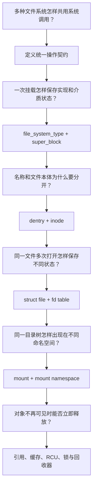
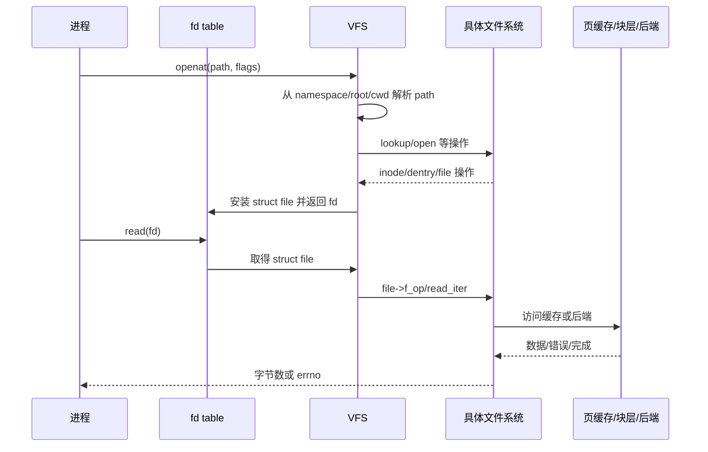

# 第1章\_为什么需要\_VFS

## 1.1\_没有统一层会发生什么

应用需要打开、读取、写入、重命名和删除文件，但 Linux 同时支持 ext4、XFS、tmpfs、NFS、procfs 和许多特殊文件。如果系统调用直接认识每一种文件系统，增加一种实现就要修改所有文件操作入口；应用也会被迫理解磁盘文件、网络文件和内核虚拟文件的不同调用方式。

只统一函数名仍然不够。一次文件访问还要回答：

- 路径从哪个根目录、工作目录和挂载命名空间开始；
- 名称在哪个目录中解析，是否命中缓存；
- 找到的是文件系统对象、挂载点还是符号链接；
- 权限在哪些时刻检查；
- 多次打开共享哪个 inode，又各自保存哪些 flags 和位置；
- 删除名字后，已经打开的文件为什么仍然可用；
- 文件系统卸载时如何确认没有路径、文件或写回仍在使用它。

因此 VFS 不是简单的“统一回调表”，而是 **统一对象模型、路径语义、操作分派和生命周期规则**。

## 1.2\_从统一接口推演到对象模型

对象数量多不是为了把概念复杂化，而是因为“名字”“文件本体”“一次打开”和“一次挂载”具有不同的共享范围与生命周期，不能安全地塞进一个结构。

## 1.3\_VFS\_统一了什么，又没有统一什么

VFS 统一：

- 系统调用可见语义和通用错误边界；
- `super_block/inode/dentry/file` 等对象接口；
- 路径遍历、挂载交叉和文件描述符管理；
- 文件系统和文件操作的回调契约；
- 通用缓存、引用和回收框架。

具体文件系统仍决定：

- inode 和目录项怎样持久化或从网络取得；
- 块怎样分配、日志怎样提交、一致性怎样恢复；
- 自己支持哪些扩展属性、配额和特性；
- 回调如何把 VFS 操作变成具体介质或协议操作。

所以“所有东西都是文件”不是 VFS 的精确实现说明。更准确的说法是：**许多对象选择接入统一文件接口，但不同对象仍保留自己的数据模型和约束。**

## 1.4\_一次访问的双向链

路径只在建立或重新定位对象时参与；已有 fd 的 I/O 通常从进程 fd table 直接取得 `struct file`。这也是文件被 unlink 后，旧 fd 仍可能继续访问 inode 的基础。

## 1.5\_VFS\_需要解决的核心并发矛盾

- 路径读取极热，但目录可能并发创建、删除和重命名；
- dentry 和 inode 需要缓存，但缓存对象可能失效或等待回收；
- 多个 file 可共享 inode，一个 file 又可被多个 fd 和线程共享；
- write、truncate、mmap 和 writeback 可能同时改变文件数据与大小；
- mount namespace 允许不同进程看到不同挂载拓扑；
- 卸载要阻止新进入并等待旧引用，却不能扫描后凭猜测释放对象。

这决定 VFS 必须综合使用引用计数、锁、序列计数、RCU 路径查找、延迟回收和文件系统专用同步。后续不能用“一把 VFS 大锁”解释现代实现。

## 1.6\_源码位置感

Linux 6.12.20 的主要入口包括：

- `fs/filesystems.c`：文件系统类型注册；
- `fs/namespace.c`：挂载与命名空间；
- `fs/namei.c`：路径查找和创建/open 状态机；
- `fs/open.c`：打开、关闭及部分文件操作；
- `fs/file.c`：文件描述符表；
- `fs/read_write.c`：读写系统调用和 VFS 分派；
- `fs/inode.c`、`fs/dcache.c`、`fs/super.c`：核心对象缓存和生命周期；
- `include/linux/fs.h`、`include/linux/dcache.h`、`include/linux/mount.h`：主要结构和契约。

下一章不直接背结构字段，而是从最小方案推导这些对象为什么出现：[VFS 抽象机制推演](P02_VFS抽象机制推演.md)。
