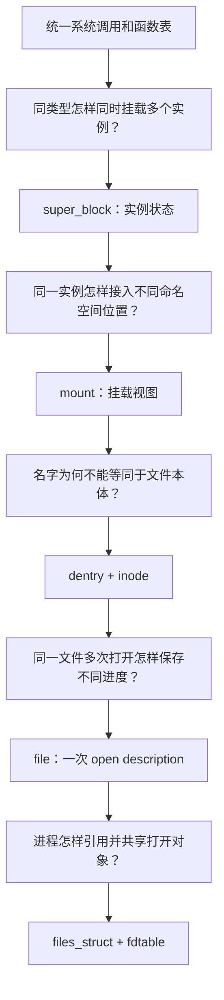
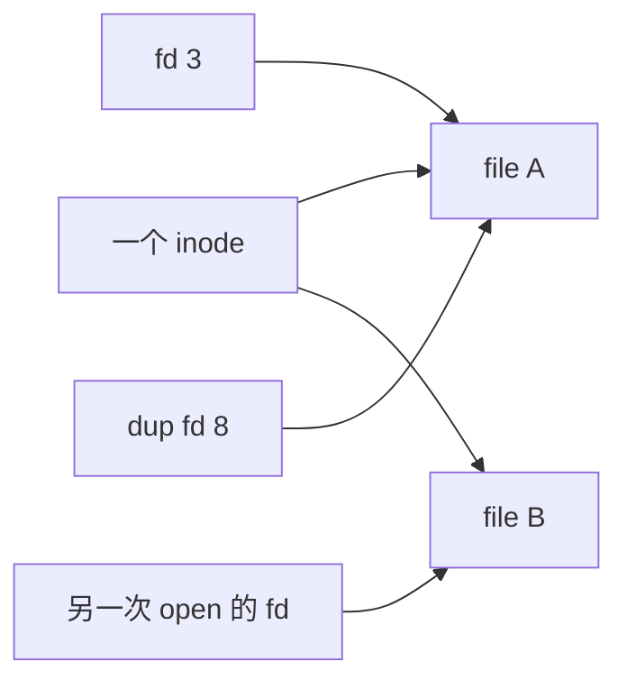

# 第2章\_VFS\_抽象机制推演

## 2.1\_从一个函数表开始为什么不够

最小方案可以让每种文件系统提交 `open/read/write` 函数表，系统调用按类型选择它。但类型只回答“由哪段代码处理”，没有回答一次挂载、一个名字、一个文件本体和一次打开各自保存什么状态。

## 2.2\_实例必须与实现类型分开

`file_system_type` 描述 ext4、tmpfs 等实现代码；一次挂载还需要源设备、选项、根目录、inode 集合和写回状态。同一实现可以产生多个独立实例，因此这些运行状态必须进入 `super_block`，不能写进全局类型对象。

挂载配置也可能失败。参数收集、校验和建立树需要临时事务对象，于是现代 VFS 使用 `fs_context` 把“正在配置”与“已经发布的 superblock/mount”分开。

## 2.3\_文件本体必须与名称分开

若名称对象和文件本体是同一个结构，硬链接无法表达多个名字指向同一文件；rename 会迫使打开文件更换身份；unlink 也会错误地立即销毁仍被 fd 使用的文件。

VFS 因此让 dentry 保存“父目录下的名称关联”，inode 保存文件本体。一个 inode 可被多个 dentry 指向；负 dentry 还可以缓存“名字不存在”，即使它没有 inode。

## 2.4\_打开对象必须与\_inode\_分开

两个进程打开同一 inode，可能使用不同 flags、文件位置和私有上下文，因此需要各自的 `struct file`。反过来，`dup()` 和 fork 又可让多个 fd 指向同一个 file，共享 open description 状态。

## 2.5\_路径必须是\_mount\_与\_dentry\_的组合

同一 dentry 树可通过 bind mount 或不同 mount namespace 出现在多个位置。只保存 dentry 无法判断 `..` 应跨向哪个父 mount，也无法表达调用者实际看到的拓扑，所以运行路径用 `struct path` 同时携带 mount 和 dentry。

## 2.6\_生命周期规则由可见性差异逼出来

unlink 使名字不可达，不代表 inode 无引用；close 删除一个 fd，不代表 file 已到最后引用；lazy unmount 从拓扑摘除 mount，也不代表旧 path 已消失。VFS 必须把“停止新查找”和“等待旧引用退出”分成不同阶段。

因此引用计数、锁、RCU、序列验证和延迟回收不是对象模型之外的附加优化，而是允许这些对象拥有不同可见性和生命周期的必要条件。

## 2.7\_推演结果

VFS 最终不是单一转发表，而是一组按共享范围分层的状态对象。下一章把这些对象放在同一张拓扑图中，逐项说明所有者、读写者和有效性协议：[VFS 状态与对象拓扑](P03_VFS_状态与对象拓扑.md)。
