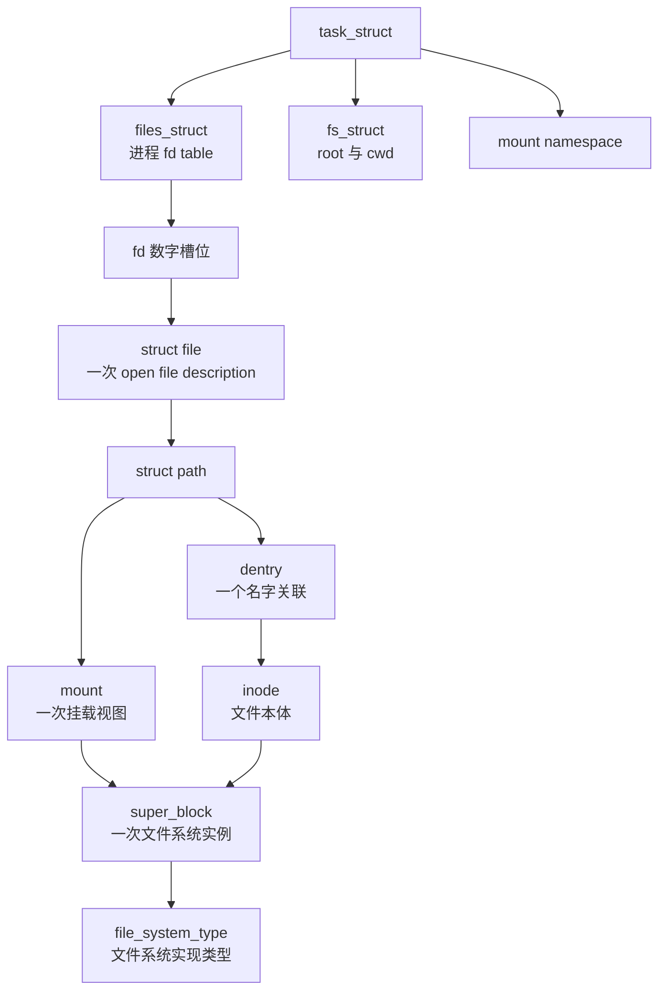
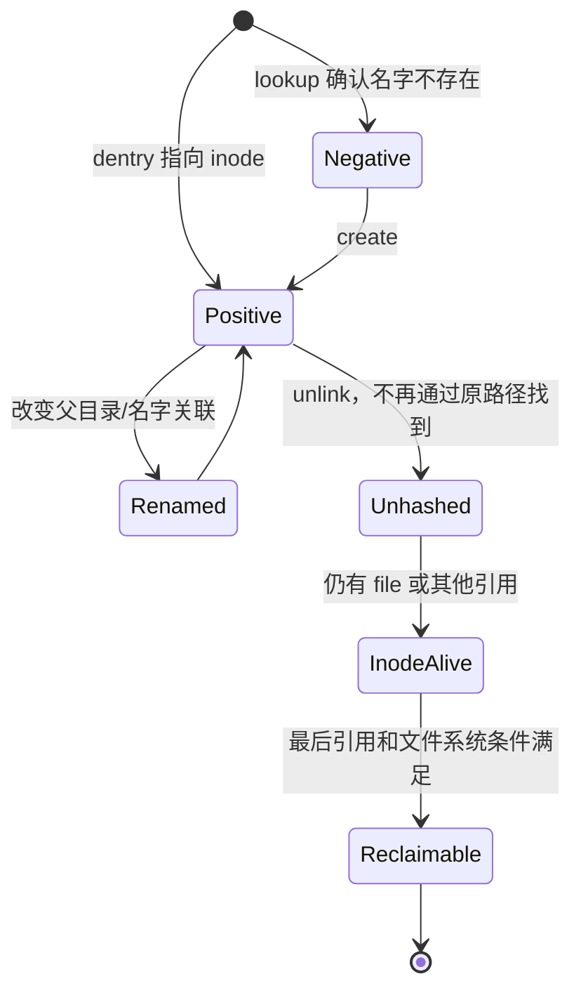
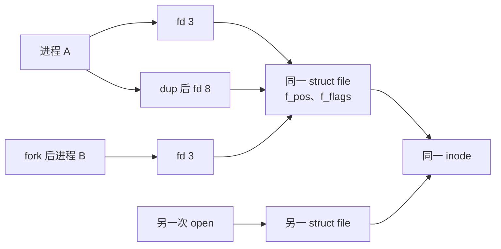

# 第3章\_VFS\_状态与对象拓扑

## 3.1\_先看共享关系，不先背结构字段

这张图表达的是引用和归属，不代表所有箭头都是结构体直接字段。最关键的区分是：

- dentry 表示 **某个父目录下的名字关联**；
- inode 表示 **文件系统中的文件本体和元数据**；
- file 表示 **一次打开及其运行状态**；
- mount 表示 **文件系统树接入命名空间的位置和视图**；
- superblock 表示 **一次挂载/文件系统实例的核心状态**。

## 3.2\_状态存在哪里，谁会访问

| 状态 | 典型保存位置 | 写入者 | 读取者 |
| --- | --- | --- | --- |
| fd 到 file 的映射 | `files_struct/fdtable` | open、dup、close | 系统调用入口 |
| root、cwd | `fs_struct` | chroot、chdir 等 | 路径查找 |
| 挂载拓扑 | mount namespace 和 mount 对象 | mount、umount、namespace 操作 | 路径跨挂载点 |
| 名称缓存 | dentry/dcache | lookup、create、rename、unlink、回收器 | 路径查找 |
| 文件元数据 | inode 和文件系统私有 inode | 文件系统操作、写入、truncate | 权限、I/O、stat、回写 |
| 本次打开状态 | `struct file` | open、fcntl、read/write/llseek | 使用该 open description 的线程 |
| 文件系统实例状态 | `super_block` | mount、sync、freeze、unmount | inode、回写和文件系统操作 |

“VFS 状态”不是某个全局结构。不同共享范围的对象通过引用连接；路径查找、I/O 和回收分别读取这些地址，并用各自的同步协议确认它们仍有效。

## 3.3\_名称为什么不能等同于文件

硬链接允许多个 dentry 指向同一个 inode；负 dentry 可以缓存“这个名字当前不存在”；rename 可以改变名称关联而不必替换打开的 file；unlink 删除最后一个名字后，inode 仍可能被打开 file 引用。

这解释了为什么“路径已经没有”和“文件对象已经释放”是两件事。

## 3.4\_fd、file\_与\_inode\_的共享层级

因此：

- fd 是进程表中的索引，不保存文件本体；
- `dup()` 和继承通常共享 file，因而共享文件位置等 open description 状态；
- 对同一路径再次 `open()` 产生另一 file，但仍可能共享 inode；
- 锁设计必须说明保护 file 级状态还是 inode/文件系统级状态。

## 3.5\_路径状态为什么是\_`mount + dentry`

单独的 dentry 不能唯一表达进程看到的路径。同一 dentry 树可以通过 bind mount 或不同 mount namespace 出现在不同位置；路径遍历还必须知道跨越挂载点时进入哪个 mount。VFS 因而用 `struct path` 把 mount 与 dentry 配成一对。

root、cwd、系统调用传入的 dirfd 也最终为路径查找提供起始 `path`。符号链接、`..`、挂载点和 namespace 规则再共同决定遍历结果。

## 3.6\_对象有效性依赖协议而非裸指针

拿到结构地址不等于可以无限期使用。VFS 常见保护包括：

- file 引用保证一次打开对象仍在；
- dentry 和 mount 引用保证保存的 path 仍有效；
- inode 引用和文件系统状态协调回收；
- RCU-walk 在受限条件下无引用快速遍历，遇到不稳定情况转入 ref-walk；
- rename、mount 和对象专用锁/序列状态验证并发拓扑变化；
- superblock active/write 等协议参与 freeze 和 unmount。

后续章节会在实际调用链中逐项展开。现在先记住：**每条指针边都必须说明取得条件、稳定条件和释放位置。**

## 3.7\_字符设备在哪一条边接入

字符特殊文件仍有 dentry 和 inode，也通过普通路径查找取得；区别发生在 inode 类型和打开操作：inode 的 `i_rdev` 携带设备号，默认字符设备 `open` 再把 file 操作替换为驱动 `cdev->ops`。

这一交叉链的完整实现见[字符设备的 VFS 打开路径](../../driver_model/character_device/P03_打开路径与文件操作.md)。VFS 专题后续讲特殊文件时只总结其 VFS 边界，不复制 `cdev_map` 教程。

## 3.8\_下一步

对象地图建立后，下一章从最外层实现登记开始：[文件系统类型注册](P04_文件系统类型注册.md)。
