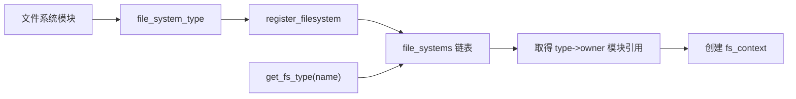

# 第4章\_文件系统类型注册

## 4.1\_注册发布的是实现，不是文件树

`struct file_system_type` 描述一种文件系统实现。注册以后，mount 才能按名称找到该实现；此时还没有 superblock、根 dentry 或命名空间入口。

## 4.2\_全局登记状态

Linux 6.12 的 [`fs/filesystems.c`](../../../research/source_reading/linux/fs/filesystems.c) 用 `file_systems` 保存单链表，用 `file_systems_lock` 串行化注册和注销。`register_filesystem()` 检查类型名称、设置链表状态并拒绝同名实现；`unregister_filesystem()` 只移除对应类型。

这里的通信方式很直接：注册者在锁内修改全局链表，mount 路径在锁内查找，并通过 `try_module_get()` 让实现代码在使用期间不能卸载。它不是通过扫描所有 superblock 判断类型是否存在。

## 4.3\_查找与自动加载

`get_fs_type(name)` 支持 `type.subtype` 形式，并在首次找不到时尝试 `request_module("fs-%.*s", ...)`，随后再次查找。找到类型只说明代码入口可用；源设备、参数和实例仍由后续 `fs_context` 处理。

## 4.4\_注销边界

从类型链表摘除只阻止新的名称查找，不能直接销毁已有 superblock。活动 mount、superblock 和 file 分别持有自己的对象与模块依赖。安全卸载必须先让这些实例退出，再注销实现类型。

下一章进入一次挂载配置事务：[fs_context 挂载事务](P05_fs_context挂载事务.md)。
