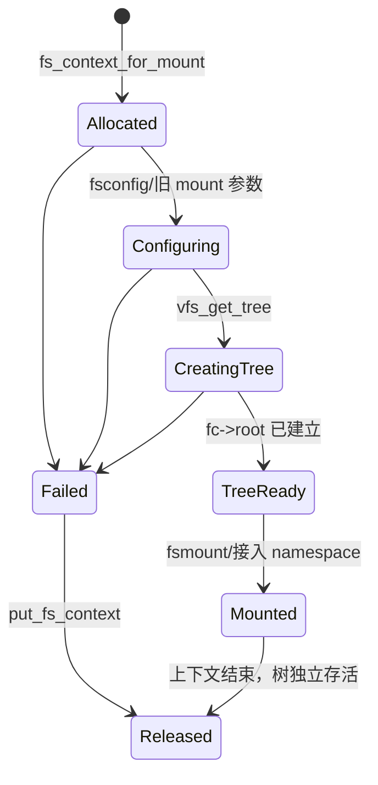

# 第5章\_fs\_context\_挂载事务

## 5.1\_为什么挂载不能是一次函数调用

挂载需要选择实现、保存调用者凭据、解析源设备和多个参数、校验组合、取得安全上下文，最后才建立树。任何一步都可能失败，因此 VFS 用 `struct fs_context` 保存 **尚未发布的一次配置事务**。

## 5.2\_状态和所有者

`fs_context_for_mount()` 分配上下文，保存 `fs_type`、目的、flags、用户命名空间和凭据，并调用文件系统 `init_fs_context()`。参数通过 `vfs_parse_fs_param()` 交给 LSM 与文件系统解析；成功 `get_tree()` 后，`fc->root` 指向新树根。

## 5.3\_新旧 mount API\_在何处汇合

新 API 让用户态显式执行 `fsopen → fsconfig → fsmount → move_mount`；旧 `mount(2)` 在内核中一次性准备参数并进入相同的上下文和建树机制。区别主要是事务是否暴露为 fd，不代表存在两套 superblock 模型。

## 5.4\_失败回滚

上下文持有文件系统类型、凭据、source 字符串和文件系统私有配置。失败必须由 `put_fs_context()` 与文件系统 `.free` 回收这些临时状态；只有 `get_tree()` 成功后的 root/mount 才进入后续对象生命周期。

源码依据：[`fs/fs_context.c`](../../../research/source_reading/linux/fs/fs_context.c) 和 [`include/linux/fs_context.h`](../../../research/source_reading/linux/include/linux/fs_context.h)。下一章解释 `get_tree()` 最终建立的实例：[superblock 实例状态与生命周期](P06_superblock实例状态与生命周期.md)。
