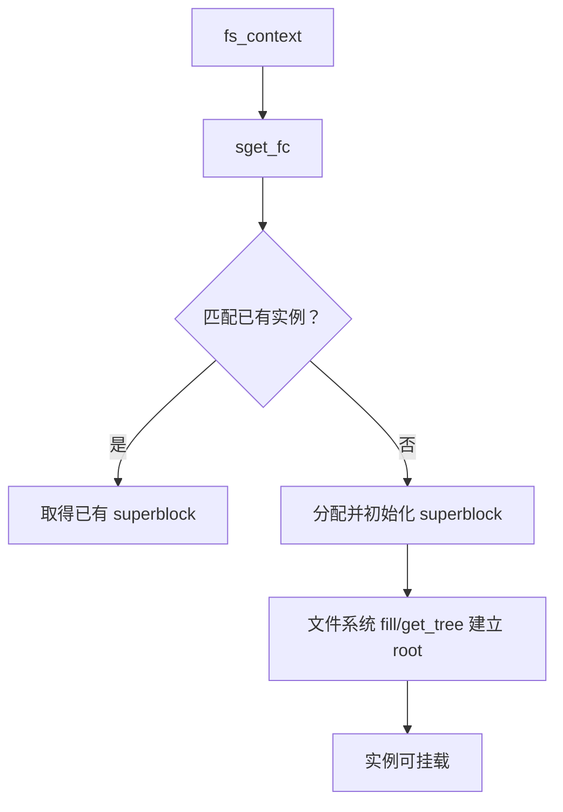

# 第6章\_superblock\_实例状态与生命周期

## 6.1\_superblock\_不是只给磁盘使用

`struct super_block` 表示一次文件系统实例。磁盘文件系统可把它与块设备关联；tmpfs、procfs 同样需要它保存根、inode 集合、操作表、限制、写回和关闭状态。

## 6.2\_建立或复用实例

文件系统 `get_tree` 最终可通过 `sget_fc()` 按测试规则寻找已有 superblock，或分配新实例。新实例先处于未发布状态，文件系统填充 `s_root`、`s_op` 和私有状态，成功后才允许 mount 使用。

## 6.3\_关键状态的共享者

superblock 被 mount、inode、写回和文件系统内部状态共同引用。`s_root` 是根 dentry，`s_inodes` 连接实例 inode，`s_type` 指向实现类型，`s_op` 定义实例级操作。freeze、只读、active 和关闭状态决定新写入或新引用能否进入。

## 6.4\_关闭是分阶段协议

从一个 namespace 卸载 mount 不一定意味着 superblock 已无其他 mount。最后活动使用者离开后，VFS 才同步和关闭实例、清理 inode/dentry、调用文件系统 `kill_sb` 路径并释放实现引用。旧 file 或 path 是否允许卸载，由 mount/superblock 的引用与 busy 检查共同裁决。

源码依据：[`fs/super.c`](../../../research/source_reading/linux/fs/super.c) 与 [`include/linux/fs.h`](../../../research/source_reading/linux/include/linux/fs.h)。下一章说明实例如何进入进程可见拓扑：[mount 与 mount namespace](P07_mount与mount_namespace.md)。
