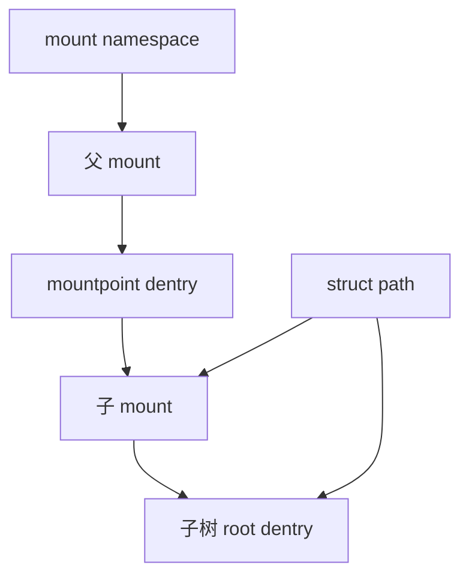

# 第7章\_mount\_与\_mount\_namespace

## 7.1\_实例和挂载视图必须分开

superblock 是文件系统实例；mount 表示这个实例的某棵树在命名空间中的一次接入。bind mount、namespace clone 和共享传播都要求多个 mount 视图复用已有树。

## 7.2\_路径为何必须携带两根指针

`struct path` 同时保存 `vfsmount` 和 dentry。dentry 只知道文件系统内部父子关系；mount 才知道当前树接在外部哪个 mountpoint、属于哪个 namespace，以及在根处执行 `..` 应跨向哪里。

## 7.3\_发布与传播

新 mount 先在 namespace 外建立，再由挂载操作在锁和 namespace 写保护下连接到 mountpoint。shared/slave/private 等传播类型决定一个拓扑变化是否复制到 peer group 或下游 mount；这不是 superblock 自身状态。

## 7.4\_普通卸载与懒卸载

普通 umount 要通过 busy 检查，避免仍被 cwd、path、file 或子 mount 使用的视图被强制拆除。lazy umount 先从可见拓扑断开，旧引用仍可沿已持有对象继续存在，最后引用离开后才回收 mount。这再次体现“不可新达”与“对象已死”不同。

源码依据：[`fs/namespace.c`](../../../research/source_reading/linux/fs/namespace.c)、[`fs/pnode.c`](../../../research/source_reading/linux/fs/pnode.c) 和 [`fs/mount.h`](../../../research/source_reading/linux/fs/mount.h)。下一章进入名称缓存和路径查找基础：dcache。
