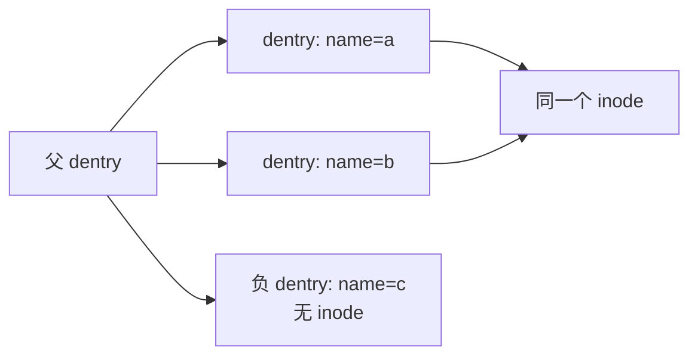

# 第8章\_dcache\_与名称状态

## 8.1\_缓存的不是文件内容

dcache 缓存“父目录中的名字对应什么”，文件内容由 page cache 等机制处理。`struct dentry` 连接父 dentry、名称和可选 inode；同一个 inode 可被多个硬链接 dentry 指向。

## 8.2\_正、负和 unhashed\_状态

- 正 dentry 指向 inode，表示名称当前存在；
- 负 dentry 没有 inode，缓存一次“不存在”的查找结果；
- unhashed dentry 已从名称哈希中摘除，旧引用仍可能持有它；
- rename 可以改变名称/父关联，unlink 可以使正 dentry 失去可达性。

这些状态解释了为何“路径找不到”不等于“dentry 或 inode 已释放”。

## 8.3\_查找通信链

路径查找者先在 dcache 哈希中按父 dentry 和名称寻找；命中且有效就复用结果，未命中或需要 revalidate 才调用父 inode 的 lookup。文件系统把新 dentry 与 inode 关联，随后其他 CPU 可在同步协议下观察该缓存。

网络文件系统的名称结果可能过期，因此 dentry operations 可提供 revalidate。VFS 不能仅因指针仍在哈希中就断言后端状态永久有效。

## 8.4\_引用、锁、RCU\_和回收

dentry 引用允许调用者跨临界区稳定持有对象；`d_lock` 等锁保护局部字段；rename 和父子关系还有更高层同步；RCU 允许路径快速观察，序列状态验证观察期间关系是否变化。引用归零的未使用 dentry 可进入 LRU，内存压力下由 shrinker 回收。

源码依据：[`fs/dcache.c`](../../../research/source_reading/linux/fs/dcache.c) 与 [`include/linux/dcache.h`](../../../research/source_reading/linux/include/linux/dcache.h)。下一章沿 dcache 逐分量解析 pathname：[路径查找状态机](P09_路径查找状态机.md)。
