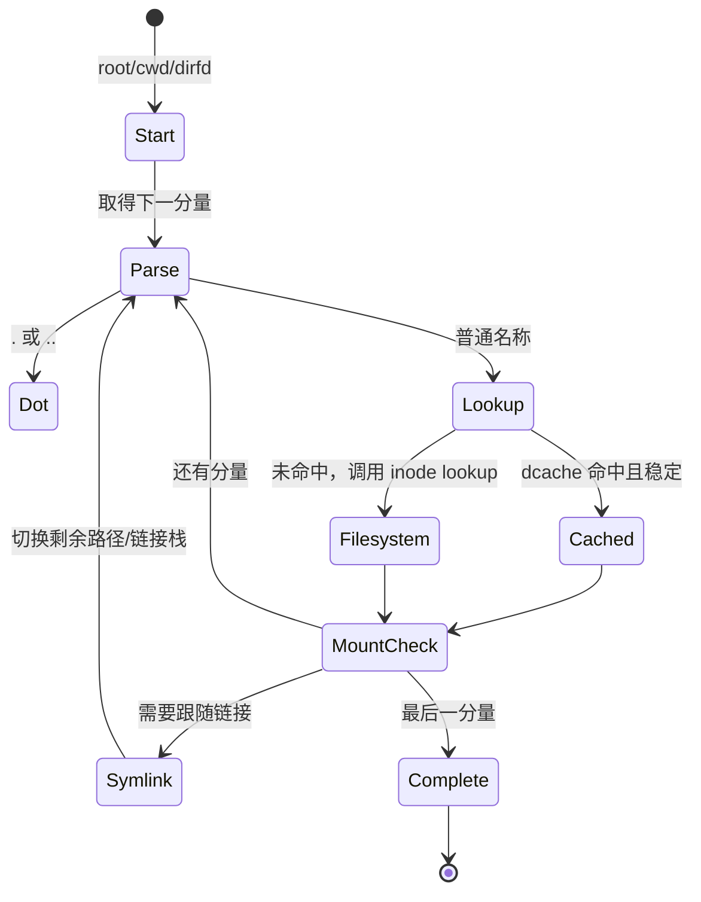

# 第9章\_路径查找状态机

## 9.1\_路径不是一次字符串哈希

`/a/b/../c` 的结果取决于进程 root、cwd、dirfd、mount namespace、符号链接和并发 rename。路径查找必须逐分量推进，同时维护当前 `mount + dentry`、剩余字符串、链接栈和查找约束。

Linux 6.12 在 [`fs/namei.c`](../../../research/source_reading/linux/fs/namei.c) 中用 `struct nameidata` 保存这次遍历的状态；最终结果用 `struct path` 返回。

## 9.2\_起点由路径类型和进程状态决定

- 绝对路径从调用者可见的 root 开始；
- 相对路径默认从 cwd 开始；
- `*at()` 接口可从 dirfd 对应目录开始；
- `AT_FDCWD` 明确表示 cwd；
- `openat2()` 的 resolve flags 可以限制符号链接、跨 mount 或逃逸边界。

root/cwd 来自 `fs_struct`，namespace 决定 mount 拓扑，dirfd 来自 fd table。由此可见 pathname 的含义不是进程无关的全局事实。

## 9.3\_逐分量遍历

主链可概括为 `path_init()` 建立起点，`link_path_walk()` 拆分非最后分量，`walk_component()` 查找/跟随单个名字，`complete_walk()` 验证结束状态。最后分量是否允许创建、删除或打开，由上层操作采用不同规则处理。

## 9.4\_与\_dcache\_的交接

逐分量查找向 dcache 提交父 dentry 和名称，取得正或负结果；缓存未命中或需要重新验证时才进入文件系统 lookup。正负 dentry、哈希和回收机制已在 [dcache 与名称状态](P08_dcache与名称状态.md) 完整说明，本章只追踪查找状态机怎样消费结果。

## 9.5\_选择快速或稳定遍历模式

路径状态机优先尝试 RCU-walk，遇到必须阻塞或无法验证的状态就转入 ref-walk。两种模式读取的状态、序列验证和回退原因由下一章 [RCU-walk 与 ref-walk](P10_RCU-walk与ref-walk.md) 单独解释。

## 9.6\_`.`、`..`、挂载点和符号链接会改变拓扑

`.` 保持当前位置；`..` 既可能走向父 dentry，也可能从挂载根跨回父 mount，同时受进程 root 边界限制。普通分量命中挂载点时可能进入子 mount。符号链接则把新的路径文本压入遍历过程，并受跟随次数与 resolve 策略限制。

这些规则说明仅保存 inode 无法继续路径遍历：VFS 必须知道名称所在 dentry 以及它属于哪个 mount。

## 9.7\_并发修改怎样被观察

rename、unlink 和 mount 变更可能与查找并发。VFS 使用 dentry/inode/mount 专用锁、序列计数、RCU 和重试组合，而不是一把全局路径锁。读侧只有在验证期间状态未发生不允许的变化时才能接受结果；否则重试或转慢路径。

## 9.8\_从查找到打开的交接

普通 lookup 返回 path；创建和 open 还要特殊处理最后分量、`O_CREAT/O_EXCL/O_TRUNC`、权限和只读挂载等状态。下一章先解释快速遍历如何验证结果：[RCU-walk 与 ref-walk](P10_RCU-walk与ref-walk.md)。
