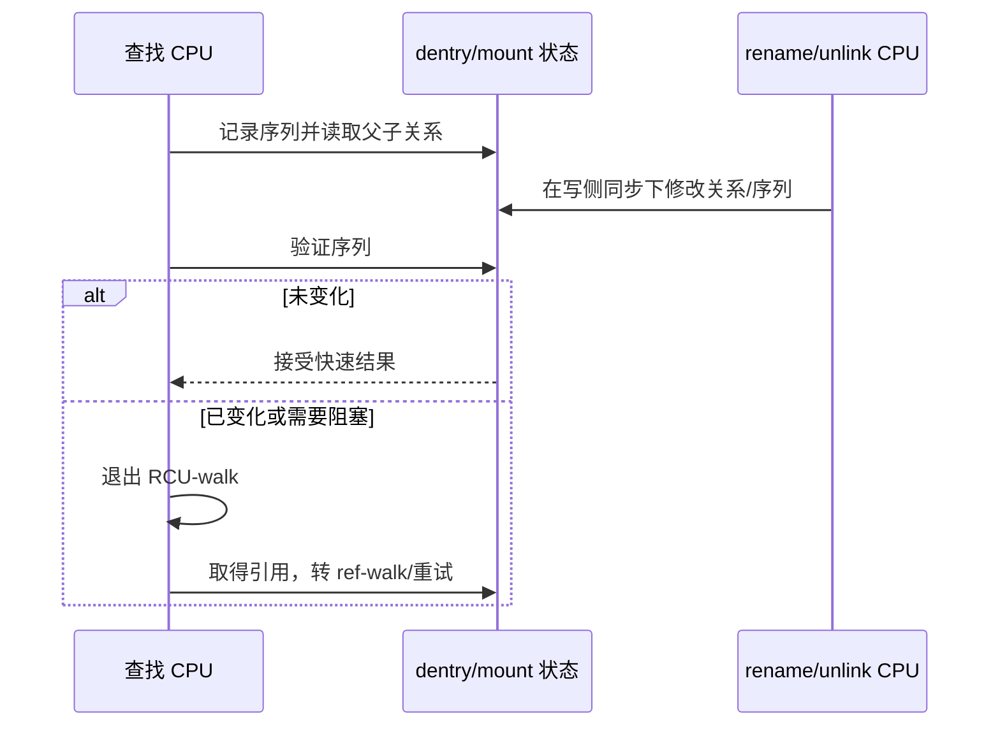

# 第10章\_RCU-walk\_与\_ref-walk

## 10.1\_为什么路径读侧需要两种模式

路径查找极热，如果每个分量都修改共享引用计数和锁状态，会制造缓存行竞争；但目录可能同时 rename、unlink 或跨 mount 变化。Linux 先用 RCU-walk 低成本观察，无法证明稳定时再切换到 ref-walk。

## 10.2\_RCU-walk\_实际读取什么

它在 RCU 读侧保护下读取 dentry、inode、mount 和序列状态，并保存遍历所需的序列值。对象内存不会在观察期间释放，但名称关联是否仍然有效还要靠序列验证。RCU 只解决生命周期窗口的一部分，不替代拓扑一致性检查。

## 10.3\_什么会触发回退

缓存未命中需要调用可能睡眠的文件系统 lookup、符号链接处理需要阻塞、revalidate 不能在 RCU 模式完成、序列校验失败或 mount 状态不稳定，都会要求退出快速模式。内部常用 `-ECHILD` 表达“请在可阻塞模式重试”，它不是直接返回用户的普通路径错误。

## 10.4\_ref-walk\_提供什么

ref-walk 对 path、dentry 和 mount 取得稳定引用，可调用允许睡眠的文件系统操作，并使用更强的锁与重试规则。代价是引用计数写入和更多同步，所以它是必要慢路径而非默认热路径。

## 10.5\_扩展性来源

RCU-walk 的收益不是“读者完全不通信”，而是把每分量共享写操作改为本 CPU 读侧状态、只读观察和失败验证。真正发生拓扑冲突或缓存缺失时，才支付引用和锁成本。

实现集中在 [`fs/namei.c`](../../../research/source_reading/linux/fs/namei.c)。下一章从读侧转向修改名称拓扑：[创建、删除、链接与重命名](P11_创建删除链接与重命名.md)。
