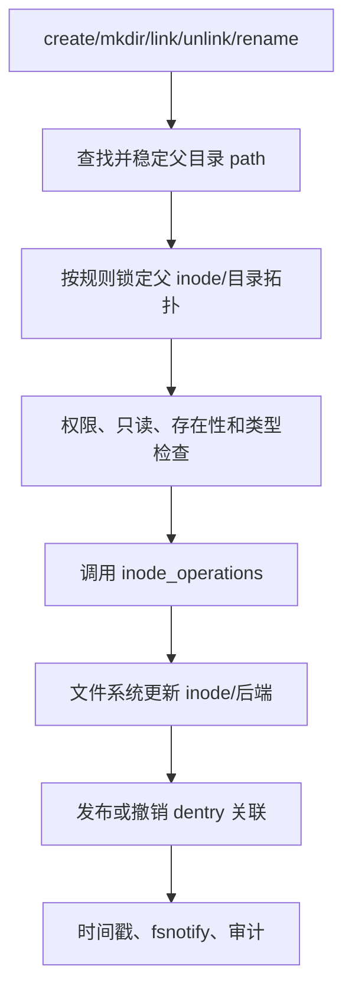

# 第11章\_创建、删除、链接与重命名

## 11.1\_修改的是名称拓扑和文件状态

创建不仅分配 inode，还要把父目录中的负 dentry 转成正关联；unlink 删除名称并调整 link count，却不一定释放 inode；rename 同时改变一个或两个目录中的名称关联。

## 11.2\_共同执行链

文件系统回调和 dcache 状态必须按 VFS 约定共同更新，否则路径缓存会与后端事实分裂。

## 11.3\_unlink\_为何不会关闭旧\_fd

unlink 从目录移除名称并减少 inode link count。只要 file、VMA 或其他引用仍持有 inode，数据对象继续存在；最后 link count 和引用条件都满足后，文件系统才真正回收。用户看到的是“新路径查找失败，旧 fd 仍能访问”。

## 11.4\_rename\_为什么锁顺序复杂

rename 可能跨两个目录、覆盖目标并涉及目录祖先关系。VFS 必须防止目录环、死锁和中间状态被无保护观察，因此规定目录锁顺序并使用 rename 级同步。路径读侧通过序列验证发现并发变化后重试，而不是读取半更新父子关系。

## 11.5\_发布点与通知点

名称修改成功后，dcache、inode 元数据、时间戳及 fsnotify 事件需要反映同一结果。通知告诉观察者发生过操作，不是对象当前状态的替代；观察者仍应重新查询路径或 inode 状态。

## 11.6\_Linux\_6.12\_源码落点

[`fs/namei.c`](../../../research/source_reading/linux/fs/namei.c) 同时保存 VFS 的 `vfs_create()`、`vfs_mkdir()`、`vfs_unlink()`、`vfs_link()` 和 `vfs_rename()` 等写侧入口及系统调用状态机。阅读时应分三层观察：系统调用怎样取得父 path，`vfs_*` 怎样检查和协调，最后怎样进入具体 `inode_operations`；不能把文件系统回调当作全部锁和权限逻辑。

下一章把路径查找和可能的创建合并到 open 事务：[open 状态机](P12_open状态机.md)。
