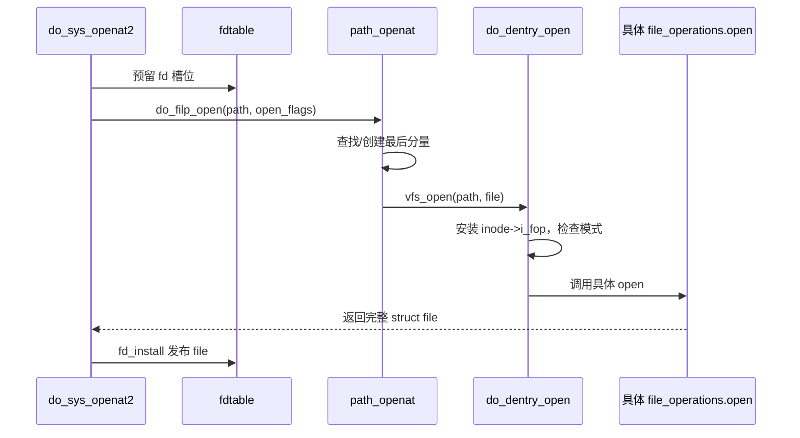

# 第12章\_open\_状态机

## 12.1\_open\_不是普通 lookup\_加一个回调

`openat2()` 需要预留 fd、解释 flags、处理最后分量和 `O_CREAT`、执行权限/安全检查、取得写访问、分配 file、安装操作表并调用具体 `.open`，最后才发布 fd。

## 12.2\_最后分量状态机

中间分量只需遍历，最后分量受 `O_CREAT/O_EXCL/O_TRUNC/O_DIRECTORY/O_NOFOLLOW` 等影响。它可能命中现有 dentry、使用负 dentry 创建 inode、拒绝符号链接或在打开后截断文件。检查和创建必须在父目录同步下完成，不能先 lookup、解锁后再凭旧结论创建。

## 12.3\_`do_dentry_open()`\_的发布边界

它把 path、inode、操作表、访问模式和凭据装入 `struct file`，取得必要写访问并调用 `file->f_op->open`。具体 `.open` 失败时 file 不能安装到 fd table，前面取得的状态按阶段回滚。

字符特殊文件在这里先取得默认字符设备操作表，再由 `chrdev_open()` 替换成 `cdev->ops`；这是 VFS 的一个分支，不是 open 主线的中心。

## 12.4\_并发与失败

预留 fd 尚未安装 file，其他线程不能通过它取得半初始化对象。路径创建失败、权限失败、file 分配失败或具体 `.open` 失败都会释放预留号码。只有 `fd_install()` 后，整数 fd 才成为可观察入口。

源码依据：[`fs/open.c`](../../../research/source_reading/linux/fs/open.c) 与 [`fs/namei.c`](../../../research/source_reading/linux/fs/namei.c)。下一章解释发布后的共享关系：[fd table 与 open file description](P13_fd_table与file生命周期.md)。
