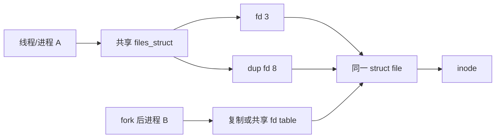

# 第13章\_fd\_table\_与\_open\_file\_description

## 13.1\_整数\_fd\_不是对象身份

fd 是 `files_struct` 中槽位编号，槽位指向 `struct file`。close 后同一数字可立即复用并指向其他 file；内核操作必须先安全取得 file 引用，不能长期依赖整数值。

## 13.2\_共享拓扑

`dup()` 不执行新的 `.open`，多个 fd 共享 file 的位置和状态；再次 `open()` 才产生另一 file。fork 是否共享 `files_struct` 取决于 clone 语义，但继承的槽位都会增加底层 file 引用。

## 13.3\_fdtable\_扩容与发布

[`fs/file.c`](../../../research/source_reading/linux/fs/file.c) 维护 bitmap、fd 指针数组和扩容状态。修改在 `file_lock` 等同步下完成，读取路径结合 RCU 和 file 引用。`fd_install()` 是从“号码已预留”到“file 已发布”的关键点，需要保证 file 初始化写入先于其他 CPU 观察指针。

## 13.4\_close\_和正在执行的系统调用

close 清除槽位并交出该槽位的 file 引用；另一个线程若已通过 fd 成功取得 file 引用，操作仍可继续。最后一个 file 引用离开后才进入 `fput()` 和具体 `.release`，因此 `.release` 不对应每次用户 `close(fd)`。

## 13.5\_file、inode\_与路径各自结束

file 释放会归还 path、操作表模块引用和打开私有状态；inode 是否回收取决于 dentry、link count、缓存和文件系统；mount 是否回收取决于 path/mount 引用。一个 close 不能跨层直接宣布所有对象死亡。

下一章从已发布 file 进入数据通路：VFS read/write 分派。
