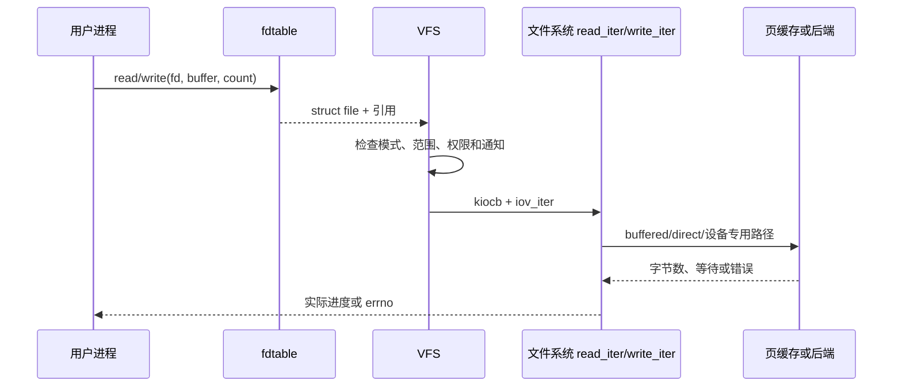

# 第14章\_VFS\_read/write\_分派

## 14.1\_已有\_fd\_的\_I/O\_不再查路径

系统调用先从 fd table 安全取得 `struct file`，再沿 `file->f_op` 分派。路径只在 open 等操作中建立 file；后续 I/O 使用已保存的 path、inode、flags、位置和操作表。

## 14.2\_系统调用到迭代接口

Linux 6.12 的 [`fs/read_write.c`](../../../research/source_reading/linux/fs/read_write.c) 中，`vfs_read()`/`vfs_write()` 校验 file 模式、用户缓冲区和范围，再优先进入 `read_iter`/`write_iter`。`readv/writev` 和许多异步接口也用 `iov_iter` 表示一段或多段缓冲区，避免为每种缓冲形式设计独立文件系统回调。

`kiocb` 保存 file、位置、标志和完成相关状态；同步调用可以在栈上构造同步 kiocb，异步提交则必须保证请求对象活到完成。

## 14.3\_文件位置属于哪一层

普通 read/write 通常使用并更新 `file->f_pos`，共享同一 file 的 dup/fork fd 因而共享位置。`pread/pwrite` 使用显式位置，不修改共享 `f_pos`。位置串行化解决的是同一 open description 的偏移，不自动串行化 inode 数据和页缓存修改。

## 14.4\_短传输和错误

正返回值表示已经完成的字节数，可能小于请求长度；零在读取普通文件时通常表示当前位置到 EOF；负值表示尚无可报告进度的错误。VFS 和文件系统必须避免已完成部分数据后只返回错误而隐藏进度。

## 14.5\_写入冻结与通知边界

写路径还要处理 append、文件大小限制、只读/冻结状态、写入统计和 fsnotify。`file_start_write()` 一类协议使 freeze 能阻止新写入并等待已进入写侧的操作，不能靠扫描线程判断“是否还有人在写”。

下一章进入普通文件最常见的数据路径：[address_space、folio 与页缓存](P15_address_space_folio与页缓存.md)。
