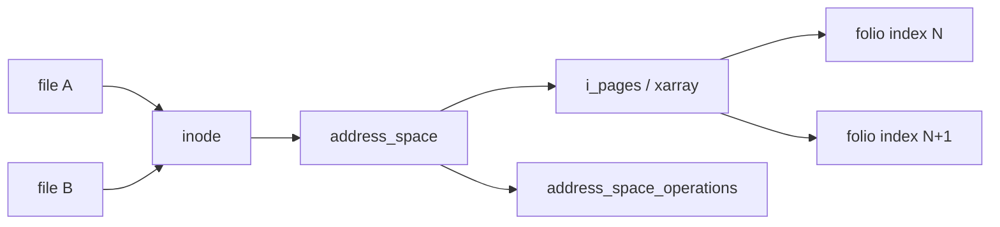
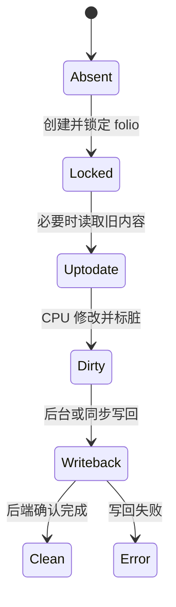

# 第15章\_address\_space、folio\_与页缓存

## 15.1\_页缓存属于文件，不属于某个\_fd

同一 inode 的多个 file 应观察同一缓存数据，因此页缓存由 `inode->i_mapping` 指向的 `address_space` 组织。file 保存一次打开状态，address_space 保存文件偏移到 folio 的缓存和写回关系。

## 15.2\_buffered read

读取先按文件位置在 page cache 查找 folio。命中且数据有效即可复制；未命中则分配/插入缓存，并通过文件系统 `read_folio`、readahead 或 iomap 等路径从后端填充。I/O 完成和 folio 状态使等待者知道数据是否可用或失败。

多个 CPU 可能同时错失同一索引，xarray、folio 锁和 uptodate/error 状态协调“谁填充、谁等待、谁消费”，而不是各自留下互相矛盾的副本。

## 15.3\_buffered write

写入定位或创建 folio，文件系统准备可修改范围，CPU 把用户数据写进缓存，然后把 folio 和 inode 标记为 dirty。系统调用成功通常只说明数据进入内存缓存，不等于介质已经持久化。

## 15.4\_truncate、hole\_和并发访问

truncate 改变 inode size 并使超出范围的缓存失效；稀疏文件缺洞读取返回零但不一定有后端块；mmap fault、read、write 和 writeback 都可能并发访问相同 address_space。锁和 invalidate 协议必须保证 folio 不在仍被使用时直接复用为无关数据。

源码依据：[`mm/filemap.c`](../../../research/source_reading/linux/mm/filemap.c) 与 [`include/linux/fs.h`](../../../research/source_reading/linux/include/linux/fs.h)。下一章解释 dirty 状态如何变成持久化结果：[writeback、fsync 与错误传播](P16_writeback_fsync与错误传播.md)。
