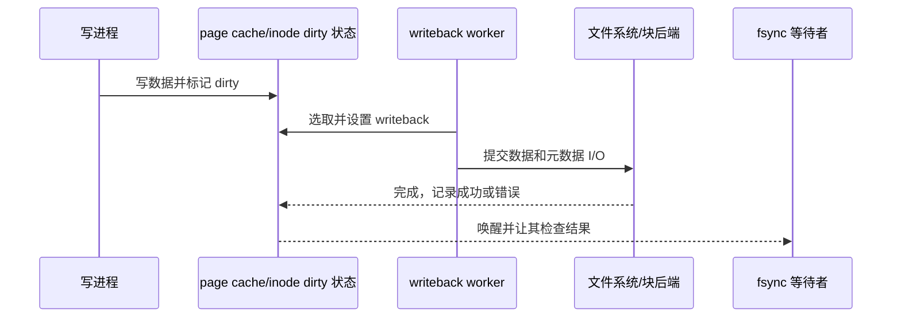

# 第16章\_writeback、fsync\_与错误传播

## 16.1\_dirty\_是待处理状态，不是通知

buffered write 把 folio/inode 标记为 dirty，writeback 代码按内存压力、时间、显式同步或后台策略找到它们，设置 writeback 状态并提交后端 I/O。完成方再清除/更新状态并唤醒等待者。

## 16.2\_后台写回与同步写回

后台线程控制全局/设备脏页比例和写回节奏；内存压力也可能使写入者节流。`sync` 面向更广范围，`fsync(file)` 要求文件系统按契约提交该文件数据及必要元数据，`fdatasync` 可减少非关键元数据范围。

## 16.3\_持久化必须由文件系统和设备共同完成

把页交给块层不一定代表非易失介质已提交；日志文件系统还要处理事务顺序，设备缓存可能需要 flush/FUA。VFS 提供同步入口，具体文件系统负责把“该文件已持久化”的要求转成自己的数据、元数据和日志协议。

## 16.4\_错误不能随着后台线程消失

writeback 在原 write 系统调用返回后失败，必须把错误记录到 address_space/file 可观察状态，使后续 fsync 或适当操作报告它。通知唤醒等待者，错误序列状态保证每个观察者能判断是否出现尚未消费的新错误。

源码依据：[`fs/fs-writeback.c`](../../../research/source_reading/linux/fs/fs-writeback.c)、[`mm/page-writeback.c`](../../../research/source_reading/linux/mm/page-writeback.c) 和 [`fs/sync.c`](../../../research/source_reading/linux/fs/sync.c)。下一章比较绕过页缓存的数据路径：[Direct I/O 与异步完成](P17_Direct_IO与异步完成.md)。
