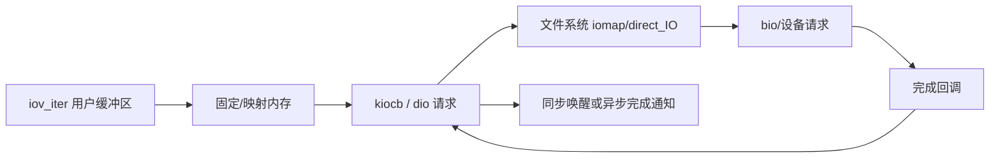

# 第17章\_Direct\_I/O\_与异步完成

## 17.1\_Direct\_I/O\_绕过的是什么

Direct I/O 主要绕过普通文件数据的 page cache 路径，把用户缓冲区映射/固定后直接交给文件系统和存储后端。它没有绕过 VFS、inode、权限、文件大小、并发和持久化契约。

## 17.2\_请求状态与所有权

同步调用可以等待请求完成；异步调用返回排队状态，请求、固定页和 file 引用必须活到完成回调。完成方写入字节数/错误，释放映射，并通过 kiocb 的完成契约通知提交者。

## 17.3\_对齐与页缓存一致性

设备、文件系统和映射粒度可能要求地址、长度和偏移对齐。Direct I/O 与 buffered I/O、mmap 同时访问重叠范围时，必须由文件系统执行失效、等待 writeback 或串行化，否则 page cache 与介质可能代表不同版本。

## 17.4\_io_uring\_边界

io_uring 可以提交 VFS 文件 I/O，并复用 kiocb/iov_iter 及文件系统异步能力；它自己的环、任务执行和取消属于独立子系统。VFS 本章只说明 file 操作怎样接受并完成异步请求。

源码依据：[`fs/direct-io.c`](../../../research/source_reading/linux/fs/direct-io.c) 和 [`fs/iomap/direct-io.c`](../../../research/source_reading/linux/fs/iomap/direct-io.c)。下一章进入另一种长期共享数据路径：[文件 mmap 与 page fault](P18_文件mmap与page_fault.md)。
