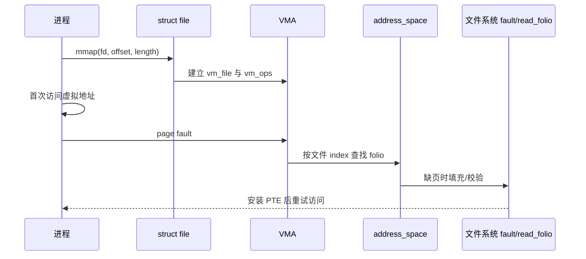

# 第18章\_文件\_mmap\_与\_page\_fault

## 18.1\_mmap\_发布的是长期映射关系

`mmap()` 用 file、偏移、长度和权限建立 VMA。系统调用返回后，真正的数据访问可在以后 page fault 时发生；close fd 不会自动撤销 VMA，因此映射持有独立的 file/后备对象生命周期。

## 18.2\_shared\_和\_private

`MAP_SHARED` 写入可使文件页变脏并参与 writeback；`MAP_PRIVATE` 的写故障通常建立进程私有 COW 页，不把修改写回文件。两者初始读取都可能来自同一 page cache。

## 18.3\_truncate\_和失效

文件被 truncate、打洞或撤销映射时，VFS/文件系统要失效相应 page cache 和页表映射。进程之后访问越过新 EOF 的区域可能收到 SIGBUS。不能因为 VMA 还保存 file 就认为所有旧文件偏移永远有效。

## 18.4\_并发和生命周期

fault、writeback、buffered I/O、Direct I/O 和 truncate 会在 address_space 边界交汇。folio 锁、invalidate、i_mmap 关系和文件系统锁共同协调它们。最后 VMA 消失才归还映射持有的 file 引用；这可能晚于所有 fd 的关闭。

源码依据：[`mm/mmap.c`](../../../research/source_reading/linux/mm/mmap.c)、[`mm/memory.c`](../../../research/source_reading/linux/mm/memory.c) 和 [`mm/filemap.c`](../../../research/source_reading/linux/mm/filemap.c)。下一章进入访问策略：[权限、凭据与安全钩子](P19_权限凭据与安全钩子.md)。
