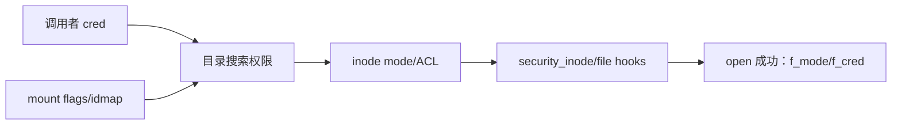

# 第19章\_权限、凭据与安全钩子

## 19.1\_权限检查不是用户态的一次预检

先 `access()` 再 `open()` 会留下路径和凭据变化的 TOCTOU 窗口。VFS 必须在实际 lookup、create、open、read/write 等操作的同步边界内检查权限，并把 mount、inode、调用者凭据和 LSM 策略共同纳入决定。

## 19.2\_路径权限与打开后权限

路径遍历需要对目录检查搜索权限；最后对象操作还要检查读、写、执行、创建或删除权限。成功 open 后，`struct file` 保存 `f_mode`、flags 和打开时凭据 `f_cred`，后续接口可依据稳定的打开授权语义，但某些操作仍需重新检查当前状态或专用 capability。

## 19.3\_传统权限、ACL、capability\_与\_LSM

mode bits 和 ACL 给出文件系统权限规则，capability 可授权特权操作，LSM 在 VFS 的 inode/file 钩子上实施 SELinux、AppArmor 等额外策略。它们不是互相替代的四条独立路径，而是在具体操作的检查链中组合。

## 19.4\_mount\_也参与语义

只读、`noexec`、`nodev`、`nosuid`、idmapped mount 等状态会改变同一 inode 在当前挂载视图下的允许行为。因此仅保存 inode 指针不足以完成路径权限判断，VFS 需要 `struct path` 中的 mount。

实现入口集中在 [`fs/namei.c`](../../../research/source_reading/linux/fs/namei.c)、[`fs/open.c`](../../../research/source_reading/linux/fs/open.c) 和 LSM 钩子。下一章解释操作成功后如何通知观察者：[fsnotify、inotify 与 fanotify](P20_fsnotify_inotify与fanotify.md)。
