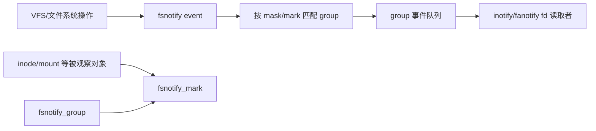

# 第20章\_fsnotify、inotify\_与\_fanotify

## 20.1\_通知层观察的是已发生操作

VFS 在创建、删除、打开、修改、移动等确定位置调用 fsnotify。inotify 和 fanotify 通过 fsnotify 后端组织观察对象与事件队列。事件是变化提示，不是对象当前状态的永久快照。

## 20.2\_状态对象和通信方向

mark 保存“谁观察哪个对象和哪些事件”，group 保存一组观察者的队列与策略。产生者按对象上的 mark 找到 group，把事件排队并唤醒等待 fd 的进程。

## 20.3\_合并、溢出和竞态

高频事件可以合并，队列容量有限并可能产生 overflow 事件。收到“文件被修改”后，文件可能已再次变化、移动甚至删除；用户必须重新查询或采用更强协议，不能把通知当作状态锁。

## 20.4\_inotify\_和\_fanotify\_边界

inotify 常面向具体 inode/目录的变化通知；fanotify 支持更广的 mount/filesystem 标记和部分权限事件。两者用户 ABI 不同，但共享 fsnotify 的 mark/group/event 基础。

源码依据：[`fs/notify/fsnotify.c`](../../../research/source_reading/linux/fs/notify/fsnotify.c)、[`fs/notify/mark.c`](../../../research/source_reading/linux/fs/notify/mark.c) 和 [`include/linux/fsnotify_backend.h`](../../../research/source_reading/linux/include/linux/fsnotify_backend.h)。下一章闭合核心对象回收：[file、dentry、inode 与 superblock 回收](P21_file_dentry_inode与superblock回收.md)。
