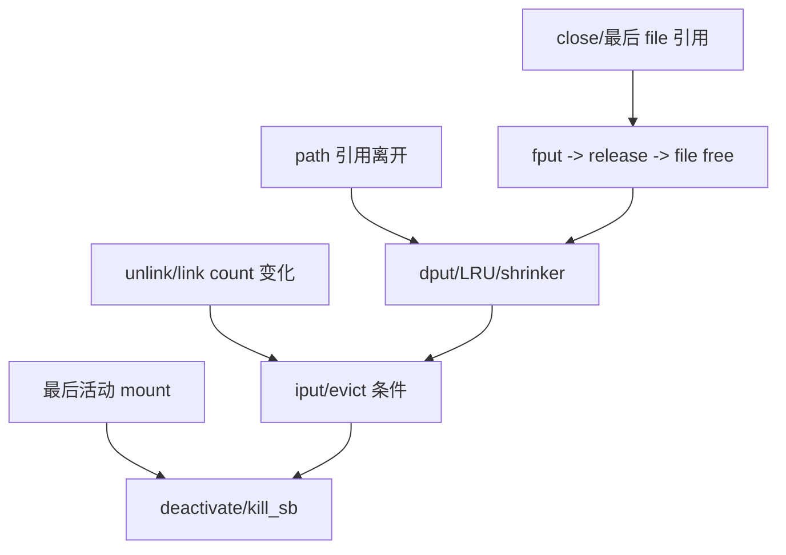

# 第21章\_file、dentry、inode\_与\_superblock\_回收

## 21.1\_四个对象有四个终点

close fd、unlink 名称、dput path 和 umount 不是同一个释放动作。它们分别减少 file、dentry/path、inode 可达关系或 mount/superblock 使用；只有各对象自己的引用和状态条件满足，才进入最终回收。

## 21.2\_file\_为什么可能延迟释放

最后引用触发 `fput()`，但释放工作可能被安排到合适上下文执行。它调用具体 `.release`、撤销 file 状态、归还 path 和模块引用。VMA、在途异步 I/O 或其他内核引用都会使最后时刻晚于用户 close。

## 21.3\_缓存对象引用归零仍可保留

dentry 和 inode 是缓存的一部分。没有活跃使用的对象可进入 LRU，内存压力下 shrinker 扫描回收；脏 inode、写回或文件系统专用状态可能阻止立即销毁。缓存保留与安全引用是两个概念：无引用观察必须遵守 RCU/锁协议。

## 21.4\_unlink\_后的 inode

link count 归零意味着没有目录名，不意味着没有 file/VMA。最后使用引用离开并满足文件系统回收条件时，evict 路径才释放数据和 inode 私有状态。

## 21.5\_superblock\_是最外层实例边界

mount、inode、写回等状态退出后才能关闭 superblock。文件系统 `kill_sb` 负责类型相关清理，VFS 再释放实例与模块依赖。任何内层对象仍需要实例代码或状态时，都不能先卸载实现。

源码依据：[`fs/file_table.c`](../../../research/source_reading/linux/fs/file_table.c)、[`fs/dcache.c`](../../../research/source_reading/linux/fs/dcache.c)、[`fs/inode.c`](../../../research/source_reading/linux/fs/inode.c) 和 [`fs/super.c`](../../../research/source_reading/linux/fs/super.c)。下一章把写入冻结和卸载组合为完整退出状态机。
