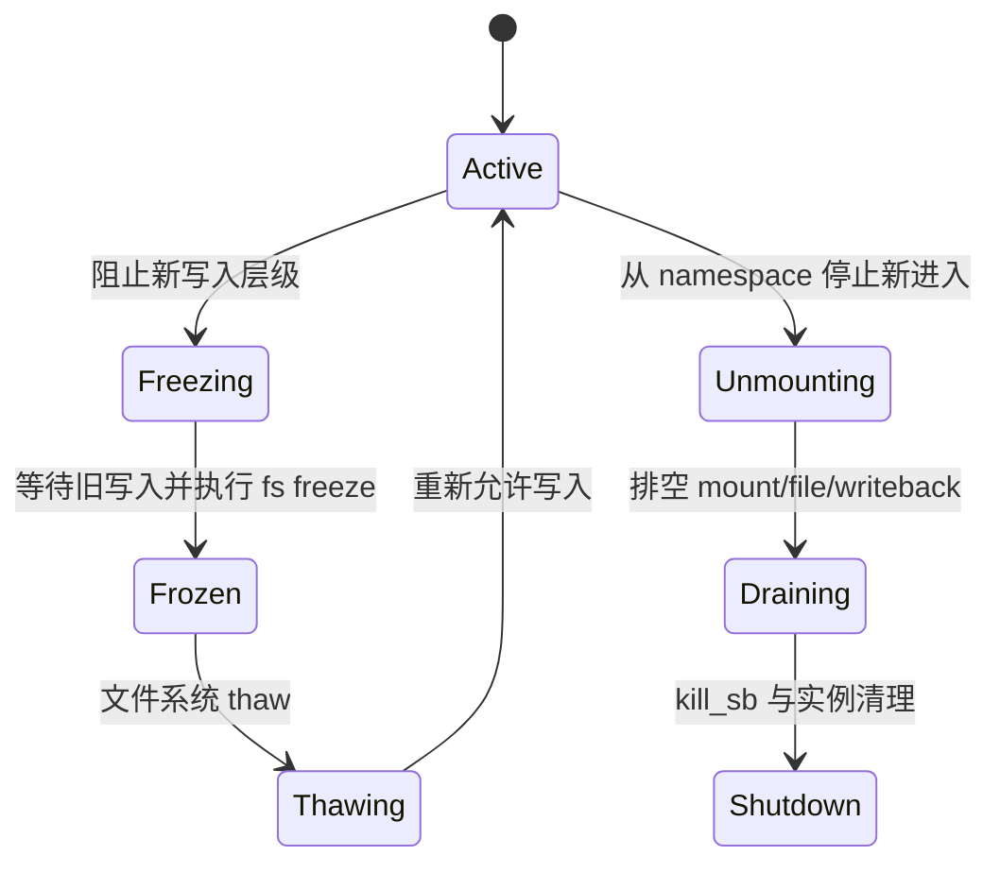

# 第22章\_freeze、unmount\_与故障退出

## 22.1\_freeze\_解决的是稳定写入边界

备份、快照或文件系统维护需要一个没有新修改进入且旧修改已排空的状态。freeze 通过 superblock 写入级别阻止新的相关操作，并等待已进入写侧的操作离开，再调用文件系统冻结回调同步内部事务。

## 22.2\_unmount\_从拓扑退出开始

普通卸载先验证没有不允许的活跃使用和子 mount，再从 namespace 拓扑摘除；lazy unmount 允许先断开新路径可达性，旧引用稍后退出。两者最终都必须等对象依赖满足后才能关闭 superblock。

## 22.3\_故障退出不能假装正常持久化

块设备消失、网络断开或文件系统检测到致命错误时，实例可能进入 shutdown/error 状态，拒绝新写入并向旧操作返回错误。已经 dirty 或在途的数据是否能持久化取决于故障类型，不能用一次无条件 `sync` 承诺恢复。

## 22.4\_谁通知等待者

状态写入者必须唤醒等待冻结、写回、I/O 或卸载条件的任务；等待者醒来后检查 superblock、请求和错误状态。通知本身不证明正常完成，错误和 shutdown 标志才是持久通信内容。

## 22.5\_源码交叉位置

- [`fs/super.c`](../../../research/source_reading/linux/fs/super.c)：superblock freeze/thaw、激活引用和关闭；
- [`fs/namespace.c`](../../../research/source_reading/linux/fs/namespace.c)：umount、拓扑摘除和 mount 生命周期；
- [`fs/fs-writeback.c`](../../../research/source_reading/linux/fs/fs-writeback.c)：inode 写回与实例退出前的数据状态。

这三处共同说明退出不是单个函数：namespace 停止新路径进入，superblock 协调实例状态，writeback 和文件系统后端处理尚未完成的数据。

下一章由一个最小内存文件系统验证前述对象如何由实现创建：[具体文件系统接入 VFS](P23_具体文件系统接入VFS.md)。
