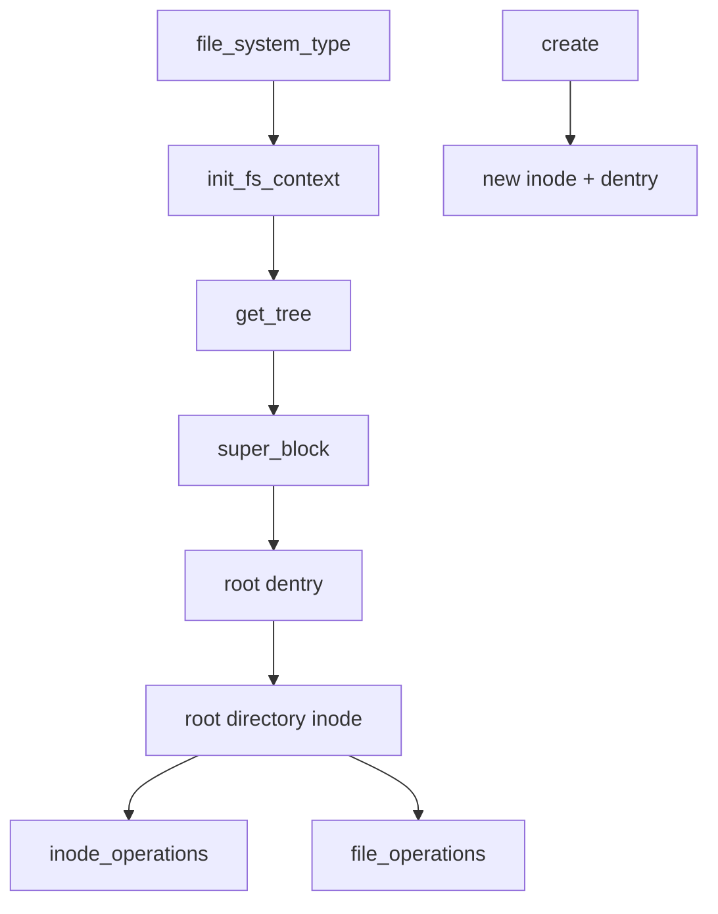

# 第23章\_具体文件系统接入\_VFS

## 23.1\_用内存文件系统验证对象链

ramfs 不需要块设备和持久化格式，适合观察 VFS 接入骨架；它不是生产文件系统模板，也不代表磁盘文件系统无需地址映射、日志和错误恢复。

## 23.2\_注册到挂载

实现提供 `file_system_type`，初始化 `fs_context`，由 `get_tree` 建立 superblock 和根。根 dentry 指向根 inode，目录 inode 提供 lookup/create 等操作，普通文件 inode 提供 file/address_space 操作。

## 23.3\_对象操作表的分层

- `super_operations` 管实例级 inode 分配、统计和销毁；
- `inode_operations` 管名称和元数据操作；
- `file_operations` 管打开后的 I/O、迭代和 mmap；
- `address_space_operations` 管页缓存与后端数据交换。

操作表描述能力，运行状态仍在 superblock、inode、file 和 address_space 中。不能把文件系统私有状态塞进全局静态操作表。

## 23.4\_创建一个文件的闭环

VFS 在父目录同步下取得负 dentry并调用目录 create；文件系统分配并初始化 inode，把 inode 与 dentry 实例化；随后 open 建立 file，read/write 进入 file/address_space 操作。unlink 撤销名称，最后引用离开后 evict inode。

源码依据：[`fs/ramfs/inode.c`](../../../research/source_reading/linux/fs/ramfs/inode.c) 与 [`fs/libfs.c`](../../../research/source_reading/linux/fs/libfs.c)。下一章比较不以普通持久文件为中心的接入方式：[特殊文件与伪文件系统接入](P24_特殊文件与伪文件系统接入.md)。
