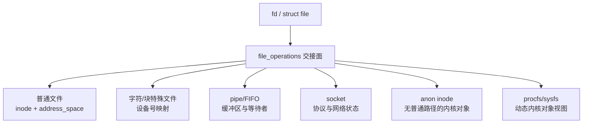

# 第24章\_特殊文件与伪文件系统接入

## 24.1\_统一入口不等于统一内部模型

字符设备、块设备、FIFO、socket、anon inode、procfs 和 sysfs 都能把操作接入 fd/VFS，但它们的数据源、命名、缓存和生命周期不同。VFS 提供 path/file/fd 和操作契约，具体子系统保存真实状态。

| 类型 | VFS 交接点 | 后续权威机制 |
| --- | --- | --- |
| 字符设备 | 特殊 inode 的 `i_rdev`，`chrdev_open()` 替换 fops | [字符设备专题](../../driver_model/character_device/大纲.md) |
| 块设备 | 块特殊 inode 和 bdev 打开路径 | 块层与文件系统 |
| FIFO/pipe | pipe inode、环形缓冲与等待者 | pipe 实现 |
| socket | socket file 与网络协议对象 | 网络子系统 |
| anon inode | 无常规持久路径的 file 入口 | eventfd、epoll 等具体子系统 |
| procfs/sysfs | 动态生成的命名与属性接口 | proc/sysfs 和设备模型 |

## 24.2\_字符设备交叉

路径查找仍取得普通 dentry/inode，区别在 inode 类型和 `i_rdev`。打开阶段通过字符设备映射找到 cdev，把 file 操作替换为驱动回调。VFS 不负责驱动 IRQ/DMA 状态，字符设备也不负责通用路径和 fd 生命周期。

## 24.3\_pipe、socket\_与匿名文件

pipe 可以由 pipefs/特殊 inode 承载缓冲与读写端状态；socket 把 file 操作交给网络 socket 对象；anon inode 为只需要 fd 但不需要用户可见持久路径的内核对象构造 file。它们说明 path 是常见入口，但并非所有 file 都需要普通目录树名称。

源码例证：[`fs/pipe.c`](../../../research/source_reading/linux/fs/pipe.c) 和 [`fs/anon_inodes.c`](../../../research/source_reading/linux/fs/anon_inodes.c)。下一章用可观察状态检查整套模型：[VFS 调试与源码追踪](P25_VFS调试与源码追踪.md)。
