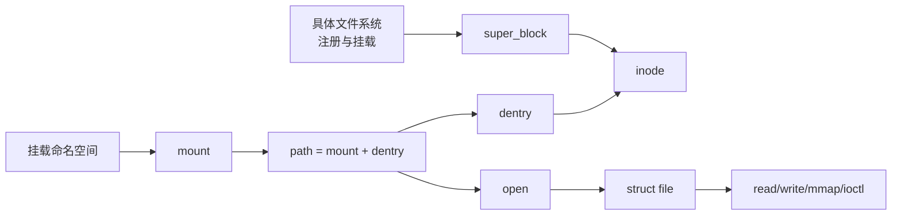

# 第1章\_VFS\_子系统大纲

## 1.1\_专题定位

VFS 是 Linux 对文件系统、路径、打开文件和 I/O 操作的统一内核抽象。它不是字符设备的辅助层，也不等于一组 `file_operations`：本专题要独立解释文件系统怎样注册和挂载、路径怎样解析、对象怎样缓存和共享、文件怎样打开、I/O 怎样分派，以及对象怎样在并发卸载下安全释放。

## 1.2\_完整阅读路线

### 1.2.1\_阶段一\_问题、抽象与全局状态

1. [为什么需要 VFS](P01_为什么需要_VFS.md)：从多文件系统和进程文件接口的矛盾推演统一抽象。
2. [VFS 抽象机制推演](P02_VFS抽象机制推演.md)：从最小函数表逐步推导实例、名称、文件本体、打开对象和挂载视图。
3. [VFS 状态与对象拓扑](P03_VFS_状态与对象拓扑.md)：建立 superblock、mount、dentry、inode、file、fd table 的所有权和共享关系。

> **读完这一阶段**，应能解释为什么 VFS 不能只有一张操作表，以及名称、文件本体、打开实例和挂载视图为什么必须分开。

### 1.2.2\_阶段二\_从文件系统实现到可见挂载树

4. [文件系统类型注册](P04_文件系统类型注册.md)：解释实现类型的全局登记、查找、模块引用和注销边界。
5. [fs_context 挂载事务](P05_fs_context挂载事务.md)：解释参数配置、建树和失败回滚。
6. [superblock 实例状态与生命周期](P06_superblock实例状态与生命周期.md)：解释实例建立、共享、根对象和关闭协议。
7. [mount 与 mount namespace](P07_mount与mount_namespace.md)：解释挂载视图、namespace 拓扑、传播和卸载。

> **读完这一阶段**，应能从 `file_system_type` 追踪到 `fs_context`、superblock、mount 和调用者可见的命名空间入口。

### 1.2.3\_阶段三\_名称读取、并发修改与打开

8. [dcache 与名称状态](P08_dcache与名称状态.md)：解释正负 dentry、名称关联、缓存验证和回收。
9. [路径查找状态机](P09_路径查找状态机.md)：解释起点、逐分量遍历、符号链接和跨 mount。
10. [RCU-walk 与 ref-walk](P10_RCU-walk与ref-walk.md)：解释快速观察、序列验证和慢路径回退。
11. [创建、删除、链接与重命名](P11_创建删除链接与重命名.md)：解释名称拓扑写侧、锁顺序和发布。
12. [open 状态机](P12_open状态机.md)：贯通最后分量、file 初始化、具体 open 和 fd 发布边界。
13. [fd table 与 file 生命周期](P13_fd_table与file生命周期.md)：解释 fd 复用、dup/fork/close 和最后引用。

> **读完这一阶段**，应能沿一个 pathname 经过 dcache、RCU-walk 和最后分量建立完整 file，并说明 fd 发布与 close 的并发边界。

### 1.2.4\_阶段四\_文件数据、缓存与持久化

14. [VFS read/write 分派](P14_VFS_read_write分派.md)：从 fd 取得 file，进入 iov_iter、文件位置和读写契约。
15. [address_space、folio 与页缓存](P15_address_space_folio与页缓存.md)：解释共享缓存、buffered read/write 和 truncate。
16. [writeback、fsync 与错误传播](P16_writeback_fsync与错误传播.md)：解释 dirty 状态、后台写回、持久化和延迟错误。
17. [Direct I/O 与异步完成](P17_Direct_IO与异步完成.md)：解释缓冲区所有权、请求完成和页缓存一致性。
18. [文件 mmap 与 page fault](P18_文件mmap与page_fault.md)：解释 VMA、fault、共享/私有映射和跨 fd 生命周期。

> **读完这一阶段**，应能区分系统调用完成、数据进入页缓存、写回提交和介质持久化，并能说明 Direct I/O 与 mmap 怎样和页缓存协调。

### 1.2.5\_阶段五\_策略、通知和退出闭环

19. [权限、凭据与安全钩子](P19_权限凭据与安全钩子.md)：解释路径检查、打开凭据、ACL、capability、LSM 和 mount 策略。
20. [fsnotify、inotify 与 fanotify](P20_fsnotify_inotify与fanotify.md)：解释 mark、group、事件队列、合并与溢出。
21. [file、dentry、inode 与 superblock 回收](P21_file_dentry_inode与superblock回收.md)：闭合各层对象的引用、缓存和最终释放。
22. [freeze、unmount 与故障退出](P22_freeze_unmount与故障退出.md)：解释阻止新进入、排空旧操作和错误状态。

> **读完这一阶段**，应能说明谁保存权限与事件状态，以及 unlink、close、freeze 和 unmount 为什么拥有不同终点。

### 1.2.6\_阶段六\_实现接入与验证

23. [具体文件系统接入 VFS](P23_具体文件系统接入VFS.md)：用 ramfs 验证注册、建树、inode、dentry 和操作表。
24. [特殊文件与伪文件系统接入](P24_特殊文件与伪文件系统接入.md)：比较字符设备、块设备、pipe、socket、anon inode 和伪文件系统交叉面。
25. [VFS 调试与源码追踪](P25_VFS调试与源码追踪.md)：按类型、mount、path、file、I/O 和生命周期状态链排错。

> **完成整条路线**，读者应能从任意文件系统调用同时追踪调用链、状态地址、通知方向和对象释放条件，而不是只记住一组 VFS API。

## 1.3\_与相邻专题的边界

- 字符设备专题完整解释 `inode->i_rdev -> chrdev_open() -> cdev -> file->f_op` 交叉链，入口见[字符设备专题](../../driver_model/character_device/大纲.md)。
- 页缓存的内存管理基础归内存管理专题；VFS 仍需解释 address_space、文件 I/O 和回写的子系统契约。
- 块层负责 bio、request 和块设备调度；VFS 解释文件 I/O 在何处交给文件系统和块层。
- 权限、安全模块和 fsnotify 分别有自身机制；VFS 解释它们插入路径和文件操作的边界。

整体职责与交叉规则见 [Linux I/O 与驱动子系统建设路线](../../../atlas/roadmaps/linux_io_driver_subsystems.md)。

## 1.4\_完成标准

完整专题最终必须让读者能够追踪：

1. 一个文件系统类型怎样产生一次挂载和 `super_block`；
2. 路径怎样跨 dentry、mount 和符号链接找到 inode；
3. inode、dentry 和 file 为什么不是同一个对象，各自怎样缓存和释放；
4. fd 怎样指向 file，`dup/fork/close` 共享什么；
5. `read/write/mmap/fsync` 怎样进入文件系统、页缓存和块层；
6. 并发重命名、删除、卸载时哪些引用、锁和序列状态保证对象有效；
7. 字符设备、管道、socket 和 procfs 等非普通磁盘文件怎样接入统一接口。
