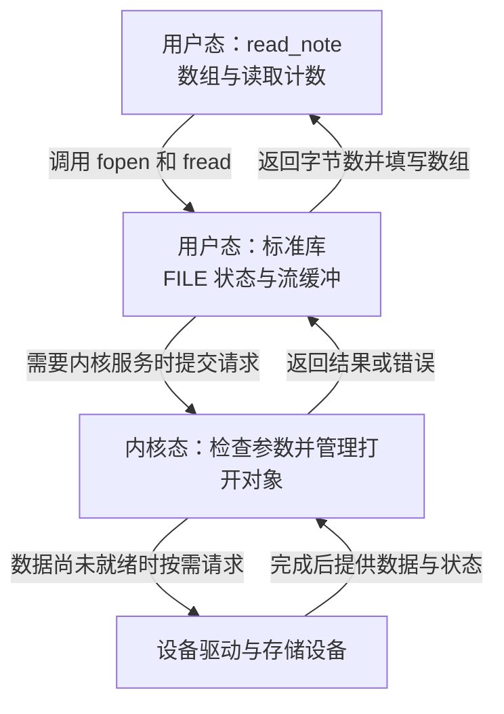
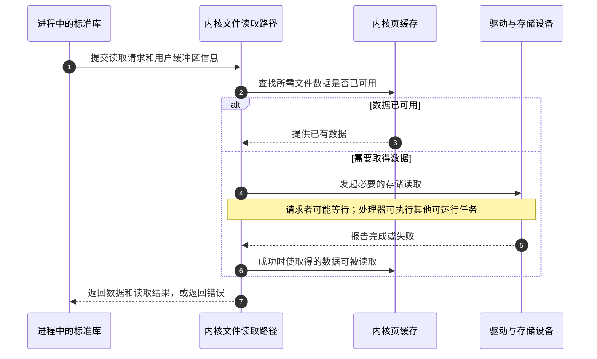
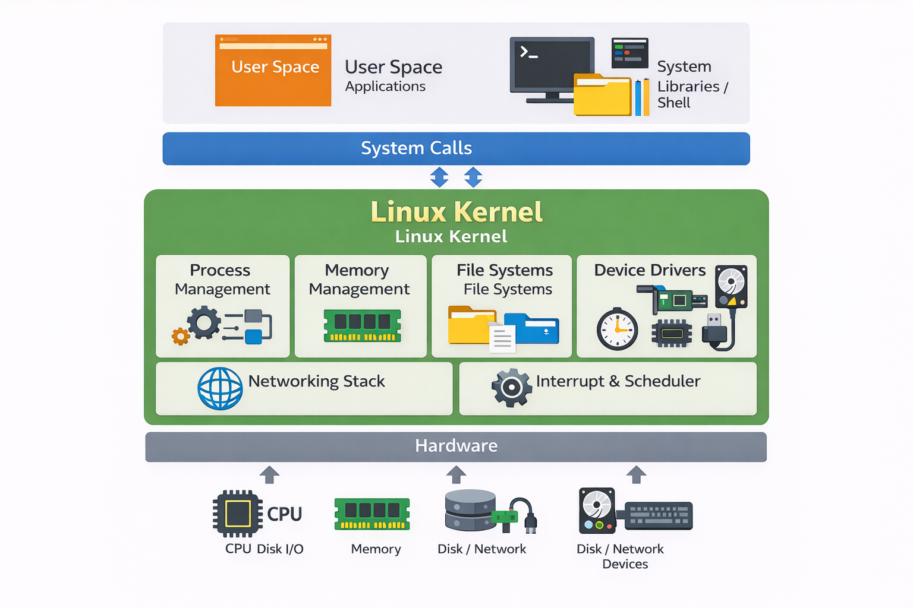

# 第1章\_Linux内核概貌\_从读取一份文件开始

假设你写了一个小程序，想读取文件里的几个字。程序只需要交出文件名，并准备一块接收数据的空间；它没有告诉存储控制器怎样传输。谁补上了这些工作？如果另一份程序也在运行，谁决定它们何时使用处理器，又是谁阻止它们随意覆盖彼此的数据？

我们就从这一次读取出发，逐步认识 Linux 内核。读完本章，你应当能沿着“程序提出请求 → 内核管理对象与资源 → 必要时访问设备 → 返回结果”解释一次操作，也能指出哪些步骤未必发生。本章只假定你读过 C 的变量、函数、数组和循环，不要求已经认识内核函数。完整内核不需要在第一天背下来，先把一次小事弄明白。

## 1.1\_先让程序读到几个字

下面的小程序接收一个文件路径，最多读取 15 个字节，然后报告实际读到多少。保存为 `read_note.c`。这里使用 C 标准库，目的是先观察输入、返回值和资源释放；随后再解释它在 Linux 上怎样向内核请求服务。

先认出程序里几个新名称：`FILE` 是库管理文件流的类型；`EOF` 是标准库定义的宏，在本例中用于判断关闭操作是否失败；`EXIT_SUCCESS` 和 `EXIT_FAILURE` 是表示程序成功或失败的返回值宏。先顺着打开、读取、关闭这条路径看，函数参数随后结合输出解释。

```c
#include <stdio.h>
#include <stdlib.h>

int main(int argc, char *argv[])
{
    FILE *input_file;
    char buffer[16] = {0};
    size_t bytes_read;

    /* 参数中只接收一个文件路径。 */
    if (argc != 2) {
        fprintf(stderr, "usage: %s <file>\n", argv[0]);
        return EXIT_FAILURE;
    }

    input_file = fopen(argv[1], "rb");
    if (input_file == NULL) {
        perror("open input");
        return EXIT_FAILURE;
    }

    /* 留出一个零字节，便于本例显示短文本。 */
    bytes_read = fread(buffer, 1, sizeof(buffer) - 1, input_file);
    if (ferror(input_file)) {
        fprintf(stderr, "read input failed\n");
        fclose(input_file);
        return EXIT_FAILURE;
    }

    if (fclose(input_file) == EOF) {
        perror("close input");
        return EXIT_FAILURE;
    }

    printf("bytes=%zu\ntext=%s\n", bytes_read, buffer);
    return EXIT_SUCCESS;
}
```

在一台已有 C 编译器的 Linux 机器上，进入你存放源文件的练习目录，执行以下命令。`cc` 是编译器命令名，`-std=c11` 选择 C11 语言规则，两个 `-W` 参数开启常用警告，`-o` 后面是输出程序名。若找不到 `cc`，需要先准备目标系统的 C 开发环境；这不是内核读取文件失败。

```bash
cc -std=c11 -Wall -Wextra read_note.c -o read_note
printf 'hello kernel\n' > note.txt
./read_note note.txt
```

第二条命令把一行文字写进当前目录的 `note.txt`，会覆盖同名练习文件。第三条中的 `./` 表示运行当前目录的程序，`note.txt` 是传入的路径。预期结果如下；文本本来带有换行，程序又打印一个换行，所以最后还有一个空行。

```text
bytes=13
text=hello kernel

```

为什么是 13？`hello` 占 5 个字节，空格占 1 个，`kernel` 占 6 个，换行再占 1 个。`fread` 的第二个参数是每个元素的大小，这里设为 1，因此返回的元素数也就是字节数。缓冲区长 16，最多读 15，剩下的零字节让 `%s` 知道文本在哪里结束。这个显示方式只适用于本例短文本；包含零字节的二进制文件可能显示不完整，读取字节数却仍然有效。

`FILE` 是标准库管理文件流的类型，`input_file` 是指向流状态的指针，声明中的星号表示它保存对象地址。`fopen` 函数打开文件流，`rb` 表示以二进制方式只读；返回 `NULL` 这个空指针值表示没有获得可用流。`fread` 读取，`ferror` 区分读取错误与正常短读，`fclose` 释放流。返回零字节不必然出错：空文件也会这样。接口契约可查 [Opening Streams](https://www.gnu.org/software/libc/manual/html_node/Opening-Streams.html) 与 [Block Input/Output](https://www.gnu.org/software/libc/manual/html_node/Block-Input_002fOutput.html)，重点核对打开模式、元素数与错误状态。

再回头看输入和诊断：`argc` 记录命令行参数数量，其中包括程序名；`argv[0]` 是程序名，`argv[1]` 才是本例要求的文件路径。因此参数数量不等于 2 时，程序先给出用法。`size_t` 是保存大小和计数的无符号整数类型，`sizeof(buffer)` 得到数组占用的字节数。`fprintf` 把说明写到标准错误流 `stderr`，`perror` 在自定提示后补出系统错误原因；这些名称与声明来自 `stdio.h`，成功与失败返回值宏来自 `stdlib.h`。错误分支在已经打开流时先关闭再退出，不把资源清理留给下一段猜测。

现在先做一个预测：把输入换成一个确定不存在的路径，程序会打印 `bytes=0`，还是在更早的位置退出？运行 `./read_note missing_note.txt` 前，先确认练习目录没有这个文件。它应在打开阶段报错并返回失败；恢复时重新传入 `note.txt` 即可。错误消息的语言和文字可能不同，真正应观察的是 **打开失败以后没有继续读取**。

## 1.2\_程序怎样越过自己的边界

磁盘上保存的可执行文件是一份 **程序（program）**。运行它时，系统为这次执行建立地址空间、打开文件记录等资源，这个正在运行的实例称为 **进程（process）**。同时运行两次 `read_note`，并不是把磁盘文件复制成两份，而是有了两个执行实例。

数组和计数运算可以在进程自己的内存中完成。但若每个程序都能随意操作存储控制器，两个程序可能同时改同一组设备寄存器，或者绕过权限读取别人的文件。仅仅约定“大家小心一点”无法隔离一个有错误的程序。因此系统把普通应用执行和受保护的资源管理分开：应用通常在 **用户态（user mode）** 执行；内核使用 **内核态（kernel mode）** 所具备的权限管理硬件和受保护状态。具体权限等级由处理器体系结构定义，这里只保留职责区别。

**系统调用（system call）** 是应用请求内核服务的受控入口。应用交出参数，内核检查请求、权限和用户地址等条件，完成操作后交回结果。它不是把所有设备权限交给应用。对当前程序来说，找到路径、建立打开状态和取回文件内容，都需要这类受保护服务。

你可能发现代码里没有名叫“系统调用”的函数。因为 `fopen`、`fread`、`printf` 是库函数，先执行标准库代码，再在需要时使用系统调用。库可以缓冲数据，一次 `fread` 不保证恰好对应一次内核读取，`fopen` 也不保证采用名字恰好为 `open` 的系统调用。**调用了库函数** 与 **进入了内核** 是两个层次，不能仅凭 C 函数名画成一一对应关系。



图中的内核不是与每个应用一一配套的独立服务进程。发生系统调用时，处理器可以在当前任务的执行路径中转入内核代码，再返回用户态。**用户态与内核态切换不等于必然切换到另一个进程**；执行者也发生变化时，才涉及后面要讲的任务切换。

## 1.3\_文件名交出去以后\_状态留在哪里

`note.txt` 是相对路径：从程序的当前工作目录出发寻找。路径只负责定位；打开成功以后，还需要记住“打开了哪个对象、允许怎样访问、下一次从哪里读”。Linux 用 **文件描述符（file descriptor，fd）** 这样的整数作为进程侧访问入口，进程的描述符表把整数关联到内核中的打开文件对象。普通可定位文件的当前位置记录在打开文件状态中；标准库还会在自己的流对象中保存缓冲等信息。

这里有三件东西：目录里的文件、内核中的一次打开状态、标准库里的文件流。关闭 `input_file` 是结束本次流的使用，并释放它持有的打开入口；它不会因此删除目录里的 `note.txt`。另一个进程打开同一文件，也不等于它使用了本进程的 `FILE` 对象。这些区别以后会帮助我们理解共享、重复打开和对象生命周期。

内核的 **虚拟文件系统（Virtual File System，VFS）** 为不同文件系统提供公共操作层。它让程序使用相近的打开和读取方式，而具体文件系统处理自己的文件组织。ext4、FAT、NTFS 和 Btrfs 是不同的文件系统格式与实现，支持情况取决于内核配置和环境；不需要在第一章比较谁“最好”。官方 [VFS 概览](https://docs.kernel.org/filesystems/vfs.html#the-file-object)解释打开文件对象与描述符表的关系，适合在理解这三类状态以后核对。

找到对象还不等于有权读取。内核会依据进程身份、目录搜索权限、文件权限以及适用的安全规则检查请求。基本读、写、执行权限分别限制不同操作；目录上的“执行”位主要关系到能否搜索和穿过该目录，不能照搬“运行文件”的含义。**访问控制列表（Access Control List，ACL）** 可以表达更细的用户或组权限，但不是绕过内核检查的另一条道路。

路径以 `/` 为根连接成一棵可见目录树。**挂载（mount）** 把某个文件系统的内容接入一个位置；根文件系统提供可见树的起点。挂载对象不一定来自硬盘，也可以是内存文件系统或网络文件系统。因此“路径存在”不等于“数据一定在本机磁盘”。完整后续学习见 [VFS 专题](../../../kernel_subsystems/vfs/大纲.md)，当前只需要记住路径、挂载和打开状态分别回答位置、接入关系和本次访问状态。

## 1.4\_读到数据\_是否就访问了硬盘

先猜一猜：连续运行程序两次，第二次是否还必须等待设备把同样的数据送来？未必。Linux 可以把文件内容保留在内存的 **页缓存（page cache）** 中。后续读取若能使用已有且可用的数据，就可能不再为这部分内容发起新的存储请求。标准库缓冲位于应用这一侧，页缓存由内核管理，两者不能混成一块缓存。

对于普通、采用缓存读取的本地文件，可以用下面的示意追踪一次请求。它没有承诺每次读取都调用某个固定函数，也没有覆盖直接 I/O 或所有文件系统。



这个分支使我们获得一个判断：**观察到程序读取成功，只说明这次访问拿到了数据，不能单凭它证明访问了哪个设备**。第二次更快也不是页缓存命中的充分证据，调度、标准库行为和其他负载都会影响时间。想证明具体路径，需要额外的跟踪和受控实验；本章短程序没有提供这些证据。

也别把读写规则混在一起。对于写入，数据进入软件缓冲、内核接受写入、设备完成持久保存，是不同阶段；一次成功的输出或关闭不能无条件证明断电后仍有数据。后续讨论文件 **输入与输出（Input/Output，I/O）** 时，会用这个区别解释为什么需要明确的持久化契约。

## 1.5\_等待时\_处理器和内存怎样被管理

**中央处理器（Central Processing Unit，CPU）** 执行指令。一个进程发出存储请求以后，若所需数据还没到，继续占着处理器反复询问往往没有必要。内核可以把任务置于等待状态，让其他可运行任务使用处理器；条件满足后，再让等待者有机会继续执行。唤醒表示它可以参与调度，不表示它立即抢到处理器。

**调度（scheduling）** 决定接下来让哪个可运行任务执行，**上下文切换（context switch）** 保存和恢复继续执行所需的处理器状态。调度可能由等待、唤醒、时间和优先级等事件推动，不是所有切换都只能等固定时钟周期。不同调度策略追求的目标不同；“公平”和“实时”也不是无条件保证每项任务立刻完成。程序创建、启动新程序映像、退出和回收同样属于进程管理：创建一个新进程与在已有进程中换上一个程序，是不同动作。

再看我们的 `buffer`。代码使用的地址属于进程看到的 **虚拟地址空间（virtual address space）**。在常见带地址转换硬件的 Linux 系统上，内核建立映射与访问权限，处理器按规则把访问落到物理内存。不同进程中的同一个数值地址，未必指向同一处物理内存；显式共享的区域又可以让多个进程访问同一份数据。隔离是一套映射和权限机制，不是“每个进程天然拥有完全独立的一块内存芯片”。

内核通常按 **页（page）** 管理映射和内存。页大小由架构与配置决定，不能把常见的 4 KiB 当作所有系统的常数。管理空闲物理页与给一个小对象分配空间属于不同层：伙伴分配机制管理页块，slab 类对象分配机制面向更小的内核对象。此处只建立两层职责，算法留到内存管理材料中展开。

内存紧张时，内核要区分哪些内容可以从原始文件重新读入，哪些内容必须先保存才能释放物理页。**交换空间（swap）** 为适用的内存内容提供后备存储，之后使用时再取回；它不是让内存访问和存储访问具有相同成本。回收策略也不能简化成“所有页面按同一张最近使用表直接换出”。这些措施使系统能管理更多需求，同时引入等待与维护成本。

## 1.6\_为什么还需要设备驱动和架构代码

前面讨论的是“读取某段文件内容”。真正的存储设备却需要具体请求格式、寄存器设置和完成处理。**设备驱动（device driver）** 把内核某类服务的要求接到具体设备或设备接口上。它可能初始化设备、提交请求、处理完成事件，并在停止使用时等待相关操作退出、释放资源；并不是设备暂时空闲，内核就自动卸载驱动。

不同设备面对的任务不同：块设备围绕可寻址的数据块组织存储访问；网络设备传递报文；字符设备通过特定文件操作提供接口。字符设备不保证所有行为都是“每次传一个字符”，网络设备也不必给每块网卡建立一个可当普通文件读取的节点。键盘和鼠标这类输入设备还会进入自己的公共输入框架。

设备可以用 **中断（interrupt）** 通知处理器有事件需要处理，也可以使用 **直接内存访问（Direct Memory Access，DMA）** 能力传输数据，减少处理器逐项搬运。两者分别回答事件通知与数据搬运问题；设备也可能采用轮询，不能把一次读取必定对应一个中断画成通用规则。

驱动代码既可以随内核一起构建进去，也可以在支持的配置下编成 **可加载内核模块（loadable kernel module）**，在运行时装入。模块描述代码怎样进入内核，设备注册描述一个对象怎样进入管理框架，两者不是同一步。即便字符设备登记成功，也还需要正确的文件操作、访问入口和生命周期，不能用一个注册函数概括全部设备管理。

CPU 本身也有差异。**指令集架构（Instruction Set Architecture，ISA）** 规定指令、寄存器和软件可依赖的机器行为。x86-64 与 Arm AArch64 是不同架构或执行状态体系中的名称；它们的寄存器、异常入口、页表格式和权限细节不同，Linux 因而保留架构相关代码。x86 的历史并非始于 32 位，AArch64 也不能仅凭名称推断“总是效率更高、功耗更低”。性能与能耗要结合具体芯片、实现和负载比较；本章不把架构标签当作测量结果。

现在再看原有组成图，会更容易给方框赋予具体意义：进程管理安排执行，内存管理提供空间，文件系统组织访问，驱动接到硬件；网络接口的请求则经过网络协议处理和对应驱动。图用于回顾职责，并不意味着每次调用都必须顺序经过全部模块。



## 1.7\_回顾与练习

我们从 13 个字节开始，建立了三个层次：应用保存自己的数组与流状态；内核管理权限、打开对象、执行与内存；必要时由驱动和设备完成具体动作。你现在不必知道调度器中的每个字段，但应能反驳“每个库函数都是系统调用”“关闭文件就是删除文件”“读成功说明一定访问了硬盘”这三个猜测。

先完成下面的练习，再往下看解答。只在自己的练习目录修改输入文件，不需要管理员权限。

1. 用 `printf '12345678901234567890' > note.txt` 写入 20 个字节。程序会报告多少？依据是哪条语句？
2. 把 `note.txt` 改成空文件后运行。零字节与打开失败怎样区分？
3. 连续读取同一个文件，输出一样，能否证明两次都访问了存储设备？还缺哪类证据？
4. 若另一个进程也打开这个文件，应把它的 C 数组、库文件流与本进程的哪一层状态视为相同？为什么不能只凭文件名相同判断？

### 1.7.1\_解答与迁移

第一题最多得到 15 个字节。限制来自 `sizeof(buffer) - 1`，与文件总长度是两件事。把数组扩大到 32 后重新编译，再预测结果；只改源码而不重新编译，运行的仍是旧程序。这也是下一章区分源文件与产物的起点。

第二题可以用 `printf '' > note.txt` 创建空的练习输入。打开成功，读取数是零，错误状态未置位，程序仍正常关闭并返回成功。不存在的路径在 `fopen` 处失败，没有获得可继续读取的流。若不按步骤确认文件内容和返回位置，很容易把两种现象都说成“没读到”。

第三题不能。缓存分支已经提供了同一可见结果的另一条路径；需要能区分缓存与设备请求的观测，再控制影响结果的条件。第四题中，两个进程的数组和库文件流分别属于各自的用户空间状态；底层可能访问同一文件，但是否共享某次打开状态，要继续查打开和继承关系。相同文件名不足以证明这些状态相同。

练习结束后，用 `printf 'hello kernel\n' > note.txt` 恢复最初输入。这个程序只演示短读取，不是完整文件复制器；要复制任意大小文件，还需要循环处理短读、输出错误和结束条件，那将是另一项明确的学习任务。

本章建立了职责关系，下一步要把它们落到实际源码位置。继续阅读 [Linux 源码树：从问题找到文件](../source_tree/Linux_kernel_目录结构说明.md#1.1_先区分源码目录与正在运行的系统)。完整前后关系见 [Linux 内核机制学习路线](../../../../atlas/tracks/linux_kernel_track.md#1.2_第一阶段_内核边界与源码定位)。
