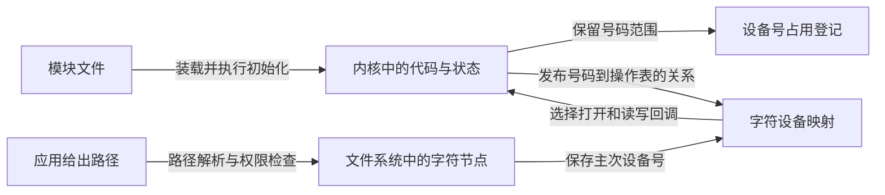
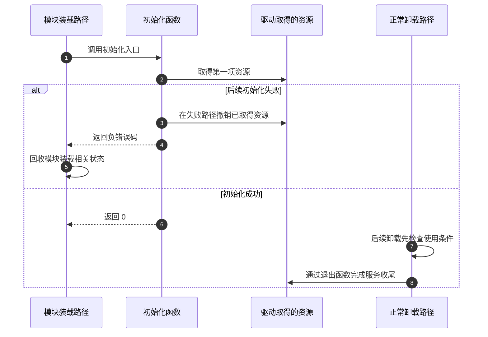

# 第1章\_模块装载与设备访问入口

在[模块构建第一章](../../../../engineering/build/kernel_modules/P01_从C文件到匹配目标内核的模块.md)中，`hello_note.ko` 已经能够打印装载和卸载日志。但是 `/dev` 中没有同名文件。先别给初始化函数补一条打印：初始化明明已经执行了，缺少的是另一种关系。

本章接着这个 Hello 实验，区分“代码进入内核”“服务可以接受请求”和“用户有一条路径能够找到服务”。我们先观察已有系统对象，再判断还需要由谁建立什么状态。读完后，应能解释为什么一个模块可以没有设备节点、一个节点可以没有同名模块，以及为什么一次成功的 `cat` 还不足以证明驱动正常。

## 1.1\_装入模块并没有替你决定提供什么服务

`.ko` 是可加载内核模块的文件。它包含代码、数据和模块元信息，还需要目标内核解析符号、处理重定位和检查装载条件，不能当作普通应用程序执行。`insmod ./hello_note.ko` 请求装入这个文件；当流程走到初始化入口时，内核调用我们通过 `module_init` 指定的函数。这个函数实际做了什么，决定模块提供了什么能力。

Hello 的初始化只写日志，因而没有用户可读写的数据服务，也没有创建字符设备。另一个模块可能注册文件系统、网络协议或硬件驱动；这些职责不必都表现为 `/dev` 文件。反过来，一种驱动也可能被直接编进内核，在启动阶段初始化，根本没有一个需要单独装载的 `.ko`。

在已经按前置章节核对目标身份、准备好 Hello 产物的 **目标 Linux** 上，进入产物所在目录。下面这组命令用于观察，不重新编译，也不操作外部源码取证树：

```bash
modinfo ./hello_note.ko
sudo insmod ./hello_note.ko
awk '$1 == "hello_note" {print}' /proc/modules
test -d /sys/module/hello_note && printf '模块目录已经出现\n'
ls -ld /dev/hello_note
```

最后一条在这个 Hello 实验中预期报告路径不存在，它不是前面装载失败的证据。`/proc/modules` 的记录证明这个可加载模块当前在内核中；`/sys/module/hello_note` 反映模块对象；两者都不承诺创建字符设备节点。若同名路径原先就存在，先辨认它的来源，不能把它归功于这次 Hello。

观察结束执行 `sudo rmmod hello_note`。注意装载按文件路径，卸载按模块名，后者没有 `.ko` 后缀。`modinfo ./hello_note.ko` 读取给定文件的元信息，也不是查询“当前正在运行的就是这个文件”。安装后的按名称查找、依赖索引、`modprobe` 和 `depmod` 在[构建与部署第四章](../../../../engineering/build/kernel_modules/P04_部署模块并沿错误定位构建问题.md)继续说明。

## 1.2\_路径先告诉内核这是哪一种文件

假设在不存在的路径上执行 `echo ABC > /dev/demo`，shell 可能创建一个普通文件，再把三个字母和换行写进去。随后 `cat /dev/demo` 读出这些字节，完全可以不经过你的字符驱动。文件名位于 `/dev`，并不会自动改变文件类型。

普通文件保存内容，字符设备节点则保存文件类型和主、次设备号等元信息。打开字符节点时，文件系统把这组号码交给字符设备分派逻辑，后者寻找服务请求的操作。节点自身不保存驱动代码，也不必保存设备数据。

先在临时目录中有意建立普通文件，与系统已有的 `/dev/null` 对比。这里不伪造设备号，也不创建任何设备节点：

```bash
work_dir=$(mktemp -d) || exit 1
printf 'ABC\n' > "$work_dir/ordinary"
ls -l "$work_dir/ordinary" /dev/null
cat "$work_dir/ordinary"
cat /dev/null
rm -- "$work_dir/ordinary"
rmdir -- "$work_dir"
```

第一行列表的类型字符应为 `-`，`/dev/null` 在通常的 Linux 环境中应为 `c`。前一个 `cat` 输出 `ABC`，后一个立即结束且不输出字节；这两次结束分别来自普通文件内容读完和空设备定义的读取行为。受限容器或不完整根文件系统可能没有预期的 `/dev/null`，这时先记录环境差异，不创建普通文件来冒充它。

这个实验没有验证自制驱动，只建立一项判断能力：**路径名与读出的内容，不能代替文件类型和设备号证据。** 后续真实字符设备实验应先检查 `test -c 路径`，再核对设备号属于本次注册，最后才比较读写返回值。

即使已经进入正确的驱动，写入成功也不必意味着数据被保存。一个只消费输入的设备可以接受字节、返回已处理数量，而读取始终返回零；保存内容再读回则需要驱动自己维护缓冲区与有效长度。不能用“write 成功，所以 cat 必须回显”代替设备的读写约定。

## 1.3\_从代码到一次访问还缺哪些连接

设想模块现在要提供一个内存窗口，让应用写入字节后再读出。代码已经在内核，接下来仍有三件独立的工作。

首先，需要保留一个设备号范围，避免与别的服务争用同一身份。然后，要把这个号码范围连接到一张文件操作表，告诉内核打开和读写时调用什么函数。最后，应用需要一个字符节点，路径解析才能取得这组号码。节点可以手工创建，也可以由设备模型配合 devtmpfs 或用户空间管理程序建立。



图中保留号码的箭头没有直接连到应用，因为“号码已经分配”不等于“请求可以执行”。同样，路径可以先存在，而服务尚未发布；这时打开可能失败。手工 `mknod` 只建立特殊文件，不能把 Hello 自动变成字符驱动。

自动创建也不是 `insmod` 的内置副作用。驱动注册带设备号的设备对象，设备核心才有信息请求创建节点或发出设备事件；能否在用户当前的 `/dev` 看见它，还取决于相关文件系统、挂载和管理程序。内核管理的节点文件系统叫 devtmpfs，用户空间设备管理程序 udev 可以管理权限和别名，它们不是同一个组件。

完整接口和状态落点在[字符设备第二章](../../../driver_model/character_device/P02_设备号_注册与设备节点.md)展开。这里先记住三个可分别观察的结果：号码归谁占用、号码能否分派、路径能否取得号码。它们允许不同的建立顺序，但访问开放之前必须准备好被访问的状态。

## 1.4\_初始化失败与正常卸载不是同一条路

如果模块初始化先申请缓冲区，再申请设备号，而后者失败，初始化函数必须释放已经取得的缓冲区，并返回负错误码。不能指望内核接着调用模块的正常退出函数：初始化失败和成功装载后的卸载，走的是不同路径。



对提供文件操作的模块，成功打开的文件通常应持有模块引用，使其代码在文件仍可调用时不会被普通卸载移走。如果还存在打开者，`rmmod` 被拒绝可能正是在保护正在执行的请求。先让本次应用结束并关闭描述符，再卸载；不是见到“正在使用”就强行销毁资源。

三个撤销动作也不能互相代替：删除路径不关闭旧描述符；撤销字符设备映射不让旧文件中的操作表消失；归还设备号不释放驱动缓冲区。独立硬件移除还要处理离线状态、等待任务与异步工作，继续由[生命周期章节](../../../driver_model/character_device/P09_安全移除_旧fd与模块卸载.md)承担。

## 1.5\_现在怎样选择下一步实验

从本章的模型进入实现时，先决定读写承诺，再挑代码。若保存一份可以反复读取的有限内容，就需要位置、有效长度和读到末尾的规则；若数据持续到来且读走就消费，就需要空闲空间、等待条件和通知。后者不是“更多接口的前者”，两者对空缓冲区的解释不同。

| 接下来要回答的问题 | 对应正文与实验结果 |
| --- | --- |
| 号码、映射和节点各存在哪里，如何发布 | [字符设备第二章](../../../driver_model/character_device/P02_设备号_注册与设备节点.md)；能区分登记、分派与可见性 |
| 同一模块怎样提供多个独立对象，名称怎样对应身份 | [多实例设备的身份与组织](Linux_内核模块与设备节点操作基础.md)；能判断别名、次号和实例是否真独立 |
| 写后读、覆盖、追加与位置怎样配合 | [有限窗口完整模板](../../../driver_model/character_device/P10_字符设备驱动模板.md)和[构建运行](../../../driver_model/character_device/P11_构建运行与验证.md)；使用同一描述符逐字节检查 |
| 晚到数据怎样让读取者继续 | [环形流完整模板](../../../driver_model/character_device/P13_流式字符设备与等待通知模板.md)；观察回绕、短传输和等待通知 |
| 成功输出为何仍不足以证明并发安全 | [读写契约](../../../driver_model/character_device/P05_文件操作契约与数据路径.md)；区分单次互斥、复制进度与多次读取快照 |
| 路径、模块或返回值出错时先查什么 | [分层排错](../../../driver_model/character_device/P12_常见故障与排查.md)；按第一项失效条件保留现场 |

这条路线保留完整代码和实验的唯一位置。遇到例子中的主设备号，不把它当作目标固定值；动态分配是在可用范围内选择，不等于“随机数”，更不保证重装后保持不变。

## 1.6\_回顾与练习

1. Hello 已出现在 `/proc/modules`，却没有 `/dev/hello_note`，应该修改装载命令还是先看初始化提供了什么服务？
2. 把普通文件命名成 `/dev/my_sensor`，读取成功，能证明字符设备注册完成吗？
3. 初始化申请第三项资源失败，只写 `return -ENOMEM`，正常退出函数写得很完整，为什么仍可能泄漏？
4. 删除一个手工节点后，已经打开的文件还能否继续调用驱动？若目标代码直接编进内核，是否应该在 `lsmod` 中寻找它？

解答：第一题先看初始化职责，Hello 只打印日志。第二题不能，普通文件的文件系统会自行完成读写。第三题没有成功进入正常服务阶段，失败分支必须撤销此前取得的资源，退出函数不会替它补做。第四题旧打开文件不靠每次重新查找路径执行操作；是否继续服务由驱动状态与引用协议决定。内建代码不作为可加载模块出现在 `lsmod`，设备是否存在应另查其服务入口和设备对象。

本章模块入口与失败路径按 NXP 官方 Linux 6.12.20 固定提交 `dfaf2136deb2af2e60b994421281ba42f1c087e0` 的 `kernel/module/main.c` 核对；字符设备证据从[源码阅读入口](../../../../research/source_reading/character_device/navigation/P01_Linux_6.12_字符设备源码阅读索引.md)继续。上面的目标命令是实验步骤，不表示已经在当前虚拟机或板上执行。

原稿保留的来源批注：

> **内容摘抄自GPT。**

本轮正文已按上述职责重新编写；原稿六组模块、字符设备、缓冲区和并发材料的去向记录在[全仓工作记录](../../../../governance/migration/repository_textbook_refactor.md)。
