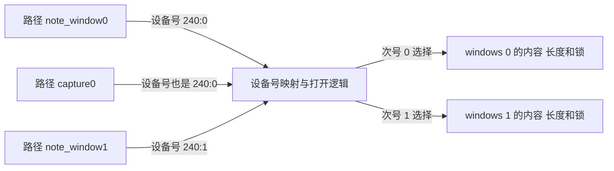

# 第1章\_多实例设备的身份与组织

[模块入口一章](Linux_内核模块与设备节点操作入门.md)已经区分代码、服务与路径。现在把一个设备变成两个：应用甲把数据写进通道 0，应用乙需要读取通道 1。给 `/dev` 增加两个名字够不够？如果两个名字保存的是同一个设备号，答案通常是否定的——应用很可能仍在访问同一个对象。

本章专门研究“名称怎样找到身份，身份怎样选中实例”。字符设备第二章负责设备号登记和分派机制，P10～P13 负责完整驱动；这里在它们之间建立多实例的组织模型，保留别名实验、连续次号、功能分段和硬件枚举的区别。读完以后，应能画出每个入口到数据对象的关系，而不是从节点数量猜设备数量。

## 1.1\_两个名字不一定代表两份状态

字符节点含有主设备号和次设备号，组合编码的内核类型叫 `dev_t`。主号和次号共同定位字符设备分派，不是“主号对应一个模块、次号对应一个硬件”的强制规范。一个模块可以提供多个号段，一张操作表也可以服务多个次号；最后选哪份状态，要看驱动的打开逻辑。

假设本次注册得到主号 240、次号 0 和 1。这里的 240 只是算例，不是要求在机器上申请的常量。三个字符节点可以形成如下关系：



前两个名字在分派意义上是同一服务的两个入口；第三个名字才选择另一份窗口。每次独立打开仍可拥有自己的位置，但设备内容是否共享由选中的实例决定。节点各自的权限、所有者以及安全策略可能不同，因此“同一设备号”不承诺两个路径都允许当前用户访问。

原作者的实验批注保留如下：

> 笔者试验过，只要使用mknod的时候，能够保证设备号对得上，创建的节点名(demo1, demo2, other_demo)可以不和模块名（demo.ko）有任何关联，它两唯一的纽带是设备号。

这条观察准确抓住了 **按号分派** 的关系。它的适用前提是字符节点类型正确，注册映射仍属于同一对象；不能把“唯一的纽带”扩大成忽略路径权限、对象生命期或设备号重用。删除并重新创建同名节点，也不会让已经打开的旧文件自动改指向新对象。

## 1.2\_从连续次号计算实例下标

若同一模块一次创建四个实例，可以保留从次号 8 开始的四个号码。它们是 8、9、10、11，实例数组下标却是 0、1、2、3。打开时先验证次号位于范围内，再计算 `index = minor - first_minor`，不能直接用 `minor` 访问只有四项的数组。

Linux 中 `MKDEV` 组合设备号，`MAJOR` 和 `MINOR` 拆出主号、次号；`iminor(inode)` 从字符节点对应的 inode 中取得次号。它们负责编码与读取，不负责数组边界，也不知道哪个硬件已经离线。次号递增只有在确认不越过本次范围和编码边界之后，才可以用于推导下一个实例。

在[有限窗口模板](../../../driver_model/character_device/P10_字符设备驱动模板.md)中，次号从 0 开始、实例整体创建，所以用一个 `cdev` 覆盖整段范围。打开回调把 `file->private_data` 指向数组中的一个窗口；后续读写不必每次重新解析路径。两个实例拥有不同缓冲区和锁，即使操作函数完全相同，内容也不会因此混在一起。

另一种组织把 `struct cdev` 嵌在每个设备对象中。打开路径取得该 cdev 后，可以通过 `container_of` 回到外围对象。这样更容易表达单个实例的注册与移除，但仍需自己管理旧文件持有的引用。**一个还是多个 cdev，取决于生命周期和映射粒度，不取决于哪个写法看起来更短。**

## 1.3\_功能分段与真正的稀疏范围

如果每个通道分接收和发送两个端点，就需要从次号同时解出“哪个通道”和“哪个方向”。一种约定是次号 0～3 表示四个接收端点，16～19 表示四个发送端点，中间的 4～15 留空。这里才有真实的空洞；把 0～15 和 16～31 连起来，整体仍是连续 0～31，只是语义分了段。

先用下面的完整普通 C 程序验证规则。它不注册任何内核对象，不需要模块权限，只把整数翻译成端点身份。保存为 `decode_minor.c`，在有 C 编译器的练习目录执行即可；[同名实验材料](../../../../labs/kernel/character_device/materials/decode_minor.c)便于取用，内容与下面一致，不参与内核模块构建。

枚举常量 `ENDPOINT_RECEIVE`、`ENDPOINT_TRANSMIT` 分别表示接收和发送方向，它们是这个程序自己的标签，不是 Linux 分配的设备号。结果结构把通道下标和方向分开保存，避免让调用者再猜一个整数同时编码了哪些含义。

```c
#include <stdbool.h>
#include <stdio.h>

enum endpoint_direction {
    ENDPOINT_RECEIVE,
    ENDPOINT_TRANSMIT
};

struct endpoint_identity {
    unsigned int channel;
    enum endpoint_direction direction;
};

static bool decode_minor(unsigned int minor, struct endpoint_identity *identity)
{
    /* 先检查范围，再做减法；不能让空洞变成数组下标。 */
    if (minor < 4) {
        identity->channel = minor;
        identity->direction = ENDPOINT_RECEIVE;
        return true;
    }
    if (minor >= 16 && minor < 20) {
        identity->channel = minor - 16;
        identity->direction = ENDPOINT_TRANSMIT;
        return true;
    }
    return false;
}

int main(void)
{
    const unsigned int minors[] = {0, 3, 4, 15, 16, 19, 20};
    struct endpoint_identity identity;

    for (size_t index = 0; index < sizeof(minors) / sizeof(minors[0]); ++index) {
        if (!decode_minor(minors[index], &identity)) {
            printf("minor=%u invalid\n", minors[index]);
            continue;
        }
        printf("minor=%u channel=%u direction=%s\n", minors[index],
               identity.channel,
               identity.direction == ENDPOINT_RECEIVE ? "receive" : "transmit");
    }
    return 0;
}
```

```bash
cc -std=c11 -Wall -Wextra -Werror decode_minor.c -o decode_minor
./decode_minor
```

预测后再运行：0、3 分别解出接收通道 0、3；16、19 解出发送通道 0、3；4、15、20 都应输出 `invalid`。函数失败时没有给输出对象建立新身份，所以调用者必须先判断布尔返回值，不能继续使用上一次留下的字段。

把这个规则接到内核时，还要决定 **保留范围** 和 **实际映射范围**。可以一次保留 0～19，再由打开逻辑拒绝空洞；这样占用的号码多一些，生命周期简单。也可以分别登记 0～3、16～19，只映射实际端点，但必须检查第二段失败，并撤销已经登记的第一段。动态选择主号后再请求同主号的第二段时，第二次申请仍可能失败，不能把第一次成功当作全组号码都已取得。

稀疏解码不等于已经实现独立通道。即使两个端点解出不同方向，若最终都指向同一缓冲区，它们仍按那份共享状态工作。相反，一份硬件状态可以由两个不同方向的端点共享，这也可能是有意设计；应明确读写权限、缓冲区所有权和关闭行为，不能从数字布局推断它们。

## 1.4\_把身份交给真实硬件时还会多一层关系

内存窗口由模块按数量创建；板上硬件通常由设备树等描述或总线枚举产生设备对象，再与驱动匹配。platform 总线用于组织一类不依赖常见自枚举总线的设备；设备树是描述硬件及连接关系的数据，不是某个 `/dev` 名称的分配器。

当一个匹配的硬件实例进入驱动的 `probe`，驱动才有机会建立这个实例的状态，并分配对用户公开的号码或名称。设备树节点名、寄存器地址、内核设备对象名、次设备号和用户路径处在不同层次。两个同类控制器可以使用相似的节点名称，只是地址不同；直接截取 `of_node->name` 当全局唯一节点名，可能发生冲突，也不能保证枚举顺序变化后名字稳定。

因此需要先选择身份策略：用户是否只需要“当前第几个设备”，还是需要“板上固定连接的那个接口”？前者可采用分配得到的实例编号；后者应根据真实可用的硬件身份、连接关系或明确约定的别名建立映射，再由用户空间规则提供稳定入口。不能为了得到好看的 `sensor0` 而把探测顺序当成硬件身份。

当设备独立消失时，还要撤销它的映射、拒绝新请求，并等待旧文件或异步工作结束。第十章整组窗口的数组生命期不能直接代替这种协议。继续学习[设备模型与硬件交接](../../../driver_model/character_device/P08_设备模型与硬件子系统交接.md)及[安全移除](../../../driver_model/character_device/P09_安全移除_旧fd与模块卸载.md)，再接真实平台。

## 1.5\_用已有实验辨认别名和独立实例

[构建运行第十一章](../../../driver_model/character_device/P11_构建运行与验证.md)已经提供两个窗口的完整装载、手工节点和 C probe。沿那套经过参数对齐的步骤，先对次号 0 的入口运行 probe，随后对次号 1 运行。第二个仍从空内容开始，才与“两个窗口独立”一致。

再做一个预测练习：如果误把两个手工节点都创建为次号 0，第二次 probe 最早会在“窗口应为空”处失败，因为第一个已经写入同一实例。它不是节点名称冲突，而是两个名字选中了同一状态。恢复时先关闭文件并卸载本次模块，只清理本次亲自建立的节点，再按实际设备号重建；不要用通配删除代替身份核对。

用户程序与 shell 的差别同样重要：连续两个 shell 重定向通常各自打开一次路径，而 C 程序可以在同一个描述符上写、移动位置、再读。完整 `window_probe.c` 检查每次返回值和包含零字节的内容；不要把忽略 `lseek` 失败的测试拿去验证无位置的流设备。[环形流实验](../../../driver_model/character_device/P13_流式字符设备与等待通知模板.md)改用消费和等待条件观察多实例状态。

还可以按需增加控制命令、sysfs 属性或内存映射。控制命令需要定义应用二进制接口（ABI，Application Binary Interface），即应用与内核约定的数据布局、命令编号等边界；属性更新需要与数据路径同步；映射需要处理越过文件关闭后的生命期。直接内存访问（DMA，Direct Memory Access）是设备访问内存的机制，并不是把用户复制函数换个名字就能得到的优化。权限与安全策略则决定谁能使用已经建立的入口。这些扩展各有问题前提，不把“接口更多”当作模板已经能直接用于生产硬件的证明。

## 1.6\_回顾与练习

1. 三个节点中两个保存同一设备号，能否仅凭路径数量断言有三个实例？
2. 一个连续范围从次号 8 开始，共四项，次号 10 应选择哪个数组下标？次号 7 应如何处理？
3. 将程序中的通道数扩为 20，却仍把发送段放在次号 16，会出现什么歧义？
4. 两块板枚举控制器的顺序不同，应用却把次号 0 认作“左侧传感器”，应该修改读写回调还是重新定义身份映射？

解答：第一题不能，别名可能选择同一对象。第二题下标为 2；7 在范围外，应先拒绝再计算下标。第三题接收段会覆盖 16～19，使原发送端点被第一条分支解释成接收通道；扩容必须同时重划区间并检查用户可见约定。第四题问题出在身份策略，读写函数再正确也无法替应用修正选错对象的入口。

现在已经能从路径追到号码，再从号码追到对象。默认下一步回到[字符设备注册](../../../driver_model/character_device/P02_设备号_注册与设备节点.md)，把这些关系落实为登记、分派和发布状态；完整代码只在 P10、P13 维护，构建和运行分别见[工程专题](../../../../engineering/build/kernel_modules/大纲.md)与 P11。
