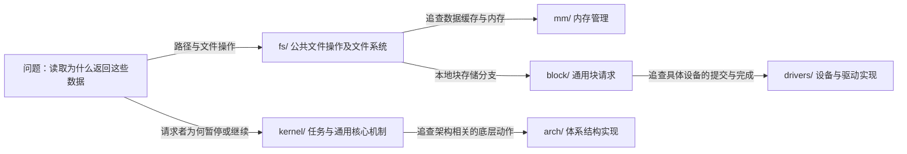

# 第1章\_Linux源码树\_从问题找到文件

上一章用一个读取文本的程序，区分了应用、库、内核和硬件。现在你想继续追问：内核在哪里检查打开请求，文件数据的缓存由哪里管理，存储设备的专有操作又放在哪里？打开源码根目录后，一串目录名并不会自动回答这些问题。

本章用这些问题带路，建立源码位置感。你不必把所有目录背下来；目标是先判断问题属于哪类职责，再用源码和构建关系检验判断。还要学会一项容易忽略的区别：源文件、配置、编译产物和正在运行的系统，是四种不同的对象。前置阅读是 [Linux 内核概貌](../kernel_composition/linux内核概貌.md#1.1_先让程序读到几个字)。

## 1.1\_先区分源码目录与正在运行的系统

把源文件 `read_note.c` 改大缓冲区，并不会让之前编好的程序自动改变。内核也是如此：源码描述实现，配置选择参加构建的功能，编译和链接产生可执行内容，启动或模块加载才使某份内容进入运行系统。看见源码中有某个函数，并不能证明当前机器正在执行它。

本文中的 `fs/`、`mm/` 等路径都 **相对于内核源码根目录**。它们不是运行系统的 `/fs`、`/mm`，也不是知识库自身的目录。运行系统的 `/usr` 与源码中的 `usr/` 恰好拼写相近，却承担完全不同的职责。区分根目录，比背目录缩写更有用。

本章目录示例以 [NXP Linux 源码基线](../../../../research/source_reading/linux/SOURCE_BASELINE.md#1.1_当前来源)中的官方 `linux-imx` 仓库为准：Linux 6.12.20，发布标签 `lf-6.12.20-2.0.0`，固定提交 `dfaf2136deb2af2e60b994421281ba42f1c087e0`。这是一棵面向多个 i.MX 平台的厂商内核树，不是 i.MX6ULL 专属实现。下面的目录定位不依赖某一份开发配置；判断一个实现是否实际编入系统时，仍须另查配置。

在已经取得的内核 Git 工作树根目录执行以下只读命令。`git remote get-url origin` 查看来源，`rev-parse HEAD` 查看当前提交，`git show` 读取固定提交中的文件，冒号后是源码相对路径。命令不会切换或修改工作树。

```bash
git remote get-url origin
git rev-parse HEAD
git show dfaf2136deb2af2e60b994421281ba42f1c087e0:Makefile
git ls-tree --name-only dfaf2136deb2af2e60b994421281ba42f1c087e0
```

第三条输出较长，先看开头的版本字段：应为 6、12、20。第四条列出该提交根目录里被版本管理的条目，而不是当前目录中所有文件。若 Git 报固定对象不存在，说明这份本地仓库还不能提供所需对象，应先核对来源和取得范围；不要把工作树中另一个版本当作替代品。同一官方仓库可以使用不同访问协议的地址，判断时要核对站点、组织、仓库和提交。本地为了实验增加的提交不改变官方证据基线，本文始终读取上述固定提交，不把本地实验差量当成发布内容。

## 1.2\_沿一次读取划分职责

回到上一章的文件读取。应用给出路径，内核需要处理打开、权限和文件操作，这使我们先看 `fs/`，它是文件系统公共层及具体实现所在的目录。若疑问变成“已有文件内容怎样留在内存里供下次使用”，就需要进入 `mm/` 所承担的内存管理职责。若疑问是“怎样把块请求交给某种存储控制器”，又会经过通用块层 `block/` 与相应的 `drivers/` 代码。

这不是保证每次读取都经过四个目录。上一章已经说明，数据可能在缓存中；某些文件也根本不来自块设备。目录是职责坐标，不是函数调用时刻表。



**VFS** 是上一章建立的虚拟文件系统公共层。它的一部分实现放在 `fs/`，数据结构声明还可能位于 `include/linux/`。文件名和目录只能帮你缩小范围；确认一个对象的意义时，要继续查声明、定义、调用者和配置，而不是找到同名词就停止。

例如 `fs/open.c` 与 `fs/read_write.c` 是打开和读写路径的起点，`mm/filemap.c` 与文件页缓存有关；这些是文件定位线索，不代表本章已经展开了其中每个函数。需要继续建立机制模型时，从 [VFS 专题大纲](../../../kernel_subsystems/vfs/大纲.md)选择阅读入口；已有源码文件的保存范围见 [源码基线的字符设备与 VFS 证据](../../../../research/source_reading/linux/SOURCE_BASELINE.md#1.3_字符设备与_VFS_证据)。

## 1.3\_带着问题读主要源码目录

下面把已经出现的职责整理成查询表。先根据问题选择一两行，再读对应文件；无需按表从上到下通读整个内核。

| 你正在追问什么 | 源码位置 | 如何缩小下一步 |
| --- | --- | --- |
| 请求者什么时候运行、等待或收到信号 | `kernel/` | 调度看 `kernel/sched/`，信号可从 `kernel/signal.c` 定位；不是一个顶层 `sched.c` 包办调度 |
| 内核启动以后，通用初始化从哪里展开 | `init/` | `init/main.c` 组织通用启动流程；更早的架构入口还在 `arch/`，初始任务定义也不应当作普通创建线程的演示 |
| 地址、物理页、缓存和内存回收由谁管理 | `mm/` | 按分配、映射、文件缓存等问题继续分流，避免把它们都叫作同一种内存分配 |
| 路径、打开状态与不同文件系统怎样合作 | `fs/` | 先读公共层，再进入 `fs/ext4/`、`fs/btrfs/` 或其他具体实现 |
| 通用存储请求怎样组织和提交 | `block/` | `bio.c`、`blk-core.c` 等是实际线索；没有必要凭名称猜出一个 `blk-flock.c` |
| 某种硬件、总线或设备框架怎样工作 | `drivers/` | 按设备家族查找；串口和 USB 等并不全在 `drivers/char/`，应核对实际子目录 |
| 网络报文怎样按协议处理 | `net/` | 协议处理与 `drivers/net/` 中的设备驱动属于不同层，两个目录需要沿调用关系连接 |
| 处理器异常、底层切换或页表有什么架构差异 | `arch/` | 先确认目标为 Arm 32 位、Arm 64 位、x86 等，再进入对应目录；不能把一个架构的结论直接外推 |
| 一种对象或接口在哪里声明 | `include/` | `include/linux/` 是常见内核内部入口；面向用户空间的接口定义关注 `include/uapi/`，架构头文件还需查对应 `arch/` 树 |
| 进程间的消息、共享内存或信号量怎样实现 | `ipc/` | 这里集中部分进程间通信实现，如 `msg.c`、`shm.c`、`sem.c`；管道、信号等并不因此都归入这个目录 |
| io_uring 请求怎样管理 | `io_uring/` | io_uring 是接口专名，先从请求提交与完成模型入手；不能把“异步”自动等同于所有负载都更快 |
| 哪些工具可被多个内核部分复用 | `lib/` | 字符串、通用数据结构与辅助算法等；它不是应用链接的 C 标准库 |

还有一些专门职责，等问题进入对应领域时再读：`crypto/` 提供密码学框架与算法，不能假定算法统一放在一个叫 `algorithms/` 的子目录；`security/` 保存安全框架及相关实现；`certs/` 处理内核构建与信任证书等事项，证书的存在本身不等于每个模块已经验签；`sound/` 是音频子系统的重要位置；`virt/` 保存部分通用虚拟化支持，架构和设备相关代码仍可能在其他目录；`rust/` 提供内核 Rust 支持相关基础设施。

“固件”也容易找错。设备固件指设备运行所需的代码或数据，不等于主机 Linux 驱动。所选 6.12.20 提交没有顶层 `firmware/` 目录；固件加载框架可从 `drivers/base/firmware_loader/` 定位，而设备需要的实际固件文件是另一类交付物。不能因为一份旧目录表写了 `firmware/`，就断言当前源码下载不完整。

## 1.4\_哪些文件决定构建\_哪些文件只是结果

前面解决了“代码按什么职责保存”，但存在代码不等于参加构建。**Kconfig** 是内核配置系统的名称；源码中的 `Kconfig` 文件描述可选项及依赖，选定结果通常保存在 `.config`。**Kbuild** 是内核构建系统的名称；各级 `Makefile` 和 `Kbuild` 文件依据配置组织要编译和链接的目标。配置描述选择，构建规则兑现选择，二者不是同一个文件换了名字。

`scripts/` 保存配置、构建和维护辅助程序；`Documentation/` 保存内核文档；`samples/` 提供示例；`tools/` 包含许多在用户空间运行的开发与测试工具。它们都可能与工作有关，但不是每个源文件都被链接进内核。

`usr/` 的名字尤其具有迷惑性。这个源码目录负责构建 **初始内存文件系统（initial RAM filesystem，initramfs）** 的归档内容等工作，供启动阶段使用；它不是运行系统 `/usr` 的源码镜像，也不是“所有用户空间接口头文件”的存放地。核对本版本的 `usr/Makefile`，可以看到生成初始文件系统数据及辅助工具的规则。

构建后你还可能遇到下列名称。先认识表中的文件格式：**ELF（Executable and Linkable Format）** 是可执行与可链接文件格式的名称，这里用于说明 `vmlinux` 的文件类型。符号则是构建工具用来标识函数或对象等实体的名称。这些产物有用，但不是判断源码是否齐全的清单：

| 名称 | 它记录什么 | 不能据此推断什么 |
| --- | --- | --- |
| `vmlinux` | 链接得到的内核可执行映像，通常为 ELF 格式 | 不一定就是引导程序直接加载的最终封装映像 |
| `System.map` | 内核符号及地址映射 | 不能拿另一次构建的地址解释当前运行内核 |
| `Module.symvers` | 构建所导出的符号及相关信息；启用模块版本检查时还记录校验值 | 不保证任意同版本字符串的模块都兼容；禁用相应检查时校验值可为零 |
| `modules.order` | 模块在构建规则中出现的顺序，供模块工具处理相关匹配 | 不是运行时所有模块实际加载先后的日志 |
| `modules.builtin` | 哪些模块对应的实现已内建到内核 | 找不到单独模块文件不表示该功能一定不存在 |
| `modules.builtin.modinfo` | 内建模块的模块信息 | 不是另一个可装入模块映像 |

精确产物含义可以在该版本的 `Documentation/kbuild/kbuild.rst` 的 “Output files” 和 `Documentation/kbuild/modules.rst` 的 “Module Versioning” 部分核对；模块版本校验是有限的一致性检查，不是万能兼容保证。

如果使用独立输出目录构建，产物可能保存在另一个位置。因而“源码根目录没有 `vmlinux`”至少可能有两种正常解释：尚未完成构建，或者构建输出在别处。直接断言源码损坏，跳过了最需要确认的一层事实。

## 1.5\_维护信息与版本管理也要分清

现在再看根目录中不属于运行机制的文件，就容易理解了。`README` 给出项目阅读入口；`MAINTAINERS` 记录维护责任和路径匹配信息，厂商树还可能有自己的补充；`COPYING` 和 `LICENSES/` 提供许可证相关说明。它们帮助你理解如何使用、修改和贡献源码，不会因为放在根目录就变成内核执行代码。

隐藏文件 `.get_maintainer.ignore` 用于维护者查找工具的忽略规则，开头的点是名称的一部分。Git 自身的管理入口通常叫 `.git`，可能是目录，也可能是指向实际管理位置的文件；源码发行包则可能根本不包含它。不要把 `.git` 误写为内核功能目录 `git/`，也不要把不同取得方式的差别当成内核机制差别。

一个完整追踪通常横跨这些层：先由源码确认实现，再由配置和构建规则确认它是否参加构建，由产物确认构建结果，最后确认机器启动的是哪份结果。目录表只能帮助第一步，不能替代其余证据。

## 1.6\_动手定位一次\_并检验自己的猜测

继续在已核对身份的内核 Git 工作树根目录执行。先不要全仓搜索 `read`：这个词会同时命中很多无关操作。我们已经由问题把范围缩到了文件公共层，所以先定位候选文件，再看定义。

```bash
git ls-tree --name-only dfaf2136deb2af2e60b994421281ba42f1c087e0 fs/open.c fs/read_write.c mm/filemap.c
git grep -n 'SYSCALL_DEFINE.*(read,' dfaf2136deb2af2e60b994421281ba42f1c087e0 -- fs/read_write.c
git show dfaf2136deb2af2e60b994421281ba42f1c087e0:usr/Makefile
```

第一条应找到指定的三个源文件。第二条中的 `-n` 要求显示行号，单引号保护搜索表达式，`--` 后限定查找路径；`SYSCALL_DEFINE` 是源码中定义系统调用的宏名称，本轮用它定位读取入口，不要求你此时展开宏体。命中只能证明固定源码中存在候选定义，尚未证明某次用户程序读取必然执行它。第三条用于核对刚才关于 `usr/` 的判断：应能看到与初始文件系统归档有关的构建规则。

这些操作只读取 Git 对象，不依赖工作树正在编译到哪个阶段，也不会触发编译。若第一条没有输出，先检查提交和路径；若第二条没有匹配，先检查表达式、所选文件和版本，不能凭空补出一个“应该存在”的函数。实验的结束状态仍是原工作树，无需清理内核文件。

进一步进入启动链时，可以选一个具体机制继续追踪。**读复制更新（Read-Copy Update，RCU）** 是后续用于协调读取与延迟回收的机制，本章只将它作为可选的源码路线。先从 [RCU 源码总阅读索引](../../../../research/source_reading/rcu/navigation/P01_Linux_6.12_RCU源码总阅读索引.md#1.6_建议的源码阅读顺序)选择分支，再看 [启动链实现讲解](../../../../research/source_reading/rcu/source_explanations/P05_Linux_6.12_Tree_RCU_GP全局生命周期源码实现.md#5.5.1_先从内核启动链定位early_initcall)怎样追踪通用初始化创建长期任务。它属于深入阅读，不是理解本章目录关系的前提。

## 1.7\_复习题与解答

先独立判断下面三个现场，再对照解答：

1. 你看见 `drivers/net/`，同伴却让你到 `net/` 找报文协议处理。谁找错了？
2. 工作树没有 `Module.symvers`，但固定提交的源文件完整。是否应重新下载所有源码？
3. 已经找到了读取系统调用的定义，能否宣布上一章的一次库函数 `fread` 调用就对应它的一次执行？

第一题不必有人找错。协议处理与具体网络设备操作是两个层次；先明确是在追协议行为还是硬件收发，再沿调用关系连接二者。第二题应先确认是否构建过、构建目标和输出目录；这个文件是构建产物，重新下载源码不一定使它出现。第三题也不能：标准库缓冲、所选实现和本次请求的实际路径尚未被观察到。

本章让我们把“找个名字相近的目录”升级成“按职责提出假设，再用固定版本文件验证”。下一步可以学习 [模块与设备入口](../modules_and_device_nodes/大纲.md#1.1_沿三个问题进入正文)：代码怎样进入内核，与用户怎样获得访问入口，是两件需要分别完成的事。其余专题按 [内核机制学习路线](../../../../atlas/tracks/linux_kernel_track.md)继续；不必为了证明自己认真，先通读整棵源码树。
