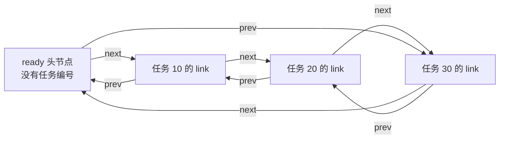

# 第1章\_概念\_定位与底层实现

假设驱动手里有三项待处理任务，编号分别为 10、20、30。它们已经分配在不同地址，别的代码还持有其中一些对象的指针。现在任务 20 暂时退出队列，之后又排到队尾。我们希望改变处理顺序，却不搬走任务对象，也不把任务内容复制一遍。

数组可以保存这三个对象的指针，但从中间删除后可能需要移动后续指针；如果已经拿到待删除对象，又希望快速接好邻居，链表提供另一种表示。它让对象保存连接关系，删除时改邻居的连接，业务数据继续留在原地址。本章先建立这份模型，下一章再执行一次完整的增删循环。

## 1.1\_先分清对象与连接

普通单向链表的节点保存 next，从一个节点走到下一个节点；要删除某个节点，通常还需要找到它的前驱。双向链表增加 prev，使已经拿到节点时也能找到前驱。代价是每个节点多一个指针，修改时必须维护两个方向。

Linux 的 `struct list_head` 采用 **双向循环链表**：头节点也有 next/prev，空表时都指向自己，非空表的尾节点 next 回到头，首节点 prev 也回到头。这里的“头”是连接哨兵，不是第一个任务。



循环结构让空表、首项和尾项使用同一套连接规则，但也带来一个明确边界：遍历走回 head 就要停止，不能继续把 head 当作业务对象读 number。

本目录沿用原路径以保持已有引用；名称中的“单链表”不代表正文的结构类型。真正的单向 `llist` 是另一组接口，具有特定生产者/消费者约束，后面只在选择边界介绍，不能把 list_head 的操作表套过去。

## 1.2\_为什么把节点放进业务对象

下面是应用侧的类型设计，不是上游结构定义的替代版本：

```c
struct note_task {
    int number;             /* 业务内容 */
    struct list_head link;  /* 这项任务在某一条队列中的连接 */
};
```

连接被嵌入宿主对象，因此称为 **侵入式链表**。链表接口操作 link，任务处理代码操作 note_task。插入已有对象不需要另外分配一份通用“装数据的节点”；但任务对象从哪里分配、何时释放，仍然由调用者负责。链表可以避免插入时搬动整个数组，不代表它自动完成动态分配。

拿到 link 地址，怎样取得 number？结构布局给出了 link 在 note_task 内的固定偏移，`container_of` 根据成员地址、宿主类型和成员名找回外层对象；`list_entry` 将这件事包装成链表用法。它不查表，也不检查指针究竟属于哪个对象，类型与成员名填错仍可能得到错误地址。

一个任务若同时参与“待处理”和“按超时排序”两种关系，就需要两个不同成员节点。不能把同一个 link 同时插入两条链；第二次插入会覆盖它的 next/prev，第一条链的邻居却仍指向它，两个容器都会失去一致性。每个连接成员表示一种成员资格，并不等于对象只允许属于一个集合。

## 1.3\_四条必须同时成立的关系

对链上的节点 x，沿 next 再回 prev 应回到 x，沿 prev 再回 next 也应回到 x。空表满足 head.next=head 且 head.prev=head。节点仍在表内时，其宿主对象必须存活。

这四条约束分别保护拓扑与寿命。一个表可以指针方向完全正确，却指向已经释放的任务；也可以所有对象都还活着，却因为重复插入而连成错误的环。正确性检查不能只看一个字段或只确认内存没释放。

对象生命周期至少区分：已分配但未入表、已入表、已摘链仍存活、已释放。`list_del` 只改变成员关系，不调用 kfree；`list_del_init` 还把摘下的连接重置为自环，便于在已定义的协议中复用。是否要释放对象，取决于还有没有其他持有者，以及它究竟来自堆、栈还是静态存储。

## 1.4\_到固定源码中确认名字

本专题具体实现使用 NXP 官方 Linux 6.12.20、固定提交 dfaf2136deb2af2e60b994421281ba42f1c087e0。源码从[链表总阅读索引](../../../../research/source_reading/linked_list/navigation/P01_Linux_6.12_链表源码阅读索引.md#1.1_版本和阅读任务)进入：types.h 定义节点，list.h 实现连接操作，container_of.h 提供宿主地址恢复。

这组工具不自动提供业务锁，不知道任务能否被硬件或另一个文件继续访问。调度、网络、内存与驱动也不是一律用同一种链表管理所有状态；我们会在第八章按真实字段区分它们。

## 1.5\_回顾与预测

现在应能画出“头节点—成员节点—宿主对象”的关系，并指出插入改变什么、不会改变什么。

1. 任务 20 摘链后，其 number 是否立即不能读？
2. 一项任务加入两个队列，为什么需要两个 link？
3. 空表的 next 是否为 NULL？头节点能否直接转成 note_task？
4. 已知任务地址时删除可以少做哪些查找？若只知道编号，又必须补什么工作？

解答：第一题取决于对象寿命，摘链本身不释放对象。第二题两个集合需要独立连接，复用会覆盖第一份拓扑。第三题 list_head 空表是自环，独立头节点不是业务对象。第四题可以直接取得成员及邻居，但按编号查找仍通常需要遍历；下一章用完整模型观察这一差别。

下一篇：[初始化与基本操作](P02_初始化与基本操作.md)。返回[大纲](大纲.md)。
