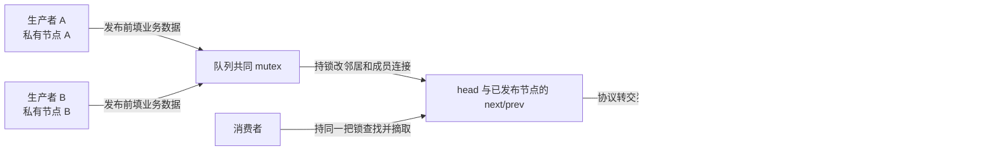
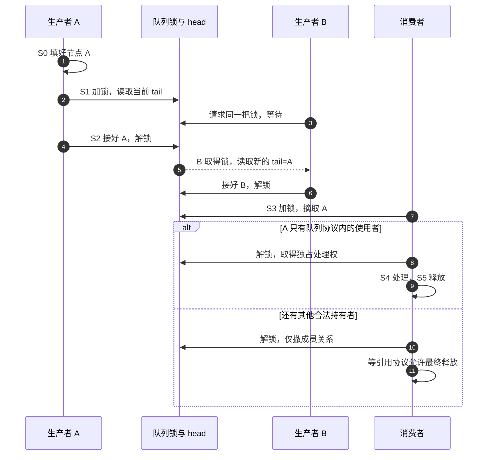

# 第3章\_并发原语与原子性

上一章的四次接链赋值在独占条件下完成。现在两个 CPU 都要向同一 ready 队尾放任务。即使每次指针写都不撕裂，是否就足够？

## 3.1\_两个正确的局部操作怎样丢节点

队列最初为空，head 的前后指针都指向自身。A 和 B 各自分配并初始化一个节点，然后都读取旧 tail=head。A 接好自己的四条边，随后 B 仍按刚才保存的旧邻居接链。B 覆盖 head.next/head.prev，A 的对象仍活着，却不再能从 head 到达。

下面把这种交错写成确定的 Python 模型；它不依赖宿主调度碰巧发生，也不模拟 CPU 内存乱序。

```python
head = {"next": "head", "prev": "head"}
nodes = {"head": head, "A": {}, "B": {}}
old_tail_a = old_tail_b = "head"

def finish_insert(name, old_tail):
    nodes[name]["prev"] = old_tail
    nodes[name]["next"] = "head"
    nodes[old_tail]["next"] = name
    head["prev"] = name

finish_insert("A", old_tail_a)
finish_insert("B", old_tail_b)
assert head["next"] == "B"
assert nodes["B"]["next"] == "head"
assert nodes["A"]["next"] == "head"
print("从 head 可达的是 B，A 的对象仍存在但成员关系已丢失")
```

这个反例没有把任何指针拆成半截，所有赋值都完整执行。问题是两个调用者依据同一份旧拓扑分别完成修改，单次访问原子性无法把“读邻居—写四条边”合成一个事务。

## 3.2\_先用同一把锁建立完整周期

对两个可睡眠的进程上下文，可让同一把 mutex 覆盖找邻居、增删与需要一致性的遍历。所有访问者都遵守协议时，A 持锁修改完才归还，B 之后再读取当前 tail，就会把节点接在 A 后面。只给写者加锁却让普通读者无锁遍历，仍然可能观察中间状态或访问被释放的对象。



这是一组相互关联的状态：拓扑、锁所有者、成员资格和对象使用者数量。统一周期如下：

| 阶段 | 状态与写入者 | 下一步的条件 |
| --- | --- | --- |
| S0 私有准备 | 生产者分配对象、填写业务字段 | 其他参与者尚不可达 |
| S1 取得队列锁 | 生产者获得修改权并读取当前邻居 | 旧拓扑不被其他遵约访问者改动 |
| S2 发布成员 | 持锁接好所有边，再归还锁 | 后续取得同一锁的执行者可观察完整对象 |
| S3 取得工作 | 消费者持锁找到并摘除节点 | 若没有其他持有者，所有权可转给消费者 |
| S4 私有处理 | 消费者解锁后使用对象 | 别的路径不能仍靠裸指针访问它 |
| S5 回收 | 最后使用者释放对象 | 不再入队，也没有待执行异步访问 |



锁还提供同步顺序，但不会替一个脱离协议的裸指针自动增加引用。需要在解锁后继续使用“仍留在共享表里”的对象时，应在锁内按对象协议取得引用；不能以 list_for_each_entry_safe 的名字为凭据逃过这个证明。

## 3.3\_READ\_ONCE究竟多保证了什么

READ_ONCE/WRITE_ONCE 约束特定对象的编译器访问，限制合并、消除、重复取值等变换；支持的尺寸与底层实现还有架构边界。它们不等于通用 CPU 内存屏障，不绕过缓存，也不保证“这一刻最新值”。CPU 的缓存一致性、指令原子性与软件同步协议必须分别考虑。

尤其不能从“32 位”推断所有 64 位访问必为两条指令，也不能从“64 位且对齐”推断任何对象、内存类型和指令都一律原子。固定通用 rwonce.h 明确允许某些 32 位环境下的 64 位访问，但仍可能拆分；普通 ARM 指针宽度又不能与 64 位整数混成同一例子。需要跨架构的 64 位原子计数，应选对应原子接口并核对契约，不把 READ_ONCE 当成通用补救。

若要发布“指针背后已经填好的对象”，发布者与使用者需要匹配的顺序协议。一个常见模式是 release 存储与 acquire 读取；它只在读取到相应发布值、对象内容及寿命符合约束时建立所需关系。它不允许两个写者同时改同一链表，也不处理对象被撤销后的回收。链表入门继续使用明确的锁，内存序深入见[内核同步总纲](../../synchronization_and_asynchrony/大纲.md)。

## 3.4\_执行上下文决定可用的锁

mutex 适合可睡眠的进程路径；硬中断不能等待睡眠锁。若队列同时由普通进程和硬中断访问，需要按上下文选择自旋锁及本地中断控制：否则进程持锁时被本 CPU 中断打断，中断又等待同一锁，进程无法回来归还它。具体 irqsave 方案还需与 PREEMPT_RT 等配置边界一起核对，不能把所有内核构建下的锁实现当成相同。

自旋锁下不能随意做可能睡眠的分配或用户复制；可在锁外准备私有对象，锁内只交接成员资格。这样缩短锁内工作，是建立正确性之后的优化，不是自旋锁天然“减少锁竞争”。

## 3.5\_练习与解答

1. 给上面的 Python 模型每次赋值加一个“原子”标签，会阻止丢失 A 吗？
2. 在 S3 保存裸指针然后解锁，另一个使用者能立即 free 吗？
3. list_empty 为真后，下一条语句能无锁断言队列仍空吗？
4. 一个只在初始化函数中构建且从未对外发布的表需要并发锁吗？

解答：第一题不会，必须串行化整个读改写事务或采用经过证明的不同算法。第二题需要引用或独占转交协议，否则有寿命缺口。第三题不能，判空是一次观察，不是预留条件。第四题不需要为不存在的并发加锁，但要检查初始化过程中是否已注册能回调的入口；这将引出下一章的发布问题。

上一篇：[初始化与基本操作](P02_初始化与基本操作.md)。

下一篇：[一次性初始化](P04_一次性初始化.md)。返回[大纲](大纲.md)。
