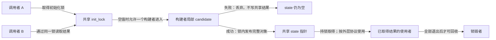
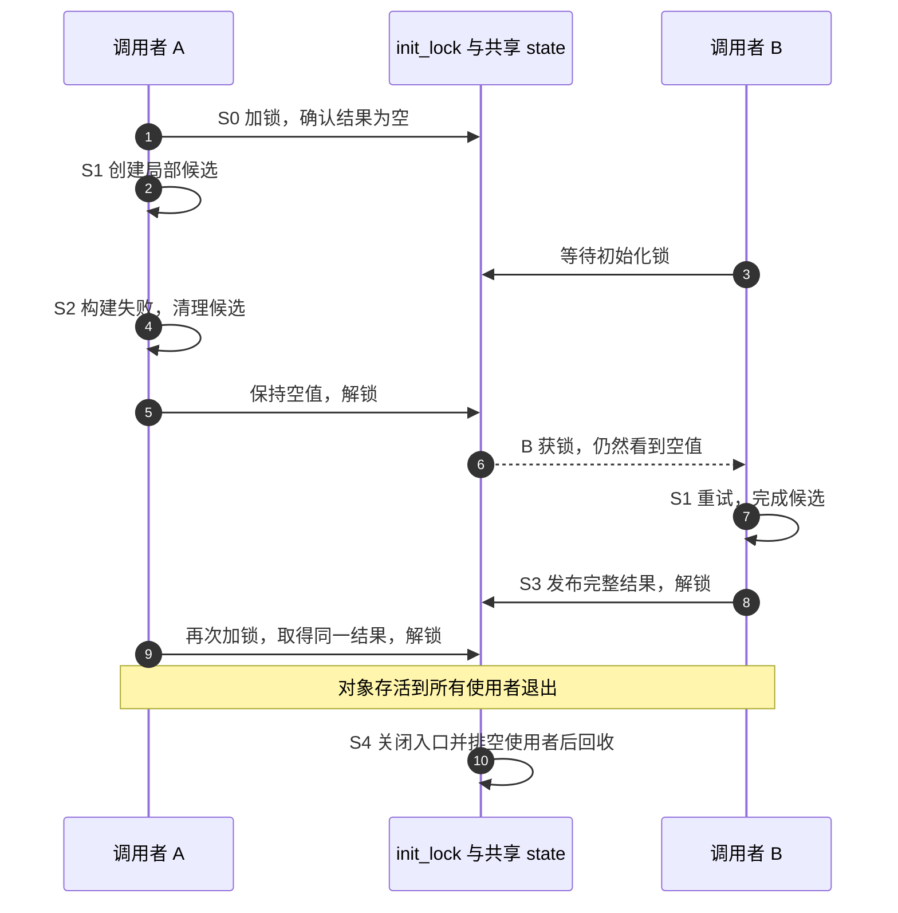
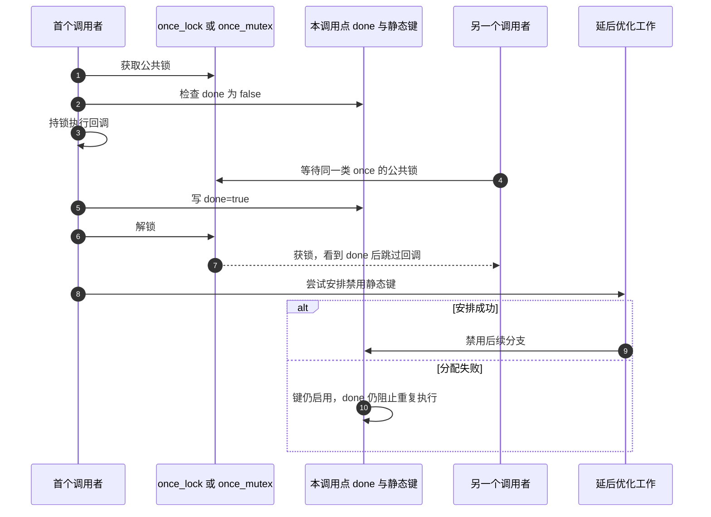

# 第4章\_一次性初始化

上一章把共享表的修改放进同步协议。本章追问一个更早的时刻：谁保证表第一次被使用时已经准备好？给 head 写成自环很短，但真实初始化还可能分配对象、创建缓存或填充索引，其中任何一步都可能失败。

## 4.1\_初始化与发布不能合成一个标志

如果 A 先把 ready=true，再逐个添加初始节点，B 看到 true 后就可能读到半份表。若 A 在第三次分配失败，标志已经宣告完成，B 甚至无法知道这次构建应该被撤销。

先用私有候选构建完整结果，再发布共享指针，可以让失败只影响本次候选。但还需要解决两个初始化者同时创建、失败后能否重试、使用期间是否允许销毁三个问题。

| 阶段 | 锁内状态 | 其他调用者的处境 |
| --- | --- | --- |
| S0 未就绪 | 共享结果为空 | 第一个获得初始化锁的调用者可以尝试 |
| S1 构建中 | 构建者持锁，候选只在局部可见 | 等待锁，不能绕过锁使用共享半成品 |
| S2 失败 | 清理候选，共享结果仍为空，然后解锁 | 下一个调用者可以按策略重试 |
| S3 就绪 | 完整候选赋给共享结果，然后解锁 | 下一个持锁者取得同一份完整结果 |
| S4 退出 | 阻止新调用并排空旧使用者后销毁 | 初始化锁本身不替使用者保活结果 |

“谁先执行一次”与“谁取得一个可用结果”不同。构建失败是否永久失败，还是允许重试，必须在接口中说明。

下面两图采用后一种策略。共享状态由初始化锁保护，候选对象在发布前只属于构建者；取得结果以后能用多久，则由更外层的使用期协议决定。





## 4.2\_先选最容易证明的安排

如果资源每次加载都会使用，把构建放在模块初始化、在任何可调用入口发布之前完成，通常最容易推理。这里的安全来自 **尚无访问者**，不是因为 module_init 名字自带全系统互斥。初始化过程中注册设备、启动工作项或使能中断后，回调可能立即出现；不能继续假定所有状态都私有。

若确实要懒初始化，先让所有使用者通过同一把可睡眠锁取得结果。下面完整模型用 Python 的 Lock 表示这种互斥，首次故意失败，随后两个调用者得到同一个完整对象：

```python
# 教学模型：用一把锁演示失败不发布与后续重试，不模拟 CPU 内存序。
from concurrent.futures import ThreadPoolExecutor
from threading import Lock

init_lock = Lock()
state = None
attempts = 0

def get_tasks():
    global state, attempts
    with init_lock:
        if state is None:
            attempts += 1
            candidate = [10]
            if attempts == 1:
                # 私有候选失败，尚未写入共享 state。
                raise MemoryError("模拟构建失败")
            candidate.extend([20, 30])
            state = tuple(candidate)
        return state

try:
    get_tasks()
except MemoryError:
    pass
assert state is None
with ThreadPoolExecutor(max_workers=2) as workers:
    results = list(workers.map(lambda unused: get_tasks(), range(2)))
assert attempts == 2
assert results[0] is results[1]
assert results[0] == (10, 20, 30)
print("尝试次数:", attempts)
print("两个调用者共享完整结果:", results[0])
```

保存为 `once_retry.py`，执行 `python3 once_retry.py`，预期尝试次数为 2，结果为 `(10, 20, 30)`。第一次只构建了私有 [10] 就失败；它没有污染 state。后两个调用者谁先获得锁不重要，第二个成功构建后，另一个复用同一对象。这个模型验证失败与重试状态，不验证 Linux 内存屏障或对象回收。

代价也很清楚：每次取得结果都加锁，初始化耗时会阻塞其他调用者。只有真实负载表明这条路径值得优化时，再引入无锁快速检查，并单独证明顺序和寿命。

## 4.3\_快路径为什么不能随意只读一次

若慢路径用 release 发布指针，快路径不能仅因为用了 READ_ONCE 就宣称得到完整 acquire 保证。需要选择与发布匹配的读取协议，并说明读取到哪次发布、对象哪些字段随后保持不变、谁保证它不会被释放。某些地址依赖协议有专门内存模型约束，也不能简写成“有指针依赖就把 release 换成 WRITE_ONCE”。

双重检查仍需锁内再次确认：A 在锁外看到空，等待期间 B 已完成构建；A 得锁后若不重查，会重复创建。若允许销毁并重新初始化，还要处理旧读者持有旧对象、地址复用和世代问题；一个非空指针不是完整生命周期状态机。入门例子采用持锁访问、结果存活到所有使用者退出，避免把这些未建立的条件藏进短代码。

比较交换 cmpxchg 可以选择一个获胜结果，但没有凭空消除成本：多个调用者可能都完成昂贵的候选计算，失败者必须清理自己的候选；有外部副作用的构建不能只 free 内存就撤销。用 0 表示“未初始化”时，合法结果也为 0 就会失去完成状态，需要独立标记或不同表示。

## 4.4\_本版本确实有DO\_ONCE与可睡眠变体

旧稿断言“内核没有阻塞式 once，DO_ONCE 通常不带锁”不符合本基线。固定 include/linux/once.h 与 lib/once.c 的行为是：

- DO_ONCE 的首次调用由公共 once_lock 自旋锁保护，并保存/屏蔽本地硬中断状态；回调在锁内执行，不能睡眠。
- DO_ONCE_SLEEPABLE 使用 once_mutex，允许进程上下文的可睡眠回调；递归进入相同公共锁的 once 路径可能死锁。
- 每个宏展开位置有自己的 done 与静态分支键。两个不同调用点不是“全局同一个一次”，需要共享入口时应使用同一辅助函数。
- 回调返回后写 done，再安排禁用静态分支的后台工作，以降低后续判断开销。安排优化所需分配失败不等于再次执行回调，done 仍然有效。
- 宏的结果表示本次是否执行了回调，不是回调的业务错误码。回调内部构建失败也会走“本次调用已完成”的记录，不自动重试。



因此，能睡眠、会失败且要求重试的初始化，应明确设计自己的结果和状态协议。不要把 DO_ONCE、DO_ONCE_LITE、printk_once、WARN_ON_ONCE 都视为同一契约；名字里的 once 不是一致性规范。具体入口和状态落点见[初始化源码导读](../../../../research/source_reading/linked_list/navigation/P02_拓扑修改与发布边界导读.md#2.3_一次执行不等于成功初始化)。

## 4.5\_回顾与练习

1. 如果模型在 candidate=[10] 后立即设置 state，第一次失败会留下什么？
2. 让失败永久保留与允许重试，哪一种天然正确？
3. 用 cmpxchg 发布一个新分配缓存，输掉竞争者是否可以直接返回？
4. 给 DO_ONCE 回调增加 int 返回值，宏会把它自动交给调用者吗？

解答：第一题暴露不完整状态；第二题取决于接口策略，必须让调用者知道结果，不能靠空值猜；第三题必须处理自己的未发布候选及副作用；第四题不会，宏忽略函数表达式的业务返回值，结果是执行标记。下一章采用更容易证明的“私有批次全部成功后接入”来构建链表模块。

上一篇：[并发与单次访问](P03_并发原语与原子性.md)。

下一篇：[完整内核示例](P05_接口_示例与注意事项.md)。返回[大纲](大纲.md)。
