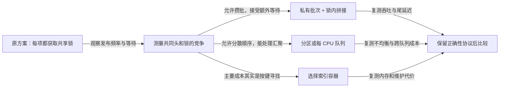

# 第9章\_优化与总结

我们现在会维护拓扑，也能识别子系统的附加状态。最后一个问题是：一个正确的链表，何时会成为不合适的容器？答案取决于正在做什么操作，以及数据怎样被处理器访问。

## 9.1\_先把查找与改边分开计费

假设每次只消费队首，或者调用方已经持有待删除对象，双向链表的连接修改只触碰固定数量的边。可若每个请求只给一个编号，必须从头寻找对应对象，平均查找就可能走过许多节点。链表的快速摘除没有消除前面的查找。

下面模型计算“依次查询每个编号”的比较次数，不是处理器性能测试：

```python
for size in (8, 32, 128):
    comparisons = sum(index + 1 for index in range(size))
    assert comparisons == size * (size + 1) // 2
    print(size, comparisons)
```

预期得到 8→36、32→528、128→8256。请求数也随 size 增长，所以总比较次数呈平方增长；固定请求数下，单次线性查找仍是 O(n)。不要把这段模型输出称为某台机器上的纳秒耗时。

如果主要任务是按键查找，哈希表用桶和哈希函数减少候选范围，但付出空间、冲突处理与扩容协议；若需要有序范围、前驱后继或排序遍历，平衡树可能更合适，但插入删除维护更复杂。数组适合连续扫描、索引和良好局部性，稳定对象地址或中间插入则需要另外设计。不能只记“树比链表快”。

## 9.2\_指针追踪为什么可能慢

遍历时 CPU 先取得当前节点，才能从 next 知道下一节点地址。若节点分散在不同缓存行甚至不同页，后续读取可能等前一次访存完成；硬件难以像扫描连续数组那样直接预取一串相邻地址。对象分配方式、工作集大小和访问模式决定这个成本是否明显，三个常驻缓存的小节点与百万个分散节点不能用同一结论代替测量。

给每个小节点加 PAGE_SIZE 对齐，不会把所有 next 指向的对象变连续，反而可能浪费空间、增加触页数量和缓存工作集。缓存行大小也不等于页大小。若两个 CPU 高频修改不同对象却共用一条缓存行，适当分离写热点可能减少伪共享；这需要先确认真实布局和竞争位置，不能把强制页对齐作为默认优化。

## 9.3\_锁竞争发生在哪条状态上

两个生产者即使各自准备私有节点，发布时仍要修改共同的队尾和锁状态。一方占有相关缓存行并修改，另一方随后要取得可写状态；请求密集时，锁等待与缓存一致性通信可能超过接几条边本身的成本。把加锁换成自旋等待，不会消除共同写入点。

在约束允许时，可以锁外准备一批节点，锁内拼接，再锁外处理摘下的私有批次。这样减少获取锁次数，但增加批量延迟，也可能让一方占据较长批次。每 CPU 队列把高频写分散到不同头，随后要付出跨队列汇聚、负载不均、迁移和顺序定义的成本；它不能免费保留原单队列的全局顺序。



## 9.4\_无锁与RCU有各自的前提

真正的单向 llist 使用不同头与节点，围绕原子头指针操作提供特定契约。固定头文件允许多生产者 add 与合适的 del_all 消费组合，也允许单消费者 del_first；多个消费者若混用 del_first 与其他删除操作则需要额外锁。取走批次后再遍历，并且默认新到项在前；需要到达顺序时须按约定反转。不能因为名字写着 lock-less，就在共享链上任意遍历、删除中间节点或在所有架构的 NMI 中调用。

读多写少场景可能适合 RCU 链表，但它把成本移到更新序列、延后回收与版本观察语义，不是“把锁删掉，读者就自动安全”。旧路径连续性、宽限期与引用逃逸已有[RCU 权威专题](../../synchronization_and_asynchrony/synchronization/rcu/大纲.md)，此处不复制其完整机制。是否接受读者看到不同时间的成员集合，是选择前必须回答的业务问题。

## 9.5\_最后一次选择练习

一张只有十个成员、修改很少、每次完整扫描的小表，是否因为哈希查找平均复杂度更好就必须改？没有这个结论：维护成本、代码简单性和工作集可能更重要。另一张十万个对象、每次按唯一编号查询的表，即使摘除很快，也值得评估索引结构。

把两个场景换成自己的负载，记录节点数、主要操作、并发参与者、寿命保证、排序要求、内存占用与实际耗时，再比较相同正确性条件下的方案。至此，本专题完成的是 list_head 的基础模型与应用判断；它没有用一次宿主实验证明所有并发容器。

上一篇：[子系统应用](P08_高级应用.md)。返回[大纲](大纲.md)，或继续[哈希表原理](../哈希表_Hash_Table/P01_数据结构理论基础/P01_哈希表核心原理_空间与时间的终极博弈.md)。
