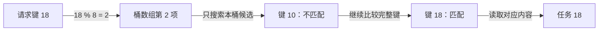

# 第1章\_哈希表核心原理\_空间与时间的终极博弈

在[链表课程](../../单链表_linked_list/大纲.md)里，我们已经能把任务接入、摘除并释放。如果调用者拿着任务指针，摘链只需修改几条边；如果调用者只知道“我要编号 18”，却得从头比较每个任务。表越长，寻找对象的时间越可能超过修改连接的时间。

这一章让同一批任务多一个按编号查找的入口。暂时只有一个执行者，先把“怎样找到正确对象”讲清楚；并发和回收会在后面加入。

## 1.1\_先计算候选位置再比较完整编号

最直接的办法是把编号当数组下标。编号为 18 的任务放在第 18 格，查找时立即定位。可若只有三个任务，编号却分别是 10、1000000、2000000000，为最大编号准备整个数组就很浪费。我们希望数组保持适当大小，同时仍能用编号缩小查找范围。

先准备八个格子，用 `编号 % 8` 选择格子。这里的格子叫 **桶（bucket）**，用于选择格子的计算叫 **哈希函数（hash function）**，编号是 **键（key）**，任务内容是对应的 **值（value）**。这一组“计算规则、桶数组和桶内记录”组成哈希表（hash table）。

编号 10、18、26 都落到桶 2。这不是计算失败，而是 **冲突**：不同键得到相同桶号。既然可能冲突，桶里就不能只留一个未经辨别的结果；我们给每个桶保存一组记录，找到桶后继续比较完整键。



哈希结果是 **索引**，不是对象的物理地址，更不是相等性的证明。编号 34 也进桶 2，但不应拿到任务 10。查找缺失的键，往往最容易暴露“只算桶、不比较键”的错误。

## 1.2\_运行一张故意发生冲突的表

下面用 C11 实现一张最多十六个桶的教学表，MAX_BUCKETS 常量给出这个上限。先只启用八个桶，节点嵌在调用者持有的 entry 对象中，next 把同桶记录串起来；本章不做动态分配。这样既能看到真实的指针修改，也能把“维护索引”和“分配释放对象”分开。hlist 对桶头和回指的进一步设计留给第二章。

table.buckets 保存各桶首节点，bucket_count 记录当前启用桶数。lookup 沿候选节点比较完整键；insert 拒绝重复键，再做头插；remove_key 返回被摘对象，其存储仍归调用者。遇到链首或中间节点时，slot 保存的是“指向当前节点的那个指针槽的地址”，所以修改 *slot 就能统一绕过当前节点。

保存为 `bucket_model.c`。完整材料也保存在[实验目录](../../../../../labs/kernel/hash_table/materials/README.md)。

```c
/* 教学模型：固定最多十六个桶，节点由调用者持有，不进行动态分配。 */
#include <assert.h>
#include <stdbool.h>
#include <stdio.h>
#include <string.h>

#define MAX_BUCKETS 16

struct entry {
    unsigned int key;
    const char *value;
    struct entry *next;
};

struct table {
    struct entry *buckets[MAX_BUCKETS];
    unsigned int bucket_count;
};

static struct entry *lookup(struct table *table, unsigned int key)
{
    struct entry *entry = table->buckets[key % table->bucket_count];
    while (entry) {
        if (entry->key == key)
            return entry;
        entry = entry->next;
    }
    return NULL;
}

static bool insert(struct table *table, struct entry *entry)
{
    unsigned int bucket = entry->key % table->bucket_count;
    if (lookup(table, entry->key))
        return false; /* 重复键不改变原记录，也不接入候选。 */
    entry->next = table->buckets[bucket];
    table->buckets[bucket] = entry;
    return true;
}

static struct entry *remove_key(struct table *table, unsigned int key)
{
    struct entry **slot = &table->buckets[key % table->bucket_count];
    while (*slot) {
        struct entry *entry = *slot;
        if (entry->key == key) {
            *slot = entry->next;
            entry->next = NULL;
            return entry; /* 只撤销成员资格，存储仍归调用者。 */
        }
        slot = &entry->next;
    }
    return NULL;
}

static bool rebuild(struct table *table, unsigned int bucket_count)
{
    struct entry *new_heads[MAX_BUCKETS] = { NULL };
    unsigned int index;
    if (bucket_count == 0 || bucket_count > MAX_BUCKETS)
        return false; /* 非法参数在修改任何连接之前拒绝。 */
    for (index = 0; index < table->bucket_count; ++index) {
        struct entry *entry = table->buckets[index];
        while (entry) {
            struct entry *next = entry->next;
            unsigned int bucket = entry->key % bucket_count;
            entry->next = new_heads[bucket];
            new_heads[bucket] = entry;
            entry = next;
        }
    }
    for (index = 0; index < MAX_BUCKETS; ++index)
        table->buckets[index] = new_heads[index];
    table->bucket_count = bucket_count;
    return true;
}

int main(void)
{
    struct table table = { .bucket_count = 8 };
    struct entry entries[] = {
        { 10, "任务10", NULL },
        { 18, "任务18", NULL },
        { 26, "任务26", NULL }
    };
    struct entry duplicate = { 18, "另一任务", NULL };
    struct entry *cursor;
    unsigned int index;

    for (index = 0; index < 3; ++index)
        assert(insert(&table, &entries[index]));
    printf("桶2:");
    for (cursor = table.buckets[2]; cursor; cursor = cursor->next)
        printf(" %u", cursor->key);
    putchar('\n');
    printf("查18: %s\n", lookup(&table, 18)->value);
    assert(lookup(&table, 34) == NULL);
    puts("查34: 未找到");
    assert(!insert(&table, &duplicate));
    puts("重复18: 已拒绝");
    assert(rebuild(&table, 16));
    for (index = 0; index < 3; ++index)
        assert(lookup(&table, entries[index].key) == &entries[index]);
    puts("扩容后: 三个对象仍可按键找到");
    assert(remove_key(&table, 18) == &entries[1]);
    assert(remove_key(&table, 18) == NULL);
    assert(strcmp(lookup(&table, 10)->value, "任务10") == 0);
    assert(lookup(&table, 26) == &entries[2]);
    puts("删18后: 未找到");
    assert(remove_key(&table, 10) == &entries[0]);
    assert(remove_key(&table, 26) == &entries[2]);
    for (index = 0; index < MAX_BUCKETS; ++index)
        assert(table.buckets[index] == NULL);
    return 0;
}
```

在终端执行以下命令。assert 是模型中的主动检查，本实验不定义 NDEBUG，以便实际执行每一步操作和断言。Windows 编译器生成的程序可直接运行其 .exe；Linux 使用下面的 ./ 路径。

```bash
cc -std=c11 -Wall -Wextra -Werror -pedantic bucket_model.c -o bucket_model
./bucket_model
```

先预测查询 34 和第二次插入 18 的结果，再对照：

```text
桶2: 26 18 10
查18: 任务18
查34: 未找到
重复18: 已拒绝
扩容后: 三个对象仍可按键找到
删18后: 未找到
```

头插使 26 排在最前面，这与键的大小没有必然关系。重复键检查负责实现 **键唯一** 的业务规则；另一种接口可以替换同键旧值，或者允许同键多值，但查找和删除拿哪一项也要一起定义。

remove_key 在改边后立即返回，且先把当前节点的 next 置空，不依靠被摘节点继续遍历。rebuild 则先保存 next，再修改当前节点的连接；否则循环会沿新链走，丢掉还没迁移的旧候选。新桶头是局部数组，最终复制的是它保存的节点指针值，没有把局部数组的地址交给外部。

桶数改变后，`key % 桶数` 的结果可能改变。因此 rebuild 不能只在原数组末尾补八个空桶，而要把全部记录重新计算位置。它在改边前检查参数，后续没有可失败的分配步骤；三个业务对象的地址始终不变。这个过程限定为单执行者，迁移期间原桶连接已经在变化，不能把它拿来证明并发扩容安全。

退出 main 前，我们把三个栈对象都摘下；它们从未由 malloc 分配，因此不调用 free。这与“从容器删除就必须释放对象”是不同的事情。

## 1.3\_为什么平均很快却不能承诺每次很快

用 n 表示记录数，m 表示桶数，**负载因子** α=n/m 表示平均每桶分到多少项。若键能合理分散，一次查找先做哈希，再比较一个较短的候选集合。简单链式表的平均工作量可以写成 O(1+α)，还要加上计算键哈希和比较键本身的代价。键很长时，读字符串的成本并不会因桶索引很快而消失。

“平均 O(1)”因此有条件：随着 n 增长，m 和分布也要让平均候选数量保持在适当范围。若仍只给八个桶，却持续加入上百万条记录，平均链长自然增长。若所有键都进入一个桶，即使其他桶空着，查询最后一项仍可能比较 n 次。

各操作也不能机械填同一张 O(1) 表：

| 操作与前提 | 主要工作 |
| --- | --- |
| 允许重复且已有待插入对象 | 定位桶后可直接头插，连接修改可为常数步 |
| 插入前要求键唯一 | 还要查找该键是否已存在 |
| 只有键的删除 | 先找对象，再摘除成员 |
| 已有合法对象指针的删除 | 可按节点表示直接摘除，但寿命和同步仍须成立 |
| 遍历整张稀疏表 | 通常既扫描桶，也访问元素，需考虑 O(m+n) |
| 调整桶数 | 分配新桶并重新计算位置，不能算作永远没有的维护成本 |

把实验的键改成 0、8、16、24，冲突会更集中。桶数从 8 变成 16 有时会拆开候选，却不保证任何输入都分散。不能用一次小样本分布好看，替代真实键集合的观察。

## 1.4\_桶里挂链与在数组里探测

上面的模型属于 **链式冲突处理（separate chaining）**：每个桶允许多条记录。它使桶容量与记录数量分开，删除某个成员后只需修补本桶的连接；代价是节点存储、指针追踪和分散访问。

另一类方案叫 **开放寻址（open addressing）**：记录直接放在槽数组中。目标槽被其他键占用时，继续按约定探测下一个候选槽。例如长度为 8 的线性探测表，10 占槽 2，18 发现槽 2 已占，便放到槽 3。查询 18 也必须沿相同探测路线比较。

现在删除 10。若直接把槽 2 变回“从未使用”的空槽，而查询把这种空槽当作停止条件，18 就会被漏掉。需要删除标记或适当的后移修补来保存探测路径；插入还要区分“可复用的删除槽”和“该停止查询的未用槽”。二次探测等方案改变探测序列，但序列能否覆盖所需槽位仍依赖容量和参数，不能只说它会自动消除聚集。

两类方案都必须检查真正的键相等，也都要处理装载压力。连续数组可能改善访问局部性，链式桶方便保持对象地址和节点关系；选择要看对象寿命、删除频率、内存预算与实际负载，不能把“Linux 使用哈希”推成“所有子系统都选同一种表示”。

## 1.5\_当你还需要顺序时

哈希索引回答“这个键对应谁”，通常不按键大小排列。任务先来先服务的顺序，可以由另一条队列关系保存；一份对象若同时加入队列和索引，应为两种成员关系使用独立节点。改变键时也不能只改对象字段：旧桶位置仍按旧键计算，应按同步协议撤下旧索引、修改键，再重新登记。

| 需求 | 优先比较的方案与代价 |
| --- | --- |
| 少量对象逐个处理，或经常拿着指针摘除 | 链表可能已足够简单，没必要先增加桶维护 |
| 编号范围小而密集，允许直接索引 | 数组避免冲突，但空间与编号范围相关 |
| 大量按键查找，能接受无排序结果 | 哈希索引减少候选，但要承担冲突和容量策略 |
| 经常查前驱、后继或键的范围 | 有序树更直接，需要维护平衡和比较关系 |

链表可以保持插入或人为安排的顺序，但不会自动按键排序；树也不是天然每个节点都固定占“三个指针加颜色”的同一种内存布局。先说明操作和表示，才能比较成本。

## 1.6\_回顾与练习

1. 查询 34 已算出桶 2，为什么还不能返回该桶第一项？
2. 把 insert 的重复键检查删掉，会让程序更正确还是改变契约？
3. 扩容时只把桶数组长度翻倍、记录保持原桶，会漏掉哪类查询？
4. 一个缓存只有六条记录，是否必须用哈希表代替线性查找？

解答：第一题必须比较完整键，桶号相等只表示候选范围相同。第二题改成允许重复，查找和删除拿哪一项也要重新定义。第三题是新旧桶号不同的键，本例中 10 从桶 2 变成桶 10。第四题没有必然性；简单扫描可能更合适，需要比较实际成本和维护复杂度。

现在我们能写出一张正确的单执行者模型，但还没有说明 Linux 怎样在桶头与业务对象之间布置连接。

下一篇：[hlist 的节点与前驱位置](../P02_Linux_内核_5.10_核心实现/P02_内核基石_hlist非对称链表.md)。

想先检验取模对齐问题，可以选读[哈希函数与位宽](../P02_Linux_内核_5.10_核心实现/P03_算法之魂_哈希函数与位运算优化.md)。返回[大纲](../大纲.md)。
