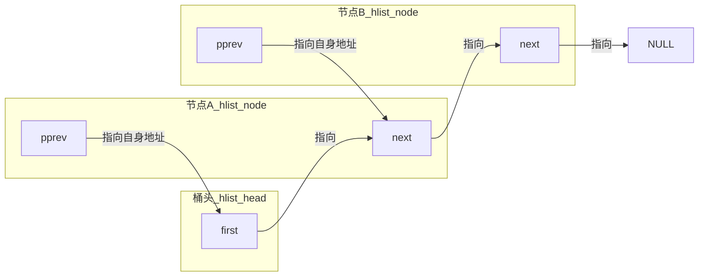
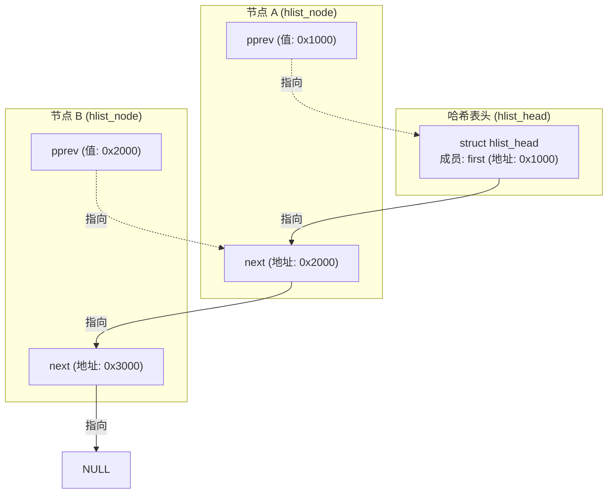
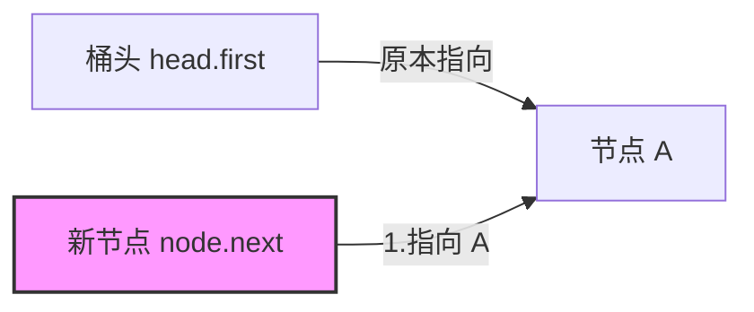
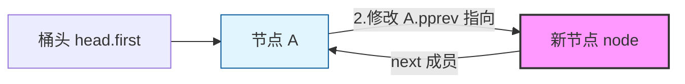
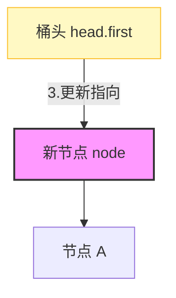
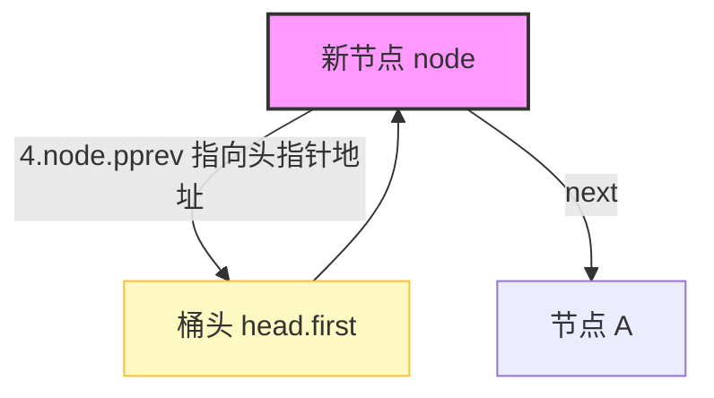
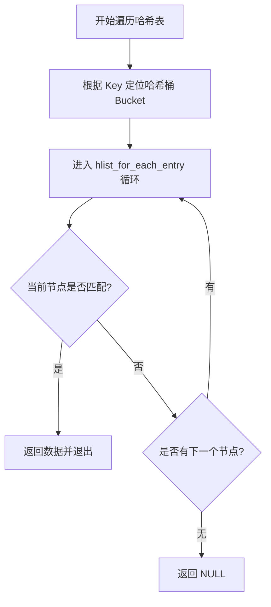

# 第2章\_内核基石\_hlist非对称链表

## 2.1\_内核基石\_hlist\_非对称链表

在 Linux 内核（5.10 及其前后版本）中，标准的双向链表 `list_head` 固然强大，但在构建大型哈希表时，它显得过于“奢侈”。为了节省宝贵的内存，内核引入了专门为哈希表设计的 **hlist**。

### 2.1.1\_结构定义\_非对称的艺术

`hlist` 的核心设计哲学是**非对称性**。

- **`struct hlist_head`（哈希桶头）**，定义位于 [include/linux/types.h](../../../../../research/source_reading/linux/include/linux/types.h)：
  - 仅包含一个指针 `first`，指向链表的第一个节点。
  - **设计动机**：哈希表通常包含数以百万计的桶。如果每个桶头都用 `list_head`（16 字节），会占用大量内存。`hlist_head` 仅需 8 字节（64 位系统），直接将表头开销减半。
- **`struct hlist_node`（数据节点）**，定义位于 [include/linux/types.h](../../../../../research/source_reading/linux/include/linux/types.h)：
  - `next`：指向下一个节点的指针。
  - `pprev`：一个二级指针，指向前一个节点的 `next` 指针所在的地址。

#### (1)\_内核源码结构定义

```c
struct hlist_head {
    struct hlist_node *first; // 指向首个节点
};

struct hlist_node {
    struct hlist_node *next;       // 后继指针
    struct hlist_node **pprev;     // 前驱二级指针，指向前一个元素的 next 成员地址
};
```

------

### 2.1.2\_pprev\_指针\_内核级的工程智慧

这是 `hlist` 最精妙的设计。在普通的双向链表中，`prev` 指向的是前一个结构体；而在 `hlist` 中，`pprev` 指向的是**“前一个元素的 `next` 属性所在的内存地址”**。

#### (1)\_为什么要这么做

在哈希表中，链表的第一个节点的前驱是 `hlist_head`，而中间节点的前驱是 `hlist_node`。

- 如果使用普通 `prev` 指针，删除节点时必须通过 `if` 判断：当前是不是头节点？建议参考代码 [2.3.3 节点删除：`hash_del()`](#(3)_节点删除_hash_del()) 辅助理解。

- **使用 `pprev` 的优势**：无论节点在什么位置，删除操作都可以统一为一行代码：

  - 对 `pprev` 二级指针解引用（类似于取一级指针的 `node->prev->next` ），又重新赋值该指向 `node->next` 的值：

    ```c
    *(node->pprev) = node->next;
    ```

  - 这意味着内核代码可以消灭条件分支，极大地优化了指令流水线性能。


#### (2)\_数据结构关联图(中文说明)






------

### 2.1.3\_核心操作\_API\_增\_删\_查

内核通过一套精密的宏来封装这些复杂的指针操作，确保开发者不会因手动操作 `pprev` 而崩溃。

#### (1)\_初始化与定义

在内核模块中，我们可以静态或动态地初始化哈希表。

- **静态定义**：`DEFINE_HASHTABLE(name, bits);`（定义一个 $2^{bits}$ 大小的哈希表）。
- **动态初始化**：`hash_init(table_name);`。

#### (2)\_节点插入\_hash\_add()

内核默认使用**“头插法”**，因为这不需要遍历链表，时间复杂度恒定为 $O(1)$。下面是简要说明，后面有详细定义说明：

```c
// 简化后的内核逻辑示意
void hash_add(struct hlist_head *head, struct hlist_node *node)
{
    node->next = head->first;      // 1. 新节点指向原头节点
    if (head->first)
        head->first->pprev = &node->next; // 2. 原头节点的前驱指向新节点的 next 成员
    head->first = node;            // 3. 桶头指向新节点
    node->pprev = &head->first;    // 4. 新节点的前驱指向桶头的 first 成员
}
```

在内核中，`hash_add` 将新节点插入哈希桶的头部（头插法），整个过程分为四个关键的指针操作步骤。

**第一步：建立后继连接**

**代码：** `node->next = head->first;`

**逻辑：** 新节点的 `next` 指针指向当前桶中的第一个元素，接管原有的链表。



------

**第二步：更新原首节点的前驱回指**

**代码：**

```c
if (head->first)
    head->first->pprev = &node->next;
```

**逻辑：** 如果原桶不为空，让原节点 A 的 `pprev` 二级指针指向新节点的 `next` 成员所在的内存地址。



------

**第三步：更新桶头指向**

**代码：** `head->first = node;`

**逻辑：** 修改哈希桶头部的 `first` 指针，使其正式指向新节点。



------

**第四步：建立新节点的前驱连接**

**代码：** `node->pprev = &head->first;`

**逻辑：** 新节点的 `pprev` 指向桶头 `first` 成员的地址，完成整个双向（非对称）链表的闭环。



------

**技术总结：为何如此设计？**

- **消除分支**：通过建立这种“指向指针地址”的 `pprev` 链条，后续的删除操作 `hash_del` 无论面对的是表头还是中间节点，都只需执行 `*(node->pprev) = node->next`，从而消除了 `if` 判断分支。
- **效率保证**：头插法确保了插入操作的时间复杂度始终为 $O(1)$。


详细定义说明：

定义位于 [include/linux/hashtable.h](../../../../../research/source_reading/linux/include/linux/hashtable.h)。

```c
/**
 * hash_add - add an object to a hashtable
 * @hashtable: hashtable to add to
 * @node: the &struct hlist_node of the object to be added
 * @key: the key of the object to be added
 */
#define hash_add(hashtable, node, key)						\
	hlist_add_head(node, &hashtable[hash_min(key, HASH_BITS(hashtable))])
```

定义位于 [include/linux/list.h](../../../../../research/source_reading/linux/include/linux/list.h)。

```c
/**
 * hlist_add_head - add a new entry at the beginning of the hlist
 * @n: new entry to be added
 * @h: hlist head to add it after
 *
 * Insert a new entry after the specified head.
 * This is good for implementing stacks.
 */
static inline void hlist_add_head(struct hlist_node *n, struct hlist_head *h)
{
	struct hlist_node *first = h->first;
	WRITE_ONCE(n->next, first);
	if (first)
		WRITE_ONCE(first->pprev, &n->next);
	WRITE_ONCE(h->first, n);
	WRITE_ONCE(n->pprev, &h->first);
}
```

#### (3)\_节点删除\_hash\_del()

得益于 `pprev`，删除操作变得异常简洁且安全。下面是精简说明，后面有详细定义说明：

```c
void hash_del(struct hlist_node *node)
{
    struct hlist_node *next = node->next;
    struct hlist_node **pprev = node->pprev;

    *pprev = next;                 // 修改前驱的 next，直接跳过当前节点
    if (next)
        next->pprev = pprev;       // 修改后继的前驱指向
}
```

详细定义说明：

定义位于 [include/linux/hashtable.h](../../../../../research/source_reading/linux/include/linux/hashtable.h)。

```c
/**
 * hash_del - remove an object from a hashtable
 * @node: &struct hlist_node of the object to remove
 */
static inline void hash_del(struct hlist_node *node)
{
	hlist_del_init(node);
}
```

定义位于 [include/linux/list.h](../../../../../research/source_reading/linux/include/linux/list.h)。

```c
/**
 * hlist_del_init - Delete the specified hlist_node from its list and initialize
 * @n: Node to delete.
 *
 * Note that this function leaves the node in unhashed state.
 */
static inline void hlist_del_init(struct hlist_node *n)
{
	if (!hlist_unhashed(n)) {
		__hlist_del(n);
		INIT_HLIST_NODE(n);
	}
}
```

其他定义，同文件下的定义：

```c
/**
 * hlist_unhashed - Has node been removed from list and reinitialized?
 * @h: Node to be checked
 *
 * Not that not all removal functions will leave a node in unhashed
 * state.  For example, hlist_nulls_del_init_rcu() does leave the
 * node in unhashed state, but hlist_nulls_del() does not.
 */
static inline int hlist_unhashed(const struct hlist_node *h)
{
	return !h->pprev;
}

static inline void __hlist_del(struct hlist_node *n)
{
	struct hlist_node *next = n->next;
	struct hlist_node **pprev = n->pprev;

	WRITE_ONCE(*pprev, next);
	if (next)
		WRITE_ONCE(next->pprev, pprev);
}

static inline void INIT_HLIST_NODE(struct hlist_node *h)
{
	h->next = NULL;
	h->pprev = NULL;
}
```

`hlist_unhashed` 函数用来检查一个哈希节点是否已经从链表中移除，并且其 `pprev`（指向前一个节点的指针）是否被重置为 `NULL`。如果节点已被移除并处于未哈希状态，返回 `true`（即 1）。这通常用于验证节点是否完全断开了与哈希链表的联系。

上述代码中16-17行两个操作，让我产生了疑惑：<span style="color:red;">为什么 `n->next` 和 `n->pprev` 的读取操作没有加入上READ_ONCE操作？</span>以下是我与AI的探讨：

1. kernel默认用户编程时，采用有锁编程，因此写者同一时间内只有一个，修改操作仅在该线程内，因此不需要给它加上 `*_ONCE` 操作中的 `volatile` 限定，也就是 `READ_ONCE`。既然有锁且线程本身是写者，原子序也不在考虑范畴。
2. 写者操作时，会加上 `WRITE_ONCE`，不仅仅是为了强调原子序，`volatile` 禁止编译器优化该变量（老老实实从内存读取值）；还有就是为了保证写操作的原子性，保障其他线程读者无锁读操作的安全性。

> 这份笔记专门为你准备，旨在深度解析 Linux 内核在 `__hlist_del` 实现中，关于内存屏障与并发语义的底层考量。
>
> ------
>
> # 核心笔记：为什么 `__hlist_del` 的成员读取不使用 `READ_ONCE`？
>
> 在 Linux 5.10 内核源码中，`__hlist_del` 函数通过 `WRITE_ONCE` 修改内存，但对局部变量 `next` 和 `pprev` 的初始化却使用了普通读取。
>
> ### 1. 核心结论：写者的独占性与读者的可见性
>
> 这种“非对称”的 `_ONCE` 使用，源于内核对**写者（Writer）**与**读者（Reader）**职责的不同定义。
>
> - **对写者而言（私有稳定性）**：局部变量赋值发生在**加锁保护**的临界区。
> - **对读者而言（并发安全性）**：内存修改必须对**无锁读者（RCU）**具有原子可见性。
>
> ------
>
> ### 2. 深度成因分析
>
> #### 2.1 写者侧的序列化保证（Writer-Side Serialization）
>
> 在调用 `__hlist_del` 时，内核协议规定调用者必须持有互斥锁（如 `spinlock`）。
>
> - **无竞争读取**：既然已经持有锁，就保证了**同一时刻没有任何其他 CPU 会修改当前节点 `n` 的成员**。
> - **无需 volatile**：因为数据不会异步变动，编译器将 `n->next` 读入寄存器并缓存是安全的优化。使用 `READ_ONCE` 强制刷新缓存反而会产生多余的性能开销。
>
> #### 2.2 读者侧的原子发布要求（Reader-Side Visibility）
>
> 虽然写者只有一个，但可能存在成百上千个**无锁读者**正在通过 RCU 遍历哈希表。
>
> - **防止存储撕裂（Store Tearing）**：如果不使用 `WRITE_ONCE`，编译器可能将 64 位指针的写入拆分为两个 32 位的指令。并发读者可能因此读到损坏的中间地址，导致系统 Panic。
> - **发布语义**：`WRITE_ONCE` 确保了指针更新的原子性，让读者看到的要么是“旧值”，要么是“完整的新值”。
>
> ------
>
> ### 3. 并发交互逻辑图
>
> ```mermaid
> flowchart TD
>     subgraph CPU_A_写者_加锁状态
>     A1[读取 n.next 到寄存器] --> A2[读取 n.pprev 到寄存器]
>     A2 -->|无需 READ_ONCE| A3[逻辑稳定: 无竞争修改]
>     A3 --> A4["执行 WRITE_ONCE(*pprev, next)"]
>     end
>
>     subgraph CPU_B_无锁读者_RCU
>     B1[rcu_read_lock] --> B2[hlist_for_each_entry_rcu]
>     B2 -->|内部包含 READ_ONCE| B3{读取指针}
>     B3 -->|看到原子更新| B4[安全继续遍历]
>     B3 -->|若无 WRITE_ONCE| B5[由于撕裂导致内核崩溃]
>     end
>
>     A4 -.->|确保修改对读者原子可见| B3
>
>     style A4 fill:#fff9c4,stroke:#fbc02d
>     style B4 fill:#e8f5e9,stroke:#2e7d32
> ```
>
> ------
>
> ### 4. 技术精要：为什么写者不需要防备读者？
>
> 这里存在一个关键的**内存依赖顺序**：
>
> 1. **数据读取**：CPU 必须先从内存中读取 `n->next` 的值。
> 2. **数据写入**：CPU 随后通过 `WRITE_ONCE` 将该值写入 `*pprev`。
>
> - **硬件保证**：由于存在数据依赖，硬件天然保证了读取 `n->next` 的动作一定先于写入 `*pprev` 指针的动作。因此，在写者内部，顺序是自然受控的。
>
> ### 5. 总结
>
> | **操作**         | **动作对象**             | **是否使用 _ONCE** | **原因**                                             |
> | ---------------- | ------------------------ | ------------------ | ---------------------------------------------------- |
> | **读取局部变量** | `n->next` / `n->pprev`   | **否**             | **写者互斥**。锁保证了数据在此期间不会被他人篡改。   |
> | **写入共享内存** | `*pprev` / `next->pprev` | **是**             | **读者并发**。确保指针更新对无锁读者是原子且可见的。 |
>
> > **笔记要点**：内核不滥用 `READ_ONCE` 是为了保留编译器的优化空间。只有在值可能被“外部异步修改”（即无锁并发读取/写入）的情况下，才必须使用 `_ONCE` 系列宏。

------

### 2.1.4\_遍历宏\_如何高效访问数据

内核提供了多种遍历宏，最常用的是 `hlist_for_each_entry`。

| **宏名称**                  | **适用场景**                                            |
| --------------------------- | ------------------------------------------------------- |
| `hlist_for_each_entry`      | 标准遍历，性能最高。                                    |
| `hlist_for_each_entry_safe` | **安全遍历**：允许在遍历过程中删除当前节点。            |
| `hlist_for_each_entry_rcu`  | **RCU 遍历**：用于无锁的高并发读取场景（第 4 章重点）。 |

在 Linux 5.10 内核中，遍历哈希表不仅是查找数据的过程，更是一场关于并发安全与执行效率的权衡。内核通过一组精心设计的宏来隐藏 `hlist` 复杂的指针逻辑。

为了让示例更具实战意义，我们先定义一个通用的数据结构：

```c
struct my_node {
    int key;
    char value[32];
    struct hlist_node node; // 嵌入哈希节点
};
```

#### (1)\_标准遍历\_hlist\_for\_each\_entry

这是最常用的宏，适用于简单的读取场景。它直接从桶头（`hlist_head`）开始，顺着 `next` 指针一路向后。

**接口示例：**

```c
struct my_node *obj;
struct hlist_head *head = &my_hashtable[hash_key(target_key)]; // 将在第三章解释 hash表 为何是这样的操作

// pos: 当前获取到的结构体指针
// head: 目标哈希桶的头指针
// member: 结构体中 hlist_node 的成员名
hlist_for_each_entry(obj, head, node) {
    if (obj->key == target_key) {
        pr_info("找到数据: %s\n", obj->value);
        return obj;
    }
}
```

`hlist_for_each_entry()` 定义位于 [include/linux/list.h](../../../../../research/source_reading/linux/include/linux/list.h)：

```c
/**
 * hlist_for_each_entry	- iterate over list of given type
 * @pos:	the type * to use as a loop cursor.
 * @head:	the head for your list.
 * @member:	the name of the hlist_node within the struct.
 */
#define hlist_for_each_entry(pos, head, member)				\
	for (pos = hlist_entry_safe((head)->first, typeof(*(pos)), member);\
	     pos;							\
	     pos = hlist_entry_safe((pos)->member.next, typeof(*(pos)), member))
```

##### 1)\_hlist\_entry\_safe()定义

获取 `pos` 的 `hlist_entry_safe()` 定义位于 [include/linux/list.h](../../../../../research/source_reading/linux/include/linux/list.h)：

```c
#define hlist_entry(ptr, type, member) container_of(ptr,type,member)

#define hlist_entry_safe(ptr, type, member) \
	({ typeof(ptr) ____ptr = (ptr); \
	   ____ptr ? hlist_entry(____ptr, type, member) : NULL; \
	})
```

<span style="color:red;">这里的块语句为啥有返回值的功能？</span>

> 1. **块语句在宏中的使用**
>
> 在 C 语言中，块语句（`{}`）通常用于组织多条语句，但它也有一个特别的性质：**块语句可以作为一个表达式**。这意味着块语句的最后一条语句的值将作为块语句的值。
>
> 这里，`({ ... })` 是一种称为 **GCC 扩展**的语法，称为**内联代码块表达式**（**statement expression**）。在这种语法下，整个块语句被当作一个表达式来处理，块语句内部的最后一个值（在这个例子中就是 `hlist_entry(____ptr, type, member) : NULL`）成为表达式的返回值。
>
> 2. **为什么使用块语句返回值**
>
> 通过使用块语句作为表达式，我们可以在宏中进行复杂的操作（例如条件判断和变量赋值），并将操作的结果返回。这也是为什么你可以看到 `hlist_entry_safe` 在宏中返回一个值，并且将该值传递给 `pos`。
>
> 让我们逐步拆解：
>
> - **`typeof(ptr) ____ptr = (ptr);`**: 这行定义了一个局部变量 `____ptr`，它的类型和 `ptr` 一致。
> - **`____ptr ? hlist_entry(____ptr, type, member) : NULL;`**: 这是一个条件表达式。如果 `____ptr` 非空，则执行 `hlist_entry` 宏，否则返回 `NULL`。
>
> **`({ ... })` 语法的作用**：
>
> - 它将整个块语句当作一个表达式，最后一个操作的结果（`hlist_entry` 或 `NULL`）是块语句的返回值。
> - 这种语法的关键优势是可以在宏中执行多个操作（如条件判断、局部变量赋值等），并返回计算的结果。
>
> 3. **将返回值传递给 `pos`**
>
> 在 `hlist_for_each_entry` 宏中，`pos` 是通过：
>
> ```
> for (pos = hlist_entry_safe((head)->first, typeof(*(pos)), member); ...
> ```
>
> 来初始化的。这里，`hlist_entry_safe` 的返回值被赋给 `pos`，而这个返回值就是 `hlist_entry_safe` 宏内部块语句的结果。
>
> 具体步骤：
>
> 1. **`hlist_entry_safe` 的返回值**：在宏中，`hlist_entry_safe` 的块语句返回的就是 `hlist_entry(____ptr, type, member)` 或 `NULL`，即链表节点对应的结构体指针或空指针。
> 2. **赋值给 `pos`**：返回的结构体指针（或者 `NULL`）被赋给 `pos`，然后 `pos` 就指向了链表中的当前元素（或者 `NULL`）。
>
> 4. **为什么使用块语句而不是直接表达式**
>
> 使用块语句有以下优点：
>
> - **多条语句**：块语句允许在其中进行多条语句的处理。例如，`____ptr ? ... : ...` 语句是一个三元操作符表达式，它本身就包含了条件判断逻辑，使用块语句可以更清晰地表达这个逻辑。
> - **局部变量**：块语句内部可以定义局部变量，比如这里的 `____ptr`，它在宏展开时局部于宏内部，不会污染外部代码的命名空间。
>
> 5. **总结**
>
> 块语句可以作为表达式的主要原因在于 **GCC 扩展的内联代码块表达式（statement expression）** 语法。使用这种语法可以在一个宏中执行多条语句，并将其结果作为值返回。在 `hlist_entry_safe` 宏中，使用块语句能够：
>
> - 定义局部变量（如 `____ptr`），
> - 执行条件判断，
> - 返回计算结果。
>
> 这样，`hlist_entry_safe` 就能够返回链表节点对应的结构体指针（或者 `NULL`），并将该值赋给 `pos`。这种做法让宏更强大且灵活，能够处理复杂的操作并返回值。

------

#### (2)\_安全遍历\_hlist\_for\_each\_entry\_safe

**核心痛点**：如果你在遍历过程中调用了 `hash_del(obj)`，当前节点的 `next` 指针可能会被修改。此时再执行下一次循环的 `pos = pos->next` 就会导致内核崩溃（Kernel Panic）。

如果你要在内核模块里删除节点，**必须使用这种 4 参数（单桶遍历）或 5 参数（全表遍历）的形式**。

**接口示例（删除特定条件的所有节点），示意伪代码：**

```c
struct my_node *obj;
struct hlist_node *tmp; // 必须有这个临时游标
struct hlist_head *my_head = &my_table[hash];

// 注意：这里是 4 个参数
hlist_for_each_entry_safe(obj, tmp, my_head, node) {
    if (obj->value == target) {
        hlist_del(&obj->node); // 内核标准删除 API
        kfree(obj);            // 安全释放
    }
}
```

`hlist_for_each_entry_safe()` 定义位于 [include/linux/list.h](../../../../../research/source_reading/linux/include/linux/list.h)：

```c
/**
 * hlist_for_each_entry_safe - iterate over list of given type safe against removal of list entry
 * @pos:	the type * to use as a loop cursor.
 * @n:		a &struct hlist_node to use as temporary storage
 * @head:	the head for your list.
 * @member:	the name of the hlist_node within the struct.
 */
#define hlist_for_each_entry_safe(pos, n, head, member) 		\
	for (pos = hlist_entry_safe((head)->first, typeof(*pos), member);\
	     pos && ({ n = pos->member.next; 1; });			\
	     pos = hlist_entry_safe(n, typeof(*pos), member))
```

当条件语句中 `pos` 不为空时，执行 `n = pos->member.next; return 1` 。

`hlist_entry_safe()`说明：[`hlist_entry_safe()`定义](#1)_hlist_entry_safe()定义)。

------

#### (3)\_无锁遍历\_hlist\_for\_each\_entry\_rcu

在 5.10 内核中，为了追求极致的性能，读取操作通常不加锁。此宏配合 `rcu_read_lock()` 使用，确保在不影响并发写入的情况下，读取者能看到一致的链表视图。

**接口示例（高并发查找），伪代码：**

```c
struct my_node *obj;
unsigned int key = 1024;

rcu_read_lock(); // 进入 RCU 临界区

// 仅遍历与该 Key 可能匹配的特定桶
hlist_for_each_entry_rcu(obj, &my_hashtable[hash_min(key, HASH_BITS)], node) {
    if (obj->key == key) {
        pr_info("RCU 查找到数据: %s\n", obj->value);
        break;
    }
}

rcu_read_unlock(); // 退出 RCU 临界区
```

本节只说明 `hlist_for_each_entry_rcu()` 怎样用于哈希桶遍历。RCU 的问题背景、硬件基础、通知机制和通用 API 不在本章重复维护，统一参考如下入口：

1. [RCU 专题大纲](../../../synchronization/rcu/大纲.md)。
2. [为什么需要 RCU](../../../synchronization/rcu/P01_为什么需要_RCU.md)。
3. [RCU 核心概念与工作机制](../../../synchronization/rcu/P02_RCU_核心概念与工作机制.md)。


<span style="color:red;">给出一个较为具体的示例，不然我看着代码很陌生。尤其是关于加锁的细节研究。</span>

> 理解 `hlist_for_each_entry_rcu` 的难点在于它打破了我们对“并发必须加锁”的直觉。在 RCU（Read-Copy-Update）的世界里，**读取者几乎是“裸奔”的**，而所有的压力都在写入者身上。
>
> 为了让你不再感到陌生，我们直接看一个内核中非常典型的场景：**一个维护在线用户会话（Session）的哈希表**。
>
> ------
>
> ## 无锁遍历实战 —— `hlist_for_each_entry_rcu`
>
> ### 1 核心案例：在线用户查询系统
>
> 假设我们要维护一个通过 `user_id` 快速查找用户信息的哈希表。这个表每秒会被查询数万次（读者），但用户登录退出（写者）的频率相对较低。
>
> #### 1.1 数据结构准备
>
> 我们使用内核标准的 `hlist` 结构。
>
> ```c
> struct user_session {
>  int user_id;
>  char username[64];
>  struct hlist_node node; // 嵌入哈希节点
>  struct rcu_head rcu;    // 用于异步回收内存
> };
>
> /* 定义一个 2^10 = 1024 桶的哈希表 */
> DECLARE_HASHTABLE(user_htable, 10);
> /* 写者必须持有的锁，用于保护拓扑结构修改 */
> DEFINE_SPINLOCK(user_htable_lock);
> ```
>
> ------
>
> ### 2 读者端：极致的无锁查询
>
> 这是你最关心的部分。注意：**这里没有任何 `spin_lock`**。
>
> ```c
> /* 调用者必须已经进入 RCU 读侧临界区；返回值只能在该保护区内使用 */
> struct user_session *find_user_rcu(int id)
> {
>  struct user_session *sess;
>  unsigned int key = hash_min(id, 10);
>
>  lockdep_assert_rcu_read_lock_held();
>
>  /* 在调用者持有的 RCU 读侧临界区内遍历特定桶 */
>  // obj: 返回的结构体指针
>  // &user_htable[key]: 目标桶头指针
>  // node: 结构体中的成员名
>  hlist_for_each_entry_rcu(sess, &user_htable[key], node) {
>      if (sess->user_id == id)
>          return sess;
>  }
>
>  return NULL;
> }
> ```
>
> 调用者应在 `rcu_read_lock()` 与 `rcu_read_unlock()` 之间调用并使用返回值；如果指针需要逃出临界区，必须在区间内安全取得独立的 kref/refcount。原先“函数内部解锁后返回裸指针”的写法会失去 RCU 生命周期保护。
>
> <span style="color:red">rcu_read_lock()不需要带入参数吗？rcu是统一的临界区或者说统一的读写锁吗？</span>
>
> > 下述 Tree RCU 运行机制按仓库内 NXP Linux 6.12.20 的 `include/linux/rcupdate.h`、`kernel/rcu/tree_plugin.h`、`kernel/rcu/tree.c` 和 `kernel/rcu/tree.h` 校正。当前章节虽然位于 5.10 哈希表目录，但不再用未经源码验证的旧比喻代替实现细节。
> >
> > `rcu_read_lock()` 的设计与传统锁（如 `spin_lock` 或 `mutex`）不同，首先要分清它是否排斥其他执行者，以及它实际登记了什么状态。
> >
> > 以下是针对你这两个疑问的深度解析：
> >
> > ### 1. 为什么 `rcu_read_lock()` 不需要带入参数？
> >
> > 在传统的锁定机制中，你必须指定要锁定的对象（例如 `spin_lock(&my_lock)`）。普通 Tree RCU 的读取端不接收对象参数，因为它不需要知道你在读“哪一个”数据结构。
> >
> > - **生命周期标记而非互斥锁定**：`rcu_read_lock()` 声明当前执行流进入普通 RCU 读侧保护区间，不会排斥写者发布新版本。
> > - **配置相关的真实实现**：非抢占 Tree RCU 通常通过禁止抢占并在 CPU 后续的 QS/EQS 路径证明旧读者结束；`PREEMPT_RCU` 更新 `current->rcu_read_lock_nesting`，读侧中被抢占的任务还会登记到 `rcu_node->blkd_tasks`。
> > - **有状态，但不是逐对象状态**：RCU 明确追踪或推断哪些 CPU／任务仍可能属于当前 GP 的旧读者集合；它不记录这些读者是否真的读取了本哈希表或某个节点地址。
> >
> > ### 2. RCU 是统一的临界区还是统一的读写锁？
> >
> > 这是一个非常好的逻辑切入点。RCU 既不是传统的“局部锁”，也不是简单的“读写锁”。
> >
> > #### 普通 Tree RCU 共享系统级 GP 基础设施
> >
> > 普通 Tree RCU 的调用者共享系统级 GP 检测与回调基础设施，但这不是一把全局读写锁，也不意味着所有时刻都只有一个笼统的“有人读”总灯。
> >
> > - **不区分对象**：无论你是在读取 PID 哈希表、路由表，还是你自定义的会话表，你调用的都是同一个 `rcu_read_lock()`。
> > - **共享宽限期基础设施（Grace Period）**：内核并不关心你在读哪一张表。一个 GP 要证明的是其开始前可能存在的旧读者都已跨过安全边界；GP 后进入的新读者可以继续存在，无需等待全系统读者在某一瞬间同时归零。
> >
> > #### 它与“读写锁（RW-Lock）”的本质区别
> >
> > 虽然 RCU 经常用于“读多写少”的场景，但它与读写锁有三个本质不同：
> >
> > | **特性**     | **读写锁 (Read-Write Lock)**                 | **RCU 机制**                                   |
> > | ------------ | -------------------------------------------- | ---------------------------------------------- |
> > | **锁定对象** | 必须针对特定的 `rwlock_t` 对象               | 无需对象，全局声明                             |
> > | **阻塞行为** | 读者会阻塞写者，写者也会阻塞读者             | **互不阻塞**。读者在读时，写者可以同时删       |
> > | **开销**     | 读者通常修改共享锁状态，可能形成缓存行热点 | 快速路径不修改单一全局读计数；具体指令和状态更新取决于 RCU 配置 |
> >
> > ### 3. 如何理解这种“统一性”？
> >
> > 你可以把 `rcu_read_lock()` 想象成机场里的“静止指令”：
> >
> > - **写者（回收者）**就像是清洁工，想要清理跑道上的杂物。
> > - **读者**就像是正在起飞的飞机。
> > - 当清洁工想清理时，他不会询问哪架飞机碰过某一块杂物，而是发起一轮面向既存航班的安全确认。
> > - 控制塔通过各跑道的状态报告和被延误航班清单，确认这轮开始前可能相关的航班都已跨过安全边界；后来起飞的航班不阻塞这一轮完成。
> >
> > **总结建议：**
> >
> > 你在笔记中可以这样记录：`rcu_read_lock()` **不针对特定对象，它是执行流生命周期的标记**。Tree RCU 不做地址级追踪，但会通过任务状态、每 CPU 状态、QS/EQS 和 `rcu_node` 树明确推进旧读者判定。`hlist_for_each_entry_rcu()` 不争抢传统读锁，但不能说整个读侧“完全没有状态或通知”。
> >
> > 既然已经理解读者如何在不争抢传统读锁的情况下遍历哈希表，压力就来到写者一侧。删除节点后不能立即释放；写者必须等待一个覆盖删除前潜在旧读者的 GP。RCU 不知道其中哪些读者实际取到了该节点，因此会保守覆盖大量与该节点无关的既存读侧临界区。
> >
> > 这就是 **RCU 宽限期（Grace Period）** 的管理逻辑。内核提供了两种主要的“清道夫”工具：`synchronize_rcu`（同步等待）和 `call_rcu`（异步回调）。
> >
> > ------
> >
> > ## 4.6 写者的清算：`synchronize_rcu` 与 `call_rcu`
> >
> > 在执行 `hlist_del_rcu(node)` 后，节点只是从逻辑上脱离了哈希表，但它占用的内存地址依然可能被某个读者的寄存器持有。
> >
> > ### 1. 同步等待：`synchronize_rcu()`
> >
> > 这是最直观的方法，类似于“原地踏步”。
> >
> > - **工作逻辑**：写者调用此函数后会阻塞等待一个覆盖调用前旧读者的 GP。非抢占路径主要等待相关 CPU 报告 QS/EQS；PREEMPT_RCU 还必须等待阻塞本 GP 的被抢占任务退出。并非机械要求每个 CPU 都发生一次上下文切换。
> > - **适用场景**：对性能要求不是极致，或者是在可以睡眠的内核路径中。
> >
> > **代码示例：**
> >
> > C
> >
> > ```c
> > void delete_user_sync(struct user_session *sess) {
> >     spin_lock(&user_htable_lock);
> >     hlist_del_rcu(&sess->node); // 1. 逻辑删除，读者仍可能在读旧内存
> >     spin_unlock(&user_htable_lock);
> >
> >     synchronize_rcu();          // 2. 阻塞，等待删除前潜在旧读者跨过安全边界
> >
> >     kfree(sess);                // 3. 安全释放内存
> > }
> > ```
> >
> > ------
> >
> > ### 2. 异步回调：`call_rcu()`
> >
> > 如果写者不能休眠（例如在中断上下文或高性能转发路径中），就必须使用异步方式。
> >
> > - **工作逻辑**：写者把回调关联到 RCU 回调系统。覆盖删除前潜在旧读者的 GP 完成后，回调才具备执行资格；RCU 不检查这个节点实际上有没有被任何人读过。
> > - **数据要求**：结构体中必须包含 `struct rcu_head` 成员。
> >
> > **代码示例：**
> >
> > ```c
> > // 回调函数，由内核在宽限期结束后自动调用
> > static void user_session_reclaim(struct rcu_head *rh) {
> >     // 通过 rcu_head 找回结构体首地址
> >     struct user_session *sess = container_of(rh, struct user_session, rcu);
> >     kfree(sess); //
> > }
> >
> > void delete_user_async(struct user_session *sess) {
> >     spin_lock(&user_htable_lock);
> >     hlist_del_rcu(&sess->node); //
> >     spin_unlock(&user_htable_lock);
> >
> >     // 立即返回，不阻塞！内核会在安全时刻调用回调函数
> >     call_rcu(&sess->rcu, user_session_reclaim);
> > }
> > ```
> >
> > ------
> >
> > ### 3. RCU 宽限期工作流图
> >
> > ```mermaid
> > flowchart TD
> >     W_Del[1.写者: 执行 hlist_del_rcu] --> W_Pub[2.逻辑移除: 新读者已看不见该节点]
> >     W_Pub --> GP{宽限期检测}
> >
> >     subgraph Readers [存量读者]
> >     R1[读者 A: 正在访问节点]
> >     R2[读者 B: 正在访问节点]
> >     end
> >
> >     GP -->|保守覆盖其所属旧读者状态| R1
> >     GP -->|保守覆盖其所属旧读者状态| R2
> >
> >     R1 -->|退出临界区并推进相关状态| Done1[旧读者状态解除]
> >     R2 -->|退出临界区并推进相关状态| Done2[旧读者状态解除]
> >
> >     Done1 --> Finish[3.宽限期结束]
> >     Done2 --> Finish
> >
> >     Finish --> Free[4.执行 kfree 释放内存]
> > ```
> >
> > ------
> >
> > ### 4. 深度对比：Sync vs Async
> >
> > | **特性**     | **synchronize_rcu()**           | **call_rcu()**                      |
> > | ------------ | ------------------------------- | ----------------------------------- |
> > | **阻塞性质** | **阻塞**（会引起进程调度/休眠） | **非阻塞**（立即返回）              |
> > | **内存开销** | 低（无需额外存储）              | 较高（需在结构体中嵌入 `rcu_head`） |
> > | **编程难度** | 简单（线性逻辑）                | 较复杂（需编写回调函数）            |
> > | **典型用途** | 模块卸载、系统配置更新          | 网络包处理、高频节点删除            |
> >
> > ------
> >
> > ### 章节小结
> >
> > - **`synchronize_rcu`** 适合那些“慢速”的控制面操作。
> > - **`call_rcu`** 则是为了高性能数据面准备的，它让写者也能像读者一样，在处理完逻辑后迅速抽身，把繁琐的清理工作交给内核底层的异步机制。
> >
> > ------
> >
> > **到这里，我们已经彻底打通了 5.10 内核中哈希表的“增、删、查、并发保护”的所有理论。**
> >
> > **接下来的路径有两条：**
> >
> > 1. **实战派**：我们可以把这段 Session 管理的代码写成一个完整的 **内核模块项目**，让你在虚拟机里观察 `dmesg` 输出。
> > 2. **进阶派**：深入 **第 5 章：rhashtable**，看看内核如何处理那些需要根据负载自动“变大变小”的动态哈希表。
> >
> > **你想先走哪一条路？**
>
> ------
>
> ### 3 写者端：如何配合读者
>
> 为了让上面的无锁遍历不崩溃，写者必须按照 RCU 的规矩办事。
>
> ```c
> void add_user_session(struct user_session *new_sess)
> {
>     unsigned int key = hash_min(new_sess->user_id, 10);
>
>     /* 1. 写者之间必须互斥 */
>     spin_lock(&user_htable_lock);
>
>     /* 2. 使用 RCU 版本的添加函数 */
>     // 它内部包含 WRITE_ONCE 和内存屏障，确保读者看到的是初始化好的节点
>     hlist_add_head_rcu(&new_sess->node, &user_htable[key]);
>
>     spin_unlock(&user_htable_lock);
> }
> ```
>
> ------
>
> ### 4 锁定细节深度研究：为什么它是安全的？
>
> 你可能会问：**如果写者正在删节点，读者遍历到一半怎么办？**
>
> #### 4.1 `rcu_read_lock()` 到底锁了什么？
>
> - **真相**：在绝大多数配置下，它**什么都没锁**。它只是禁止了当前 CPU 的抢占（Preemption）。
> - **代价**：由于没有总线锁，读取操作的开销几乎等同于普通的数组访问，这是哈希表在多核下性能最高的遍历方式。
>
> #### 4.2 内存屏障与逻辑顺序
>
> `hlist_for_each_entry_rcu` 内部使用了 `rcu_dereference()`，其本质是：
>
> 1. **`READ_ONCE`**：从内存拿到最新的指针地址。
> 2. **内存屏障**：确保在该指针之后的所有成员访问（如 `sess->user_id`），都不会被 CPU 乱序执行到读取指针之前。
>
> #### 4.3 读写冲突的解决
>
> ```mermaid
> flowchart TD
>     subgraph 读者视角
>     R1[开始遍历] --> R2[读取节点 A 指针]
>     R2 --> R3[读取 A.next 发现指向 B]
>     R3 --> R4[即使此时写者删除了 B]
>     R4 --> R5[由于 B 的内存未释放, 读者仍能安全完成当前节点访问]
>     end
>
>     subgraph 写者视角
>     W1[锁定 Spinlock] --> W2[从链表移除 B: hlist_del_rcu]
>     W2 --> W3[释放 Spinlock]
>     W3 --> W4[进入宽限期: 等待所有读取者]
>     W4 --> W5[真正释放内存: kfree]
>     end
>
>     W2 -.->|读者仍能通过旧指针看到 B| R4
> ```
>
> ------
>
> ### 5 锁定状态对比总结
>
> | **角色** | **使用的“锁”**    | **对性能的影响**     | **核心保障**                                    |
> | -------- | ----------------- | -------------------- | ----------------------------------------------- |
> | **读者** | `rcu_read_lock()` | **极低**（近乎原生） | 保证在遍历期间，指向的内存不会被 `kfree`        |
> | **写者** | `spin_lock()`     | **较高**（存在竞争） | 保证同一时间只有一个 CPU 在修改哈希表的拓扑结构 |
>
> > **技术笔记**：在 RCU 哈希表中，写入者是“孤独的痛苦者”，它需要负责加锁、拷贝副本（可选）、原子发布以及等待宽限期；而读取者则是“快乐的白嫖者”，只需确保在读取期间不被系统抢占即可。
>
>
>
> <span style="color:red;">写者示例：</span>
>
> 在 RCU 机制中，写者的逻辑复杂度远高于读者。写者不仅要负责修改数据，还要承担**并发互斥**、**原子发布**以及**内存生命周期管理**这三重职责。
>
> 以下是针对 Linux 5.10 标准的写者（Writer）详细实战示例，涵盖了添加和删除两种核心场景。
>
> ------
>
> # 写者（Writer）深度实战示例
>
> 写者的核心准则：**修改拓扑必须加锁，发布更新必须原子，回收内存必须等待**。
>
> ## 1 写者：添加节点（Add）
>
> 添加节点相对简单，重点在于确保“先初始化，后发布”的顺序，防止读者看到残缺的节点。
>
> ```c
> /**
>  * add_user_to_hashtable - 向哈希表添加用户（写者示例）
>  */
> int add_user_to_hashtable(int id, const char *name)
> {
>     struct user_session *new_sess;
>     unsigned int key = hash_min(id, 10);
>
>     /* 1. 准备工作：在锁外分配内存，减少锁持有时间 */
>     new_sess = kzalloc(sizeof(*new_sess), GFP_KERNEL);
>     if (!new_sess)
>         return -ENOMEM;
>
>     new_sess->user_id = id;
>     strlcpy(new_sess->username, name, sizeof(new_sess->username));
>
>     /* 2. 写者互斥：修改哈希表拓扑结构必须加锁保护 */
>     spin_lock(&user_htable_lock);
>
>     /* 3. 原子发布：使用 RCU 版本的添加宏
>      * 它包含 WRITE_ONCE 和内存屏障，确保读者看到的是完整初始化的节点 */
>     hlist_add_head_rcu(&new_sess->node, &user_htable[key]);
>
>     spin_unlock(&user_htable_lock);
>
>     return 0;
> }
> ```
>
> ------
>
> ## 2 写者：删除节点（Delete）
>
> 删除操作是写者逻辑的精髓，它实现了**逻辑删除（脱离链表）**与**物理释放（释放内存）**的时空分离。
>
> ### 方案 A：同步删除（使用 `synchronize_rcu`）
>
> 适用于可以休眠的进程上下文。
>
> ```c
> void delete_user_sync(int id)
> {
>     struct user_session *sess;
>     struct hlist_node *tmp;
>     unsigned int key = hash_min(id, 10);
>
>     /* 1. 写者互斥锁 */
>     spin_lock(&user_htable_lock);
>
>     /* 2. 查找并逻辑删除 */
>     hlist_for_each_entry_safe(sess, tmp, &user_htable[key], node) {
>         if (sess->user_id == id) {
>             /* 逻辑删除：将节点从链表中摘除
>              * 此时读者可能仍持有该节点的旧指针并在访问 */
>             hlist_del_rcu(&sess->node);
>
>             spin_unlock(&user_htable_lock);
>
>             /* 3. 等待宽限期：覆盖调用前可能存在的旧读者 */
>             synchronize_rcu();
>
>             /* 4. 物理释放：现在没有任何读者能访问 sess 了 */
>             kfree(sess);
>             return;
>         }
>     }
>     spin_unlock(&user_htable_lock);
> }
> ```
>
> ### 方案 B：异步删除（使用 `call_rcu`）
>
> 适用于不能休眠的上下文（如中断或原子路径）。
>
> ```c
> /* 回调函数：由内核在宽限期结束后自动执行 */
> static void user_session_free_cb(struct rcu_head *rh)
> {
>     struct user_session *sess = container_of(rh, struct user_session, rcu);
>     kfree(sess); //
> }
>
> void delete_user_async(int id)
> {
>     struct user_session *sess;
>     struct hlist_node *tmp;
>     unsigned int key = hash_min(id, 10);
>
>     spin_lock(&user_htable_lock);
>     hlist_for_each_entry_safe(sess, tmp, &user_htable[key], node) {
>         if (sess->user_id == id) {
>             hlist_del_rcu(&sess->node); //
>             spin_unlock(&user_htable_lock);
>
>             /* 异步注册：不阻塞，立即返回 */
>             call_rcu(&sess->rcu, user_session_free_cb);
>             return;
>         }
>     }
>     spin_unlock(&user_htable_lock);
> }
> ```
>
> ------
>
> ## 3 写者操作的生命周期图
>
> ```mermaid
> flowchart TD
>     subgraph Step_1 [1.修改阶段]
>     W1[写者持有锁] --> W2[hlist_del_rcu]
>     W2 --> W3[释放锁]
>     end
>
>     subgraph Step_2 [2.逻辑脱离]
>     W3 -->|节点 B 已移出链表| Readers[旧读者 A/B 仍可能持有 B 的指针]
>     end
>
>     subgraph Step_3 [3.宽限期]
>     Readers -->|退出 rcu_read_unlock| GP[宽限期 Grace Period 结束]
>     end
>
>     subgraph Step_4 [4.物理销毁]
>     GP --> Free[执行 kfree 释放内存]
>     end
>
>     style W2 fill:#f9f,stroke:#333
>     style GP fill:#fff9c4,stroke:#fbc02d
> ```
>
> ------
>
> ## 4 为什么写者示例至关重要？
>
> 在笔记中，你可以针对写者总结以下三条“金律”：
>
> 1. **锁（Spinlock）是写者之间的防御**：`rcu_read_lock` 只能防止内存被过早释放，不能防止多个写者同时修改链表结构导致逻辑崩溃。因此，写者之间必须互斥。
> 2. **`WRITE_ONCE` 是对读者的交代**：`hlist_add_head_rcu` 内部的原子写入确保了读者看到的指针状态永远是合法的（全或无），绝不会看到“撕裂”的中间地址。
> 3. **宽限期是最后的防火墙**：在 RCU 哈希表中，`kfree` 绝不能紧跟在 `hlist_del_rcu` 之后。必须经过 `synchronize_rcu` 或 `call_rcu` 的过滤，这是保障多核环境下不发生 Use-After-Free 的唯一手段。


#### (4)\_遍历机制逻辑图



#### (5)\_总结\_如何选择接口

| **宏接口**                  | **必须持有锁** | **允许删除节点** | **适用场景**                       |
| --------------------------- | -------------- | ---------------- | ---------------------------------- |
| `hlist_for_each_entry`      | 是 (Spinlock)  | **否**           | 标准的读取与查找。                 |
| `hlist_for_each_entry_safe` | 是 (Spinlock)  | **是**           | 清理哈希表、批量删除。             |
| `hlist_for_each_entry_rcu`  | 否 (RCU Lock)  | **否**           | 网络协议栈、PID 查找等高并发场景。 |

### 2.1.5\_小结

`hlist` 是 Linux 内核对哈希表极致优化的体现：

1. **省内存**：桶头单指针设计。
2. **高性能**：二级指针 `pprev` 消除逻辑分支。
3. **标准化**：统一的宏接口降低了开发难度。

------
