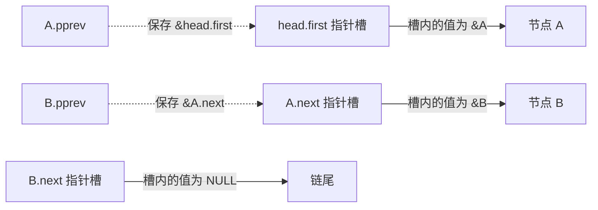

# 第2章\_内核基石\_hlist非对称链表

上一章已经把查找分成“选桶”与“比较完整键”。一个桶里仍可能有多个对象；本章暂时把桶号固定，只研究怎样连接这些对象，以及拿到一个节点后怎样把它摘下。哈希计算留给下一章，并发旧读者的路径留给第四章。

## 2.1\_给每个空桶留下什么

前面学过 list_head：头和普通节点都有 next、prev，形成双向循环。它让尾部定位、逆向遍历和任意位置插入都很方便。若当前用途只是从桶头向前扫描候选，许多桶又经常为空，我们会为每个空桶保留两个指针，却不使用其中的直接尾部入口。

hlist 选择另一组取舍：桶头 hlist_head 只保存 first，普通 hlist_node 仍保存 next 和 pprev 两个指针，链尾为 NULL。常见 32 位配置中，桶头从两个四字节指针变为一个；常见 64 位配置中，从两个八字节指针变为一个。省下的是 **每桶的头部空间**，没有把每个业务节点的两个连接字段都减半，也没有保证整个系统的内存减少一半。

代价是没有现成的尾指针，不能沿 pprev 像普通 prev 那样直接取得前一个业务对象。需要频繁操作队尾或反向遍历时，原来的双向循环表仍可能更合适。

## 2.2\_pprev保存的是入口槽的地址

设桶中已有 A、B 两个节点，顺序是 head → A → B → NULL。能使读者到达 A 的指针值存放在 head.first；能使读者到达 B 的指针值存放在 A.next。删除一个节点时，真正需要改写的是 **那个原来指向它的指针槽**。

因此，A.pprev 保存 &head.first，B.pprev 保存 &A.next。它们的类型都是“指向节点指针的指针”，即 hlist_node **。不能把 pprev 简写成“前驱节点地址”：首节点的前面根本不是 hlist_node，而是另一种头结构。


```mermaid
flowchart LR
    hf["head.first 指针槽"] -->|"槽内的值为 &A"| a["节点 A"]
    ap["A.pprev"] -.->|"保存 &head.first"| hf
    an["A.next 指针槽"] -->|"槽内的值为 &B"| b["节点 B"]
    bp["B.pprev"] -.->|"保存 &A.next"| an
    bn["B.next 指针槽"] -->|"槽内的值为 NULL"| endnode["链尾"]
```

对仍在普通表里的节点 n，有一个很实用的不变量：`*n->pprev == n`。例如删除 B，先把 A.next 改成 B.next；若 B 后面还有 C，再让 C.pprev 接管 &A.next。删除 A 时，同样的写法改的是 head.first。统一的是“改哪个入口槽”，不是整个删除过程从此没有条件分支；有没有后继，仍需判断。

这解释了表示为何成立，也限制了使用方式：桶头和仍连接的业务对象不能被随意搬到另一地址。pprev 保存的是具体字段的地址，浅拷贝整个对象并不能自动修复所有邻居的回指。一个 node 也不能同时属于两个桶；需要两种成员关系，就在业务对象中放两个独立节点。

## 2.3\_用完整C程序观察改边

下面的 task 把编号和 node 放在同一个业务对象中。桶只保存连接，业务对象的存储由 main 持有，摘链不会释放对象。task_from_link 使用 offsetof 得到成员偏移，前提是传入指针确实指向一个 task 的 node；它不是用任意地址猜对象类型。

先预测：删除中间的 18 后，10 的 pprev 应指向哪个字段？删除首项 26 后又指向哪里？保存为 hlist_model.c，或取用[材料目录](../../../../../labs/kernel/hash_table/materials/README.md)。

```c
/* 单线程教学模型：pprev 保存“通向本节点的指针槽地址”。 */
#include <assert.h>
#include <stddef.h>
#include <stdio.h>

struct link {
    struct link *next;
    struct link **pprev;
};
struct bucket {
    struct link *first;
};
struct task {
    int id;
    struct link node; /* 故意放在业务字段之后，节点地址不等于对象起点。 */
};

static struct task *task_from_link(struct link *node)
{
    return (struct task *)((char *)node - offsetof(struct task, node));
}

static void add_head(struct bucket *head, struct link *node)
{
    struct link *first = head->first;
    assert(node->pprev == NULL);
    node->next = first;
    if (first)
        first->pprev = &node->next;
    head->first = node;
    node->pprev = &head->first;
}

static void remove_init(struct link *node)
{
    struct link *next;
    struct link **previous_slot;
    if (!node->pprev)
        return;
    next = node->next;
    previous_slot = node->pprev;
    *previous_slot = next;
    if (next)
        next->pprev = previous_slot;
    node->next = NULL;
    node->pprev = NULL;
}

static void show_and_check(const struct bucket *head)
{
    struct link *node = head->first;
    const struct link *previous = NULL;
    while (node) {
        assert(*node->pprev == node);
        if (previous)
            assert(node->pprev == &previous->next);
        else
            assert(node->pprev == &head->first);
        printf("%d ", task_from_link(node)->id);
        previous = node;
        node = node->next;
    }
    puts(node ? "异常" : "NULL");
}

int main(void)
{
    struct bucket head = { NULL };
    struct task first = { 10, { NULL, NULL } };
    struct task middle = { 18, { NULL, NULL } };
    struct task last = { 26, { NULL, NULL } };
    struct link *cursor, *next;

    add_head(&head, &first.node);
    add_head(&head, &middle.node);
    add_head(&head, &last.node);
    show_and_check(&head); /* 26 18 10 */
    assert(middle.node.pprev == &last.node.next);
    remove_init(&middle.node);
    show_and_check(&head); /* 26 10 */
    assert(first.node.pprev == &last.node.next);
    assert(middle.node.pprev == NULL && middle.node.next == NULL);
    remove_init(&last.node);
    show_and_check(&head); /* 10，首节点回指桶头 first 的地址。 */
    remove_init(&first.node);
    remove_init(&first.node); /* 本模型的 del_init 空节点检查允许重复调用。 */
    assert(head.first == NULL);
    add_head(&head, &middle.node);
    add_head(&head, &first.node);
    show_and_check(&head); /* 10 18 */
    /* 先保存 next，再摘当前项；未假设它还能从当前项重新读出。 */
    for (cursor = head.first; cursor; cursor = next) {
        next = cursor->next;
        remove_init(cursor);
    }
    assert(head.first == NULL);
    puts("首中尾摘除、重新加入与逐项清空通过");
    return 0;
}
```

```bash
cc -std=c11 -Wall -Wextra -Werror -pedantic hlist_model.c -o hlist_model
./hlist_model
```

预期四行顺序分别是 26/18/10、26/10、10、10/18，然后报告清空通过。自检没有定义 NDEBUG，assert 会检查“回指槽当前确实指向自己”和每个节点的槽地址。

删除 18 后，10.pprev 指向 26.next；再删除 26，10.pprev 改为 &head.first。18 的内存一直存在，所以初始化连接后可以重新加入。本模型的 remove_init 把 next/pprev 置空，允许再次检查空节点；它对应普通摘除并初始化的教学语义，不模拟毒化、RCU、内存屏障或真实多线程。

## 2.4\_进入Linux接口之前先分清两层

固定 NXP Linux 6.12.20 的版本身份与上游位置见[源码总索引](../../../../../research/source_reading/hash_table/navigation/P01_Linux_6.12_哈希计算源码阅读索引.md#1.1_版本和任务边界)。结构位于 include/linux/types.h，单桶连接在 list.h，固定桶数组包装在 hashtable.h。历史路径中的 5.10 不是当前证据版本。

| 层次 | 调用者提供什么 | 接口做什么 |
| --- | --- | --- |
| 单桶 hlist | 桶头与成员节点 | 只连接、摘除或遍历该桶，不计算键 |
| 固定 hashtable | 真正的桶数组、节点和原始键 | 按键计算桶号，再调用单桶操作 |
| 业务对象 | 完整键、值、唯一性规则和寿命协议 | 比较候选是否相等，决定是否重复、能否释放 |

DEFINE_HASHTABLE(name, bits) 定义带初值的 2^bits 个桶；DECLARE_HASHTABLE 声明没有显式初值的数组，自动存储期对象不能直接当作空表。hash_init 初始化桶头，它不分配业务对象，也不释放原来已连在表里的节点，不能拿它“清空并回收”一张非空表。

hash_add(table, &obj->node, obj->key) 有三个参数：先选桶，再头插。旧稿把自定义的二参数改边函数也命名为 hash_add，混淆了两层接口；教学模型现在使用 add_head。hash_add 不检查同键重复，也不自动防止同一个节点重复插入。插入前查重与插入动作必须处在同一业务同步协议内。

完整键比较同样属于调用者：hash_for_each_possible 只缩小到可能包含键的桶。碰撞后还应比较 obj->key；字符串键比较内容，不能把字符数组地址相等当成字符串相等。计算与类型选择继续见下一章，当前映射见[单桶与数组导读](../../../../../research/source_reading/hash_table/navigation/P03_节点连接与并发边界导读.md#3.1_节点与桶数组分别负责什么)。

## 2.5\_删除以后节点自己处于什么状态

“从新路径里绕过节点”和“节点字段被写成什么”是两件事。固定接口各自有明确后置状态：

| 操作 | 对原节点的处理 | 能否据此立即释放 |
| --- | --- | --- |
| hlist_del | next/pprev 写毒化值 | 仍取决于是否有其他合法使用者 |
| hlist_del_init | 普通摘除后 next/pprev 置 NULL；已 unhashed 时跳过 | 不替调用者证明对象寿命 |
| hash_del | 包装 hlist_del_init | 与上行相同 |
| hlist_del_rcu | 保留 next，pprev 写毒化值 | 必须遵守读侧与延后回收协议 |
| hash_del_rcu | 使用 hlist_del_init_rcu，仅把 pprev 置 NULL，保留 next | unhashed 仍不代表没有旧读者 |

hlist_unhashed 只是判断 pprev 是否为 NULL。hlist_del 后通常仍判断为假，因为毒化值不是 NULL；不能据此断言节点还合法地属于某张表，也不能再次调用删除去解引用毒化地址。RCU 变体即使已经 unhashed，旧读者还可能需要 next；在旧读者结束前重新初始化或重用节点仍可能破坏旧路径。

具体状态写入只在[普通删除实现](../../../../../research/source_reading/hash_table/source_explanations/include/linux/list.h.md#1.2_摘除与节点后置状态)及[RCU 删除实现](../../../../../research/source_reading/hash_table/source_explanations/include/linux/rculist.h.md#1.2_删除保留前向连接)展开。不要从函数名中的 del/init 推断其他变体也写同样的字段。

## 2.6\_为什么写者的局部读取没有READ\_ONCE

原有人工问题保留：

<span style="color:red;">为什么 `n->next` 和 `n->pprev` 的读取操作没有加入上READ_ONCE操作？</span>

原稿紧接着的两条学习推断也保留供对照，下面再校正其适用边界：

> 1. kernel默认用户编程时，采用有锁编程，因此写者同一时间内只有一个，修改操作仅在该线程内，因此不需要给它加上 `*_ONCE` 操作中的 `volatile` 限定，也就是 `READ_ONCE`。既然有锁且线程本身是写者，原子序也不在考虑范畴。
> 2. 写者操作时，会加上 `WRITE_ONCE`，不仅仅是为了强调原子序，`volatile` 禁止编译器优化该变量（老老实实从内存读取值）；还有就是为了保证写操作的原子性，保障其他线程读者无锁读操作的安全性。

应把判断放回调用契约。__hlist_del 不在内部获取锁；调用者可能持有合适的锁，也可能尚未发布对象、根本没有并发者。只要调用者已经保证其他修改者不能同时改变该节点的连接，局部取得 next/pprev 就不需要靠 READ_ONCE 修补写写竞争。缺少这种保证时，补两个 READ_ONCE 也不能把几次改边变成一个事务。

WRITE_ONCE 限制相应访问的编译器变换，其可用尺寸及原子性仍有体系结构边界；它既不刷新 CPU 缓存，也不单独建立完整的发布—取得协议。普通 hlist_add_head 虽有 WRITE_ONCE，仍不能替代 hlist_add_head_rcu。更不能因为看见普通读就断言“原子序不需要考虑”，或因为看见单次写就允许任意无锁读者加入。

这个修正沿用[链表并发章](../../单链表_linked_list/P03_并发原语与原子性.md#3.3_READ_ONCE究竟多保证了什么)已建立的边界：分别证明修改者互斥、读者取得方式和对象使用期。源码导读将它们放在同一张责任表中，不靠“底层宏很安全”替调用者完成证明。

## 2.7\_遍历中的safe究竟保护哪一步

普通 hlist_for_each_entry 从 first 取得成员，再由 node 地址恢复业务对象，每轮结束读取当前对象的 node.next。如果循环体已经摘除并释放当前对象，最后这次读取就可能访问已失效内存。

hlist_for_each_entry_safe 先保存 next，再执行循环体；因此可以在具备独占修改与回收权限时删除当前项。它没有锁住保存的下一项，另一个执行者仍可能释放它。safe 不等于并发安全。反过来，删除当前项后立即 break 或 return、不再执行推进表达式时，也并非只能使用 safe 宏；仍应分别证明其余访问和对象寿命。

| 任务 | 适用起点 | 尚需提供的保证 |
| --- | --- | --- |
| 不修改当前项的普通扫描 | hlist_for_each_entry | 独占、共同锁或其他足够的访问协议 |
| 删除当前项后继续扫描 | hlist_for_each_entry_safe | 下一游标与其他成员不会被并发回收 |
| 在 RCU 协议下读取 | hlist_for_each_entry_rcu | 匹配的读侧域、专用更新和延后回收 |

这里不规定所有普通场景都必须使用 spinlock：私有表不需要凭空加锁，可睡眠的共享业务也可能选择 mutex；执行上下文决定具体同步工具。单桶 safe 宏有四个参数，全表 hash_for_each_safe 另带桶游标，不能只凭参数数量推断锁或寿命保证。

## 2.8\_宏里的花括号为什么能产生值

<span style="color:red;">这里的块语句为啥有返回值的功能？</span>

hlist_entry_safe 使用的 `({ ... })` 是 GNU C 的 **语句表达式**，不是普通 ISO C 的 `{ ... }` 块。它允许局部变量和多条语句，最后一个表达式语句的值成为整个表达式的值；不是执行了一次隐藏的 return。typeof 用于取得表达式类型，内核宏借局部临时指针避免对输入做重复求值，再处理 NULL。

用一个完整小程序观察这种语法，保存为 statement_expression.c：

```c
/* GNU C 的语句表达式；不是普通 ISO C 花括号块。 */
#include <stdio.h>

int main(void)
{
    int calls = 0;
    int result = ({
        int value = ++calls;
        value ? value + 10 : 0; /* 最后一个表达式的值成为整个表达式的值。 */
    });
    printf("result=%d calls=%d\n", result, calls);
    return result == 11 && calls == 1 ? 0 : 1;
}
```

```bash
cc -std=gnu11 -Wall -Wextra -Werror statement_expression.c -o statement_expression
./statement_expression
```

预期 result=11、calls=1。这里选择 gnu11 是为了允许该扩展；前面的 hlist_model 则不依赖它。不要把这段语法搬入要求严格 ISO C 的接口，再把编译失败理解为宏没有返回值。固定 hlist_entry_safe 和遍历展开见[成员恢复与游标实现](../../../../../research/source_reading/hash_table/source_explanations/include/linux/list.h.md#1.3_成员恢复与遍历游标)。

## 2.9\_回顾与下一步

现在能从地址关系推出头插、摘除和继续遍历：pprev 统一的是入口槽；safe 提前保存的是下次游标；对象的拥有者与回收者并没有因为调用一个宏而消失。

1. 为什么删除首节点也能使用 *pprev = next？为什么删除整个桶头对象之前必须处理节点？
2. hlist_del 后 hlist_unhashed 为假，能否再删一次？
3. safe 保存了下一节点地址，另一个 CPU 随即释放该节点，当前线程还能安全继续吗？
4. 对带副作用的参数，为什么宏先存入局部临时变量更容易推理？

解答：首节点回指 &head.first，桶头消失会使这个地址悬空；毒化非空不能证明仍是成员；保存地址不等于保活；临时变量避免输入在多个位置被重复求值。原来的 RCU 会话、写者和无参数读锁问题已连同红色批注放入[第四章](../P03_高级进阶与性能调优/P04_并发保护与RCU机制_多核下的读写博弈.md)，它接着回答“读者不持共同锁时，旧路径由谁保留”。

上一篇：[哈希桶与完整键](../P01_数据结构理论基础/P01_哈希表核心原理_空间与时间的终极博弈.md)。下一篇：[位宽与选桶](P03_算法之魂_哈希函数与位运算优化.md)。返回[大纲](../大纲.md)。
