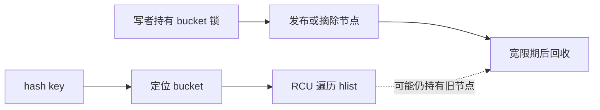
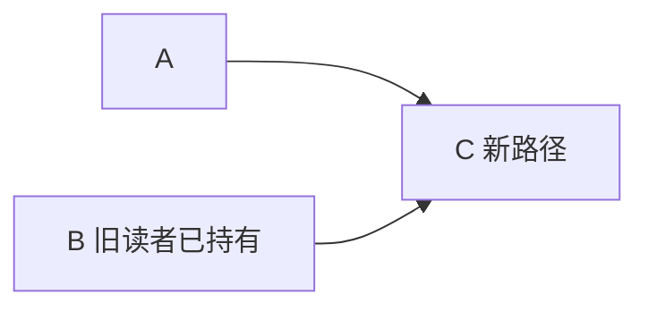

# 第4章\_并发保护与RCU机制\_多核下的读写博弈

## 4.1\_本章要回答的问题

RCU 的问题动机、硬件基础、读侧通知、宽限期和通用 API 已统一收拢到[RCU 专题](../../../synchronization/rcu/大纲.md)。如果尚不能解释“取消发布为什么不等于可以立即释放”，应先阅读[为什么需要 RCU](../../../synchronization/rcu/P01_为什么需要_RCU.md)到[Tree RCU 宽限期与回调机制](../../../synchronization/rcu/P06_Tree_RCU_GP请求与全局生命周期.md)。

本章不再重复通用 RCU 教程，只回答它落到哈希桶和 hlist 后新增的问题：

1. 读侧不因共享锁热点失去多核扩展性。
2. 读者取得指针后，对象已完成初始化。
3. 并发删除不会破坏旧读者的遍历路径。
4. 从表中删除的节点不会在旧读者退出前释放。
5. 写者之间仍然保持结构不变量。



## 4.2\_哈希节点的发布顺序

写者发布新 hlist 节点前，必须先完成 key、value 和链接字段初始化。RCU 链表宏通过发布—取得契约使读者不会只看到新指针，却看到未初始化的节点内容。

```c
struct bucket_entry {
	int key;
	int value;
	struct hlist_node node;
	struct rcu_head rcu;
};

new->key = key;
new->value = value;
hlist_add_head_rcu(&new->node, &bucket->head);
```

缓存一致性不能单独保证读者按源码顺序观察“对象初始化”和“链表指针发布”这两个不同地址的写入，所以必须由 RCU 发布接口建立必要顺序。

## 4.3\_并发删除时为什么不能斩断旧路径

考虑链表：

```text
A -> B -> C
```

旧读者可能已取得 B，但还没读取 `B->next`。写者将 B 从新版本链表中删除后，新读者将沿 `A -> C` 遍历；旧读者仍需要沿 `B -> C` 继续。



因此，RCU 删除宏必须在取消发布的同时保留旧读者所需的前向结构连续性。如果删除后立即清空 B 的后继指针，旧读者就会中断遍历或访问无效地址。

## 4.4\_hlist\_del\_rcu()不等于可以\_kfree()

RCU 删除路径必须分成：

```text
在写侧锁下取消节点发布
        ↓
新读者不再从 bucket 找到节点
        ↓
旧读者可能仍持有节点
        ↓
等待一个覆盖旧读者的 GP
        ↓
释放节点与读者可达的子资源
```

```c
spin_lock(&bucket->lock);
hlist_del_rcu(&entry->node);
spin_unlock(&bucket->lock);

kfree_rcu(entry, rcu);
```

`hlist_del_rcu()` 不负责写者互斥，也不负责等待 GP。这三个责任必须分开审查。

这里使用 `kfree_rcu()` 的理由和内部 GP/回调推进过程属于通用机制，分别参见[宽限期与回调机制](../../../synchronization/rcu/P06_Tree_RCU_GP请求与全局生命周期.md)和[RCU API 速查](../../../synchronization/rcu/P20_RCU_通用API与调用契约.md)。哈希表章节只需确认：节点已经取消发布，而且写侧锁已经释放，最终回收才进入 RCU 回调路径。

## 4.5\_一个完整的\_hlist\_RCU\_模型

```c
struct table_entry {
	int key;
	int value;
	struct hlist_node node;
	struct rcu_head rcu;
};

struct table_bucket {
	struct hlist_head head;
	spinlock_t lock;
};

static struct table_entry *lookup(struct table_bucket *bucket, int key)
{
	struct table_entry *entry;

	rcu_read_lock();
	hlist_for_each_entry_rcu(entry, &bucket->head, node) {
		if (entry->key == key) {
			/* 仅能在当前 RCU 读侧内直接使用 entry */
			rcu_read_unlock();
			return entry; /* 实际接口不应如此返回裸指针 */
		}
	}
	rcu_read_unlock();
	return NULL;
}
```

上述示例故意显示了一个常见边界：查找函数不能在退出 RCU 后返回没有独立引用的裸指针。真正接口应选择：

- 在 RCU 临界区内完成数据复制或业务判断。
- 在 RCU 内用 `kref_get_unless_zero()`/`refcount_inc_not_zero()` 安全取得长期引用。
- 由调用者持有 RCU 读侧，并用接口合同明确指针只在临界区内有效。

为避免误用，更好的最小查找示例是返回值副本：

```c
static bool lookup_value(struct table_bucket *bucket, int key, int *value)
{
	struct table_entry *entry;
	bool found = false;

	rcu_read_lock();
	hlist_for_each_entry_rcu(entry, &bucket->head, node) {
		if (entry->key == key) {
			*value = READ_ONCE(entry->value);
			found = true;
			break;
		}
	}
	rcu_read_unlock();
	return found;
}
```

## 4.6\_本章结论

1. hlist 的 RCU 更新需要专用接口保持旧读者仍可能依赖的前向遍历路径。
2. `hlist_del_rcu()` 只负责取消发布和结构语义，不负责写写互斥，也不表示可以立即释放节点。
3. 查找函数不能在退出 RCU 后返回没有独立引用的裸指针；可以返回值副本、让调用者持有读侧域，或在域内取得 kref/refcount。
4. RCU 保护节点生命期，不保护节点内部可变字段的一致性。

进一步阅读：

- [RCU 专题大纲](../../../synchronization/rcu/大纲.md)：从问题、硬件和通知机制开始的完整阅读路径。
- [RCU 模板、选型与核对](../../../synchronization/rcu/P21_RCU_数据结构模板与选型.md)：通用调用模板和审查清单。
- [kref 与 RCU](../../../object_lifetime/kref/P10_kref_与_RCU.md)：查找后需要跨出读侧临界区长期持有节点时的专门讨论。
