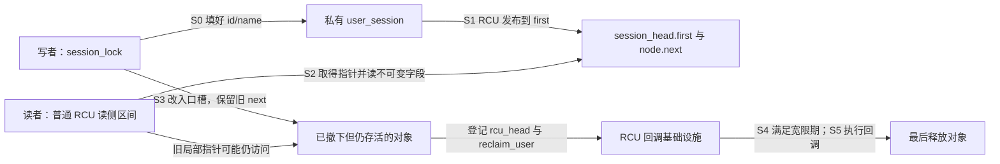
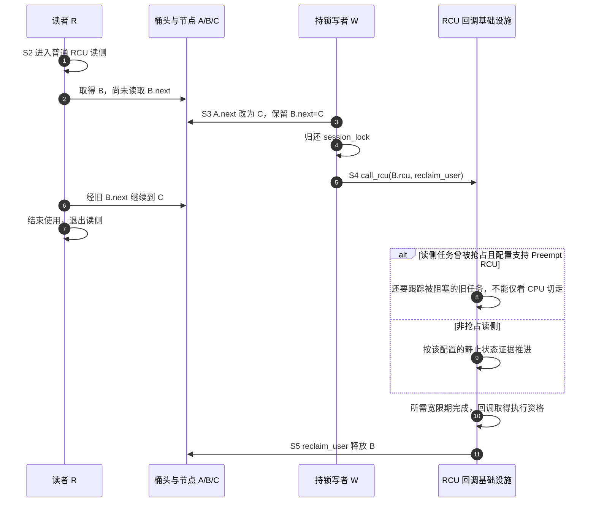

# 第4章\_并发保护与RCU机制\_多核下的读写博弈

前两章已经给出桶、节点和选桶规则。只要所有访问者持同一把锁，写者可以完整改边，读者也不会走到半改好的拓扑。现在给会话表增加一个条件：很多处理器频繁按用户编号查询，用户加入和退出相对少，而且已发布的编号和名字不再原地修改。

本章以一个已经选中的桶为单位，比较共同锁与 RCU（Read-Copy-Update）的责任变化。它不重讲整个宽限期检测器；先修是[RCU 通用机制与最小闭环](../../../synchronization_and_asynchrony/synchronization/rcu/P03_RCU_通用API与最小使用闭环.md)。若还不能解释“取消发布为何不等于立即释放”，先从[RCU 问题与推演](../../../synchronization_and_asynchrony/synchronization/rcu/大纲.md)补齐这一结论。

## 4.1\_共同锁解决了什么又付出了什么

在共同锁方案中，查询者取得桶锁，沿连接找到对象、复制需要的值，再解锁；删除者取得同一锁，摘除对象，并在没有其他使用者时释放。正确性的价值很直接：两方不会同时对同一拓扑作出互相矛盾的操作，也不会一边复制名字一边释放其存储。

成本来自每次查询都参与锁状态的读改写。即使两个 CPU 只想读不同节点，它们仍先操作同一个桶锁；锁所在缓存行的可写权限在参与者之间转交，后到者等待前者完成，读业务没有修改对象也不能跳过这一步。分桶锁能缩小冲突范围，却不能消除热点桶的共享写入；小表、低频查询或需要强一致复合更新的场景，保留共同锁通常更易维护。

如果业务允许查询与删除重叠，且只读取发布后不变的字段，可以让写者先改变可达路径，旧读者继续使用旧对象。这样移走的是读者争用共同锁的成本；新增的是专用发布、保留旧路径、延后回收及退出时排空的责任。它不承诺全表原子快照，也不替业务提供“注销命令返回后一切并发查询都立即拒绝旧身份”的线性化规则。

## 4.2\_同一个桶中的状态由谁保存

原有人工要求保留在实例入口：

<span style="color:red;">给出一个较为具体的示例，不然我看着代码很陌生。尤其是关于加锁的细节研究。</span>

会话对象 user_session 保存 id、name、node 和 rcu。session_head.first 保存当前入口；node.next 是读者的前向路径，node.pprev 供修改者定位入口槽；session_lock 只协调写者。rcu 是回调登记头，承载回收动作，不是每对象的读锁或读者计数。


```mermaid
flowchart LR
    writer["写者：session_lock"] -->|"S0 填好 id/name"| candidate["私有 user_session"]
    candidate -->|"S1 RCU 发布到 first"| bucket["session_head.first 与 node.next"]
    reader["读者：普通 RCU 读侧区间"] -->|"S2 取得指针并读不可变字段"| bucket
    writer -->|"S3 改入口槽，保留旧 next"| retired["已撤下但仍存活的对象"]
    reader -->|"旧局部指针可能仍访问"| retired
    retired -->|"登记 rcu_head 与 reclaim_user"| callbacks["RCU 回调基础设施"]
    callbacks -->|"S4 满足宽限期；S5 执行回调"| free["最后释放对象"]
```

这是几组相互关联的状态：成员关系、写者互斥、读侧保护和回收登记，并非一个 enabled 标志能代表的单一状态机。

| 阶段 | 地址与写入者 | 谁读取以及退出条件 |
| --- | --- | --- |
| S0 私有构建 | 写者填候选的 id/name，初始化 node | 其他路径尚不可达；失败可直接释放 |
| S1 发布 | 持 session_lock 的写者用 hlist_add_head_rcu 修改入口 | 读者按 RCU 取得指针后可读取发布前内容；其他写者仍须串行 |
| S2 读取 | 读者在自己的局部变量保存节点地址，保持正确读侧域 | 使用完成并退出；临界区外继续持有需另取引用 |
| S3 撤下 | 持锁写者让入口槽绕过节点，旧 node.next 保留 | 后续沿已更新路径的遍历绕过它；旧局部指针仍可能访问 |
| S4 回收等待 | 写者把对象的 rcu_head 与回调提交给 RCU | RCU 依据执行流证据判定覆盖旧读者的宽限期，不逐对象点名 |
| S5 最后释放 | RCU 执行 reclaim_user，回调读取宿主地址并 kfree | 所有必要寿命条件成立；模块退出还要等回调实际执行完 |


```mermaid
sequenceDiagram
    autonumber
    participant reader as 读者 R
    participant state as 桶头与节点 A/B/C
    participant writer as 持锁写者 W
    participant rcu as RCU 回调基础设施
    reader->>reader: S2 进入普通 RCU 读侧
    reader->>state: 取得 B，尚未读取 B.next
    writer->>state: S3 A.next 改为 C，保留 B.next=C
    writer->>writer: 归还 session_lock
    writer->>rcu: S4 call_rcu(B.rcu, reclaim_user)
    reader->>state: 经旧 B.next 继续到 C
    reader->>reader: 结束使用，退出读侧
    alt 读侧任务曾被抢占且配置支持 Preempt RCU
        rcu->>rcu: 还要跟踪被阻塞的旧任务，不能仅看 CPU 切走
    else 非抢占读侧
        rcu->>rcu: 按该配置的静止状态证据推进
    end
    rcu->>rcu: 所需宽限期完成，回调取得执行资格
    rcu->>state: S5 reclaim_user 释放 B
```

图中的基础设施是通用 RCU 的职责，当前工作树启用的是 Tiny RCU、非 SMP 配置。Tree/Preempt 分支说明接口为何不能按一种配置猜测，并非声称本实验实际运行了所有分支。版本入口见[哈希源码索引](../../../../../research/source_reading/hash_table/navigation/P01_Linux_6.12_哈希计算源码阅读索引.md#1.1_版本和任务边界)。

## 4.3\_没有对象参数不等于一把全局读写锁

<span style="color:red">rcu_read_lock()不需要带入参数吗？rcu是统一的临界区或者说统一的读写锁吗？</span>

普通 rcu_read_lock 声明的是 **当前执行流的一段保护区间**，不登记“正在读会话 18 的地址”。它不排斥写者发布新对象，也不因同时读两张表而变成两把对象锁。普通 RCU 使用对应配置的共享宽限期基础设施；一个宽限期覆盖相关旧读者，不要求所有新旧读者在同一瞬间全部归零。

配置决定实际状态落点：非抢占路径利用不跨过某些调度/静止边界的约束；Preempt Tree RCU 跟踪任务的 rcu_read_lock_nesting，被抢占的旧读者还会登记在 rcu_node 的 blkd_tasks 中。每 CPU 证据与节点汇聚共同推进全局结论，不能压成“什么状态都没写”。当前 Tiny 路径更小，但仍有回调队列和静止状态推进；它不是把这些 Tree 字段都开在单核配置里。

这些状态的写入、报告、阻塞读者与慢路径请沿[RCU 读侧导读](../../../../../research/source_reading/rcu/navigation/P02_Linux_6.12_RCU公共接口与读侧模型模块源码概念导读.md)和[Tiny 模块导读](../../../../../research/source_reading/rcu/navigation/P11_Linux_6.12_Tiny_RCU模块源码概念导读.md)继续。本章保留原问题与配置区别，但不再用机场“静止指令”暗示读者或写者必须共同停下。

| 比较轴 | 共同读写锁协议 | 本例普通 RCU 协议 |
| --- | --- | --- |
| 保护对象 | 调用者选择具体锁 | 读侧没有会话对象参数，使用普通 RCU 域 |
| 写者何时改变可达路径 | 取得相应排他权限以后 | 在写者互斥下可与读者重叠更新 |
| 回收依据 | 没有仍被允许访问的持有者 | 取消发布，再覆盖旧读者；其他引用仍需单独归还 |
| 读侧成本去向 | 参与共享锁的协调 | 配置相关的读侧状态与取得操作；写侧承担延迟回收 |

## 4.4\_三种不能混用的保证

发布时，id/name 先初始化，再通过 hlist_add_head_rcu 把对象接入。缓存一致性本身不能替代不同地址之间的发布—取得顺序；普通 hlist_add_head 中存在 WRITE_ONCE，也不意味着它已提供同样契约。

撤下 B 后，旧读者可能还要走 B.next。hlist_del_rcu 保留 next，只毒化 pprev；hash_del_rcu 使用另一种变体，仅清 pprev，仍保留 next。把节点立即重新初始化、再次加入另一张表或原地重用，可能在内存尚未释放之前就破坏旧路径。只能依据完整寿命协议决定重用时机。

宽限期也不保护可变字段的复合一致性。本例发布后不再改 id/name，因此可以在读侧复制或打印；若一边修改名字数组一边读取，必须增加适当的锁、版本替换或其他一致性协议。给某个 int 加 READ_ONCE，不会让整个对象成为快照。

固定的发布与遍历落点见[RCU 单桶实现](../../../../../research/source_reading/hash_table/source_explanations/include/linux/rculist.h.md#1.1_先构建再发布)，普通改边的边界见[节点导读](../../../../../research/source_reading/hash_table/navigation/P03_节点连接与并发边界导读.md#3.2_普通修改与RCU发布的分界)。

## 4.5\_一个能构建的会话桶实验

<span style="color:red;">写者示例：</span>

下面把原先分散的添加、查找和回收片段合成完整模块。它只创建一个已经选定的桶，不导出设备或外部访问入口；编号 10、18、26 和名字发布后不变。add_user 在锁外分配、锁内查重与发布；remove_user_async 只撤下一次并登记一次回调。find_user_rcu 返回借用指针，调用者负责保持读侧区间。

实验在同一个初始化任务中安排“先持有 18 → 撤下 18 → 再沿旧 next 到 10”，这样可重复观察契约，而不依赖两个 CPU 碰巧交错。它不是 SMP 压力证明。fail_at 允许在第 1～3 次准备前注入失败，失败清理与正常退出都排空回调，防止模块代码先于回调消失。

程序沿用 P02 的 HLIST_HEAD 空头定义和 INIT_HLIST_NODE 节点初始化宏。DEFINE_SPINLOCK 定义写者共享的自旋锁对象；RCU_LOCKDEP_WARN 是检查宏，只在相应配置与检查器有效时诊断缺少读侧保护，不替程序加锁。GFP_KERNEL 是允许睡眠的分配标志，因此分配在锁外。其余模块入口、许可证标识、参数说明和 ARRAY_SIZE 数组长度宏沿用模块构建课程；下文逐项解释本例返回的错误码。

```c
// SPDX-License-Identifier: GPL-2.0
/* 一个已选定的哈希桶：仅演示发布、旧路径和异步回收，不导出设备。 */
#include <linux/module.h>
#include <linux/init.h>
#include <linux/slab.h>
#include <linux/list.h>
#include <linux/rculist.h>
#include <linux/rcupdate.h>
#include <linux/spinlock.h>
#include <linux/string.h>

struct user_session {
	int id;
	char name[32];
	struct hlist_node node;
	struct rcu_head rcu;
};

static HLIST_HEAD(session_head);
static DEFINE_SPINLOCK(session_lock);
static int fail_at;
module_param(fail_at, int, 0444);
MODULE_PARM_DESC(fail_at, "在第 1 到 3 个对象准备前模拟失败，0 表示不注入");

/* 返回地址只属于调用者已建立的读侧区间，没有取得独立引用。 */
static struct user_session *find_user_rcu(int id)
{
	struct user_session *item;

	RCU_LOCKDEP_WARN(!rcu_read_lock_held(), "find_user_rcu needs RCU");
	hlist_for_each_entry_rcu(item, &session_head, node)
		if (item->id == id)
			return item;
	return NULL;
}

static int add_user(int id, const char *name)
{
	struct user_session *candidate, *item;
	int error = 0;

	candidate = kzalloc(sizeof(*candidate), GFP_KERNEL);
	if (!candidate)
		return -ENOMEM;
	candidate->id = id;
	if (strscpy(candidate->name, name, sizeof(candidate->name)) < 0) {
		kfree(candidate);
		return -E2BIG;
	}
	INIT_HLIST_NODE(&candidate->node);
	spin_lock(&session_lock);
	hlist_for_each_entry(item, &session_head, node)
		if (item->id == id) {
			error = -EEXIST;
			goto unlock;
		}
	hlist_add_head_rcu(&candidate->node, &session_head);
unlock:
	spin_unlock(&session_lock);
	if (error)
		kfree(candidate); /* 未发布候选可直接释放。 */
	return error;
}

static void reclaim_user(struct rcu_head *head)
{
	struct user_session *item = container_of(head, struct user_session, rcu);

	pr_info("note_hlist_rcu: reclaim id=%d\n", item->id);
	kfree(item);
}

static int remove_user_async(int id)
{
	struct user_session *item, *removed = NULL;

	spin_lock(&session_lock);
	hlist_for_each_entry(item, &session_head, node)
		if (item->id == id) {
			hlist_del_rcu(&item->node);
			removed = item;
			break; /* 普通遍历删除后立即离开，不再执行推进表达式。 */
		}
	spin_unlock(&session_lock);
	if (!removed)
		return -ENOENT;
	call_rcu(&removed->rcu, reclaim_user);
	return 0;
}

static void drain_sessions(void)
{
	struct user_session *item;
	struct hlist_node *next;

	/* 本模块没有外部生产入口，调用本函数时不会再提交新对象。 */
	spin_lock(&session_lock);
	hlist_for_each_entry_safe(item, next, &session_head, node) {
		hlist_del_rcu(&item->node);
		call_rcu(&item->rcu, reclaim_user);
	}
	spin_unlock(&session_lock);
	rcu_barrier(); /* 等回调真正执行，之后模块回调代码才可消失。 */
}

static int __init note_hlist_rcu_init(void)
{
	const int ids[] = { 10, 18, 26 };
	const char *const names[] = { "user10", "user18", "user26" };
	struct user_session *old, *following;
	struct hlist_node *next;
	unsigned int index;
	int error = -ENOMEM;

	if (fail_at < 0 || fail_at > 3)
		return -EINVAL;
	for (index = 0; index < ARRAY_SIZE(ids); ++index) {
		if ((unsigned int)fail_at == index + 1)
			goto fail;
		error = add_user(ids[index], names[index]);
		if (error)
			goto fail;
		error = -ENOMEM; /* 为下一次注入点保留确定的失败码。 */
	}
	rcu_read_lock();
	old = find_user_rcu(18);
	if (!old) {
		error = -ENOENT;
		goto unlock_fail;
	}
	error = remove_user_async(18);
	if (error)
		goto unlock_fail;
	next = rcu_dereference_raw(hlist_next_rcu(&old->node));
	following = hlist_entry_safe(next, struct user_session, node);
	if (!following || following->id != 10 || find_user_rcu(18)) {
		error = -EINVAL;
		goto unlock_fail;
	}
	pr_info("note_hlist_rcu: old=%s next=%d lookup18=absent\n",
		old->name, following->id);
	rcu_read_unlock();
	return 0;
unlock_fail:
	rcu_read_unlock();
fail:
	drain_sessions();
	return error;
}

static void __exit note_hlist_rcu_exit(void)
{
	drain_sessions();
}

module_init(note_hlist_rcu_init);
module_exit(note_hlist_rcu_exit);
MODULE_LICENSE("GPL");
MODULE_DESCRIPTION("hlist 旧路径与回调寿命教学模块");
```

材料保存为 note_hlist_rcu.c；同目录 Makefile 的内容为 `obj-m += note_hlist_rcu.o`。kzalloc/ENOMEM 沿用模块课程，EEXIST 表示重复编号，E2BIG 表示名字未能完整复制，ENOENT 表示未找到，EINVAL 表示参数或实验不变量不成立。strscpy 返回负值时直接释放未发布候选；没有沿用本版本已经移除的 strlcpy。

rcu_read_lock 区间里没有分配或等待宽限期。remove_user_async 只持有短自旋锁、撤下节点并提交 call_rcu；普通遍历在摘除后立即 break，不再用已删除的当前项推进。drain_sessions 则要继续删其他项，因此提前保存下一游标。RCU 回调中的 container_of 从 rcu_head 找回同一宿主对象，只执行最后释放。

## 4.6\_观察旧路径并检查退出

按[模块构建课程](../../../../../engineering/build/kernel_modules/大纲.md)准备与运行内核匹配的 KDIR，在[材料目录](../../../../../labs/kernel/hash_table/materials/README.md)构建，在匹配的 Linux 目标装载：

```bash
make -C "$KDIR" M="$PWD" modules
sudo insmod ./note_hlist_rcu.ko
sudo dmesg | tail -n 16
sudo rmmod note_hlist_rcu
sudo dmesg | tail -n 16
```

正常装载预期看到 `old=user18 next=10 lookup18=absent`。这说明同一次受保护观察中，旧指针仍能使用，而重新沿已更新入口查找不再得到 18；没有把全系统查询都解释成同一个时间点。18 的 reclaim 日志只能在这段旧使用结束后出现；10、26 在退出清理后回收。回调之间的日志顺序不作为跨配置承诺。

分别尝试 fail_at=1、2、3。insmod 应失败；第一个注入点尚无发布对象，后两次应回收各自已发布的前缀。实际分配失败也应走清理路径。失败装载不再执行 rmmod；不要把反复卸载一个没有成功装入的模块当作恢复。

这里的输出是预测，ARM 语法或宿主模型检查不能替代目标 Kbuild、MODPOST、装卸、检查器和真实并发验证。该模块只安排受控使用者，不证明带外部工作队列、定时器、硬件中断或热拔插入口的生产驱动已经完成关闭协议。

## 4.7\_同步等待与异步回调怎样选择

同一个 S3 撤下对象之后，如果只存在受本 RCU 域保护的借用者，且当前路径允许睡眠，可以在释放写侧锁、退出读侧区间后执行 synchronize_rcu，再释放对象。它不是固定时长等待，也不机械要求每个 CPU 都切换一次任务；Tiny 在合法上下文中甚至可以用已有约束满足语义。具体证明见[Tiny 同步等待](../../../../../research/source_reading/rcu/source_explanations/P13_Linux_6.12_Tiny_RCU源码实现.md#13.12_synchronize_rcu立即返回不等于没有宽限期语义)。

call_rcu 把回收安排给回调基础设施，调用不等待相应宽限期，但登记仍有执行成本，并非“任何上下文零成本立即返回”。对象需持续保存 rcu_head 和回调所需数据；同一回调头不能重复在途提交。高频删除还可能积累大量待回收对象，要考虑内存峰值和背压。同步与异步的选择依据是能否等待、控制流和资源预算，不是把控制面/数据面当成硬性分类。

模块退出的 rcu_barrier 等待的是先前登记回调的实际完成。只等待一次 synchronize_rcu，不能替代“回调已经执行、不会再调用本模块代码”的证明。调用 barrier 之前还必须阻止新的生产者继续登记；本示例没有外部入口，因此初始化失败或退出时已满足这一前提，真实服务需要自己的关闭阶段。具体机制见[回调排空导读](../../../../../research/source_reading/rcu/navigation/P08_Linux_6.12_Tree_RCU_同步等待与rcu_barrier模块源码概念导读.md)。

## 4.8\_查找返回什么决定剩余责任

最容易使用的接口是在读侧内复制所需值再返回；字段必须不可变，或具有足够的一致性协议。第二种是本例的 find_user_rcu：调用者持有读侧，返回指针只是借用。第三种是在读侧内按照对象引用协议安全取得长期引用，随后由最后一次 put 决定销毁。

第三种不能简化成“加一个 kref 字段即可”。kref_get_unless_zero/refcount_inc_not_zero 还依赖初始化、表拥有的引用、撤下后归还顺序以及最后销毁方式；对象已经归零时不能重新复活。完整组合见[RCU 与复合对象生命周期](../../../synchronization_and_asynchrony/synchronization/rcu/P21_RCU_kref与复合对象生命周期.md)及[kref 与 RCU](../../../object_lifetime/kref/P10_kref_与_RCU.md)。

本章撤下旧稿中“先 rcu_read_unlock 再 return 裸指针”的伪完整函数，保留该反例的因果解释：调用者开始使用时保护已经结束，可能正好与回调释放重叠。不能通过给 return 加注释弥补失去的寿命。

## 4.9\_回顾与练习

1. 若普通 hlist_del 清掉或毒化 B.next，却仍延后 kfree，旧读者是否就安全？
2. 为何 hash_del_rcu 后 unhashed 为真仍不能立即把该 node 用到另一张表？
3. 查找者只读 name，写者原地改 name，是否已经由本章的 RCU 保护？
4. 模块退出先 rcu_barrier，再允许最后一个工作项 call_rcu，有什么缺口？
5. 每秒只有几次查询、业务要求一次原子修改三个字段，是否必须切换成 RCU？

解答：前两题都可能破坏旧读者还要使用的路径；第三题缺字段一致性；第四题新回调不属于已排空的集合，必须先关入口、排空生产者再等回调；第五题没有这种必要，清楚的共同锁协议可能更符合需求。RCU 改变的是并发责任分配，不是给任意容器自动加上“更快”标签。

上一篇：[哈希计算与位宽](../P02_Linux_内核_5.10_核心实现/P03_算法之魂_哈希函数与位运算优化.md)。下一篇：[动态容量](P05_动态伸缩的rhashtable_无感扩容的艺术.md)。返回[大纲](../大纲.md)。
