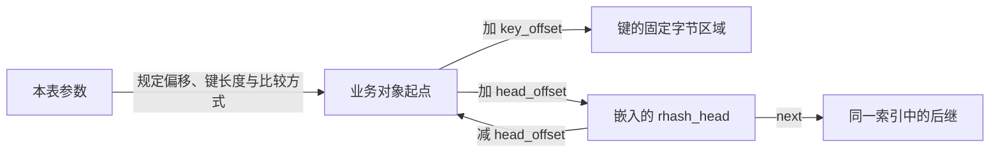
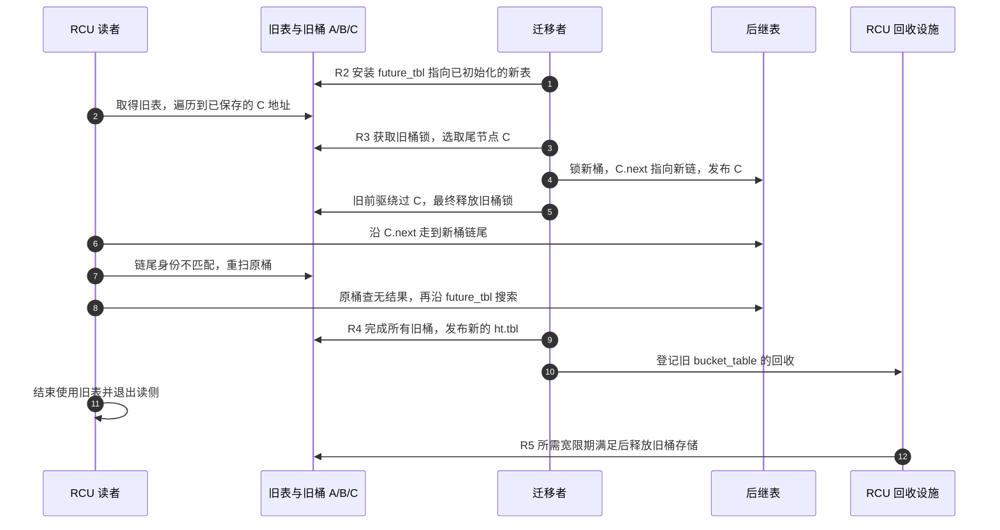
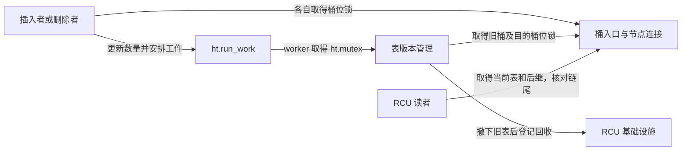

# 第5章\_动态伸缩的rhashtable\_无感扩容的艺术

上一章允许读者与删除者重叠，并把“撤下入口”和“销毁对象”分开。它仍有一个固定条件：桶数组的大小不变。如果会话数量从几百逐渐长到几万，原来短的候选链会变长；如果从一开始就预留很大的数组，低负载时又会保存许多空桶。

本章先从这个容量矛盾推导在线换表需要的状态，再核对 Linux 的 rhashtable（Resizable Hash Table，可调整大小的哈希表）。文件名中的“无感”不表示延迟没有变化：分配、重哈希、重试和额外内存都有成本。本章不作恒定时间、零抖动或攻击必然失效的承诺。

## 5.1\_先想清楚为什么不能只换一个数组

共同锁方案仍有价值：先阻止表的使用者，分配新桶，把全部节点按新容量重新分桶，再替换入口。读者只见到完整的旧版或新版，证明很简单。若表很小、维护窗口允许暂停或变更极少，这种方案可能已足够。

问题出现在暂停预算短而对象很多时。每个节点都要重新计算桶号并改连接；一万项与一百万项不是同一次常数工作。查询者等锁，后续请求在队列里积累，等待时间取决于实际迁移、内存分配和调度，而不是仅由桶数公式决定。不能脱离硬件和负载虚构“必然停顿 100 毫秒”。

如果希望查询继续，就不能一边随意改旧节点的 next，一边要求所有读者仍按静态旧表解释路径。至少要解决四个问题：新表从哪里被发现；新插入的对象归哪张表；读者跨进另一条链后怎样发现；旧桶数组何时允许释放。RCU 能推迟存储回收，但不会替我们设计前三条协议。

## 5.2\_把业务对象和索引容器分开

rhashtable 不复制每个业务对象。调用者在对象中嵌入 rhash_head，库用配置中的偏移找到节点、键和宿主。rhash_head 只有前向 next，不是上一章带 pprev 的 hlist_node；删除通常需要在候选链中定位相应节点的前驱。

<span style="color:red">为啥不直接使用 `container_of()`，然后记录成员地址？反而是采用 `offset`？</span>

container_of 的调用点知道具体类型和成员名，编译器可以在那里检查类型并计算偏移；独立编译的通用库不知道将来用户的 struct note_record。用户用 offsetof 生成数字参数，库保存 head_offset/key_offset 后按字节寻址，于是同一份实现可以服务不同结构体。二者不是互斥技术，都是根据真实布局恢复地址；“省掉类型检查所以执行更快”没有由此成立。

一个对象按编号、名称进入两个独立索引时，要有两个独立 rhash_head，并给两张表传入各自的 head_offset。不能把同一节点的 next 同时交给两种成员关系维护。容器不移动业务对象，调用者仍负责让其地址和键在成员期间保持有效；原地修改键却不移除重插，会让查找和删除按新键寻找错误的桶。



固定字节键还要考虑 C 的填充字节。若把含 padding 的结构体整体当键，未初始化字节可能使逻辑相同的字段比较不等；应规范键的编码，或提供与哈希一致的比较函数。字符串指针不是字符串内容，变长键需要相应的对象哈希与比较策略。具体字段与初始化边界见[动态表源码导读](../../../../../research/source_reading/hash_table/navigation/P04_动态表迁移与接口边界导读.md#4.1_表句柄桶数组与业务节点)。

## 5.3\_三类状态不能共用一个解释

先给旧表增加 future 指针：它指向已经准备好的后继表，插入者据此改变目的地，读者在旧桶查无结果后也能继续。若换表请求重叠，可能形成多个版本的后继链；“永远只有两张表”只是最小示意，不是实现上界。

仅有 future 仍不够。设旧桶 A → B → C；迁移者把 C.next 改成新桶链头。已经拿到 C 的读者随后会沿新链走下去，不能再把遇到的任何链尾都当成“我已经完整检查过旧桶”。因此链尾要包含桶身份，读者确认结束位置；身份不匹配时重扫原桶，确认原桶已扫描完成后再访问后继表。

固定 Linux 实现有三种不同载体：

| 状态 | 保存地址及消费者 | 不能解释成什么 |
| --- | --- | --- |
| 桶锁位 | 桶头指针值的 bit 0；写者原子加锁，读者取得入口时清除此位 | 不是迁移完成标志 |
| nulls 链尾标记 | 节点 next 链尾中的带桶地址标记值；读者比较是否为原桶的结束标记 | 空桶也有相应结束语义，不表示这个桶正在搬家 |
| future_tbl | bucket_table 内的后继表指针；插入、查找、删除和迁移按协议读取 | 不是把一个桶指针直接强制转换成新表 |

空桶在数组槽里实际保存 NULL，读者的取得辅助函数会生成与该槽地址对应的 nulls 标记；桶槽不直接保存这个标记，因为它的低位已经用于锁。对齐允许编码这些值，但必须先辨认自己读的是哪个地址、哪种状态。

桶布局、标记与取得函数的唯一实现见[版本化对象布局](../../../../../research/source_reading/hash_table/source_explanations/include/linux/rhashtable-types.h.md#1.1_从句柄到节点的状态落点)和[标记与查找](../../../../../research/source_reading/hash_table/source_explanations/include/linux/rhashtable.h.md#1.1_桶锁位与链尾身份)。本专题固定源码统一从[总阅读索引](../../../../../research/source_reading/hash_table/navigation/P01_Linux_6.12_哈希计算源码阅读索引.md#1.1_版本和任务边界)进入。

## 5.4\_一次迁移怎样保持可以继续查找

这是几组正交状态共同推进的过程：表版本关系、桶内写互斥、业务对象可达性、读者局部游标以及旧表回收条件。用 R0～R5 追踪一次换表；它描述表版本迁移，不等同于上一章 S0～S5 的单对象删除周期。

| 阶段 | 谁写哪个地址 | 后续消费者与退出条件 |
| --- | --- | --- |
| R0 当前表 | ht.tbl 指向旧 bucket_table；对象由旧桶连接 | 读者取得旧表，写者按桶互斥 |
| R1 准备后继 | 分配者填新表 size/hash_rnd/空桶 | 分配失败保留已有表，按路径返回错误或安排重试 |
| R2 挂接后继 | 竞争者用原子比较交换安装 old.future_tbl | 只接受一个后继；插入者检查后转向末端表 |
| R3 逐项迁移 | worker 持旧桶锁，从尾节点开始；先改节点 next、发布新桶，再绕过旧入口 | 旧读者可能跨链，按链尾身份重扫；新插入由后继协议接收 |
| R4 切换入口 | worker 用 RCU 发布 ht.tbl，登记旧表回收 | 旧表还可能被先前读者引用，不能立即 free |
| R5 回收旧表 | RCU 在所需宽限期后调用核心库的旧表释放函数 | 释放桶存储；业务对象仍由新表连接，并未被销毁 |

本表 R3 中旧尾 C 改 next 的动作，与上一章“删除 B 时保留 B.next”看似不同。原因是协议不同：单桶删除保持旧链连续；动态表允许改变方向，但增加带身份的结束标记、重扫和后继表搜索。不能把 rhashtable 的做法直接套回普通 hlist 删除。



图中“先发布新连接，再绕过旧入口”是一个节点的操作顺序，不是整个新表瞬间对所有 CPU 可见的口号。读者查无结果后还有读取屏障与 future_tbl 的取得；写者有桶锁和后继发布协议。完整证明依赖这些配套动作，而不只依赖 RCU 不释放内存。对应函数见[迁移实现](../../../../../research/source_reading/hash_table/source_explanations/lib/rhashtable.c.md#1.2_尾节点迁移与表入口交接)。

## 5.5\_用C模型观察走错链尾后的重扫

下面把每张表简化为一个桶，并用独立节点表示链尾身份。所有动作在一个线程按顺序执行；hook 只在读者已经取得 C 后插入一次迁移，因此能稳定复现跨链。它不使用 Linux 指针位、不模拟锁或内存乱序，不把串行断言当成并发正确性证明。

保存为 rehash_path_model.c，或从[材料目录](../../../../../labs/kernel/hash_table/materials/README.md)取用：

```c
/* 确定性串行模型：用独立链尾对象模拟桶身份，不模拟指针位或真实并发。 */
#include <assert.h>
#include <stdbool.h>
#include <stdio.h>

struct node {
    int key;
    bool terminal;
    struct node *next;
};
struct table {
    struct node *head;
    struct node *end;
    struct table *future;
};
static struct node old_end = { 0, true, NULL };
static struct node new_end = { 0, true, NULL };
static struct node a = { 10, false, NULL };
static struct node b = { 18, false, NULL };
static struct node c = { 26, false, NULL };
static struct table old_table = { NULL, &old_end, NULL };
static struct table new_table = { NULL, &new_end, NULL };
static unsigned int retries;

/* 新表已通过 future 可发现。先发布尾节点到新链，再绕过旧入口。 */
static void move_tail(void)
{
    struct node **slot = &old_table.head;
    struct node *item = *slot;
    assert(old_table.future == &new_table && !item->terminal);
    while (!item->next->terminal) {
        slot = &item->next;
        item = item->next;
    }
    struct node *old_next = item->next;
    item->next = new_table.head;
    new_table.head = item;
    *slot = old_next;
}

/* hook 在读者已经拿到旧尾 C 后插入一次迁移动作。 */
static struct node *lookup(struct table *table, int key, bool hook)
{
    while (table) {
        struct node *cursor;
        do {
            cursor = table->head;
            while (!cursor->terminal) {
                if (hook && cursor == &c) {
                    move_tail();
                    hook = false;
                }
                if (cursor->key == key)
                    return cursor;
                cursor = cursor->next;
            }
            if (cursor != table->end)
                ++retries;
        } while (cursor != table->end);
        table = table->future;
    }
    return NULL;
}

int main(void)
{
    a.next = &b;
    b.next = &c;
    c.next = &old_end;
    old_table.head = &a;
    new_table.head = &new_end;
    old_table.future = &new_table;

    assert(lookup(&old_table, 99, true) == NULL);
    assert(retries == 1); /* 走到新桶的尾标记，必须重扫旧桶。 */
    assert(b.next == &old_end && new_table.head == &c);
    assert(lookup(&old_table, 26, false) == &c);
    printf("wrong_end_retries=%u moved_key=%d\n", retries, c.key);

    move_tail();
    move_tail();
    assert(old_table.head == &old_end);
    assert(lookup(&new_table, 10, false) == &a);
    assert(lookup(&new_table, 18, false) == &b);
    assert(lookup(&new_table, 26, false) == &c);
    assert(lookup(&new_table, 99, false) == NULL);
    puts("迁移后对象地址不变，三个键都可查到");
    return 0;
}
```

```bash
cc -std=c11 -Wall -Wextra -Werror -pedantic rehash_path_model.c -o rehash_path_model
./rehash_path_model
```

预期 wrong_end_retries=1、moved_key=26，随后报告三个对象仍能按原地址找到。查询 99 故意查无结果：读者经 C 走到新链尾，重扫旧桶，再查后继表；查询 26 则在后继表命中。若去掉链尾身份比较，可能把一次混合路径误当成原桶完整扫描。模型没有证明所有真实交错，但指出了重扫判断究竟要补哪个缺口。

本例 move_tail 每次移走旧链尾，正好对应固定实现选择尾节点的动作；它没有模拟多个桶、多个后继、失败分配或缩容。下一节把这些工程条件加回来。

## 5.6\_正常路径与慢路径各承担什么

普通插入先定位桶并持有该桶的位锁。若未出现后继表、链长和数量限制都允许，就把候选发布到桶头，增加 nelems，释放桶锁；超过适用的增长阈值时安排 run_work。worker 后来运行并取得 ht.mutex，协调分配后继、迁移和当前表切换。ht.lock 则服务于全表遍历器登记；不能把这两把锁都说成保护每次业务写入。



遇到 future_tbl、过长候选链或增长压力时，插入可能转慢路径。它在各版本中检查同键对象，转向后继表，并可能在当前调用中尝试非睡眠分配新表、挂接后继，随后安排 worker。返回 EAGAIN 的内部尝试还可能重试。因此“业务路径只发通知，从不分配或循环”不成立，名称中的 fast 也不保证最坏常数时间。

具体边界见[插入和调整实现](../../../../../research/source_reading/hash_table/source_explanations/lib/rhashtable.c.md#1.3_后台调整与插入慢路径)。固定版本的普通增长判断是元素数大于桶数的 75% 并未触及增长上界；允许自动缩小时，低于约 30% 且大于最小桶数才有收缩条件。两阈值之间留出间隔以减少反复伸缩，但不能保证任何负载下都没有抖动。触发条件、worker 真正执行和迁移完成是不同事件。

随机种子保存在每个 bucket_table 的 hash_rnd 中，新表分配时重新取得；同样的键可能因此落到不同桶，不能只按旧桶号切一位来搬迁。种子使事先构造某一映射更困难，却不是密码学抗碰撞证明，不能保证攻击失效或最坏 O(1)。过长链的检测与重哈希也可能消耗额外 CPU 和内存；资源约束仍须业务层处理。

## 5.7\_参数与接口怎样转成可执行选择

| 需求 | 参数或接口起点 | 还须满足的条件 |
| --- | --- | --- |
| 预计对象数 | nelem_hint、min_size | 只是初始规模提示和边界；先测真实负载及桶存储 |
| 限制增长 | max_size | 约束桶数，初始化还推导 max_elems；不是完整内存预算或攻击防线 |
| 空闲后归还桶空间 | automatic_shrinking | 接受后台迁移、旧新表短时共存和反复调整的成本 |
| 固定字节键且拒绝重复 | rhashtable_lookup_insert_fast | 处理 EEXIST；键长度、偏移、编码与比较必须一致 |
| 已有外部去重协议 | rhashtable_insert_fast | 本接口传空查重键，不应假定自动拒绝同键对象 |
| 同键多个对象 | rhltable、rhlist_head | 同键组再连一条链；不同于哈希冲突，销毁仍需业务协议 |

偏移字段与部分容量提示是有限宽度整数，不应随意把任意 size_t 截进去。参数值应来自真实结构布局；默认比较按字节比较完整键，不等于只比较 hash。同一业务在两个索引中的键规范、发布和回滚还必须一起设计。

lookup 在普通 RCU 读侧中返回借用对象。lookup_fast 内部短暂进入和退出读侧，但返回以后不会自动保活；只有额外寿命协议成立才能使用它。remove_fast 只撤下成员，调用者仍决定何时销毁对象。free_and_destroy 会停止表的后台工作并释放容器，但不会替调用者关闭外部入口或等待任意业务读者。完整的错误、移除和销毁闭环见[接口与回收实验](P08_rhashtable接口与回收实验.md#8.1_先固定本例的拥有者)。

<span style="color:red;">所以，hash存储解决的是查找和插入的时间优化，并不解决顺序逻辑上的问题；而顺序问题要由数据结构本身来解决。</span>

这里保留原批注，并补一个边界：哈希索引本身不定义业务顺序。若还需要 FIFO、时间顺序或有序范围查询，应另选队列、树或排序协议，不是每种数据结构自动替业务决定顺序。头插也只说明插入位置，不能推出“最近使用的对象必定在最前面”；一次查询不会自动把对象移到链头。

## 5.8\_回顾与渐进练习

1. 空桶没有迁移过，却也能被读者解释成 nulls 链尾。这为什么足以反驳“bit 0 是已搬标志”？
2. 模型先查询 26，再查询 99 并触发迁移。哪次一定经过链尾身份检查，为什么？
3. 一个调用者在 lookup_fast 返回后才复制名字，需要补上什么寿命条件？
4. 把 max_size 设为固定数后，为何内存仍可能增长到超出“桶数乘指针大小”的估算？
5. 负载稳定且共同锁的等待在预算内，是否应该仅因动态表功能更多而替换现有实现？

解答：第一题的标记表达结束位置身份，与迁移无必然对应；第二题成功命中可提前返回，查无键的完整扫描才需要判断结束位置。第三题要有外部引用或不会并发销毁的协议，不能借短读侧的名字推断保护。第四题还包含业务对象、并存表、嵌套分配及待回收状态。第五题应保留已满足约束且更简单的方案，迁移协议带来的复杂度必须由实际需求解释。

本章证明了为什么需要后继关系、带身份的链尾以及重试，尚未把它等同于所有架构上的性能结论。接着可做[完整接口实验](P08_rhashtable接口与回收实验.md)，或沿默认路线进入[子系统应用](../P04_内核实战与应用/P06_哈希表在内核子系统中的影子%28深度拆解篇%29.md)。上一篇：[RCU 旧路径](P04_并发保护与RCU机制_多核下的读写博弈.md)。返回[大纲](../大纲.md)。
