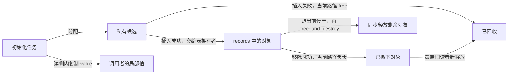
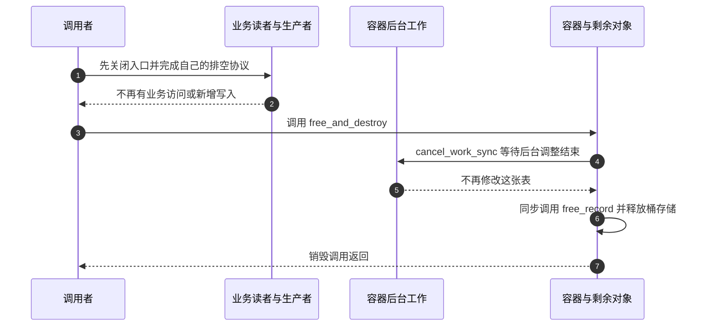

# 第8章\_rhashtable接口与回收实验

[P05](P05_动态伸缩的rhashtable_无感扩容的艺术.md)已经解释在线换表为何需要后继链、桶锁和链尾身份。这里把同一容器交给一个具体调用者：用 32 位编号保存 32 位值，拒绝重复编号，读出值，然后删除一项并完整退出。

本章是 P05 的实验分支，不重复实现内部迁移算法。先修包括模块构建、错误码、offsetof 和 P04 的 RCU 借用/销毁边界。源码统一从[哈希总索引](../../../../../research/source_reading/hash_table/navigation/P01_Linux_6.12_哈希计算源码阅读索引.md)进入，接口调用由[动态表模块导读](../../../../../research/source_reading/hash_table/navigation/P04_动态表迁移与接口边界导读.md#4.3_业务对象的回收不等于桶表回收)组织。

## 8.1\_先固定本例的拥有者

records 是模块持有的容器句柄；note_record 是独立分配的业务对象，node 只是嵌入成员。候选插入失败，添加路径直接释放；插入成功后，退出清理负责仍在表中的成员。移除成功的单个对象另走 synchronize_rcu 后释放，不能又留给退出回调释放第二次。

本例不导出设备、工作队列或中断回调给其他业务访问者。初始化和退出不会并行操作业务对象；内核自身的后台扩缩容仍可能与初始化插入重叠。这使我们能够先检查公开接口和资源所有权，不能把它冒充外部并发服务的完整关闭模板。



read_record 在读侧内复制 value，返回以后使用的是数值。移除路径在读侧内取得地址并完成成员撤下，退出读侧后才能调用可能等待的 synchronize_rcu。它继续持有 removed 地址的理由是已经取得唯一回收责任，且没有第二个业务删除者；不是因为离开读侧仍会自动受到保护。

## 8.2\_完整模块和失败清理

record_params 的两个偏移由 offsetof 得到，键只有一个 u32，不包含结构体填充。nelem_hint=3、min_size=4 给出小规模起点，max_size=64 是桶增长参数，不是全部内存预算。automatic_shrinking 允许实现按条件收缩；程序不读取内部 tbl 字段，也不要求 worker 在某条日志之前完成。

rhashtable_lookup_insert_fast 合并查重与插入，返回零才交出候选所有权；EEXIST 表示已有同键。ENOMEM 表示本例对象分配或相应插入资源失败，ENOENT 表示查无成员，EINVAL 表示参数或实验不变量错误。初始化接口按返回码检查；这个固定版本内部对首次桶分配还有最小表及非失败分配策略，不应把它概括成“任何时候都会立即返回 ENOMEM”。

```c
// SPDX-License-Identifier: GPL-2.0
/* 仅初始化任务使用业务对象；后台扩缩容仍可与它重叠。 */
#include <linux/module.h>
#include <linux/init.h>
#include <linux/rhashtable.h>
#include <linux/slab.h>
#include <linux/rcupdate.h>

struct note_record {
    u32 key;
    u32 value;
    struct rhash_head node;
};
static struct rhashtable records;
static const struct rhashtable_params record_params = {
    .head_offset = offsetof(struct note_record, node),
    .key_offset = offsetof(struct note_record, key),
    .key_len = sizeof(u32),
    .nelem_hint = 3,
    .min_size = 4,
    .max_size = 64,
    .automatic_shrinking = true,
};
static int fail_at;
module_param(fail_at, int, 0444);
MODULE_PARM_DESC(fail_at, "在第1到3次分配前失败，0不注入");

/* 表拥有已成功插入对象；未发布的候选仍由添加路径负责释放。 */
static int add_record(u32 key, u32 value)
{
    struct note_record *candidate;
    int error;

    candidate = kzalloc(sizeof(*candidate), GFP_KERNEL);
    if (!candidate)
        return -ENOMEM;
    candidate->key = key;
    candidate->value = value;
    error = rhashtable_lookup_insert_fast(&records, &candidate->node,
                                         record_params);
    if (error)
        kfree(candidate);
    return error;
}

/* 查找在读侧内复制值，返回值不是可逃逸的借用指针。 */
static int read_record(u32 key, u32 *value)
{
    struct note_record *record;
    int error = -ENOENT;

    rcu_read_lock();
    record = rhashtable_lookup(&records, &key, record_params);
    if (record) {
        *value = record->value;
        error = 0;
    }
    rcu_read_unlock();
    return error;
}

static void free_record(void *object, void *argument)
{
    (void)argument;
    kfree(object);
}

static int __init note_rhashtable_init(void)
{
    const u32 keys[] = { 10, 18, 26 };
    struct note_record *removed;
    u32 value, key = 18;
    unsigned int index;
    int error;

    if (fail_at < 0 || fail_at > 3)
        return -EINVAL;
    error = rhashtable_init(&records, &record_params);
    if (error)
        return error;
    for (index = 0; index < ARRAY_SIZE(keys); ++index) {
        error = -ENOMEM;
        if ((unsigned int)fail_at == index + 1)
            goto destroy;
        error = add_record(keys[index], keys[index] * 10);
        if (error)
            goto destroy;
    }
    error = add_record(18, 999);
    if (error != -EEXIST) {
        error = error ? error : -EINVAL;
        goto destroy;
    }
    error = read_record(18, &value);
    if (error)
        goto destroy;
    if (value != 180) {
        error = -EINVAL;
        goto destroy;
    }

    rcu_read_lock();
    removed = rhashtable_lookup(&records, &key, record_params);
    error = removed ? rhashtable_remove_fast(&records, &removed->node,
                                             record_params) : -ENOENT;
    rcu_read_unlock();
    if (error)
        goto destroy;
    /* 本模块没有第二个业务删除者，移除后由当前路径独占最终回收责任。 */
    synchronize_rcu();
    kfree(removed);
    error = read_record(18, &value);
    if (error != -ENOENT) {
        error = error ? error : -EINVAL;
        goto destroy;
    }
    pr_info("note_rhashtable: duplicate=EEXIST value18=180 removed=ENOENT\n");
    return 0;
destroy:
    /* 没有外部读者或生产入口；函数会停止该表的后台扩缩容工作。 */
    rhashtable_free_and_destroy(&records, free_record, NULL);
    return error;
}

static void __exit note_rhashtable_exit(void)
{
    rhashtable_free_and_destroy(&records, free_record, NULL);
}
module_init(note_rhashtable_init);
module_exit(note_rhashtable_exit);
MODULE_LICENSE("GPL");
MODULE_DESCRIPTION("rhashtable参数、去重、复制读取与对象回收教学模块");
```

同目录 Makefile 已包含 `obj-m += note_rhashtable.o`。GPL 许可证和模块参数宏沿用构建课程。失败注入发生在业务对象准备前，不伪装成内核桶分配器的实际故障。fail_at=2 时，第一项已经入表，失败标签必须销毁它和容器；不应只 free 当前候选后返回。

## 8.3\_预测日志并在匹配目标验证

从[实验材料](../../../../../labs/kernel/hash_table/materials/README.md)取用文件，按[模块构建课程](../../../../../engineering/build/kernel_modules/大纲.md)设置与目标匹配的 KDIR。先预测第二次添加 18 是否会覆盖原值，再运行：

```bash
make -C "$KDIR" M="$PWD" modules
sudo insmod ./note_rhashtable.ko
sudo dmesg | tail -n 12
sudo rmmod note_rhashtable
```

正常输出应包含 duplicate=EEXIST、value18=180、removed=ENOENT。它分别证明本次重复候选没有覆盖已发布值、复制读取获得原值、成功撤下以后同一次受控实验重新查找不到该键。输出不证明发生过真实扩容，也不证明任何负载下查找延迟恒定。

分别使用 fail_at=1、2、3 装载，预期 insmod 失败且已插入前缀被清理；没有成功装入时不执行 rmmod。随后不带注入参数重新装入，检查失败是否留下影响下一次初始化的状态。本例已做 ARM 语法和宿主分支检查时，也不能因此把这些命令标成目标已执行。

## 8.4\_为什么销毁表之前还需要关闭协议

free_and_destroy 的 free_record 在销毁调用中同步执行，本例不把这个模块函数排入 RCU 回调队列。旧桶表的异步释放则使用核心库的回调，不会调用 free_record。区分两种回调的拥有者，才能判断是否还需要等待模块回调代码。



这个时序的第一步由业务提供。本模块没有外部入口，因而条件已经成立；增加设备或其他线程之后就不再自动成立。停止插入不等于等待旧查找结束，等待 worker 也不等于等待任意业务读者。若其他路径排入了自己的 RCU 回调，模块退出还必须遵守 P04 的先停产、后排空回调协议。

如果只是要列出全部成员，应使用容器自己的 walker 契约，不把普通链表游标直接搬过来。resize 可使 walk 返回 EAGAIN，调用者要正确配对 start/stop/exit，并接受可能重访；需要稳定排序或严格一次的快照时，应另建符合业务要求的数据收集协议。这个旁支的版本入口见[布局与 walker 边界](../../../../../research/source_reading/hash_table/source_explanations/include/linux/rhashtable-types.h.md#1.3_遍历器与重复键分组)。

## 8.5\_练习和迁移条件

1. 把查重插入换成普通 insert_fast 后，为什么不能继续用原测试结果证明唯一性？
2. 把 read_record 改成返回裸对象指针，原来复制值的证明还成立吗？
3. 在移除成功后直接 kfree，哪些旧访问还可能存在？
4. 加一个用户可访问的入口，退出时应先证明哪些事实，再调用 free_and_destroy？
5. 把对象改成复合字节键时，应检查哪些偏移、填充和哈希/比较条件？

解答：第一题换掉了去重契约；第二题把独立值变回有寿命的借用地址；第三题要覆盖读侧和实现可能仍使用的旧路径；第四题要关闭发布入口、阻止新调用并等待已有业务使用者退出；第五题要把键的编码、完整比较、长度与对象布局视为同一个协议。完成这些条件以后，才能把这个受控实验扩展到真实服务。

返回[P05 迁移机制](P05_动态伸缩的rhashtable_无感扩容的艺术.md#5.4_一次迁移怎样保持可以继续查找)或[哈希大纲](../大纲.md)。
