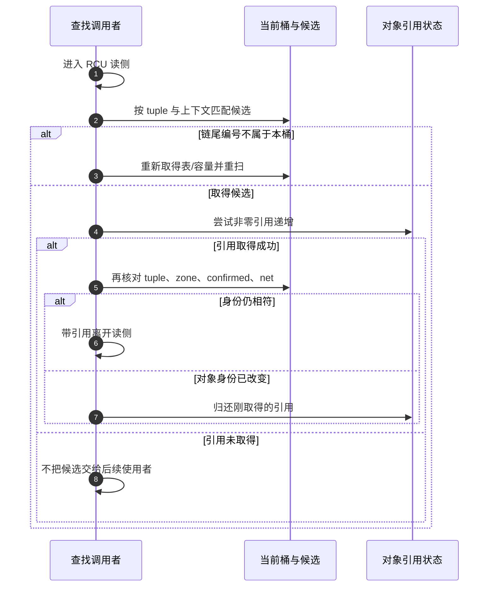

# 第6章\_哈希表在内核子系统中的影子(深度拆解篇)

前面已经证明，同桶不等于同键，得到指针不等于取得所有权，容器迁移也不替业务决定对象是否可用。现在把这三条结论带进真实子系统：同名文件、双向连接和相同邻居地址，各自需要什么上下文才能成为完整身份？

本章保留 PID 的近期版本核对，再比较三个实际使用场景。目标是学会追问“索引了什么、比较了什么、取得了什么保证”，不是把文件系统、连接跟踪和邻居状态机都压成哈希 API 教程。固定证据从[总索引](../../../../../research/source_reading/hash_table/navigation/P01_Linux_6.12_哈希计算源码阅读索引.md)和[子系统匹配导读](../../../../../research/source_reading/hash_table/navigation/P05_子系统索引身份与寿命导读.md#5.1_先区分索引任务与业务结论)进入。

## 6.1\_PID例子先教我们核对当前版本

进程编号 PID（Process ID）只有结合命名空间才具有确定身份。两个不同命名空间都可以存在编号 1，它们不必指向同一个进程。这个问题说明索引需要身份范围，却不能单凭它推出“内核必然使用某张全局哈希表”或“查找必须在常数时间内完成”。

本仓库固定的 NXP Linux 6.12.20 中，kernel/pid.c 的 find_pid_ns 调用 idr_find，从 ns->idr 查找编号；include/linux/pid_namespace.h 保存这份索引。struct upid 保存 nr 与 ns，没有旧稿的 pid_chain。因此不再把旧版本式 PID 哈希图与自造 pid_hashfn 当作本版本事实，章末也不能继续写“PID 使用静态哈希数组”。


本节保留近期已经讲清的结论，不因全仓重构而另造一套说法。当前证据见[PID 版本核对](../../../../../research/source_reading/hash_table/navigation/P02_键位宽与落桶导读.md#2.4_沿实际函数核对PID示例)。这里没有展开编号创建、命名空间和最终回收的完整协议。

## 6.2\_名称缓存匹配的是父目录中的一个名字

先看两个路径：/etc/app.conf 与 /opt/app.conf。最后一个分量相同，却属于不同父目录。名称缓存 dcache 保存的是“某个父 dentry 下的名字与名称状态”，不是整个文件内容，也不是脱离父对象的字符串字典。dentry 是路径名称对象；inode 是文件系统对象的另一层，不能因为 dentry 命中就把二者合并。

候选桶只能缩小范围。固定版本的 __d_lookup_rcu 在已有读侧保护中检查父对象、是否仍 hashed、名字的哈希/长度以及实际字节；文件系统有自定义比较时进入另一分支。它把观察到的 d_seq 序列值交给调用者，调用者还必须完成相应序列验证。函数返回地址并不表示它已经替上层取得了永久引用或证明后端名称永远有效。

这里用 hlist_bl_head 存桶入口，并把适用配置下的锁位放进头部指针低位，节省每桶独立锁对象的空间。写者仍需执行锁协议，读者还需 RCU 和序列验证；“没有单独字段”不等于没有执行、缓存一致性或检查成本。list_bl 的锁包装实际调用 bit_spin_lock，旧稿自行写的 test_and_set_bit 双循环不是这个版本原函数；单处理器和调试配置也不能一概按 64 位 SMP 解释。


普通哈希冲突只是继续比较桶内其他候选，不必立刻降级；名字比较失败也不直接等于磁盘读取。名称查找可能命中负 dentry（缓存不存在），可能需要文件系统 revalidate，也可能因为并发 rename 重新验证。后续文件系统甚至可能是内存或网络实现。完整名称状态和路径协议继续看[VFS 名称缓存](../../../../kernel_subsystems/vfs/P08_dcache与名称状态.md)与[RCU-walk](../../../../kernel_subsystems/vfs/P10_RCU-walk与ref-walk.md)，本章只承担哈希使用边界。

固定函数、位锁与返回序列的交接见[dcache 源码说明](../../../../../research/source_reading/hash_table/source_explanations/fs/dcache.c.md#1.1_候选匹配与序列交接)。没有在固定源码中确认旧稿所谓 hash_highbuffer_salt，本章撤下该名称及由它推出的安全保证，不用相似机制补猜。

## 6.3\_连接跟踪还要匹配网络上下文

连接跟踪 Conntrack 用于把包关联到受管理的连接状态，并为后续协议跟踪、地址转换或规则处理提供对象。地址转换 NAT（Network Address Translation）修改报文地址或端口，连接对象帮助关联转换前后的方向；它不是单凭一次哈希命中就宣布“这个包合法”。以 IPv4 上的传输控制协议 TCP（Transmission Control Protocol）为例，源/目的地址、源/目的端口和协议号构成常说的五元组；网络命名空间与 zone 还限定身份范围。zone 是连接跟踪的分区标识，同一网络命名空间内也可用不同分区隔离重复 tuple。其他协议的 tuple 表示由实际协议定义，不能假定所有成员都是 TCP 端口。

一个 nf_conn 保存原方向和应答方向两个 tuplehash 成员，各自的 hnnode 接入候选链。这样反向包可以找到同一连接对象。普通哈希冲突是不同 tuple 落到同桶，两个方向节点是同一对象承担的不同索引身份，两者不能混为“存了两份连接”。

固定版本的查找从 nf_conntrack_get_ht 取得当前共享表及容量，计算桶号，再逐项检查完整 tuple、zone、confirmed 状态和网络命名空间。旧稿访问 net->ct.hash/net->ct.htable_size 的片段不对应本次固定实现。hlist_nulls 的结束标记保存桶编号；若遍历落到另一桶的标记，回到开头重新取得表和容量并重扫，不把跨链当作完整查无。

取得候选后还有一层容易遗漏的交接：公开 find_get 路径在 RCU 保护下尝试 refcount_inc_not_zero，成功后 **再次核对身份**。这个对象分配协议允许地址在 RCU 观察期间被重新用于另一个对象；取得一个引用只能保证引用所指当前对象的寿命，不能自动证明它还是第一次匹配的连接。复核失败就放弃引用，不能把旧匹配结果沿用下去。



函数实现和错误路径见[连接跟踪匹配与引用](../../../../../research/source_reading/hash_table/source_explanations/net/netfilter/nf_conntrack_core.c.md#1.2_候选之后还要取得并复核)。它没有取消写者的锁，也没有把所有并发检查变成零成本。调用者获得连接对象后还须继续完成协议和策略判断。

## 6.4\_邻居地址还属于具体设备

在以太网的 IPv4 场景中，ARP（Address Resolution Protocol，地址解析协议）帮助把下一跳协议地址关联到链路地址；IPv6 有自己的邻居发现协议。内核通用邻居对象还记录有效性、探测、排队等状态，不只是一个 IP→MAC 的永久常量表。

同一个地址可以出现在不同链路上。固定 ___neigh_lookup_noref 先用地址、设备及当前哈希表种子选桶，沿 next 查找，最终要求 n->dev == dev 且 key_eq 成立。容器类型为 neigh_table，具体版本为 neigh_hash_table，业务对象为 neighbour，不能虚构成 struct neighbour_table。带引用的 neigh_lookup 另尝试非零引用递增；取得对象也不等于其链路地址已经解析成功或当前可达。


垃圾回收 GC（Garbage Collection）在数量和时间条件下尝试清理对象，还要尊重引用和状态。超过阈值不等于一定有可删除的旧项；无可回收资源时，分配可能失败。随机种子也是具体哈希表分配的状态，不能把它写成“所有网络索引每隔几分钟自动换种子”。

固定查找与引用入口见[邻居源码说明](../../../../../research/source_reading/hash_table/source_explanations/net/core/neighbour.c.md#1.1_设备和协议地址共同匹配)。本章不展开完整探测状态机、报文队列和设备退出协议，不把这个索引例子当成 ARP/IPv6 教程。

## 6.5\_用C程序验证完整身份的必要性

下面使用本地整数标签代替父对象、网络命名空间和设备身份。地址也是便于比较的数值，不是报文序列化格式。模型只检查哪些字段共同决定相等，不实现内核哈希、协议状态、引用或权限。

```c
/* 只验证完整身份的比较；数值标签模拟对象/命名空间身份，不模拟内核哈希或网络处理。 */
#include <assert.h>
#include <stdbool.h>
#include <stdint.h>
#include <stdio.h>
#include <string.h>

struct name_key {
    unsigned int parent_id;
    const char *component;
};
struct flow_key {
    unsigned int net_id, zone;
    uint32_t source, destination;
    uint16_t source_port, destination_port;
    uint8_t protocol;
};
struct neighbour_key {
    unsigned int device_id;
    uint32_t address;
};

static bool same_name(struct name_key a, struct name_key b)
{
    return a.parent_id == b.parent_id &&
           strcmp(a.component, b.component) == 0;
}
static bool same_flow(struct flow_key a, struct flow_key b)
{
    return a.net_id == b.net_id && a.zone == b.zone &&
           a.source == b.source && a.destination == b.destination &&
           a.source_port == b.source_port &&
           a.destination_port == b.destination_port &&
           a.protocol == b.protocol;
}
static bool same_neighbour(struct neighbour_key a, struct neighbour_key b)
{
    return a.device_id == b.device_id && a.address == b.address;
}

int main(void)
{
    struct name_key first_name = { 1, "app.conf" };
    struct name_key second_name = { 2, "app.conf" };
    assert(!same_name(first_name, second_name));
    second_name.parent_id = 1;
    assert(same_name(first_name, second_name));
    second_name.component = "other.conf";
    assert(!same_name(first_name, second_name));

    struct flow_key first_flow = { 1, 7, 10, 20, 3000, 443, 6 };
    struct flow_key second_flow = first_flow;
    assert(same_flow(first_flow, second_flow));
    second_flow.net_id = 2;
    assert(!same_flow(first_flow, second_flow));
    second_flow = first_flow;
    second_flow.zone = 8;
    assert(!same_flow(first_flow, second_flow));
    second_flow = first_flow;
    second_flow.source_port = 3001;
    assert(!same_flow(first_flow, second_flow));

    struct neighbour_key first_neighbour = { 1, 10 };
    struct neighbour_key second_neighbour = { 2, 10 };
    assert(!same_neighbour(first_neighbour, second_neighbour));
    second_neighbour.device_id = 1;
    assert(same_neighbour(first_neighbour, second_neighbour));
    puts("九项身份比较通过；键相等不等于权限、协议状态或链路可用");
    return 0;
}
```

```bash
cc -std=c11 -Wall -Wextra -Werror -pedantic identity_key_model.c -o identity_key_model
./identity_key_model
```

预期九项比较通过。把 same_name 的父身份比较去掉，第一项就会把两个 app.conf 混为一体；去掉 same_flow 的 net_id 或 zone，会混淆不同隔离范围；去掉邻居设备条件，会把另一个链路的条目当成本地结果。即使全部比较通过，最后仍没有得到“权限允许”“TCP 状态有效”或“链路可达”的证明。

## 6.6\_随机化和性能结论要回到各自实现

Conntrack 的 hash_conntrack_raw 使用一次性初始化的 SipHash 密钥，再结合 zone 与 net 的混合值计算。它改善可预测映射的风险边界，但不能把哈希函数安全性等同于整个防火墙安全，也不自动给出最坏查询时间。邻居表在分配新哈希版本时生成自己的种子；dcache 使用另一套名称哈希与文件系统比较协议。不能用其中一个路径的字段名字或更新时间概括全部子系统。

选择一个真实应用时，依次写下：完整身份是什么；桶号之外还比较什么；对象可在何种保护下使用；哪些业务有效性判断仍未完成；分配和增长达到限制时怎样失败。这个顺序比记住“进程最快、文件最省、网络最安全”的口号更能帮助你读懂代码。

练习：一个相同 tuple 在不同 net 或 zone 下是否应匹配？负 dentry 是否意味着根本没有缓存对象？邻居引用取得成功是否证明 MAC 可用？连接引用取得后为何还要重查身份？

答案分别是：应按所属范围区分；负 dentry 本身就是名称结果对象；引用只解决寿命；可复用地址需要在引用稳住以后重新确认身份。上一篇：[动态容量](../P03_高级进阶与性能调优/P05_动态伸缩的rhashtable_无感扩容的艺术.md)。下一篇：[固定桶完整模块](P07_内核模块实战指南.md)。返回[大纲](../大纲.md)。
