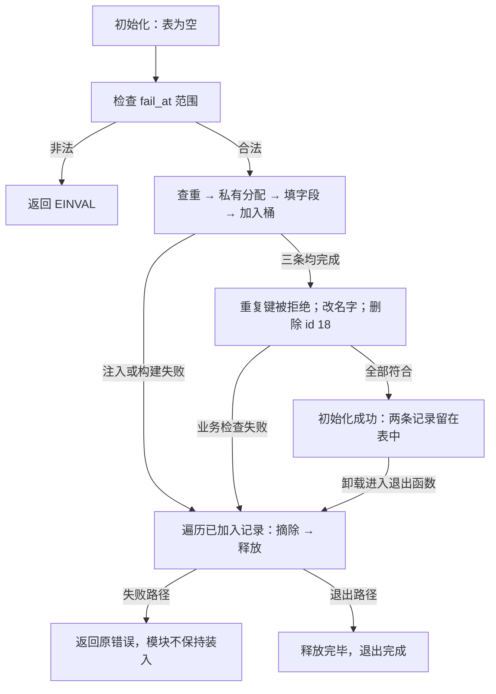

# 第7章\_内核模块实战指南

<span style="color:red;">本章只是凑数的，为了让这个主题完整，我没有让 ai 帮忙生成可靠的示例代码，简单看看即可。</span>

以上人工批注保留评审历史。本轮已补完整程序和适用检查，但作者修订不能替代开发者重新阅读，也不能把批注擅自升级为评审完成。

上一章表明，桶只帮助缩小候选集，键比较和对象寿命仍由调用者负责。现在用三个私有任务记录完成一次增、查、改、删与回滚。先把对象责任闭合，再考虑外部并发入口；本例不提供字符设备、网络服务或共享查询接口。

## 7.1\_先限定谁拥有对象

每条记录有编号 id、名字 name 和嵌入的 node。编号是完整键；名字是可修改的业务字段。固定八个桶保存节点入口，记录本身由 kzalloc 分配。模块初始化期间只有当前初始化路径访问它们；成功后没有后台任务，退出路径负责剩余对象。因此查找返回的裸指针仅在当前串行操作内使用。

这与“机器只有一个 CPU”无关。即使多 CPU 机器，其他 CPU 也没有访问本表的入口；反过来，即使单 CPU，加入可抢占任务或中断入口后，也必须重新建立访问协议。当前使用 GFP_KERNEL 是因为初始化可以睡眠，并未持自旋锁。未来是否使用互斥锁、自旋锁、RCU 或预分配，应先确定调用上下文和读写契约，不能凭“内核代码”直接选锁。

| 阶段 | 对象地址与状态 | 唯一写者和后续动作 |
| --- | --- | --- |
| T0 尚未分配 | 表中没有该 id | add_task 先查重 |
| T1 私有构建 | kzalloc 返回的对象尚未连入桶 | 填 id 和完整名字；失败直接释放 |
| T2 已加入 | table[bucket] 经 node 能到达对象 | 串行操作查找、改名字或摘除 |
| T3 已摘除 | hash_del 已移除入口 | 当前拥有者立即 kfree |
| F 初始化失败 | 已加入的其他记录仍在表中 | clear_tasks 逐项摘除并释放，返回错误 |

这里不需要额外通知或宽限期，因为没有另一个参与者借用对象。增加外部读者会改变这个前提，届时必须回到[P04 的寿命协议](../P03_高级进阶与性能调优/P04_并发保护与RCU机制_多核下的读写博弈.md)，不能照搬 T3。

## 7.2\_完整模块和失败出口

代码继续使用 P02 已讲过的 DEFINE_HASHTABLE 数组定义宏、INIT_HLIST_NODE 节点初始化宏和 HASH_SIZE 桶数宏；ARRAY_SIZE 取得输入数组长度。模块注册、参数说明 MODULE_PARM_DESC、许可证和描述宏沿用构建课，不承担哈希协议。下面的负错误码分别表示重复键 EEXIST、分配失败 ENOMEM、名字过长 E2BIG、键不存在 ENOENT 和参数非法 EINVAL；先知道失败含义，再追踪各出口如何归还已取得资源。

[源码总索引](../../../../../research/source_reading/hash_table/navigation/P01_Linux_6.12_哈希计算源码阅读索引.md)固定 NXP Linux 6.12.20 的证据身份；本例使用的数组与遍历宏见[hashtable.h 讲解](../../../../../research/source_reading/hash_table/source_explanations/include/linux/hashtable.h.md#1.1_数组身份与初始化)。保存为[note_hash_table.c](../../../../../labs/kernel/hash_table/materials/note_hash_table.c)，以下是完整文件：

```c
// SPDX-License-Identifier: GPL-2.0
/* 私有固定桶实验：没有外部入口，初始化与退出串行，业务对象由本模块独占。 */
#include <linux/module.h>
#include <linux/init.h>
#include <linux/hashtable.h>
#include <linux/slab.h>
#include <linux/string.h>

struct note_task {
    u32 id;
    char name[32];
    struct hlist_node node;
};
static DEFINE_HASHTABLE(task_table, 3);
static int fail_at;
module_param(fail_at, int, 0444);
MODULE_PARM_DESC(fail_at, "在第1到3次添加前失败，0不注入");

static struct note_task *find_task(u32 id)
{
    struct note_task *task;

    hash_for_each_possible(task_table, task, node, id)
        if (task->id == id)
            return task;
    return NULL;
}
static int add_task(u32 id, const char *name)
{
    struct note_task *task;

    if (find_task(id))
        return -EEXIST;
    task = kzalloc(sizeof(*task), GFP_KERNEL);
    if (!task)
        return -ENOMEM;
    task->id = id;
    if (strscpy(task->name, name, sizeof(task->name)) < 0) {
        kfree(task);
        return -E2BIG;
    }
    INIT_HLIST_NODE(&task->node);
    hash_add(task_table, &task->node, task->id);
    return 0;
}
static int rename_task(u32 id, const char *name)
{
    struct note_task *task = find_task(id);
    char candidate[32];

    if (!task)
        return -ENOENT;
    /* 先在私有缓冲区验证；过长输入不破坏已发布的旧名字。 */
    if (strscpy(candidate, name, sizeof(candidate)) < 0)
        return -E2BIG;
    strscpy(task->name, candidate, sizeof(task->name));
    return 0;
}
static int remove_task(u32 id)
{
    struct note_task *task = find_task(id);

    if (!task)
        return -ENOENT;
    hash_del(&task->node);
    kfree(task); /* 没有并发借用者，摘除后由唯一拥有者直接释放。 */
    return 0;
}
static void clear_tasks(void)
{
    struct note_task *task;
    struct hlist_node *next;
    unsigned int bucket;

    hash_for_each_safe(task_table, bucket, next, task, node) {
        hash_del(&task->node);
        kfree(task);
    }
}
static int __init note_hash_table_init(void)
{
    const u32 ids[] = { 10, 18, 26 };
    const char *const names[] = { "task10", "task18", "task26" };
    struct note_task *task;
    unsigned int index;
    int error;

    if (fail_at < 0 || fail_at > 3)
        return -EINVAL;
    for (index = 0; index < ARRAY_SIZE(ids); ++index) {
        error = -ENOMEM;
        if ((unsigned int)fail_at == index + 1)
            goto fail;
        error = add_task(ids[index], names[index]);
        if (error)
            goto fail;
    }
    error = add_task(18, "duplicate");
    if (error != -EEXIST) {
        error = error ? error : -EINVAL;
        goto fail;
    }
    error = rename_task(18, "renamed18");
    if (error)
        goto fail;
    task = find_task(18);
    if (!task || strcmp(task->name, "renamed18")) {
        error = -EINVAL;
        goto fail;
    }
    pr_info("note_hash_table: id=%u name=%s buckets=%zu\n",
            task->id, task->name, HASH_SIZE(task_table));
    error = remove_task(18);
    if (error)
        goto fail;
    if (find_task(18)) {
        error = -EINVAL;
        goto fail;
    }
    pr_info("note_hash_table: duplicate=EEXIST removed18=absent\n");
    return 0;
fail:
    clear_tasks();
    return error;
}
static void __exit note_hash_table_exit(void)
{
    clear_tasks();
}
module_init(note_hash_table_init);
module_exit(note_hash_table_exit);
MODULE_LICENSE("GPL");
MODULE_DESCRIPTION("私有固定桶的增删查改与失败回滚教学模块");
```

先顺着 add_task 阅读：同 id 直接返回 EEXIST；分配失败返回 ENOMEM；strscpy 检查能否连同结尾零字节完整保存名字，过长返回 E2BIG 并释放私有对象。只有构建完成才 hash_add。查重与插入在本例串行，所以中间无人插入同键；有并发写者时，两步必须纳入同一排他协议，单独给 hash_add 加锁并不够。

rename_task 先把新名字复制到栈上候选缓冲区。若直接复制进已登记对象，strscpy 虽然保证截断后的字符串终止，仍会破坏旧名字；本例先验证再替换，使“输入过长”保持原值。修改 id 则不是同一操作：id 决定桶位置，原地改键会使下一次查找去别的桶，必须摘下后按新键重新加入，并重新检查重复。

remove_task 查无记录返回 ENOENT；找到后先摘除再释放。clear_tasks 使用 safe 遍历，先保存下一节点，才释放当前记录。safe 只保护本次遍历游标，不阻止另一个 CPU 释放下一对象。本例的真正寿命保证来自唯一拥有者。

## 7.3\_构建运行与失败后的重试

先完成[模块构建课程](../../../../../engineering/build/kernel_modules/大纲.md)。KDIR 指向已经按目标配置准备的内核构建目录；运行内核、配置、架构和模块产物必须匹配。材料目录的 Makefile 已包含本例，可从仓库根执行：

```bash
# 本机运行的内核已有对应构建目录时使用这个入口。
make -C "/lib/modules/$(uname -r)/build" M="$PWD/labs/kernel/hash_table/materials" modules
sudo insmod labs/kernel/hash_table/materials/note_hash_table.ko
sudo dmesg | tail -n 20
sudo rmmod note_hash_table

# 初始化第二条记录前失败：第一条必须被回收，模块不会保持装入。
sudo insmod labs/kernel/hash_table/materials/note_hash_table.ko fail_at=2
# 上一条预期失败；随后正常加载，验证失败没有留下本模块的表状态。
sudo insmod labs/kernel/hash_table/materials/note_hash_table.ko
sudo rmmod note_hash_table
```

交叉构建时按构建课传入目标 ARCH、CROSS_COMPILE 和 KDIR，模块复制到对应测试系统后再装载。不要把宿主头文件编译出的模块放到 ARM 目标上，也不要为本例修改外部内核树。

正常日志应包含 id=18、name=renamed18、buckets=8，以及 duplicate=EEXIST、removed18=absent。后者说明显式删除已生效；另外两条记录仍由退出路径回收。日志不是内存泄漏检测器，也不是性能数据。fail_at=1、2、3 分别在已有零、一、两条记录时进入共同回滚出口；非法范围返回 EINVAL。参数注入没有真的让内核分配器失败，真实内存压力是另一种实验。

当前作者检查包含 C 分支替身与 ARM 头文件语法核对；实际 Kbuild、MODPOST、目标装卸和泄漏观察的执行情况以[工作记录](../../../../../governance/migration/repository_textbook_refactor.md)为准，不能把上面的预期输出当成目标运行日志。

## 7.4\_一次成功和一次失败怎样汇合



失败路径和退出路径共享清理函数，但触发不同：初始化失败后不会依赖模块退出函数替你回滚。表的静态初始化提供空桶；每次成功分配都必须在某个出口与一次释放配对。查重失败没有分配，因此不能无条件释放一个不存在的新对象。

## 7.5\_练习和选择边界

1. 把 fail_at 依次设为 1、2、3，先预测退出前有多少对象需要回收，再执行。答案分别为零、一、二；不要仅凭 insmod 都返回失败就认为三条路径等价。
2. 用超过 31 字节的名字尝试添加和改名，两者应返回什么？添加释放新对象，改名保留旧名字；这就是先构建再发布与先验证再修改的区别。
3. 在查重与插入间加入第二个写者，写出两次查重都未命中的交错。用一个保护完整事务的锁修复；再检查分配能否在该锁内睡眠。
4. 让查询者把指针带出调用返回，解释为什么现在不能立即 kfree。需要规定借用范围、引用取得或延后回收，不能仅把 hash_del 换成 RCU 版本。

本例完成的是固定键、固定桶和私有生命周期。八个桶不是对任意千条记录的性能承诺，容量选择仍需看键分布、负载和预算。需要在线换表时转到[P08 完整动态表实验](../P03_高级进阶与性能调优/P08_rhashtable接口与回收实验.md#8.1_先固定本例的拥有者)；它保留业务对象责任，同时把桶存储的迁移交给 rhashtable。返回[专题大纲](../大纲.md)可按需要复查节点或并发前提。
