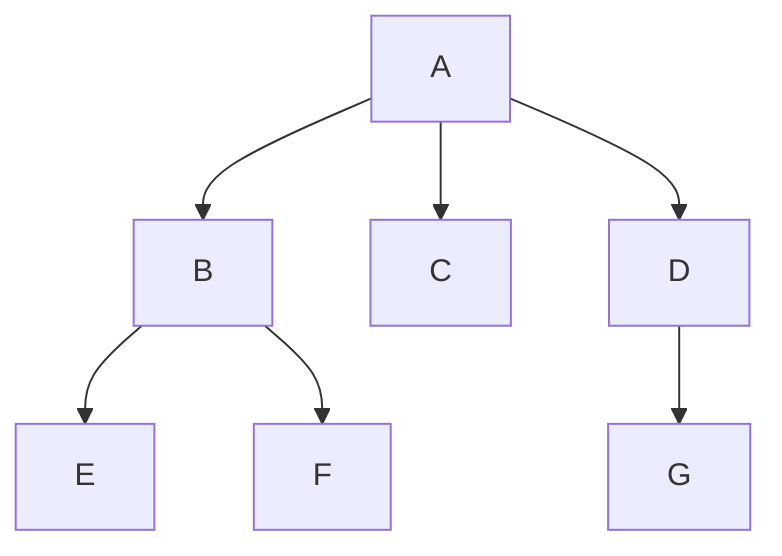
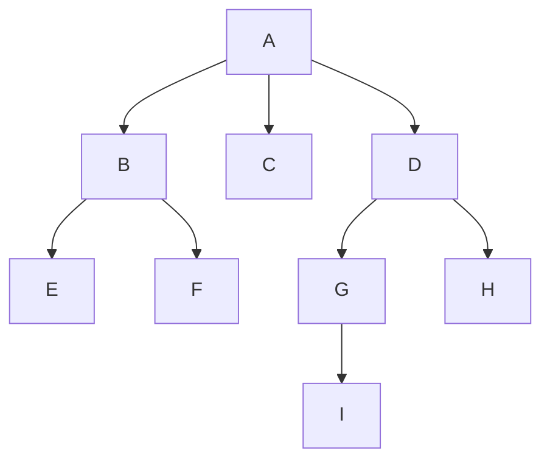
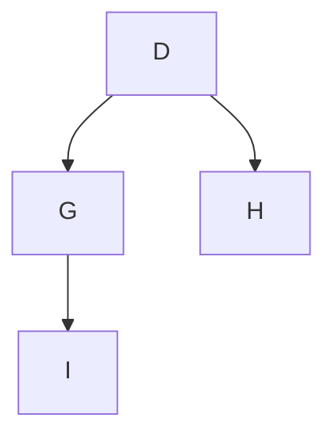
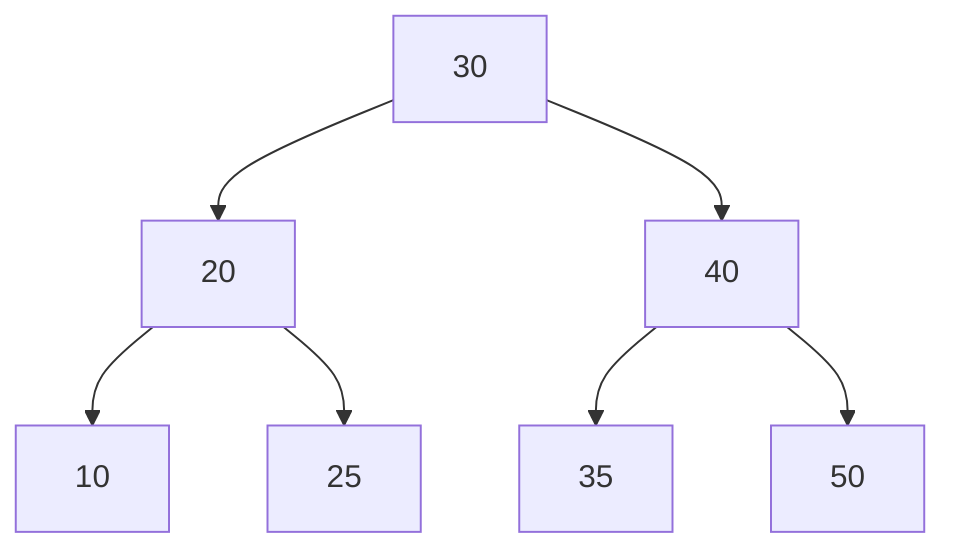
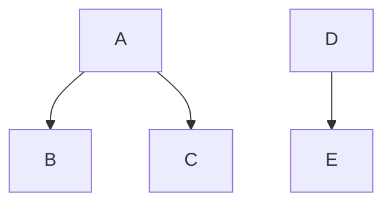
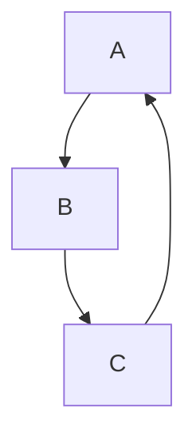
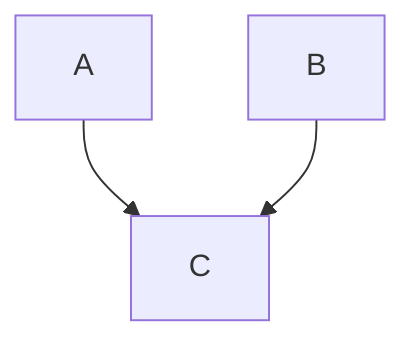
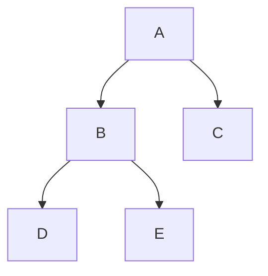
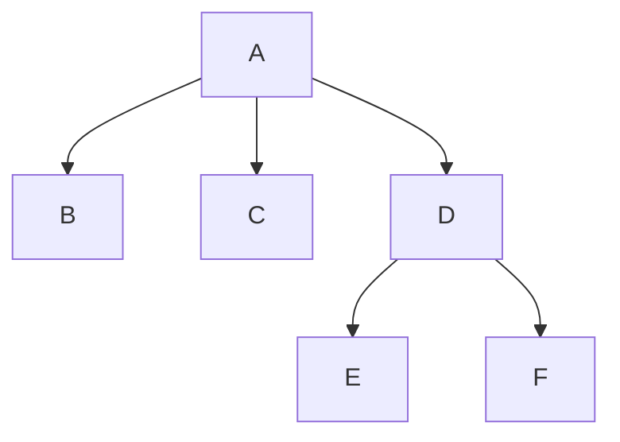
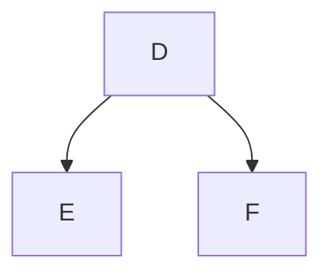

# 第1章\_树的基本概念

## 1.1\_章节内容说明

数组按位置保存元素，链表用连接表达顺序；现在若要描述一个目录里包含哪些子目录，仅有前后关系就不够。我们先区分“谁包含谁”与“节点放在哪里”，再用同一组 A～I 节点追踪路径、子树与高度。

本章是整条学习路径的起点。后续你要学习的：

- 二叉树
- 二叉搜索树
- 旋转
- 2-3-4 树
- 红黑树
- Linux 内核 `rbtree`

都建立在本章之上。


本章范围如下：

- 从层级关系建立树的定义和递归结构。
- 用同一张图辨认父子、兄弟、深度、高度与子树。
- 用断开、共享和成环的反例检验结构约束。
- 在后续[表示与实验](P16_普通树的表示与构建实验.md)中比较存储方案，运行完整 C 程序。

本章不要求先理解后面列出的树家族。这些名字只是未来路线；当前只需 C 结构体、指针、数组和基本函数调用。

------

## 1.2\_什么是树

目录例子提出了“一个上级可以拥有多个下级”的需求。先把这种关系的合法条件说清，再比较它与线性结构；否则只有一张分叉图，还不能判断共享节点或回路为什么不属于本章的树。

### 1.2.1\_树的定义

在数据结构中，**树（Tree）** 是一种由节点组成的**层级型非线性结构**。它满足以下基本特征：

1. 整体中存在一个特殊节点，称为**根节点（Root）**
2. 除根节点外，每个节点有且仅有一个直接前驱节点，称为它的**父节点（Parent）**
3. 每个节点可以有零个、一个或多个直接后继节点，称为它的**子节点（Child）**
4. 节点之间不存在回路
5. 整体是连通的

把这些约束合起来，可以得到一个更严格的表述：

> 树是一个有限节点集合；若该集合非空，则存在且仅存在一个根节点，其余节点被划分为若干个互不相交的子集合，每个子集合本身又是一棵树。

这个定义里最重要的不是字面形式，而是两个核心点。

第一，树是 **层级结构**。
树不是把元素排成一条线，而是把元素组织成“上层—下层”的层级关系。

第二，树是 **递归结构**。
一棵树的某个子节点下面挂着的整块结构，本身仍然是一棵树。这一点在后面会直接影响：

- 二叉树定义
- 遍历
- 递归算法
- BST 查找
- 红黑树旋转后的局部子树重挂接

------

### 1.2.2\_树与数组\_链表的结构差异

为了避免把树看成“只是节点多一点的链表”，这里先把它与常见线性结构严格区分。

#### (1)\_数组的结构特点

数组的典型特征是：

- 元素按逻辑顺序排列
- 通常对应一段连续存储区域
- 通过下标定位元素
- 一个元素通常只有“前一个”和“后一个”的线性邻接关系

数组强调的是：

> 顺序位置

例如第 `i` 个元素、第 `i + 1` 个元素。

------

#### (2)\_链表的结构特点

链表的典型特征是：

- 节点通过指针串接
- 整体仍然是线性关系
- 当前节点通常只直接知道下一个节点，或前后两个节点
- 路径通常是单条推进

链表强调的是：

> 线性连接

你从头结点出发，沿着 `next` 一直走，是一条线。

------

#### (3)\_树的结构特点

树与数组、链表最本质的差异在于：

- 一个节点下面可以分出多个方向
- 节点关系不是单条线，而是层级展开
- 某个节点的位置不是“前后”，而是“父、子、兄弟、祖先、后代”
- 访问路径不是固定线性推进，而是沿分支进行选择

所以树强调的是：

> 层级关系 + 分支关系

这也是为什么树非常适合表达如下结构：

- 文件系统目录
- 语法结构
- 组织层级
- 查找结构
- 编译器语法树
- 设备树的层级节点关系
- 各种索引结构

------

### 1.2.3\_树适合解决什么类型的问题

树适合处理的不是任意数据，而是具有以下特征的数据组织问题。

#### (1)\_天然存在层级关系

例如目录系统：

- `/`
  - `/home`
  - `/etc`
  - `/usr`

这里不是线性平铺关系，而是明确的上级目录和下级目录关系。

#### (2)\_需要逐层缩小范围

例如查找结构中：

- 先比较当前节点
- 再决定进入左边还是右边
- 再在子树中继续比较

BST、AVL、红黑树都属于这一类。

#### (3)\_整体由局部递归组成

例如一棵树上的任意节点往下看，形成的结构仍然符合“树”的定义。

这使得很多树算法天然适合用递归描述，例如：

- 计算高度
- 遍历所有节点
- 销毁整棵树
- 在子树中查找目标节点

------

### 1.2.4\_树为什么是非线性结构

“非线性结构”这个词不能只停留在术语层面，必须具体解释它的含义。

所谓非线性，不是说“看起来复杂”，而是说：

> 一般树的父子关系本身不规定一个全体节点的线性前后顺序。

在数组和链表里，你总能自然地说：

- 谁在谁前面
- 谁在谁后面

但在树里，这种描述通常不成立。

例如下面这棵树：



对于这棵树：

- `B`、`C`、`D` 是同一层的兄弟节点
- `E`、`F` 是 `B` 的子节点
- `G` 是 `D` 的子节点

这时候你不能像数组那样问：

- `E` 是否“在” `D` 前面
- `G` 是否“在” `C` 后面

因为树中更自然的描述是：

- `E` 是 `B` 的后代
- `D` 是 `G` 的父节点
- `B` 和 `D` 同层但分属不同分支

所以树的核心不是“全局线性顺序”，而是：

- 局部层级关系
- 分支组织关系
- 路径连接关系

------

### 1.2.5\_树的递归定义为什么重要

这部分是后面学习所有树算法的关键。

树的递归定义可以表述为：

- 一棵树由一个根节点和若干棵子树组成
- 每一棵子树本身仍是一棵树

这个定义带来三个直接结果。

#### (1)\_树算法天然适合递归

例如计算节点总数时，你并不需要从全局构造一个特别复杂的逻辑。你可以写成：

- 当前节点算 1 个
- 再分别计算每棵子树的节点数
- 最后求和

#### (2)\_局部操作可以独立成立

例如你以后学旋转时，旋转影响的是某个局部子树，但旋转后该局部结构仍然是一棵合法子树，然后再重新挂回原位置。

#### (3)\_树上的很多性质都能递归定义

例如：

- 一棵树的高度 = 其各子树高度最大值 + 1
- 一棵树是否为空树
- 一个节点是否为叶子节点
- 一棵二叉树是否满足 BST 性质

所以你后面如果遇到“树为什么总喜欢用递归写”，本质原因不在于编程技巧，而在于：

> 树本身就是递归定义的数据结构。

------

## 1.3\_树的基本术语

这一节必须打牢。
后面你学红黑树时，所有描述都会频繁出现这些词：

- 根节点
- 父节点
- 子节点
- 兄弟节点
- 祖先
- 后代
- 深度
- 高度
- 层次
- 路径
- 子树

如果这些术语不稳定，后面看任何图都会混乱。

为了统一说明，先用下面这棵树作为基准图。



------

### 1.3.1\_根节点\_父节点\_子节点\_兄弟节点

#### (1)\_根节点

根节点是整棵树最顶层的节点。它的特点是：

- 没有父节点
- 是整棵树的起点
- 任何其他节点都可以看作从根节点出发到达

在上图中：

- `A` 是根节点

根节点的作用是定义整棵树的入口。很多树操作都是从根开始的，例如：

- 查找
- 插入
- 删除
- 遍历

以后你写树代码时，通常会有一个根指针，例如：

```c
struct tree_node *root;
```

如果 `root == NULL`，就表示这棵树为空。

如果根指针是调用者唯一保存的入口，丢失它就会失去从该入口到达节点的路径，动态分配的对象还可能因此无法回收。若外部另有索引或引用，仍可能找回对象；不能把“丢失一个入口”直接等同所有地址都不可达。

------

#### (2)\_父节点

如果节点 `X` 直接连到节点 `Y`，且方向是 `X -> Y`，那么：

- `X` 是 `Y` 的父节点
- `Y` 是 `X` 的子节点

在上图中：

- `A` 是 `B`、`C`、`D` 的父节点
- `B` 是 `E`、`F` 的父节点
- `D` 是 `G`、`H` 的父节点
- `G` 是 `I` 的父节点

父节点描述的是**直接上一级关系**。注意，父节点不是任意上层节点，而是紧邻的上一级。

后续在红黑树中：

- 旋转需要修改父子关系
- 插入修复需要看父节点颜色
- 删除修复需要沿父链向上处理

所以“父节点”不是附属术语，而是核心结构信息。

如果父指针维护错误，会导致：

- 节点重新挂接失败
- 向上回溯逻辑错误
- 修复过程走错分支
- 根节点更新错误

------

#### (3)\_子节点

子节点是某个节点直接连接到的下一级节点。

在上图中：

- `B`、`C`、`D` 是 `A` 的子节点
- `E`、`F` 是 `B` 的子节点

子节点定义了从上到下的扩展方向。

后续学习中：

- 普通树：一个节点可能有多个子节点
- 二叉树：一个节点最多两个子节点
- BST：通过比较决定进入左子树还是右子树
- 红黑树：旋转本质上就是重排父节点与子节点之间的连接

子节点挂接错误会直接破坏树形结构，例如：

- 节点丢失
- 形成断链
- 形成非法共享子树
- 形成环路

------

#### (4)\_兄弟节点

具有**同一个父节点**的节点互为兄弟节点。

在上图中：

- `B`、`C`、`D` 互为兄弟节点
- `E`、`F` 互为兄弟节点
- `G`、`H` 互为兄弟节点

注意：

- 兄弟节点要求父节点相同
- 仅处于同一层但父节点不同，不算兄弟节点

例如：

- `E` 和 `G` 虽然都不高，但它们不是兄弟节点，因为父节点不同

兄弟关系在后续非常重要，尤其是在红黑树删除修复里，“兄弟节点”的颜色与孩子分布决定修复分支。

------

### 1.3.2\_叶子节点\_内部节点

#### (1)\_叶子节点

没有任何子节点的节点，称为叶子节点。

在基准图中：

- `C`
- `E`
- `F`
- `H`
- `I`

都是叶子节点。

叶子节点表示某条分支的终点。很多递归终止条件都会写成：

- 如果当前节点为空，返回
- 如果当前节点是叶子，进行特定处理

后续你会看到：

- BST 插入最终总是插到某个空位置，等价于成为叶子或外部位置节点
- 2-3-4 树的插入通常落在叶层
- 红黑树教材里经常引入 NIL 叶子节点作为统一边界处理

如果对叶子的判断错误，典型问题包括：

- 遍历越界
- 递归不终止
- 插入位置判断错误
- 删除边界处理错误

------

#### (2)\_内部节点

至少有一个子节点的节点，称为内部节点。

在基准图中：

- `A`
- `B`
- `D`
- `G`

都是内部节点。

内部节点代表结构中的中间决策位置。
在查找树中，内部节点往往承担“比较—分支”的作用。

例如在 BST 里：

- 当前节点比目标值大，就进入左子树
- 当前节点比目标值小，就进入右子树

这时内部节点就是一个判断点。

------

### 1.3.3\_节点的度\_树的度

#### (1)\_节点的度

一个节点拥有的子节点数量，称为该节点的**度**。

在基准图中：

- `A` 的度为 3
- `B` 的度为 2
- `C` 的度为 0
- `G` 的度为 1

度用来刻画节点的分支能力。

#### (2)\_树的度

一棵树中所有节点的度的最大值，称为这棵树的度。

在基准图中：

- 最大度是 `A` 的 3
- 所以整棵树的度为 3

这有助于区分树的类别。

例如：

- 普通树：节点度可以大于 2
- 二叉树：节点度最大只能是 2

所以“二叉树”不是说每个节点都恰好两个孩子，而是说：

> 每个节点最多两个孩子，并且左右孩子位置有区分；只有度数上限还不足以说明完整的二叉树约定。

------

### 1.3.4\_路径与路径长度

#### (1)\_路径

从一个节点到另一个节点所经过的节点序列，称为路径。

例如在基准图中，从 `A` 到 `I` 的路径为：

- `A -> D -> G -> I`

#### (2)\_路径长度

路径上经过的边数，通常称为路径长度。

对于路径：

- `A -> D -> G -> I`

它经过 3 条边，所以路径长度为 3。

路径很重要，因为后续几乎所有树的效率分析都和路径长度有关。

例如在 BST 里，查找某个值时：

- 每比较一次，向下一层
- 实际消耗与从根走到目标节点的路径长度有关

在红黑树里：

- 平衡性的目标，本质上就是控制从根到叶子的路径不要过长
- “黑高”也是路径维度上的计数概念

所以你必须把“路径”理解为：

> 树上一次操作实际走过的结构轨迹。

------

### 1.3.5\_深度\_高度\_层次

这几个概念最容易混。必须单独讲清。

#### (1)\_节点的深度

从根节点到该节点所经过的边数，称为该节点的深度。

在基准图中：

- `A` 的深度是 0
- `B`、`C`、`D` 的深度是 1
- `G`、`H` 的深度是 2
- `I` 的深度是 3

也就是说：

> 深度是从上往下看，某个节点距离根有多远。

------

#### (2)\_节点的高度

从该节点到其最远叶子节点的最长路径边数，称为该节点的高度。

在基准图中：

- `I` 的高度是 0
- `G` 的高度是 1
- `D` 的高度是 2
- `A` 的高度是 3

也就是说：

> 高度是从下往上量，某个节点下面还能延伸多深。

------

#### (3)\_树的高度

根节点的高度，通常也称为整棵树的高度。

所以基准图整棵树的高度是：

- 3

------

#### (4)\_层次

层次有两种常见定义方式：

1. 根节点为第 1 层
2. 根节点为第 0 层

教材和代码里都可能出现。后续学习时必须始终注意作者采用哪一种。

如果按“根为第 1 层”来算，那么基准图中：

- `A` 在第 1 层
- `B`、`C`、`D` 在第 2 层
- `G`、`H` 在第 3 层
- `I` 在第 4 层

------

#### (5)\_深度与高度不要混淆

这两个概念常被误写。

| 概念 | 方向               | 含义                 |
| ---- | ------------------ | -------------------- |
| 深度 | 根到当前节点       | 节点离根多远         |
| 高度 | 当前节点到最远叶子 | 节点下面还能延伸多深 |

这个区别在后续很关键，因为：

- 分析查找代价时，经常看深度
- 分析树整体是否过高时，经常看高度
- 分析平衡性时，本质上在控制高度

------

### 1.3.6\_子树与森林

#### (1)\_子树

树中任意一个节点，以及它下面的全部后代节点，构成的一棵树，称为原树的一棵子树。

例如在基准图中，以 `D` 为根的子树是：



这棵结构本身仍然符合树的定义，所以它是一棵合法子树。

子树这个概念极其重要，因为后面所有树算法几乎都在对子树做操作。

例如：

- 二叉树遍历：遍历左子树，再遍历右子树
- BST 查找：进入左子树或右子树
- 旋转：重新组织某个局部子树
- 红黑树修复：调整祖父节点附近的局部子树结构

所以“子树”不是附属术语，而是树算法的最小结构工作单元。

------

#### (2)\_森林

若把一棵树的根节点去掉，那么剩余部分将变成若干棵互不相交的树，这些树的集合称为**森林**。

例如在基准图中去掉 `A` 后，会得到：

- 以 `B` 为根的一棵树
- 以 `C` 为根的一棵树
- 以 `D` 为根的一棵树

这些组合起来就是森林。

森林这个概念在一般树与二叉树转换、语法结构、以及更广义的层级结构处理中经常出现。

------

## 1.4\_示例\_用一个真实层级结构来理解树

这里给一个更接近实际开发环境的例子：目录结构。本例只画选定父子目录关系，不沿符号链接展开，也不把硬链接、挂载视图和文件对象身份都当成这棵简单树。

```text
/
├── boot
├── dev
├── etc
│   ├── init.d
│   └── ssh
└── home
    └── leaf
        ├── project
        └── notes
```

把它抽成树之后：

- `/` 是根节点
- `boot`、`dev`、`etc`、`home` 是 `/` 的子节点
- `init.d`、`ssh` 是 `etc` 的子节点
- `leaf` 是 `home` 的子节点
- `project`、`notes` 是 `leaf` 的子节点

在这个例子里你可以准确对应出：

- 根节点
- 父子关系
- 叶子目录
- 子树
- 路径

例如路径：

- `/ -> home -> leaf -> notes`

路径长度为 3。

这个例子之所以重要，是因为它说明：

> 树不是为了教学而存在的抽象图形，它本来就是很多真实系统结构的自然表达方式。


你后面学习二叉树、BST、红黑树时，很多问题都会落回接下来的内容，例如：

- 为什么树天然适合递归
- 为什么树的效率经常和高度有关
- 为什么子树可以单独分析
- 为什么普通树的表示法比二叉树更宽泛
- 为什么很多高级树结构最终都会收缩到链式节点表示

------

## 1.5\_树的基本性质

前面已经能在图上叫出各个对象。现在改变图中的一条连接，检查哪些结论仍成立：分支、共享、断开与回路分别影响路径和递归的哪一步。这样可以把术语转成程序必须维护的约束。

### 1.5.1\_树为什么是非线性结构

树属于**非线性结构**。这个结论不能只记结果，必须知道判定依据。

线性结构通常满足这样的关系：

1. 节点之间可以组织成一条单一顺序链
2. 大多数节点只有一个直接前驱和一个直接后继
3. 访问过程通常沿着一条序列推进

例如：

- 数组
- 单链表
- 双向链表
- 栈
- 队列

都属于线性结构。

一般树允许分支，因此其关系模型不要求满足单一顺序链；一棵每个节点都至多有一个孩子的链形树仍是合法树。类别允许分支，不表示每个实例都必须出现分叉。

#### (1)\_第一\_树允许分支

一个节点下面可以挂接多个子节点，因此从当前节点继续访问时，后继路径可能不止一条。

#### (2)\_第二\_树中的关系不是\_前后关系

在线性结构中，常见问题是：

- 前一个元素是谁
- 后一个元素是谁
- 第几个元素是什么

而在树中，更自然的问题变成：

- 父节点是谁
- 子节点有哪些
- 兄弟节点是谁
- 某个节点属于哪棵子树
- 根到该节点的路径是什么

#### (3)\_第三\_树的访问过程带有决策分支

树上的很多操作不是机械地向后推进，而是根据条件进入不同分支。

下面给出一个结构图。



这张图额外满足“左边的所有值较小、右边的所有值较大”的搜索约束。只有加上该约束，才能根据一次比较排除整棵子树；普通层级树本身没有这种保证。现在仅把它作为后续搜索树的预告：如果目标是 `35`，访问过程可以是：

- 先访问 `30`
- 因为 `35 > 30`，进入右子树
- 再访问 `40`
- 因为 `35 < 40`，进入左子树
- 到达 `35`

这里的关键不是“能找到 `35`”，而是：

> 树上的访问不是单方向前进，而是“比较 + 选分支”的过程。

所以“非线性”不是视觉上的复杂，而是关系组织方式已经脱离一维顺序。

------

### 1.5.2\_树具有递归定义

树最核心的结构性质之一，就是它具有**递归定义**。

树可以表述为：

- 一棵树由一个根节点和若干棵子树组成
- 每一棵子树本身仍然是一棵树

这个定义非常重要，因为它直接决定了树的分析方法和实现方法。

#### (1)\_为什么这条性质重要

因为它说明：
如果你会处理“一棵树”，那么你也就会处理“树的任意子树”。

这意味着很多问题都可以拆成：

1. 先处理当前节点
2. 再对各个子树做同类处理

#### (2)\_递归性质带来的直接结果

第一，很多树算法天然适合递归写法。
第二，树上的局部结构可以单独分析。
第三，很多树的性质可以递归定义。

例如：

- 节点总数
  = 当前节点 1 个 + 各子树节点总数之和
- 树的高度
  = 各子树高度最大值 + 1
- 某个值是否存在
  = 当前节点匹配，或某棵子树中存在

#### (3)\_示例\_节点计数的递归思路

假设一棵普通树节点定义如下：

这段计数片段假定孩子数组和数量有效，输入有限、无环、无共享，且总数没有超出 int。它只展示递归分解；完整分配、失败和回收在 P16 实验中闭合。

```c
struct tree_node {
	int 			value;
	struct tree_node **children;
	int 			nr_children;
};
```

那么“统计以当前节点为根的子树节点数”可以表达为：

```c
int tree_count_nodes(struct tree_node *node)
{
	int i;
	int total;

	if (!node)
		return 0;

	total = 1;

	for (i = 0; i < node->nr_children; ++i)
		total += tree_count_nodes(node->children[i]);

	return total;
}
```

这里不是为了让你现在就背代码，而是让你看到：

> 代码结构与树的递归定义是一一对应的。

当前节点先计入 `1`，然后对子节点递归累计。
这就是“树由根和子树组成”的直接程序表达。

------

### 1.5.3\_树的连通性与无环性

一棵合法的树，必须同时满足两个重要条件：

- **连通**
- **无环**

这两个条件是树区别于一般图结构的关键约束。

#### (1)\_什么叫连通

连通表示：

> 从根节点出发，应该能够到达树中的每一个节点。

如果存在某个节点完全无法从根访问到，那么它就不属于这棵树的有效组成部分。

看下面这个例子：



这里 `A-B-C` 和 `D-E` 是两块彼此独立的结构。
它们不是一棵树，而是两棵树，组成了一个森林。

#### (2)\_什么叫无环

无环表示：

> 顺着父子连接关系往下走，不能再回到已经经过的节点。

如果出现回路，就不再是树。

例如下面这种关系就是非法的：



这里出现了环：

- `A -> B -> C -> A`

这种结构不是树，而是一般图。

#### (3)\_为什么树必须无环

如果存在环，会直接破坏前面已经建立的很多基本结论：

- 根到节点的路径不再唯一
- 父子层级关系失去稳定性
- 递归遍历可能无法终止
- 高度、深度等概念会失去严格意义

所以树的很多算法能够成立，前提之一就是：

> 它不是任意图，而是连通且无环的层级结构。

------

### 1.5.4\_除根节点外\_每个节点只有一个父节点

这是树的另一条基础性质。

#### (1)\_性质内容

对于一棵非空树：

- 根节点没有父节点
- 其余每个节点有且仅有一个父节点

这条性质非常关键，因为它保证了：

- 节点的上行路径唯一
- 节点归属关系唯一
- 结构层级稳定

#### (2)\_为什么不能有两个父节点

如果某个节点同时被两个不同节点指向，那么它已经不再是标准树结构。

例如：



这里 `C` 同时有两个父节点：`A` 和 `B`。

这种结构已经不是树，而更接近有向无环图中的共享节点模型。

#### (3)\_这条性质的直接影响

因为父节点唯一，所以：

- 从任意节点向上回溯，路径唯一
- 每个节点只属于一条明确的父链
- 深度定义稳定
- 插入、删除、旋转时，父子关系可以精确维护

后面学习红黑树时，你会大量依赖这一点。因为：

- 插入修复会沿父链向上处理
- 删除修复也会沿父链回溯
- 旋转要重新维护父子关系

如果“一个节点有多个父节点”，这些修复逻辑会全部失去前提。

------

### 1.5.5\_树的规模常用\_节点数\_和\_高度\_描述

分析一棵树时，最常用的两个全局量是：

- 节点数
- 高度

#### (1)\_节点数

节点数表示树中包含多少个节点。
它反映的是树的整体规模。

例如下面这棵树：



它的节点数是 5。

#### (2)\_高度

高度表示树从根到最远叶子节点的最长路径长度。
它反映的是树“有多深”。

对上面这棵树：

- 根 `A` 到叶子 `D` 的路径长度为 2
- 根 `A` 到叶子 `E` 的路径长度为 2
- 根 `A` 到叶子 `C` 的路径长度为 1

所以整棵树的高度是 2。

#### (3)\_为什么高度比节点数更影响效率

在很多树操作中，真正影响时间复杂度的不是节点总数本身，而是：

> 操作路径需要走多深。

例如在查找树中：

- 查找一个值时，不会访问所有节点
- 通常只沿着一条根到目标位置的路径向下走

所以时间复杂度通常与树高有关。

这也是为什么后面学 BST 时，你会看到：

- 理想情况下，树高较低，查找快
- 极端情况下，树退化成链表，树高接近节点数，查找慢

因此，从很早开始，你就必须把一个观点建立起来：

> 树的“形状”会直接影响效率，而高度是这种形状最关键的量化指标。

------

### 1.5.6\_子树可以独立看待

前面已经提到树具有递归定义，这里再把它推进一步：

> 对树上的任意节点，以它为根向下展开的部分，都可以独立当作一棵树来分析。

这就是“子树独立性”。

看下面这棵树：



以 `D` 为根的部分：



本身就是一棵合法树。

#### (1)\_为什么这个性质重要

因为很多树操作根本不需要始终站在整棵树角度分析。
它们只需要关心某个局部子树。

例如：

- 遍历左子树，再遍历右子树
- 在某棵子树中继续查找
- 旋转时重新组织局部子树
- 红黑树修复时处理祖父节点附近那一小块结构

#### (2)\_对子树独立性的正确理解

它不是说“从原树里硬截出一部分”，而是说：

- 这个节点及其全部后代
- 本身就满足树的定义
- 因此能作为独立分析单元

这个思想会在后续所有章节里反复出现。

------

## 1.6\_本章回顾与练习

九节点基准图中，根 A 的高度为 3，I 的深度为 3，E 与 G 同层却不是兄弟。高度、深度都按边数计，本章的根深度为 0；“第几层”若从 1 起算，就等于深度加 1。空树的高度不是由非空图自动确定的，后续 C 实验明确取 -1，便于把叶子算为 0。

现在检验定义，而不是只背术语：

1. 把 A、B、C 连成 A→B→C，算不算树？算。分支是允许的结构能力，不是每个实例必须具备的形状。
2. A 有孩子 B 和 C，再让 B、C 共同指向 D，会发生什么？D 有两个父节点，不再满足本章的树约束；对共享图套用普通树的递归销毁还会重复释放。
3. 对九节点基准图，从 A 数到 I 经过几个节点、几条边？四个节点、三条边，路径长度取后者。
4. 任意普通树中比较一次值，能否决定只搜左边？不能。还必须建立比较顺序与整棵子树取值范围之间的约束，后续 BST 章节才会完成这件事。
5. 为什么非空树有 n-1 条父子边？每个非根节点恰好贡献一条来自父节点的边，根不贡献；这个计数也说明各节点子节点数相加为 n-1。只有边数相符还不足以证明任意输入一定连通无环。

我们现在已经有结构约束，尚未选择存储方案。下一步先读[普通树的表示与构建实验](P16_普通树的表示与构建实验.md)：从一个父索引数组逐步增加向下访问需求，看清孩子辅助链表与孩子兄弟字段各保存什么。然后进入[P02 二叉树](P02_二叉树.md)。返回[大纲](大纲.md)。
