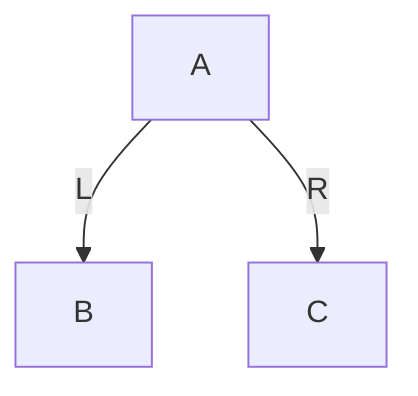
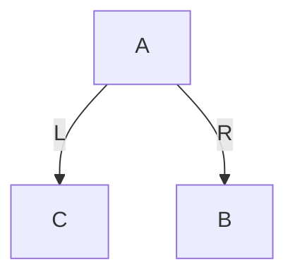
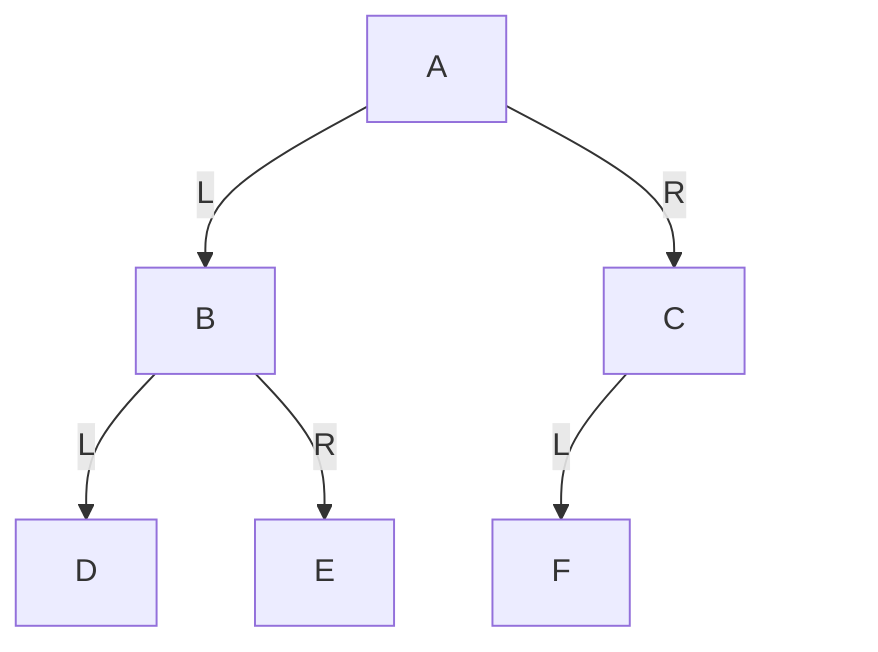
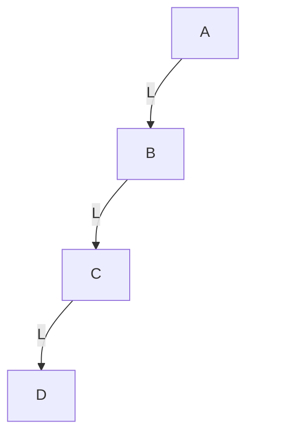
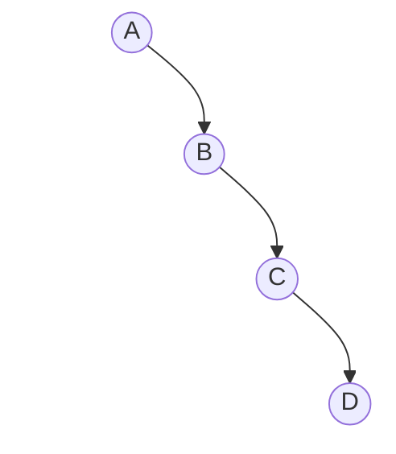
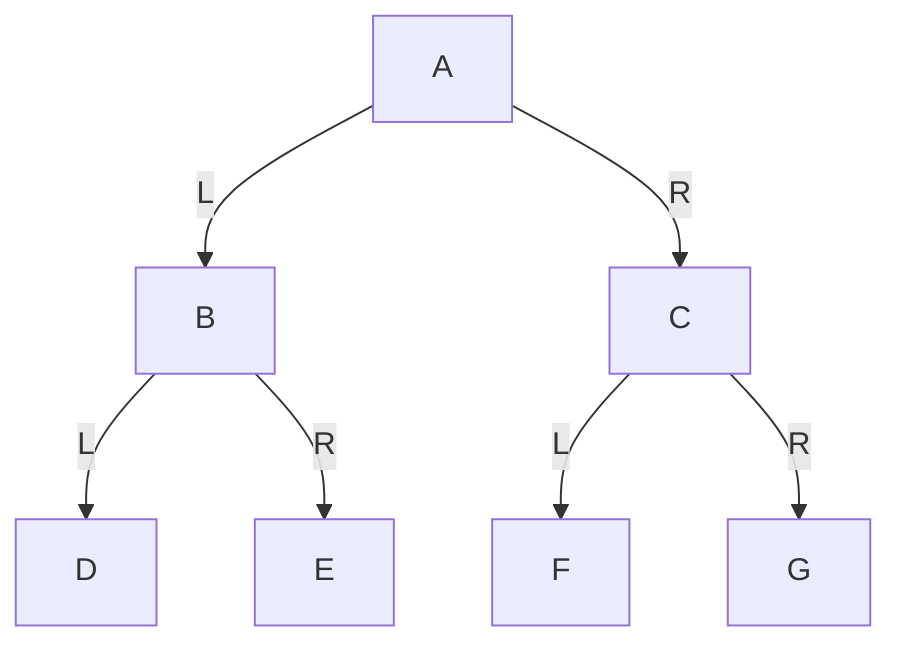
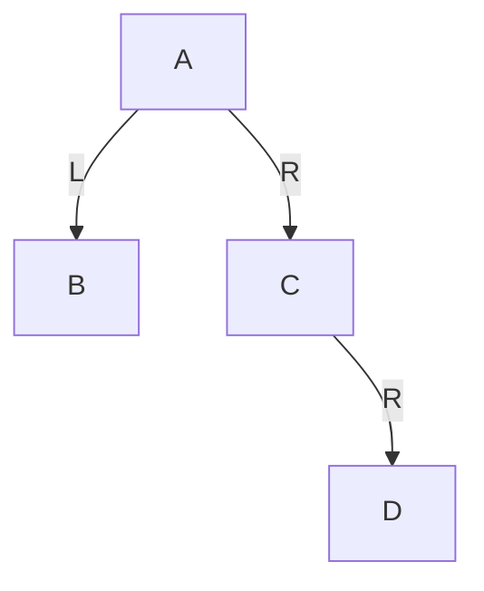
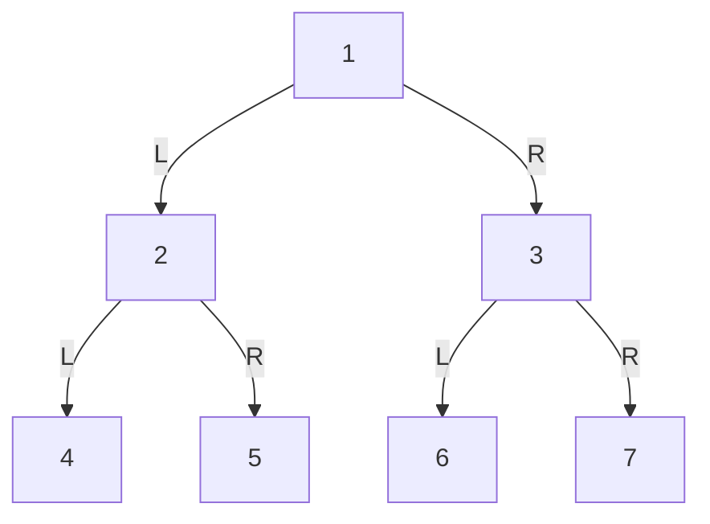
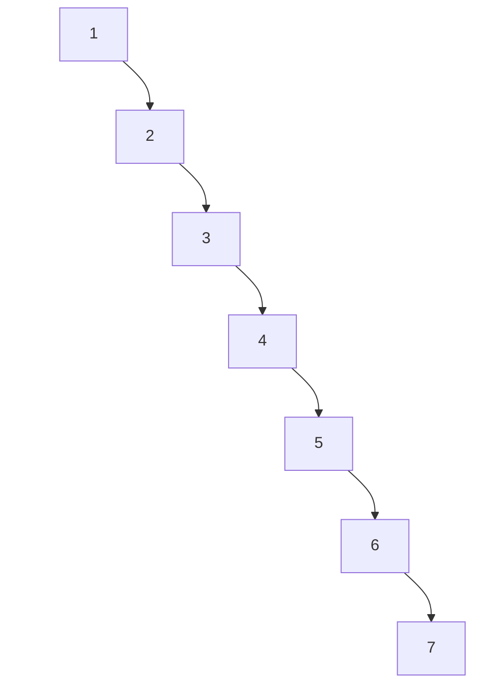

# 第2章\_二叉树

## 2.1\_章节内容说明

第1章完成后，你已经建立了“树”的一般概念。
原第一章的存储表示与 C 程序现单独放在[P16 普通树的表示与构建实验](P16_普通树的表示与构建实验.md#16.7_运行预测与资源回收)；默认先完成该实验，再进入本章。P16 的两个指针表达孩子和兄弟，本章的两个指针将表达左右孩子，二者语义不同。
从这一章开始，学习范围要进一步收缩到 **二叉树**。

这一步非常关键，因为后续你要学习的：

- 二叉搜索树（Binary Search Tree，BST）
- 旋转
- 红黑树
- Linux 内核 `rbtree`

都不再建立在“普通树”的宽泛结构上，而是建立在：

> **每个节点最多两个孩子，并且左右方向有明确语义的二叉结构上。**

所以本章的目标不是泛泛地再讲一遍树，而是要把下面几个问题建立清楚：

1. 什么是二叉树
2. 二叉树与普通树的本质区别是什么
3. 左子树与右子树为什么不能随意交换理解
4. 二叉树有哪些典型形态
5. 为什么形态还不足以规定访问顺序，需要接着学习遍历

------

## 2.2\_二叉树的定义与结构

从 P16 的“第一个孩子和下一个兄弟”换到“左孩子和右孩子”，指针数量没有变化，边的含义却变了。先固定每条边指向谁，再讨论形态。

### 2.2.1\_二叉树的定义

二叉树（Binary Tree）是树的一种特殊形式。它满足的核心约束是：

> **每个节点最多只有两个子节点，并且这两个子节点有明确区分：左子节点与右子节点。**

这里有三个点必须准确理解。

第一，**最多两个**。
不是“必须两个”，而是“最大不超过两个”。

第二，**左右有区分**。
左子节点与右子节点不是一个无序集合中的两个元素，而是两个有固定语义的位置。

第三，**二叉树仍然属于树**。
它依然满足树的基本条件：

- 连通
- 无环
- 除根节点外每个节点恰有一个父节点

所以二叉树不是脱离树的另一种结构，而是树的一种特化形式。

------

### 2.2.2\_二叉树节点的标准结构视角

普通树中，一个节点的孩子数不固定，所以表示方式比较宽泛。
二叉树因为最多只有两个孩子，因此它的节点结构可以固定下来。

最基础的二叉树节点通常写成：

```c
struct binary_node {
	int value;
	struct binary_node *left;
	struct binary_node *right;
};
```

如果后续需要向上回溯，也常加入父指针：

```c
struct binary_node {
	int value;
	struct binary_node *parent;
	struct binary_node *left;
	struct binary_node *right;
};
```

这些字段的含义必须固定理解：

- `left`：左子树入口
- `right`：右子树入口
- `parent`：父节点入口

这正是后续各类二叉树扩展结构的基础模板：

- BST：在此基础上增加大小关系约束
- AVL：在此基础上增加平衡约束
- 红黑树：在此基础上增加颜色与修复规则

也就是说，你现在看到的不是一个普通结构体，而是后面整条路线的公共骨架。

------

### 2.2.3\_左子树与右子树的有序性

这是二叉树最关键的结构特征之一。

在不约定孩子次序的普通树中，一个节点的多个孩子只形成“孩子集合”；普通树也可以另行约定孩子顺序。
但在二叉树中，两个孩子不是无序的，而是严格区分为：

- 左子树
- 右子树

这意味着：

> **左右位置本身就是结构信息。**

看下面这两棵树。

#### (1)\_图\_2-1\_左右位置不同的两棵二叉树

第一棵：



第二棵：



如果讨论的是无序普通树，你可以把它们都理解为：“`A` 有两个孩子，分别是 `B` 和 `C`”。
但如果是二叉树，这两棵树不是同一个结构，因为：

- 第一棵：`B` 在左，`C` 在右
- 第二棵：`C` 在左，`B` 在右

这件事后面会直接影响：

- 遍历结果
- BST 的大小关系
- 左旋与右旋
- 红黑树修复中的内侧 / 外侧判断

所以从二叉树开始，你必须建立一个新习惯：

> **不是只看“下面有几个孩子”，而是看“哪个在左，哪个在右”。**

------

### 2.2.4\_二叉树与普通树的区别

下面把普通树与二叉树明确对比。

| 比较项       | 普通树           | 二叉树                 |
| ------------ | ---------------- | ---------------------- |
| 子节点个数   | 不固定           | 最多 2 个              |
| 子节点顺序   | 通常是孩子集合   | 明确区分左、右         |
| 节点表示     | 常需动态孩子集合 | 可用固定字段表示       |
| 后续扩展方向 | 多叉树体系       | BST / AVL / 红黑树体系 |

所以，二叉树的重要性不只是“孩子数更少”，而在于：

> **它把不定长孩子集合压缩成了固定槽位结构。**

有了固定槽位，后面很多事情才有了精确定义：

- 左子树 / 右子树
- 比较后走左还是走右
- 局部旋转
- 平衡修复

------

### 2.2.5\_二叉树的递归定义

和普通树一样，二叉树也具有递归定义，但形式更具体：

> **二叉树由一个根节点、一棵左子树和一棵右子树组成；其中左子树和右子树本身也分别是二叉树。**

这里有三个直接结论。

第一，左子树和右子树都可以为空。
所以叶子节点的左、右子树都为空。

第二，任何局部节点以下的部分，都仍可作为一棵二叉树分析。
这为后续递归遍历和递归求高度提供了前提。

原学习批注保留：

> （在linux kernel 5.15 和 6.1 中采用的循环迭代不是递归，递归太迟栈空间了，在嵌入式不适用）

这里要把“递归定义”和“用递归函数实现”分开。前者描述子树具有相同结构，后者会为尚未返回的调用保存栈帧。沿高度为 h 的路径下降时，通常有 O(h) 层活动调用；链形树会把这个负担推到 O(n)。是否可用，要由最大输入深度、每帧大小和任务栈预算决定，不能概括成所有嵌入式场景都不适用。这条批注没有定位具体函数，不能作为两个 Linux 版本全部采用迭代的证据；本章只演示有界的小树，后面的内核实现按各自固定源码核对。

第三，很多算法都可以自然写成：

- 处理当前节点
- 递归处理左子树
- 递归处理右子树

例如后面马上要讲的：

- 前序遍历
- 中序遍历
- 后序遍历

都直接建立在这个定义之上。

------

### 2.2.6\_示例\_一个最基本的二叉树

下面给出一棵最基础的二叉树。

#### (1)\_图\_2-2\_一个基本二叉树示意图



从这张图里，你应当准确读出：

- `A` 是根节点
- `B` 是 `A` 的左孩子
- `C` 是 `A` 的右孩子
- `D` 是 `B` 的左孩子
- `E` 是 `B` 的右孩子
- `F` 是 `C` 的左孩子
- `C` 的右孩子为空

这张图里专门给 `C` 补了一个**透明右占位节点**，目的就是让你看到：

> `C` 不是“只有一个模糊的孩子”，而是“左槽位有孩子、右槽位为空”。

这个视觉习惯，对后面理解：

- 单左孩子
- 单右孩子
- BST 查找路径
- 旋转前后结构

都非常重要。

------

## 2.3\_二叉树的基本形态

虽然二叉树都遵守“最多两个孩子”的结构约束，但具体形态差异很大。
这些形态差异会直接影响：

- 高度
- 存储方式
- 遍历结果
- 操作复杂度

所以学习二叉树时，不能只知道“有左右孩子”，还要会识别它的典型形态。

------

### 2.3.1\_斜树

斜树是最不平衡的一类二叉树。它的特征是：

- 除最后的叶子外，每个节点都只有一个孩子
- 整棵树持续向某一个方向延伸

如果一直向左延伸，称为左斜树；一直向右延伸，称为右斜树。若唯一孩子的方向左右交替，仍是高度相同的链形二叉树，但不是本节图示的纯左斜或纯右斜形态。

#### (1)\_图\_2-3\_左斜树



这张图强调的是：

- `A` 只有左孩子 `B`
- `B` 只有左孩子 `C`
- `C` 只有左孩子 `D`

每一层右侧都用透明占位补齐，因此你看到的是明确的“只有左，不是右”。

------

#### (2)\_图\_2-4\_右斜树



这张图强调的是：

- `A` 只有右孩子 `B`
- `B` 只有右孩子 `C`
- `C` 只有右孩子 `D`

左侧全部用透明占位补齐，因此你能明确看出它是“单右链”。

斜树的意义在于说明：

> **二叉树并不天然平衡。**

这会在后面 BST 一章中变成核心问题：
如果树长成斜树，查找效率就会明显变差。

------

### 2.3.2\_满二叉树

本书使用中文“满二叉树”表示每层都填满的形态，对应下述严格定义：

> **除叶子节点外，每个节点都有两个子节点，并且所有叶子节点都在同一层。**

查英文材料时，应同时核对定义。[NIST 的 perfect binary tree](https://xlinux.nist.gov/dads/HTML/perfectBinaryTree.html) 对应本节这两个条件；它的 [full / proper binary tree](https://xlinux.nist.gov/dads/HTML/fullBinaryTree.html) 只要求节点的孩子数为零或二，不要求所有叶子同深。不同教材对 full、complete、perfect 的用词存在差异，所以不能只凭一个英文名称推断性质。反例是根的左边为叶子、右边有两个叶子：每个内部节点都有两个孩子，但叶子不在同一层，不符合本书的“满”定义。

#### (1)\_图\_2-5\_满二叉树



这棵树满足：

- `A`、`B`、`C` 都各有两个孩子
- `D`、`E`、`F`、`G` 都是叶子节点
- 所有叶子位于同一层

满二叉树是二叉树中最规整的一种理想形态。

如果树高为 `h`（根节点高度按边数算），那么节点总数为：

```text
2^(h + 1) - 1
```

例如图中高度为 2，则节点数为：

```text
2^3 - 1 = 7
```

满二叉树的重要性在于，它提供了一个“结构最规整”的参考模型。

------

### 2.3.3\_完全二叉树

完全二叉树（Complete Binary Tree）比满二叉树更宽松。它的定义是：

> **除最后一层外，其余各层都满；最后一层的节点必须从左到右连续排列，中间不能出现空洞。**

#### (1)\_图\_2-6\_完全二叉树


这棵树是完全二叉树，因为：

- 前两层已经满
- 最后一层节点按从左到右连续出现
- 没有“左边空着、右边先有节点”的情况

------

#### (2)\_图\_2-7\_非完全二叉树示意

下面给一个不是完全二叉树的结构。



这棵树不是完全二叉树，因为：

- `C` 的左槽位为空
- 但右槽位却先出现了 `D`

也就是说，最后一层没有按从左到右连续填充。

完全二叉树之所以重要，是因为它特别适合：

- 顺序存储
- 堆结构
- 数组表达的二叉树

------

### 2.3.4\_二叉树高度与节点数量关系

这一节的目标，是让你建立一个很重要的判断：

> **沿一条根到叶路径工作的操作，其最坏路径长度由高度限制；访问全部节点的遍历仍要做 Θ(n) 次节点处理。**

高度影响调用栈深度，却不会把一次完整遍历的工作量降成 Θ(h)。讨论“效率”之前，先问当前操作是否有依据排除整棵子树。

#### (1)\_同样节点数\_高度可能差很多

例如同样是 7 个节点。

##### 1)\_图\_2-8\_7\_个节点构成的规整二叉树



这棵树高度为 2。

------

##### 2)\_图\_2-9\_7\_个节点构成的右斜树



这棵树高度为 6。

你看到的是：

- 节点数相同
- 但高度差异极大

因此，节点数只描述规模；真正决定很多操作路径长度的，是高度。

#### (2)\_为什么这件事重要

因为后面在 BST 中：

- 查找一个值，不会扫描所有节点
- 而是沿一条根到目标位置的路径向下走

所以时间复杂度通常与高度更接近，而不是直接与节点总数相同。

这也是为什么后面会自然引出：

- BST 为什么会退化
- 为什么需要旋转
- 为什么要控制树高
- 红黑树究竟在控制什么

所以从这一节开始，你必须建立这个意识：

> **树的形状会影响效率，而高度是这种影响最关键的量化指标。**

------

## 2.4\_预测形态并进入遍历

先画三棵树：只有根、根只有右孩子、根的两个孩子中只有右孩子再分出两个叶子。分别判断是否完全、是否符合本书的满树定义，并用“缺失槽位后是否又出现节点”解释判断。

只有根同时满足满与完全的条件；根只有右孩子不完全，因为同层左槽先空缺；第三棵不是满树，叶子不在同层，也不完全，因为末层左侧空缺。它仍然满足每个内部节点有两个孩子，正好说明英文 full 的另一种用法不能替代本书的完整定义。

现在左右槽位和高度已经确定，但 A 是否应当第一个打印，还没有答案。接着进入[前序遍历](P17_前序遍历与先根处理.md)：先建立一条确定的访问规则，再逐次改变处理时机。完整路线是 P02 → P17 → P18 → P19 → P20 → P21 → P03；后续文件号保留现有章节身份。
