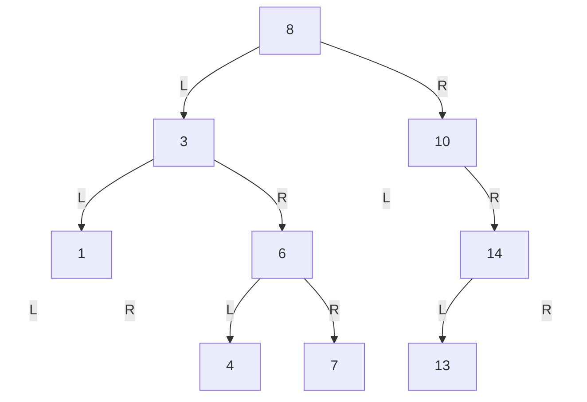
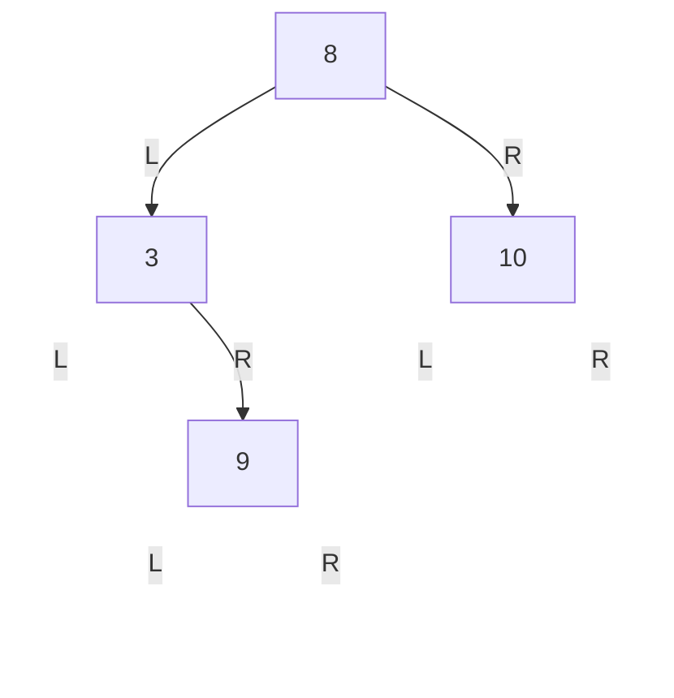
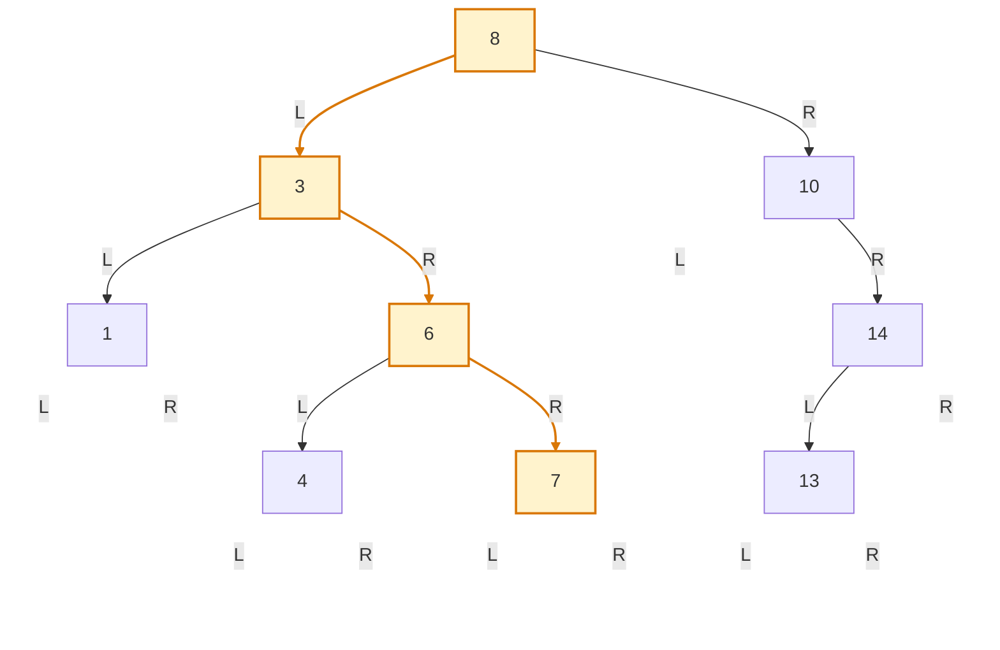
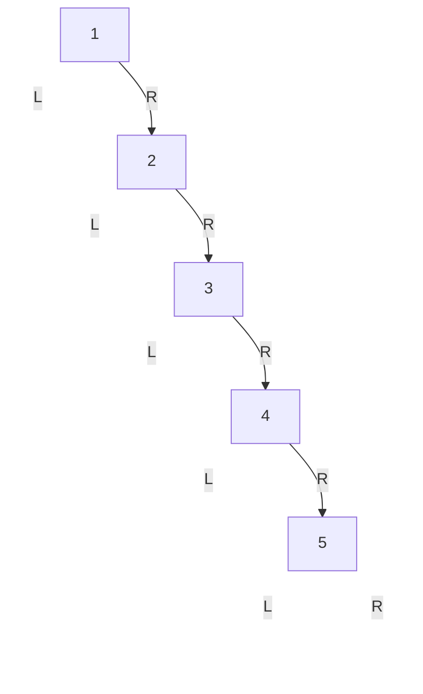
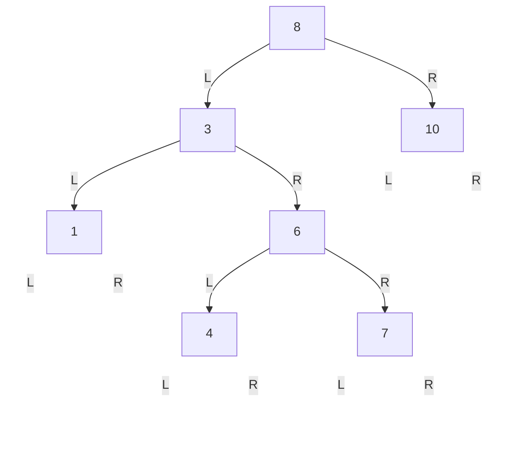
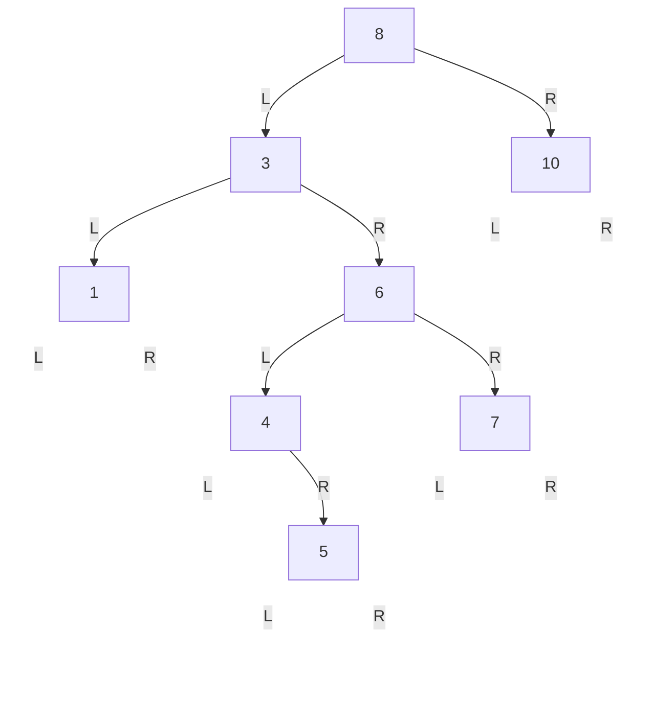

# 第3章\_二叉搜索树\_BST

## 3.1\_章节内容说明

沿[P02 二叉结构](P02_二叉树.md)及拆出的[P17～P21 遍历与查询](P21_递归状态与二叉树基本查询.md#21.8_让查询接受一个反例)，你已经学习了 **二叉树的结构、遍历、递归处理方式**。
但是普通二叉树只规定左右槽位与树的拓扑约束，并**不保证节点值之间有任何顺序关系**。这意味着：

- 你可以遍历它；
- 你可以统计它；
- 但你**不能天然高效地查找某个值**。

因此，本章进入一类更“工程化”的二叉树：**二叉搜索树**（Binary Search Tree，BST）。

BST 的核心不是“长得像树”，而是它在二叉树基础上额外加入了一条**全局有序约束**。
正是这条约束，让 BST 具备了：

- 按值快速查找
- 按值插入
- 按值删除
- <span style="color:red;">中序遍历</span>得到<span style="color:red;">有序序列</span>

但是，它约束“值的相对位置”，却不限制“树的高度”。完成删除与验证两个单元后，这个缺口会在 P04 引出平衡树的必要性。

本章你要重点掌握四件事：

1. BST 到底比普通二叉树多了什么约束
2. 查找、插入、删除为什么都沿着一条比较路径进行
3. 查重、分配失败与成功挂接怎样分开
4. 为何这个排序约束还不足以限制树的高度

## 3.2\_阅读说明

本文档阅读说明：

1. 为了示例简单，键 key 是互异整数。发现重复键返回“已存在”，不改变原树；唯一键约束不要求程序终止。
2. 失败也是接口结果：C 版检查空指针，C++ 版使用 std::nothrow；需要捕获异常时使用 try/catch。这里的节点初始化只有整数和指针，不能把 nothrow 的分配保证推广到任意会抛异常的构造器。下文明确各返回值，C++ 语法可对照 C 版本理解。
3. cpp = c++；

------

## 3.3\_二叉搜索树的定义

沿用上一单元“左边可以放大值”的反例，现在增加一项约束，让比较结果足以排除整棵子树。

### 3.3.1\_BST\_的有序性约束

二叉搜索树是一棵二叉树，并满足下面的约束：

- 对任意节点 `x`
- `x` 的**左子树**中所有节点值都**小于** `x->key`
- `x` 的**右子树**中所有节点值都**大于** `x->key`
- 并且左右子树本身也都分别是二叉搜索树

这一定义是**递归定义**。

也就是说，BST 的“有序性”不是只对根节点成立，而是对整棵树的**每一个局部子树**都成立。

### 3.3.2\_左子树\_右子树与比较规则

BST 的左右方向不是装饰信息，而是带有明确语义：

- 向左走：表示目标值更小
- 向右走：表示目标值更大

所以，在 BST 中：

- 左右孩子**不能交换**
- 左子树和右子树也**不能随意调换位置**
- “左”“右”本身就是比较规则的一部分

下面看一个合法 BST：



对这棵树逐点检查：

- `8` 左边所有值：`3 1 6 4 7`，都小于 `8`
- `8` 右边所有值：`10 14 13`，都大于 `8`
- `3` 的左边 `1` 小于 `3`，右边 `6 4 7` 大于 `3`
- `6` 的左边 `4` 小于 `6`，右边 `7` 大于 `6`

所以它是合法 BST。

### 3.3.3\_BST\_与普通二叉树的区别

下面这棵树是二叉树，但不是 BST：



问题在于：

- `9` 位于 `8` 的左子树中
- 但 `9 > 8`

这违反了 BST 的全局约束。

所以要区分两个概念：

| 结构       | 要求                               |
| ---------- | ---------------------------------- |
| 普通二叉树 | 每个节点最多两个孩子               |
| 二叉搜索树 | 在二叉树基础上，再加上全局有序约束 |

------

## 3.4\_BST\_的查找

已经知道另一侧的所有值落在哪个区间，查找就可以只保留仍可能含目标的一侧。下面跟随键 7，看每一步排除了谁。

### 3.4.1\_查找过程的决策路径

BST 查找的基本逻辑非常直接：

- 从根节点开始
- 若目标值等于当前节点值，查找成功
- 若目标值小于当前节点值，进入左子树
- 若目标值大于当前节点值，进入右子树
- 若走到空指针，说明不存在

这意味着 BST 查找并不是“遍历整棵树”，而是每一步都进行一次**方向裁剪**。

例如，在下面这棵 BST 中查找 `7`：



查找路径：

- `7 < 8`，向左到 `3`
- `7 > 3`，向右到 `6`
- `7 > 6`，向右到 `7`
- 找到目标

所以 BST 查找本质上是一条**比较驱动的单路径下降过程**。

### 3.4.2\_时间复杂度与树高的关系

BST 的查找复杂度不是直接由节点数 `n` 决定，而是由**树高 `h`** 决定。

沿用前章“按边计高度”的约定，非空树根到最深叶有 h 条边，最多比较 h+1 个节点；不是 h 个。目标可能在路径中途命中，未命中则继续到空槽。

因此：

- 一次查找的最坏时间为 `O(h + 1)`，h 增长时通常简写为 `O(h)`；只有根的树也需要一次比较。

如果树比较平衡，则：

- `h ≈ log2(n)`
- 查找复杂度接近 `O(log n)`

如果树严重退化，则：

- `h ≈ n`
- 查找复杂度退化为 `O(n)`

### 3.4.3\_不同树形下的最坏查找

| 情况 | 树形       | 树高       | 查找复杂度 |
| ---- | ---------- | ---------- | ---------- |
| 高度受控 | 接近平衡   | `O(log n)` | `O(log n)` |
| 最坏 | 退化成链表 | `O(n)`     | `O(n)`     |

表格比较的是各类树形的最坏查找，不是单次查找的最好情况：无论树形怎样，只要目标恰好是根，立即命中都是 O(1)。

下面是一个退化 BST：



此时查找 `5` 的过程和链表顺序扫描几乎一样。

------

## 3.5\_BST\_的插入

如果查找一直未命中，最后遇到的空槽同时记录了一路比较的约束。现在利用这个位置增加节点，并要求失败不能破坏原树。

### 3.5.1\_插入位置的搜索

BST 插入的第一步，不是直接挂节点，而是先做一次“查找式下降”。

规则与查找相同：

- 小于当前节点，向左走
- 大于当前节点，向右走
- 直到某个方向为空，就把新节点挂在那里

也就是说，**插入位置本质上是查找失败时落到的空位置**。

例如向下图插入 `5`：



比较过程：

- `5 < 8`，去左子树
- `5 > 3`，去右子树
- `5 < 6`，去左子树
- `5 > 4`，去右子树
- `4` 的右孩子为空，于是把 `5` 挂到 `4` 的右边

插入后：



### 3.5.2\_新节点的挂接方式

插入时要维护两类信息：

1. 当前扫描节点 `cur`
2. `cur` 的父节点 `parent`

当 cur 变空而 parent 非空时，需要修改 parent 的对应孩子槽；若树原本为空，则没有父节点，应直接修改调用者的 root 变量。后面 C++ 的 link 用“指向入口槽的指针”统一这两种情况。

所以插入的典型过程是：

- 从根出发
- 一边比较一边更新 `parent`
- 走到空位置后
- 根据新键值与 `parent->key` 的大小关系决定挂左还是挂右

### 3.5.3\_插入后为什么仍保持\_BST\_性质

这是 BST 插入最重要的正确性问题。

原因是：

- 插入时，你沿着 BST 的比较规则一直向下走
- 对当前树和一个尚不存在的键，比较会确定唯一一个插入空槽
- 将新节点挂接到该位置，不会破坏已有节点之间的大小关系

换句话说：

- 你不是随意插入
- 你是沿着“有序性约束推导出的路径”插入

因此，插入后整棵树依旧满足 BST 性质。

以 5 为例：经过 8 左侧后，允许区间为 (-∞, 8)；经过 3 右侧收紧成 (3, 8)；经过 6 左侧变为 (3, 6)；再走 4 右侧得到 (4, 6)。新节点不是只满足“比父亲大”，而是同时满足沿途每个祖先留下的界限。两边的区间不相交，才允许查找时整棵排除另一侧。

要维持这个推理，节点进入树后不能任意原地改 key。若业务要改键，应先按接口移除，再按新键重新插入；并发读写还要有专门同步，本章只处理独占的小树。

------

## 3.6\_数据结构与实现视角

这一节把 BST 从“概念”落到“代码对象”。

### 3.6.1\_最小节点结构

#### (1)\_C\_版本

```c
#include <stdio.h>
#include <stdlib.h>

struct bst_node {
	int key;
	struct bst_node *left;
	struct bst_node *right;
};
```

#### (2)\_C++\_版本

```cpp
#include <iostream>
#include <new>

struct bst_node {
	int key {};
	bst_node *left {};
	bst_node *right {};
};
```

这类结构只包含三类信息：

- 当前节点值
- 左孩子指针
- 右孩子指针

如果后续要做删除、旋转、平衡修复，工程实现中常常还会增加：

- 父指针
- 颜色位
- 高度信息
- 附加业务数据

### 3.6.2\_BST\_查找实现

#### (1)\_C\_版本

当前版本的代码要求 key 值唯一：

```c
struct bst_node *bst_find(struct bst_node *root, int key)
{
	while (root) {
		if (key == root->key)
			return root;
		if (key < root->key)
			root = root->left;
		else
			root = root->right;
	}

	return NULL;
}
```

#### (2)\_C++\_版本

当前版本的代码要求 key 值唯一：

```cpp
bst_node *bst_find(bst_node *root, int key)
{
	while (root) {
		if (key == root->key)
			return root;

		if (key < root->key)
			root = root->left;
		else
			root = root->right;
	}

	return nullptr;
}
```

### 3.6.3\_BST\_插入实现

#### (1)\_C\_版本

调用者传入有效根变量的地址，根变量本身可以保存 NULL。返回 1 表示新节点已挂入，0 表示键已存在且未分配，-1 表示无内存且原有树不变。不要传空的二级指针；它与“根变量里的值为空”不同。

```c
struct bst_node *bst_create_node(int key)
{
	struct bst_node *node = malloc(sizeof(*node));
	if (!node)
		return NULL;

	node->key = key;
	node->left = NULL;
	node->right = NULL;
	return node;
}

int bst_insert(struct bst_node **root, int key)
{
	struct bst_node *parent = NULL;
	struct bst_node *cur = *root;
	struct bst_node *node;

	while (cur) {
		parent = cur;
		if (key < cur->key)
			cur = cur->left;
		else if (key > cur->key)
			cur = cur->right;
		else
			return 0;		// 存在就不插入
	}

	node = bst_create_node(key);
	if (!node)
		return -1;

	if (!parent) {			// 根不存在
		*root = node;
		return 1;
	}

	if (key < parent->key)	// 根存在，树中不存在，插入操作
		parent->left = node;
	else
		parent->right = node;

	return 1;
}
```

#### (2)\_C++\_版本

这个版本用 link 保存“下一次要读写的指针槽地址”。开始时是 &root，下降后是某节点的 left/right 成员地址；*link 才是槽里保存的当前节点地址。发现空槽后，先创建节点，再写 *link，所以失败时没有半个节点挂入树。它与前面的 parent 写法维护同一个位置事实，但统一了空树与普通孩子槽。此片段接在本节 C++ 结构定义之后使用。

```cpp
enum class bst_insert_result { ok, duplicate, no_memory };

bst_node *bst_create_node(int key) noexcept
{
    return new (std::nothrow) bst_node { key, nullptr, nullptr };
}

bst_insert_result bst_insert(bst_node *&root, int key) noexcept
{
	bst_node **link = &root;
	bst_node *node;

	/* 沿着 BST 的比较规则向下查找插入位置 */
	while (*link) {
		if (key < (*link)->key)
			link = &(*link)->left;
		else if (key > (*link)->key)
			link = &(*link)->right;
		else {
			/* 唯一键策略：查重属于正常结果，不终止进程。 */
			return bst_insert_result::duplicate;
		}
	}

	/* 走到这里说明 *link 为空，当前位置就是插入点 */
	node = bst_create_node(key);
	if (!node)
		return bst_insert_result::no_memory;

	/* 直接把新节点挂到找到的空位置 */
	*link = node;
	return bst_insert_result::ok;
}
```

------

## 3.7\_运行查找与插入

先手写插入 5 时依次收紧的范围，再运行下面完整 C11 程序。它用 P21 已解释的中序打印与后序回收，不提前依赖删除算法；查询返回的指针借用树内对象，只在树仍存活且未被修改时读取。

```c
#include <errno.h>
#include <stdio.h>
#include <stdlib.h>

struct bst_node {
    int key;
    struct bst_node *left;
    struct bst_node *right;
};

/* 注入点仅用于复现本次构建失败；正常运行 fail_at 为零。 */
static int allocation_attempt, fail_at;

struct bst_node *bst_create_node(int key)
{
    struct bst_node *node;
    if (++allocation_attempt == fail_at)
        return NULL;
    node = malloc(sizeof(*node));
    if (node)
        *node = (struct bst_node){key, NULL, NULL};
    return node;
}

struct bst_node *bst_find(struct bst_node *root, int key)
{
    while (root) {
        if (key == root->key)
            return root;
        root = key < root->key ? root->left : root->right;
    }
    return NULL;
}

/* root 是有效根变量的地址；返回 1 成功、0 已存在、-1 无内存。 */
int bst_insert(struct bst_node **root, int key)
{
    struct bst_node **link = root;
    while (*link) {
        if (key < (*link)->key)
            link = &(*link)->left;
        else if (key > (*link)->key)
            link = &(*link)->right;
        else
            return 0;
    }
    struct bst_node *node = bst_create_node(key);
    if (!node)
        return -1;
    *link = node;
    return 1;
}

static void bst_inorder(const struct bst_node *root)
{
    if (!root)
        return;
    bst_inorder(root->left);
    printf("%d ", root->key);
    bst_inorder(root->right);
}

static void bst_destroy(struct bst_node *root)
{
    if (!root)
        return;
    bst_destroy(root->left);
    bst_destroy(root->right);
    free(root);
}

int main(int argc, char **argv)
{
    const int keys[] = {8, 3, 10, 1, 6, 14, 4, 7, 13};
    struct bst_node *root = NULL;
    if (argc > 2)
        return 2;
    if (argc == 2) {
        char *end;
        errno = 0;
        long value = strtol(argv[1], &end, 10);
        if (errno || end == argv[1] || *end || value < 0 || value > 9)
            return 2;
        fail_at = (int)value;
    }
    for (size_t i = 0; i < sizeof(keys) / sizeof(keys[0]); ++i) {
        if (bst_insert(&root, keys[i]) != 1) {
            fprintf(stderr, "构建失败，回收之前成功插入的节点\n");
            bst_destroy(root);
            return 1;
        }
    }
    printf("中序: ");
    bst_inorder(root);
    printf("\n重复插入 6: %d\n", bst_insert(&root, 6));
    struct bst_node *found = bst_find(root, 7);
    printf("查找 7: %d；查找 100: %s\n", found ? found->key : -1,
           bst_find(root, 100) ? "存在" : "不存在");
    bst_destroy(root);
    return 0;
}
```

保存为 [bst_insert_demo.c](../../../../labs/kernel/tree_basics/materials/bst_insert_demo.c)，执行：

```bash
gcc -std=c11 -Wall -Wextra -Werror -pedantic bst_insert_demo.c -o bst_insert_demo
./bst_insert_demo
./bst_insert_demo 4
```

正常输出中序 1 3 4 6 7 8 10 13 14，重复插入 6 返回 0，查找 7 成功、查找 100 失败。第二条运行命令在第四次节点申请前注入失败，退出 1；前三个已挂入的节点由根统一回收。0 或省略参数不注入，1～9 指定失败点；非法值或多余参数退出 2。真实 malloc 失败也走同一出口。示例深度有限，递归回收不承诺适合任意深度输入。

为什么发现重复键后不再调用分配器？因为已经定位现有对象，树的唯一键契约决定不新增节点。把插入 6 改成 5，会多出一个值，但不能因此宣称树自动平衡。下一步进入[删除与子树回接](P22_BST删除与子树回接.md)，解决移走一个键以后两边如何保持连通与有序。
