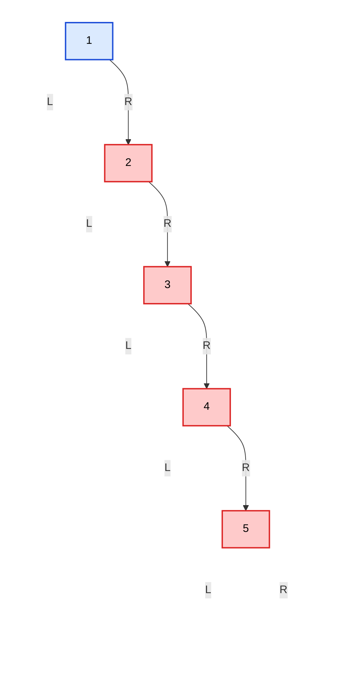
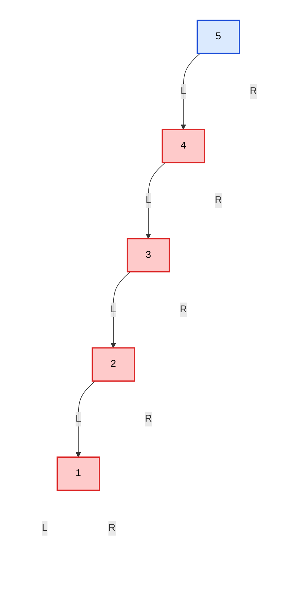
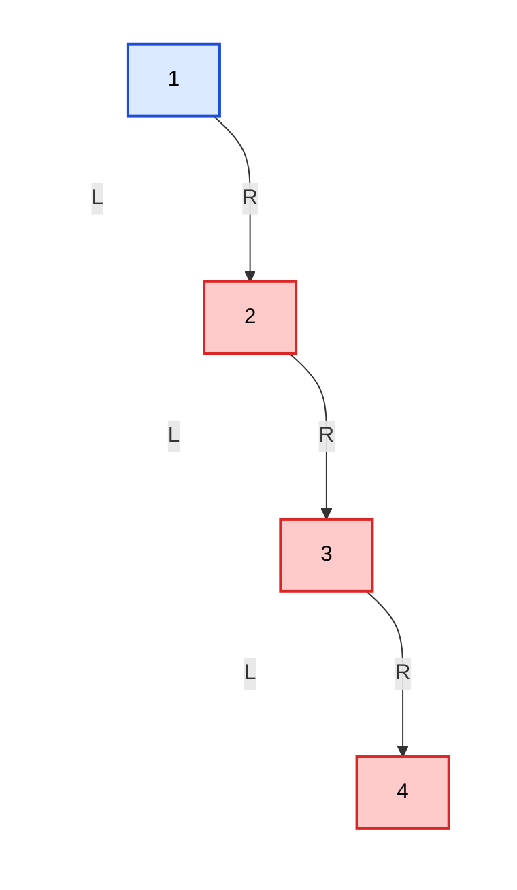
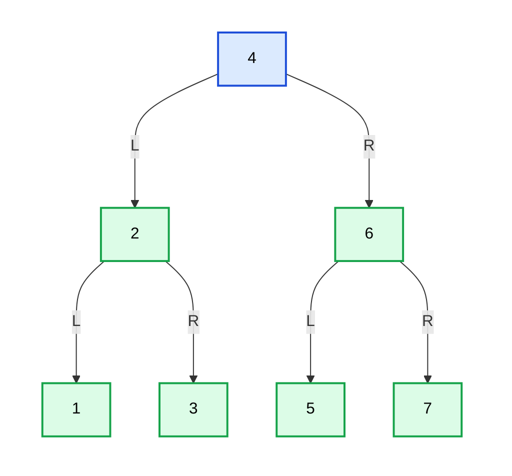
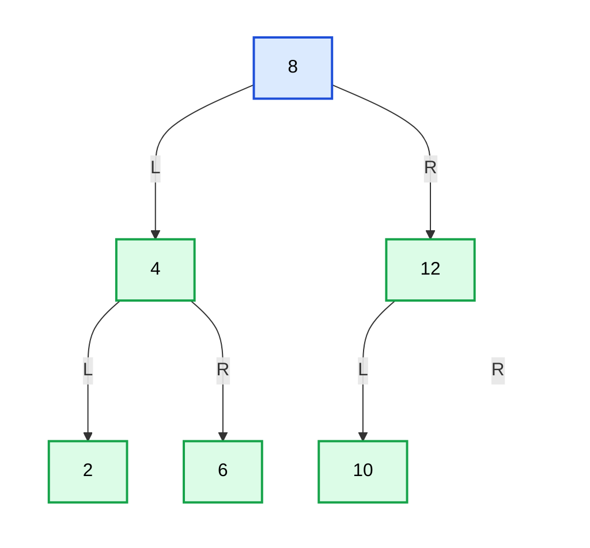
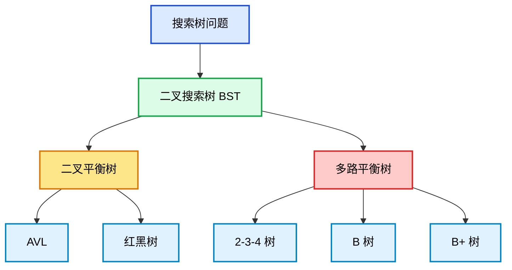

# 第4章_为什么_BST_会退化

## 4.1_章节内容说明

上一章你已经掌握了 BST 的核心性质：

- 左子树所有节点值 < 根节点
- 右子树所有节点值 > 根节点
- 查找、插入、删除都沿着一条比较路径向下进行
- <span style="color:red;font-weight: bold">中序遍历结果是有序序列</span>

但是，BST 有一个根本缺陷：

> **BST 只约束“值的相对大小关系”，不约束“树的形状”。**

这意味着：

- 它可以长成一棵比较低、比较展开的树
- 也可以长成一条很长的单边链

<span style="color:red;font-weight: bold">一旦 BST 树高失控，BST 原本依赖的性能优势就会消失。</span>
所以，本章的重点不是再扩展 BST 操作，而是回答一个更关键的问题：

> **为什么 BST 之后还必须继续学习平衡树？**

答案就在于：**BST 会退化，而退化的本质就是树高失控。**

------

## 4.2_退化问题的提出

### 4.2.1_顺序插入导致的单边增长

BST 的插入规则本身很简单：

- \< 当前节点，向左走
- \> 当前节点，向右走
- 遇到空位置就插入

问题不在规则本身，而在于：

> **插入路径完全受“已有树形 + 输入顺序”共同影响。**

例如按顺序插入：

```text
1, 2, 3, 4, 5
```

最终会得到下面这棵 BST：



这棵树虽然仍然满足 BST 的大小关系，但已经明显不是“展开的树形”，而是在向右单边增长。

### 4.2.2_树退化为链表的结构现象

所谓“退化”，最典型的现象就是：

> **树的分支结构几乎消失，只剩下一条很长的路径。**

上面那棵树，本质上已经接近下面这种线性结构：

```text
1 -> 2 -> 3 -> 4 -> 5
```

如果反过来按降序插入：

```text
5, 4, 3, 2, 1
```

则会得到左斜树：



所以“退化”不是抽象描述，而是一个非常具体的结构问题：

- 原本应该有分支
- 最后却被压成一条长路径

### 4.2.3_查找效率从对数级退化到线性级

BST 的查找复杂度本质上是：

```text
O(h)
```

这里的 `h` 是树高。

当树比较低、比较展开时：

```text
h ≈ log n
```

于是查找复杂度接近：

```text
O(log n)
```

但当树退化成单链时：

```text
h ≈ n
```

于是查找复杂度就退化成：

```text
O(n)
```

这意味着：

- 原本你以为自己在“树上查找”
- 实际上却变成了“沿着一条链线性扫描”

所以必须明确一个判断标准：

> **BST 的效率优势并不是因为它叫“树”，而是因为它的高度足够低。**

------

## 4.3_退化的本质原因

### 4.3.1_BST_只约束大小关系_不约束形状

BST 的定义只有这些：

- 左边小
- 右边大
- 子树本身仍然满足这个规则

请注意，这里面并没有要求：

- 左右子树高度接近
- 左右节点数接近
- 树必须均匀展开
- 树高必须受限

这就意味着：

> **只要大小关系没破坏，再差的树形也仍然是合法 BST。**

例如下面这棵树：



它很差，但仍然是合法 BST。
所以，退化之所以会发生，不是因为插入算法写错了，而是因为：

> **BST 的定义本来就不负责控制树形。**

### 4.3.2_插入顺序对树形态的直接影响

同一组数据，用不同顺序插入，最终树形可能完全不同。

例如同样使用这些值：

```text
1, 2, 3, 4, 5, 6, 7
```

如果按升序插入，就容易得到右斜链。
但如果按下面顺序插入：

```text
4, 2, 6, 1, 3, 5, 7
```

则会得到一棵比较规整的 BST：



**这说明一个根本事实：**

> **BST 不会自动纠正树形。**

它只是根据当前树和输入顺序，被动生成结果。

### 4.3.3_删除操作也可能进一步破坏形态

很多人会以为只有插入会导致退化，删除不会。
这个理解不完整。

删除虽然不一定像顺序插入那样直接制造单边链，但它也不会主动修复已经变差的树形。

原因在于：

- 删除只保证 BST 的有序性不被破坏
- 删除并不负责“让树更好看”
- 单孩子删除会发生子树顶替
- 双孩子删除会发生前驱/后继替换

这些动作都只是为了：

```text
删完以后树仍然合法
```

而不是为了：

```text
删完以后树自动变平衡
```

所以必须认识到：

> **BST 的删除目标是维持有序，不是优化形状。**

------

## 4.4_为什么需要平衡

### 4.4.1_平衡的目标不是绝对对称

很多初学者会把“平衡”理解成：

- 左右完全一样高
- 左右节点数完全一样
- 图形看上去完全对称

这并不准确。

在搜索树里，所谓“平衡”，核心目标不是几何对称，而是：

> **让树高保持在可接受范围内。**

例如下面这棵树并不完全对称，但树高仍然比较低：



所以“平衡”的判断标准不应该是“完全对称”，而应该是：

> **树高有没有被有效控制。**

### 4.4.2_控制树高才是核心目标

BST 的核心操作：

- 查找
- 插入
- 删除

它们的复杂度都依赖于树高 `h`：

```text
O(h)
```

所以真正要解决的问题不是“让图好看”，而是：

```text
让 h 不要无限增长
```

也就是说，平衡树的本质任务是：

> **在保留 BST 有序性的前提下，控制树高。**

### 4.4.3_平衡树解决的本质问题

平衡树解决的问题可以概括成一句话：

> **在保持 BST 左小右大规则不变的前提下，额外引入结构控制机制，使树高维持在合理范围内。**

这里有两个层面：

#### (1)_第一层_仍然必须是_BST

平衡树不是脱离 BST 的新结构。
它仍然必须满足：

- 左子树值 \< 根
- 右子树值 \> 根
- 中序遍历有序

#### (2)_第二层_还要控制树形

BST 自己不控制树形，所以平衡树必须额外引入机制去修正结构。
后面你会看到，这些机制最终都会落在：

- 旋转
- 染色(这里是针对红黑树的)
- 局部重排

这些动作上。

------

## 4.5_常见平衡思想概览

### 4.5.1_严格平衡与弱平衡

不同平衡树对“高度控制”的严格程度并不一样。

可以先粗略分成两类：

| 类型     | 特点                                       | 代表          |
| -------- | ------------------------------------------ | ------------- |
| 严格平衡 | 更严格限制局部高度差                       | AVL[^AVL全称] |
| 弱平衡   | 不要求每个局部都接近，但能控制整体高度上界 | 红黑树        |

这里的“严格”和“弱”不是好坏，而是策略差异。

### 4.5.2_AVL_与红黑树的思路差异

#### (1)_AVL_的思路

AVL[^AVL全称] 更强调：

- 任一节点左右子树高度差不能太大
- 一旦失衡就尽快旋转修复

所以 AVL 通常：

- 查找性能更紧凑
- 但插入删除时调整可能更频繁

#### (2)_红黑树的思路

红黑树不追求每个局部都高度接近，而是通过颜色规则和路径黑高约束来控制树高。

所以红黑树通常：

- 条件更宽松
- 修复规则更系统
- 工程中使用非常广泛

### 4.5.3_多路平衡树与二叉平衡树的分化方向

除了 AVL、红黑树这种二叉平衡树，还有另一条路线：多路平衡树。

例如：

- 2-3-4 树
- B 树
- B+ 树

它们可以放进同一个“平衡搜索树家族”里：



------

## 4.6_本章小结

### 4.6.1_红黑树出现的动机

到这里你应该已经清楚：

- BST 的问题不在查找规则
- 而在树高不受控
- 一旦树高失控，性能优势就消失

所以红黑树出现的动机不是重新发明搜索树，而是：

> **在保留 BST 有序性的前提下，补上树高控制能力。**

### 4.6.2_为什么后面先学旋转_而不是直接学红黑树性质

很多教材一上来就讲：

- 红节点
- 黑节点
- 五条性质
- 插入 case
- 删除 case

如果前面没有先理解“BST 为什么会退化”，这些内容就会显得像一组机械规则。

实际上，后面所有平衡树修复动作，最终都会落到一个最基本的操作上：

> **旋转**

为什么先学旋转？

因为旋转解决的是最核心的问题：

- 如何在不破坏 BST 有序性的前提下
- 改变局部树形
- 压低高度
- 修复失衡

所以正确的学习顺序是：

1. 先知道 BST 为什么会退化
2. 再知道平衡树为什么存在
3. 然后学习如何通过局部重排修复树形
4. 最后进入红黑树的具体性质与修复规则

------

[^AVL全称]: 中文通常叫：**AVL 树** 或 **平衡二叉搜索树的一种**。AVL 全称是 **Adelson-Velsky and Landis Tree**。它是以两位提出者的名字命名的： **Georgy Adelson-Velsky** 和 **Evgenii Landis**。

